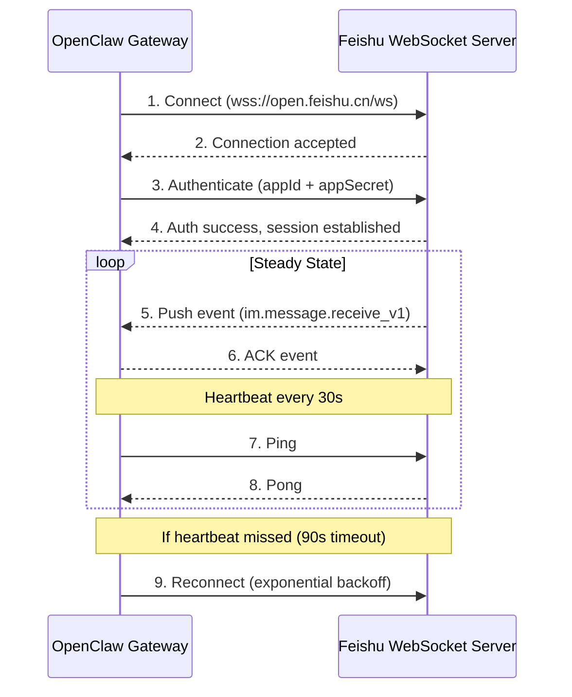
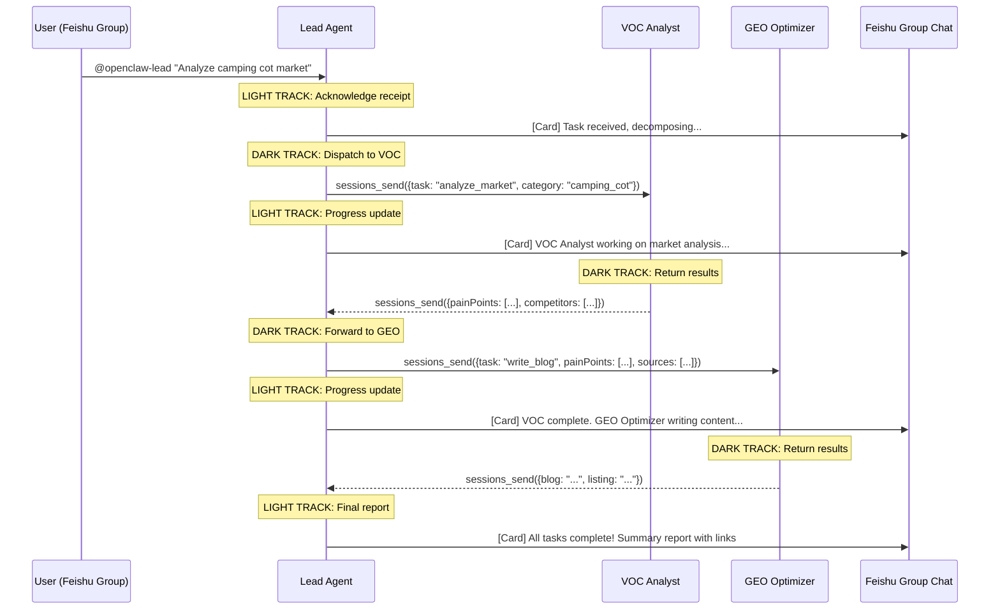
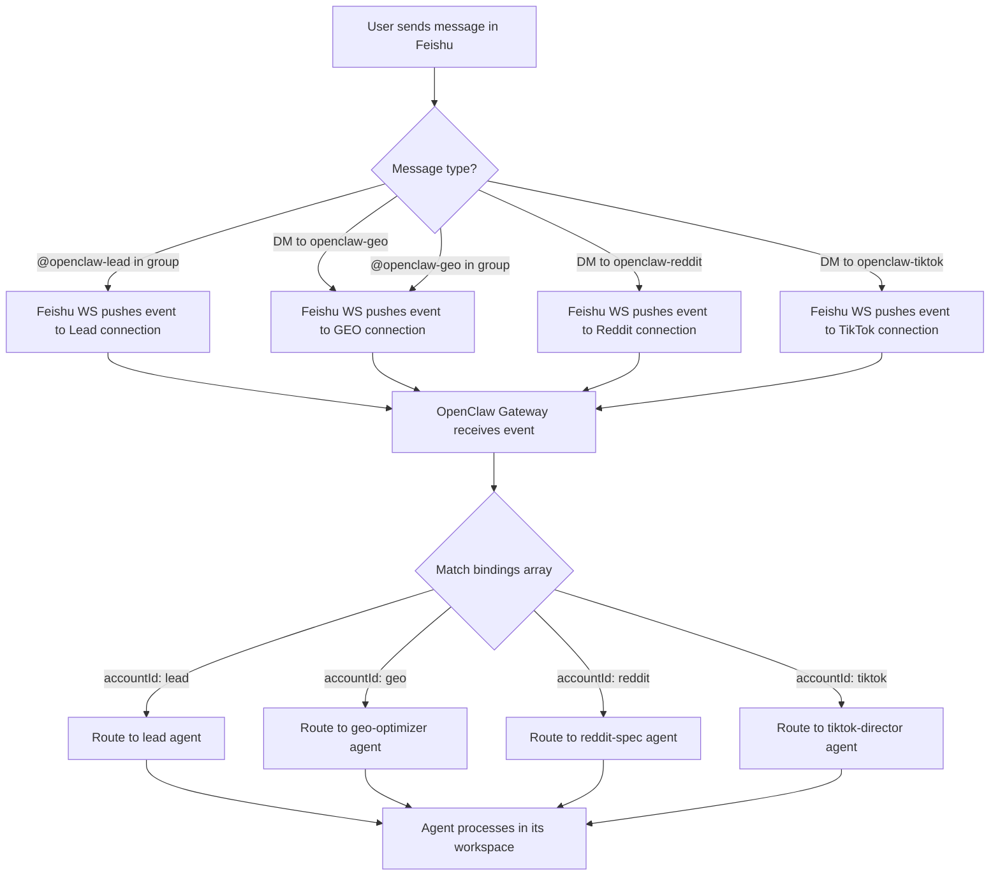

# Feishu (Lark) Integration Plan

**Status**: Not Started
**Scope**: 5 independent Feishu apps, WebSocket long connections, dark/light track communication, interactive cards, message routing, troubleshooting
**Depends on**: openclaw.json master configuration (PLAN-config)

---

## 1. Feishu Open Platform App Setup (Step-by-Step)

### 1.1 App Inventory

The platform requires **4 Feishu apps** (not 5). The VOC Analyst operates as a pure backend agent with no direct Feishu presence -- it only communicates via `sessions_send` through Lead.

| App Name | Account ID | Agent ID | Purpose |
|----------|-----------|----------|---------|
| `openclaw-lead` | `lead` | `lead` | Main human interface, receives all @mentions, reports progress |
| `openclaw-geo` | `geo` | `geo-optimizer` | Direct DM access for content review/approval |
| `openclaw-reddit` | `reddit` | `reddit-spec` | Direct DM access for Reddit campaign management |
| `openclaw-tiktok` | `tiktok` | `tiktok-director` | Direct DM access for video review/approval |

VOC Analyst (`voc-analyst`) has no Feishu app because:
- It never needs to receive direct human messages
- All its tasks come from Lead via `sessions_send`
- Its results flow back to Lead, which reports to Feishu

### 1.2 Per-App Creation Steps (Repeat for Each of the 4 Apps)

**Step 1: Create the App**
1. Go to [open.feishu.cn](https://open.feishu.cn)
2. Log in with the organization admin account
3. Click "Create Custom App" (or "My Apps" > "Create App")
4. Fill in:
   - App Name: `openclaw-lead` (or `-geo`, `-reddit`, `-tiktok`)
   - App Description: Brief description of agent role
   - App Icon: Use a distinct icon per agent for visual differentiation in group chats
5. Note the **App ID** (`cli_xxxx`) and **App Secret** from the "Credentials & Basic Info" page

**Step 2: Enable Bot Capability**
1. Navigate to "Add Features" > "Bot"
2. Enable the bot capability
3. This is required for the app to receive and send messages in groups

**Step 3: Configure Permissions**
1. Navigate to "Permissions & Scopes"
2. Add the required permissions (see Section 6 for full table)
3. Minimum permissions for each app:
   - `im:message` -- Send messages
   - `im:message:send_as_bot` -- Send messages as bot
   - `im:message.group_at_msg` -- Receive @mention events in groups
   - `im:message.group_at_msg:readonly` -- Read @mention messages
   - `im:chat` -- Access chat/group info
   - `im:chat:readonly` -- Read chat list
   - `contact:user.base:readonly` -- Read basic user info (for identifying who sent message)

**Step 4: Configure Event Subscriptions**
1. Navigate to "Event Subscriptions"
2. Select connection mode: **WebSocket** (not HTTP callback)
3. Subscribe to these events:
   - `im.message.receive_v1` -- Receive messages (critical)
   - `im.chat.member.bot.added_v1` -- Bot added to group (optional, for auto-setup)
   - `im.chat.member.bot.deleted_v1` -- Bot removed from group (optional, for cleanup)

**Step 5: CRITICAL -- Create Version and Request Publish**

> This is the most common gotcha (Q3 from reference doc). Permissions and event subscriptions do NOT take effect until you publish.

1. Navigate to "App Release" > "Version Management"
2. Click "Create Version"
3. Fill in version number (e.g., `1.0.0`) and update description
4. Click "Request Publish"
5. If you are the admin, approve immediately in the admin console
6. Wait for status to change to "Published" / "Activated"

**Without this step, the bot will NOT receive any messages, even if all permissions are correctly configured.**

**Step 6: Record Credentials in openclaw.json**
After all 4 apps are created and published, update `~/.openclaw/openclaw.json`:

```json
{
  "channels": {
    "feishu": {
      "enabled": true,
      "connectionMode": "websocket",
      "accounts": {
        "lead":   { "appId": "cli_a]REAL_APP_ID", "appSecret": "REAL_SECRET" },
        "geo":    { "appId": "cli_b]REAL_APP_ID", "appSecret": "REAL_SECRET" },
        "reddit": { "appId": "cli_c]REAL_APP_ID", "appSecret": "REAL_SECRET" },
        "tiktok": { "appId": "cli_d]REAL_APP_ID", "appSecret": "REAL_SECRET" }
      }
    }
  }
}
```

> **Security**: Never commit `appSecret` values to git. Use environment variables or a local-only config overlay. See Section 10.

---

## 2. WebSocket Long Connection Architecture

### 2.1 Why WebSocket Over HTTP Callback

| Dimension | WebSocket | HTTP Callback |
|-----------|-----------|---------------|
| Deployment | No public IP/domain needed | Requires public-facing server |
| Firewall | Outbound only (client-initiated) | Inbound traffic required |
| Latency | Persistent connection, sub-second | HTTP roundtrip per event |
| Mac Mini suitability | Ideal (no port forwarding) | Requires tunneling (ngrok/frp) |

OpenClaw uses WebSocket mode because the platform runs on a local Mac Mini without a public IP.

### 2.2 Connection Lifecycle



### 2.3 Per-App Connection Details

OpenClaw maintains **one WebSocket connection per Feishu account** (4 total):

| Connection | Account | Purpose | Auth Credentials |
|-----------|---------|---------|-----------------|
| WS-1 | `lead` | Main interface, group @mentions | `cli_lead` + secret |
| WS-2 | `geo` | GEO optimizer direct messages | `cli_geo` + secret |
| WS-3 | `reddit` | Reddit specialist direct messages | `cli_reddit` + secret |
| WS-4 | `tiktok` | TikTok director direct messages | `cli_tiktok` + secret |

### 2.4 Reconnection Strategy

```
Attempt 1: Immediate retry
Attempt 2: Wait 1s
Attempt 3: Wait 2s
Attempt 4: Wait 4s
Attempt 5: Wait 8s
Attempt 6: Wait 16s
Attempt 7+: Wait 30s (cap)
```

After successful reconnect, reset the backoff counter to 0.

If all connections fail for > 5 minutes, log an error and send a notification via alternative channel (system alert).

### 2.5 Heartbeat Configuration

| Parameter | Value | Notes |
|-----------|-------|-------|
| Heartbeat interval | 30 seconds | Feishu server expectation |
| Timeout threshold | 90 seconds | 3 missed heartbeats = dead |
| Reconnect trigger | After timeout | Automatic with backoff |

### 2.6 Resource Considerations (Mac Mini)

Running 4 persistent WebSocket connections on a Mac Mini:

| Resource | Impact | Notes |
|----------|--------|-------|
| Memory | ~20-40 MB total | ~5-10 MB per connection (negligible) |
| CPU | Near zero at idle | Event-driven, no polling |
| Network | Minimal | Heartbeat packets only when idle |
| File descriptors | 4 sockets | Well within OS limits |
| Battery (if laptop) | Minimal | WebSocket is efficient |

No performance concerns for 4 connections. The Mac Mini can comfortably handle 20+ simultaneous WebSocket connections.

---

## 3. Bot-to-Bot Loop Prevention Workaround ("Dark/Light Track")

### 3.1 The Problem

Feishu implements **Bot-to-Bot Loop Prevention** to prevent infinite message loops. When Bot A @mentions Bot B in a group chat:
- The message appears visually in the group
- Bot B's backend **does NOT receive** the `im.message.receive_v1` event
- Feishu silently drops the event delivery to Bot B

This means: **Agents cannot communicate with each other through Feishu group messages.**

### 3.2 The Solution Architecture: Dark Track + Light Track

```
Dark Track (sessions_send)  = Agent-to-Agent real data exchange
Light Track (Feishu cards)  = Human-readable progress reports in group
```

| Aspect | Dark Track | Light Track |
|--------|-----------|-------------|
| Protocol | `sessions_send` (A2A) | Feishu Bot API (send_message) |
| Audience | Agents only | Humans only |
| Content | Structured data (JSON payloads) | Formatted cards/text |
| Visibility | Invisible in Feishu | Visible in Feishu group |
| Loop prevention | Not affected (bypasses Feishu) | Not a concern (one-way to humans) |
| Latency | Sub-second (local IPC) | 1-2 seconds (Feishu API call) |

### 3.3 Sequence Diagram: Both Tracks Operating Simultaneously



### 3.4 When to Use Which Track

| Scenario | Track | Reason |
|----------|-------|--------|
| Agent dispatching subtask to another agent | Dark | Real data exchange |
| Agent returning results to Lead | Dark | Structured data |
| Lead acknowledging user request | Light | Human needs confirmation |
| Lead reporting progress mid-execution | Light | Human wants visibility |
| Lead delivering final summary | Light | Human needs results |
| Agent requesting clarification from user | Light (via Lead) | Only Lead has Feishu access |
| Error notification | Light | Human needs to know |
| Periodic cron job results | Light | Human needs the report |

### 3.5 Examples

**Dark Track Message (sessions_send):**
```json
{
  "from": "lead",
  "to": "voc-analyst",
  "payload": {
    "task": "market_analysis",
    "category": "camping folding cot",
    "platforms": ["amazon", "reddit", "youtube"],
    "depth": "full",
    "output_format": "structured_report"
  }
}
```

**Light Track Message (Feishu Card in Group):**
A Feishu interactive card showing task status, progress percentage, and agent assignments (see Section 4 for card templates).

---

## 4. Feishu Interactive Card Templates

### 4.1 Task Received Acknowledgment Card

```json
{
  "msg_type": "interactive",
  "card": {
    "config": {
      "wide_screen_mode": true
    },
    "header": {
      "title": {
        "tag": "plain_text",
        "content": "Task Received"
      },
      "template": "blue"
    },
    "elements": [
      {
        "tag": "div",
        "text": {
          "tag": "lark_md",
          "content": "**Task**: Analyze camping folding cot market and create multi-channel content"
        }
      },
      {
        "tag": "div",
        "fields": [
          {
            "is_short": true,
            "text": {
              "tag": "lark_md",
              "content": "**Submitted by**\n@User"
            }
          },
          {
            "is_short": true,
            "text": {
              "tag": "lark_md",
              "content": "**Status**\nDecomposing subtasks..."
            }
          }
        ]
      },
      {
        "tag": "hr"
      },
      {
        "tag": "div",
        "text": {
          "tag": "lark_md",
          "content": "Dispatching to: VOC Analyst, GEO Optimizer, Reddit Specialist, TikTok Director"
        }
      }
    ]
  }
}
```

### 4.2 Progress Update Card (with Progress Bar)

```json
{
  "msg_type": "interactive",
  "card": {
    "config": {
      "wide_screen_mode": true
    },
    "header": {
      "title": {
        "tag": "plain_text",
        "content": "Task Progress: Camping Cot Analysis"
      },
      "template": "orange"
    },
    "elements": [
      {
        "tag": "column_set",
        "flex_mode": "none",
        "background_style": "default",
        "columns": [
          {
            "tag": "column",
            "width": "weighted",
            "weight": 3,
            "vertical_align": "top",
            "elements": [
              {
                "tag": "div",
                "text": {
                  "tag": "lark_md",
                  "content": "**Overall Progress: 60%**"
                }
              }
            ]
          }
        ]
      },
      {
        "tag": "hr"
      },
      {
        "tag": "div",
        "fields": [
          {
            "is_short": true,
            "text": {
              "tag": "lark_md",
              "content": "**VOC Analyst**\nComplete"
            }
          },
          {
            "is_short": true,
            "text": {
              "tag": "lark_md",
              "content": "**GEO Optimizer**\nWriting blog..."
            }
          },
          {
            "is_short": true,
            "text": {
              "tag": "lark_md",
              "content": "**Reddit Specialist**\nSearching old posts..."
            }
          },
          {
            "is_short": true,
            "text": {
              "tag": "lark_md",
              "content": "**TikTok Director**\nPending (waiting for VOC)"
            }
          }
        ]
      },
      {
        "tag": "hr"
      },
      {
        "tag": "note",
        "elements": [
          {
            "tag": "plain_text",
            "content": "Estimated completion: ~12 minutes remaining"
          }
        ]
      }
    ]
  }
}
```

### 4.3 VOC Report Summary Card (with Data Table)

```json
{
  "msg_type": "interactive",
  "card": {
    "config": {
      "wide_screen_mode": true
    },
    "header": {
      "title": {
        "tag": "plain_text",
        "content": "VOC Report: Camping Folding Cot"
      },
      "template": "green"
    },
    "elements": [
      {
        "tag": "div",
        "text": {
          "tag": "lark_md",
          "content": "**Top Pain Points (Cross-validated from 3+ sources)**"
        }
      },
      {
        "tag": "div",
        "text": {
          "tag": "lark_md",
          "content": "| Rank | Pain Point | Frequency | Sources |\n|:---:|------|:---:|------|\n| 1 | Insufficient weight capacity | 42% | Amazon, Reddit, YouTube |\n| 2 | Difficult storage/folding | 31% | Amazon, Reddit |\n| 3 | Fabric tearing after 3 months | 18% | Amazon, YouTube |\n| 4 | Noisy joints | 9% | Reddit |"
        }
      },
      {
        "tag": "hr"
      },
      {
        "tag": "div",
        "fields": [
          {
            "is_short": true,
            "text": {
              "tag": "lark_md",
              "content": "**Price Range**\n$30 - $80"
            }
          },
          {
            "is_short": true,
            "text": {
              "tag": "lark_md",
              "content": "**BSR Range**\n#1,200 - #8,500"
            }
          },
          {
            "is_short": true,
            "text": {
              "tag": "lark_md",
              "content": "**Products Analyzed**\n50"
            }
          },
          {
            "is_short": true,
            "text": {
              "tag": "lark_md",
              "content": "**Reviews Processed**\n2,847"
            }
          }
        ]
      },
      {
        "tag": "hr"
      },
      {
        "tag": "note",
        "elements": [
          {
            "tag": "plain_text",
            "content": "Full report saved to workspace-voc/data/reports/"
          }
        ]
      }
    ]
  }
}
```

### 4.4 Content Preview Card (Approve/Reject)

```json
{
  "msg_type": "interactive",
  "card": {
    "config": {
      "wide_screen_mode": true
    },
    "header": {
      "title": {
        "tag": "plain_text",
        "content": "Content Review: Blog Draft"
      },
      "template": "purple"
    },
    "elements": [
      {
        "tag": "div",
        "text": {
          "tag": "lark_md",
          "content": "**Title**: The Ultimate Guide to Choosing a Camping Folding Cot in 2026"
        }
      },
      {
        "tag": "div",
        "text": {
          "tag": "lark_md",
          "content": "**GEO Score**: 87/100\n**Word Count**: 2,450\n**Citations**: 6 (OutdoorGearLab, Wirecutter, REI Co-op)"
        }
      },
      {
        "tag": "div",
        "text": {
          "tag": "lark_md",
          "content": "**Preview**: This guide examines key factors for selecting a camping cot, including weight capacity (tested up to 450 lbs), fold-down dimensions, and fabric durability..."
        }
      },
      {
        "tag": "hr"
      },
      {
        "tag": "action",
        "actions": [
          {
            "tag": "button",
            "text": {
              "tag": "plain_text",
              "content": "Approve & Publish"
            },
            "type": "primary",
            "value": {
              "action": "approve",
              "content_id": "blog_camping_cot_001"
            }
          },
          {
            "tag": "button",
            "text": {
              "tag": "plain_text",
              "content": "Request Revision"
            },
            "type": "default",
            "value": {
              "action": "revise",
              "content_id": "blog_camping_cot_001"
            }
          },
          {
            "tag": "button",
            "text": {
              "tag": "plain_text",
              "content": "Reject"
            },
            "type": "danger",
            "value": {
              "action": "reject",
              "content_id": "blog_camping_cot_001"
            }
          }
        ]
      }
    ]
  }
}
```

### 4.5 Price Alert Card

```json
{
  "msg_type": "interactive",
  "card": {
    "config": {
      "wide_screen_mode": true
    },
    "header": {
      "title": {
        "tag": "plain_text",
        "content": "Price Alert: Competitor Price Change Detected"
      },
      "template": "red"
    },
    "elements": [
      {
        "tag": "div",
        "text": {
          "tag": "lark_md",
          "content": "**Product**: ASIN B09XYZ1234 - Folding Camping Cot Pro\n**Competitor**: OutdoorBrand Co."
        }
      },
      {
        "tag": "div",
        "fields": [
          {
            "is_short": true,
            "text": {
              "tag": "lark_md",
              "content": "**Previous Price**\n$59.99"
            }
          },
          {
            "is_short": true,
            "text": {
              "tag": "lark_md",
              "content": "**Current Price**\n$44.99"
            }
          },
          {
            "is_short": true,
            "text": {
              "tag": "lark_md",
              "content": "**Change**\n-25.0%"
            }
          },
          {
            "is_short": true,
            "text": {
              "tag": "lark_md",
              "content": "**Detected At**\n2026-03-05 03:12 CST"
            }
          }
        ]
      },
      {
        "tag": "hr"
      },
      {
        "tag": "div",
        "text": {
          "tag": "lark_md",
          "content": "**Recommendation**: Competitor likely running a Lightning Deal. Consider matching within 48 hours if your margin allows."
        }
      },
      {
        "tag": "action",
        "actions": [
          {
            "tag": "button",
            "text": {
              "tag": "plain_text",
              "content": "View Full Price History"
            },
            "type": "default",
            "value": {
              "action": "view_history",
              "asin": "B09XYZ1234"
            }
          }
        ]
      }
    ]
  }
}
```

### 4.6 Error Notification Card

```json
{
  "msg_type": "interactive",
  "card": {
    "config": {
      "wide_screen_mode": true
    },
    "header": {
      "title": {
        "tag": "plain_text",
        "content": "Agent Error: Task Failed"
      },
      "template": "red"
    },
    "elements": [
      {
        "tag": "div",
        "fields": [
          {
            "is_short": true,
            "text": {
              "tag": "lark_md",
              "content": "**Agent**\nReddit Specialist"
            }
          },
          {
            "is_short": true,
            "text": {
              "tag": "lark_md",
              "content": "**Error Type**\nScraping Failure"
            }
          }
        ]
      },
      {
        "tag": "div",
        "text": {
          "tag": "lark_md",
          "content": "**Details**: Reddit rate limit exceeded (429 Too Many Requests). The agent attempted 3 retries with exponential backoff but all failed."
        }
      },
      {
        "tag": "hr"
      },
      {
        "tag": "div",
        "text": {
          "tag": "lark_md",
          "content": "**Impact**: Reddit traffic hijacking subtask is paused. Other agents (GEO, TikTok) are unaffected and continue executing."
        }
      },
      {
        "tag": "action",
        "actions": [
          {
            "tag": "button",
            "text": {
              "tag": "plain_text",
              "content": "Retry Task"
            },
            "type": "primary",
            "value": {
              "action": "retry",
              "agent": "reddit-spec",
              "task_id": "task_reddit_001"
            }
          },
          {
            "tag": "button",
            "text": {
              "tag": "plain_text",
              "content": "Skip & Continue"
            },
            "type": "default",
            "value": {
              "action": "skip",
              "task_id": "task_reddit_001"
            }
          }
        ]
      }
    ]
  }
}
```

### 4.7 Final Summary Report Card

```json
{
  "msg_type": "interactive",
  "card": {
    "config": {
      "wide_screen_mode": true
    },
    "header": {
      "title": {
        "tag": "plain_text",
        "content": "Task Complete: Camping Folding Cot - Full Pipeline"
      },
      "template": "green"
    },
    "elements": [
      {
        "tag": "div",
        "text": {
          "tag": "lark_md",
          "content": "All 4 agents have completed their subtasks. Total execution time: **18 minutes**."
        }
      },
      {
        "tag": "hr"
      },
      {
        "tag": "div",
        "text": {
          "tag": "lark_md",
          "content": "**Deliverables Summary**"
        }
      },
      {
        "tag": "div",
        "text": {
          "tag": "lark_md",
          "content": "| Agent | Output | Status |\n|------|------|:---:|\n| VOC Analyst | Market report (50 products, 2847 reviews) | Done |\n| GEO Optimizer | 1 blog post + 1 Amazon listing | Done |\n| Reddit Specialist | 3 comments on high-ranking posts | Done |\n| TikTok Director | 1x 15s UGC video + storyboard | Done |"
        }
      },
      {
        "tag": "hr"
      },
      {
        "tag": "div",
        "text": {
          "tag": "lark_md",
          "content": "**Key Insight**: Top consumer pain point is insufficient weight capacity (42% mention rate). Content has been optimized around \"450 lbs weight capacity\" with OutdoorGearLab citation."
        }
      },
      {
        "tag": "action",
        "actions": [
          {
            "tag": "button",
            "text": {
              "tag": "plain_text",
              "content": "View Full VOC Report"
            },
            "type": "default",
            "value": {
              "action": "view_report",
              "type": "voc"
            }
          },
          {
            "tag": "button",
            "text": {
              "tag": "plain_text",
              "content": "Review Blog Draft"
            },
            "type": "default",
            "value": {
              "action": "view_content",
              "type": "blog"
            }
          },
          {
            "tag": "button",
            "text": {
              "tag": "plain_text",
              "content": "Preview TikTok Video"
            },
            "type": "primary",
            "value": {
              "action": "view_content",
              "type": "video"
            }
          }
        ]
      },
      {
        "tag": "hr"
      },
      {
        "tag": "note",
        "elements": [
          {
            "tag": "plain_text",
            "content": "All files saved to respective agent workspaces. Reply to request changes or start a new task."
          }
        ]
      }
    ]
  }
}
```

---

## 5. Message Routing Architecture

### 5.1 Inbound Message Flow



### 5.2 How the Bindings Array Routes Messages

The `bindings` array in `openclaw.json` maps incoming Feishu events to agents:

```json
"bindings": [
  { "agentId": "lead",            "match": { "channel": "feishu", "accountId": "lead" } },
  { "agentId": "geo-optimizer",   "match": { "channel": "feishu", "accountId": "geo" } },
  { "agentId": "reddit-spec",     "match": { "channel": "feishu", "accountId": "reddit" } },
  { "agentId": "tiktok-director", "match": { "channel": "feishu", "accountId": "tiktok" } }
]
```

**Routing logic:**
1. Incoming Feishu event arrives on a specific WebSocket connection
2. Each WebSocket connection is identified by its `accountId` (derived from which appId authenticated the connection)
3. Gateway matches the `accountId` against the `bindings[].match.accountId`
4. The matched `agentId` receives the message in its workspace context

### 5.3 @Mention vs Group vs DM Behavior

| Interaction | What Happens | Which Agent Receives |
|------------|-------------|---------------------|
| @openclaw-lead in group | Event pushed via Lead's WS connection | `lead` |
| @openclaw-geo in group | Event pushed via GEO's WS connection | `geo-optimizer` |
| DM to openclaw-lead | Event pushed via Lead's WS connection | `lead` |
| DM to openclaw-reddit | Event pushed via Reddit's WS connection | `reddit-spec` |
| Plain message in group (no @) | No bot receives (Feishu only pushes @mentions to bots) | None |
| @all in group | All bots in group receive independently | All 4 agents |

### 5.4 Message Format Transformation

```
Feishu Event (im.message.receive_v1)
  -> OpenClaw Gateway extracts:
       - sender (user ID, name)
       - message content (text, mentions, images)
       - chat context (group ID, chat type)
       - event metadata (timestamp, event ID)
  -> Transforms to OpenClaw internal format:
       {
         "channel": "feishu",
         "accountId": "lead",
         "sender": { "id": "ou_xxxx", "name": "Boss" },
         "content": "Analyze camping cot market",
         "chatId": "oc_xxxx",
         "chatType": "group",
         "timestamp": 1741132800
       }
  -> Routes to matched agent via bindings
  -> Agent receives clean, channel-agnostic message
```

---

## 6. Feishu Permissions Deep Dive

### 6.1 Complete Permissions Table

| Permission | Scope | Why Needed | Lead | GEO | Reddit | TikTok |
|-----------|-------|-----------|:---:|:---:|:---:|:---:|
| `im:message` | Send messages | Send text/card messages to users and groups | Yes | Yes | Yes | Yes |
| `im:message:send_as_bot` | Send as bot | Required for bot identity on messages | Yes | Yes | Yes | Yes |
| `im:message.group_at_msg` | Group @mention events | Receive @mention triggers in groups | Yes | Yes | Yes | Yes |
| `im:message.group_at_msg:readonly` | Read @mention messages | Parse the content of @mention messages | Yes | Yes | Yes | Yes |
| `im:message.p2p_msg` | P2P message events | Receive direct messages (DMs) | Yes | Yes | Yes | Yes |
| `im:message.p2p_msg:readonly` | Read P2P messages | Parse DM content | Yes | Yes | Yes | Yes |
| `im:chat` | Chat access | Create/manage group chats | Yes | No | No | No |
| `im:chat:readonly` | Read chat info | Get group member list, group info | Yes | Yes | Yes | Yes |
| `im:resource` | Access message resources | Download images/files from messages | Yes | Yes | No | Yes |
| `contact:user.base:readonly` | Read user info | Get sender name for reports | Yes | No | No | No |
| `im:message.card` | Interactive cards | Send interactive card messages | Yes | Yes | Yes | Yes |

### 6.2 The "Publish Then Activate" Requirement

**This is the #1 configuration gotcha.** Here is the exact sequence:

```
1. Add permissions in "Permissions & Scopes" page
2. Add event subscriptions in "Event Subscriptions" page
3. Go to "App Release" > "Version Management"
4. Click "Create Version" (NOT just save)
5. Fill version number (e.g., 1.0.0)
6. Click "Request Publish"
7. Admin approves in Admin Console
8. Status changes to "Published" / "Activated"
9. NOW the permissions and events are live
```

Changes to permissions or event subscriptions **require a new version** each time. You cannot modify a published version -- you must create a new one (e.g., 1.0.1) and publish again.

### 6.3 Permission Review Process

- For **internal apps** (within your own organization): Admin can self-approve, usually instant
- For **ISV apps** (published to App Gallery): Requires Feishu platform review (3-5 business days)
- All our apps are internal (custom apps), so approval is immediate if you are the admin

### 6.4 Minimum Viable vs Full Permissions

**Minimum viable** (to just get the system running):
- `im:message`, `im:message:send_as_bot`, `im:message.group_at_msg`, `im:message.group_at_msg:readonly`

**Full permissions** (for complete functionality including DMs, cards, and resource access):
- All permissions listed in the table above

Recommendation: Start with full permissions to avoid multiple publish cycles.

---

## 7. Group Setup Guide

### 7.1 Option A: Single Group with All 4 Bots (Recommended)

**Best for**: Most users, small teams, getting started quickly

**Setup:**
1. Create a new Feishu group (e.g., "AI E-Commerce Team")
2. Add all 4 bots to the group:
   - openclaw-lead
   - openclaw-geo
   - openclaw-reddit
   - openclaw-tiktok
3. Add human team members who need visibility

**Advantages:**
- Single place for all progress updates (Light Track)
- Easy for the boss to see all agent activity
- Simple to manage

**Disadvantages:**
- Can get noisy with progress cards from multiple agents
- All team members see all agent activity

### 7.2 Option B: Multiple Specialized Groups (Enterprise)

**Best for**: Larger teams with role-based access

| Group | Bots | Human Members | Purpose |
|-------|------|---------------|---------|
| "AI Command Center" | Lead only | Boss, managers | High-level task dispatch and final reports |
| "Content Pipeline" | Lead, GEO | Content team | Blog/listing drafts, review, approval |
| "Social Ops" | Lead, Reddit, TikTok | Social media team | Campaign status, video previews |
| "Market Intel" | Lead only | Product/sourcing team | VOC reports, price alerts |

### 7.3 How to Add Bots to a Group

1. Open the target Feishu group
2. Click the group name/settings (top bar)
3. Navigate to "Bots" or "Integrations"
4. Search for your bot by name (e.g., "openclaw-lead")
5. Click "Add"
6. Repeat for each bot

**Note**: The bot must be "Published" (Section 1.2, Step 5) before it appears in the search.

### 7.4 Group Settings Recommendations

| Setting | Recommended Value | Reason |
|---------|------------------|--------|
| Who can @all | Admins only | Prevent bots from triggering @all loops |
| Who can add bots | Admins only | Security -- prevent unauthorized bot additions |
| Message visibility | All members | Transparency for the Light Track |
| Pin messages | Enable | Pin final summary cards for easy reference |
| History for new members | Show all | New team members can see past reports |

### 7.5 Naming Conventions

| Entity | Convention | Example |
|--------|-----------|---------|
| Group name | `[Project] AI Team` | "Camping Cot AI Team" |
| Bot display name | `openclaw-[role]` | "openclaw-lead" |
| Card message title | `[Action]: [Subject]` | "Task Complete: Camping Cot Analysis" |

---

## 8. Test Scenarios

### 8.1 Test 1: @Lead Triggers Task Decomposition

**Input:**
In the Feishu group, type: `@openclaw-lead Analyze the camping folding cot market and create content for all channels`

**Expected Behavior:**
1. Lead receives the message via WebSocket (verify in OpenClaw logs)
2. Lead sends a "Task Received" acknowledgment card to the group (Light Track)
3. Lead decomposes the task into subtasks
4. Lead dispatches subtasks via `sessions_send` to VOC, GEO, Reddit, TikTok (Dark Track)
5. Lead sends a "Progress Update" card showing agent assignments

**Validation Steps:**
- [ ] Check OpenClaw gateway log for `im.message.receive_v1` event on Lead's connection
- [ ] Verify acknowledgment card appears in group within 5 seconds
- [ ] Check `sessions_send` logs for outbound messages to each agent
- [ ] Verify each agent's workspace shows the received task

### 8.2 Test 2: Progress Cards During Multi-Agent Execution

**Input:**
Continue from Test 1. Wait for agents to begin processing.

**Expected Behavior:**
1. As VOC Analyst completes, Lead posts a progress card: "VOC complete (1/4)"
2. As GEO Optimizer starts writing, Lead updates: "GEO writing content (2/4 in progress)"
3. Progress cards update incrementally until all agents finish
4. Final summary card is posted with all deliverables

**Validation Steps:**
- [ ] Count the number of progress cards (should be 3-5, not flooding)
- [ ] Verify each card correctly reflects the current state
- [ ] Final summary card includes all 4 agent outputs
- [ ] Total execution time is displayed and reasonable (15-25 minutes)

### 8.3 Test 3: Error Card When Agent Fails

**Input:**
Deliberately cause a failure (e.g., revoke Reddit scraping credentials or set an invalid API key for Decodo).

Then trigger: `@openclaw-lead Check Reddit sentiment for wireless earbuds`

**Expected Behavior:**
1. Lead dispatches to Reddit Specialist
2. Reddit Specialist encounters error (scraping failure / API auth error)
3. Reddit Specialist reports failure back to Lead via `sessions_send`
4. Lead posts an "Error Notification" card in the group
5. Card includes error details, agent name, and "Retry" / "Skip" buttons

**Validation Steps:**
- [ ] Error card appears within 30 seconds of failure
- [ ] Error message is descriptive (not generic "something went wrong")
- [ ] Other agents continue working (fault isolation)
- [ ] "Retry" button triggers a new attempt if clicked
- [ ] "Skip" button allows Lead to produce partial results

### 8.4 Test 4: Direct DM to Specific Agent Bypasses Lead

**Input:**
Send a DM directly to `openclaw-geo`: "Rewrite the camping cot blog to emphasize waterproof fabric"

**Expected Behavior:**
1. GEO Optimizer receives the DM via its own WebSocket connection
2. GEO Optimizer processes the request directly (no Lead involvement)
3. GEO Optimizer responds in the DM conversation with the updated content
4. Lead is NOT notified (this is a direct interaction)

**Validation Steps:**
- [ ] Check that GEO's WebSocket connection received the event
- [ ] Verify Lead's logs show NO activity for this interaction
- [ ] GEO responds in the DM thread, not in the group
- [ ] Response references the correct blog content from its workspace

### 8.5 Test 5: Cron Job Delivers Report via Feishu

**Input:**
Wait for the daily price monitor cron (`0 3 * * *`) to trigger, or manually trigger it.

**Expected Behavior:**
1. VOC Analyst runs the price monitoring sweep
2. VOC Analyst sends results to Lead via `sessions_send`
3. Lead formats results as a Price Alert card (if changes detected) or a "No changes" note
4. Card is posted to the Feishu group

**Validation Steps:**
- [ ] Cron triggers at the scheduled time (check system cron logs)
- [ ] VOC Analyst executes the price check template
- [ ] Results are routed through Lead to Feishu (not directly from VOC)
- [ ] Card appears in the correct group

---

## 9. Troubleshooting Guide

### 9.1 Bot Not Responding to @Mentions

**Symptoms:** User @mentions the bot in group, no response at all.

**Checklist:**
1. **Version published?** -- Go to open.feishu.cn > App Release > Version Management. Status must be "Published"
2. **Event subscription active?** -- Check that `im.message.receive_v1` is subscribed AND published
3. **Connection mode correct?** -- Must be "WebSocket", not "HTTP"
4. **WebSocket connected?** -- Check OpenClaw gateway logs for active connections
5. **Bindings configured?** -- Verify `openclaw.json` bindings match the accountId
6. **Bot added to group?** -- Check group members list for the bot
7. **Bot enabled?** -- "Add Features > Bot" must be toggled on

### 9.2 Permissions Not Active After Configuration

**Symptoms:** API calls return 403 or "insufficient permissions" errors.

**Root Cause:** Permissions were added but not published.

**Fix:**
1. Go to "App Release" > "Version Management"
2. Create a new version (even if just bumping patch: 1.0.0 -> 1.0.1)
3. Request publish
4. Approve (if admin)
5. Wait for status change to "Published"

### 9.3 WebSocket Disconnects Frequently

**Symptoms:** Bot goes offline intermittently, messages missed.

**Checklist:**
1. **Network stability** -- Check Mac Mini's internet connection
2. **Heartbeat interval** -- Ensure OpenClaw sends pings every 30s (not less)
3. **Firewall/proxy** -- Ensure outbound WebSocket (wss://) is not blocked
4. **Multiple connections** -- Verify all 4 connections are maintained (check gateway status)
5. **Reconnection working** -- Check logs for reconnection attempts and successes

**Long-term fix:** Add monitoring that alerts if any WebSocket connection has been down for > 2 minutes.

### 9.4 Card Messages Not Rendering

**Symptoms:** Card appears as raw JSON or plain text, or fails to send.

**Checklist:**
1. **Card JSON valid?** -- Validate against Feishu card schema at [open.feishu.cn/tool/cardbuilder](https://open.feishu.cn/tool/cardbuilder)
2. **msg_type correct?** -- Must be `"interactive"` for cards (not `"text"`)
3. **im:message.card permission?** -- Check this permission is granted and published
4. **Card too large?** -- Feishu has a card size limit. Simplify if needed.
5. **lark_md syntax?** -- Feishu markdown is a subset; not all standard markdown works

### 9.5 Skills Loading in Wrong Workspace (Layer Isolation)

**Symptoms:** Agent A calls a skill that belongs to Agent B, or gets "tool not found" errors.

**Root Cause:** Skill placed in wrong directory level.

**Fix:**
- **Global skills** (shared by all agents): `~/.openclaw/skills/`
- **Agent-specific skills**: `~/.openclaw/workspace-{agent}/skills/`

Loading priority:
1. Agent workspace `skills/` directory (highest priority)
2. Global `~/.openclaw/skills/` directory (fallback)

If a skill with the same name exists in both locations, the workspace version wins.

### 9.6 Message Received by Wrong Agent (Binding Mismatch)

**Symptoms:** GEO receives messages intended for Reddit, or vice versa.

**Root Cause:** `accountId` in bindings does not match the actual Feishu app.

**Fix:**
1. Verify each Feishu app's `appId` in `openclaw.json` matches the actual app
2. Verify each `accountId` in `bindings` matches the corresponding key in `channels.feishu.accounts`
3. Each WebSocket connection authenticates with a specific `appId` -- ensure no duplicates

### 9.7 Rate Limiting (Feishu API Limits)

**Feishu API rate limits:**

| API | Limit | Reset |
|-----|-------|-------|
| Send message | 50 requests/second per app | Per second |
| Send card | 50 requests/second per app | Per second |
| Upload image | 10 requests/second per app | Per second |

**Mitigation:**
- Progress cards should be throttled (max 1 card per 10 seconds per agent)
- Batch updates into a single card instead of multiple small cards
- If rate limited, queue messages and retry with exponential backoff

### 9.8 Bot-to-Bot @Mention Fails Silently

**Symptoms:** Lead @mentions GEO in a group message, GEO does nothing.

**Root Cause:** This is the Bot-to-Bot Loop Prevention. This is by design.

**Fix:** Use the Dark Track (`sessions_send`) for all agent-to-agent communication. The Feishu group is only for human-facing Light Track messages.

---

## 10. Security Considerations

### 10.1 appSecret Storage

**Rule: NEVER commit appSecret values to git.**

**Recommended approach -- environment variables:**

```bash
# ~/.zshrc or ~/.bashrc (local machine only)
export FEISHU_LEAD_APP_ID="cli_actual_id"
export FEISHU_LEAD_APP_SECRET="actual_secret"
export FEISHU_GEO_APP_ID="cli_actual_id"
export FEISHU_GEO_APP_SECRET="actual_secret"
export FEISHU_REDDIT_APP_ID="cli_actual_id"
export FEISHU_REDDIT_APP_SECRET="actual_secret"
export FEISHU_TIKTOK_APP_ID="cli_actual_id"
export FEISHU_TIKTOK_APP_SECRET="actual_secret"
```

**openclaw.json references env vars:**
```json
{
  "accounts": {
    "lead": {
      "appId": "${FEISHU_LEAD_APP_ID}",
      "appSecret": "${FEISHU_LEAD_APP_SECRET}"
    }
  }
}
```

**Alternative -- .env file (gitignored):**
```
# ~/.openclaw/.env (add to .gitignore)
FEISHU_LEAD_APP_SECRET=xxxx
FEISHU_GEO_APP_SECRET=xxxx
FEISHU_REDDIT_APP_SECRET=xxxx
FEISHU_TIKTOK_APP_SECRET=xxxx
```

### 10.2 WebSocket Connection Encryption

- All Feishu WebSocket connections use `wss://` (TLS encrypted)
- No plaintext `ws://` connections are supported by Feishu
- Certificate validation is handled by the runtime (do not disable)

### 10.3 Message Content Privacy Between Agents

- Dark Track (`sessions_send`) messages stay local (within the OpenClaw runtime on the Mac Mini)
- They do NOT traverse the internet -- it is local IPC
- Light Track messages go through Feishu servers (encrypted in transit, stored by Feishu)
- Sensitive data (API keys, account credentials) should ONLY travel via Dark Track, never Light Track

**Rule:** Never include API keys, passwords, or account tokens in Feishu card messages.

### 10.4 Access Control

| Control | Implementation |
|---------|---------------|
| Who can trigger tasks | Only members of the Feishu group can @mention bots |
| Who can approve content | Card button callbacks are verified by sender identity |
| Agent communication scope | `tools.agentToAgent.routing` whitelist in openclaw.json |
| Workspace data isolation | Each agent can only read/write its own workspace directory |
| Cron job scope | Each cron job is bound to a specific agent |

### 10.5 Feishu App Visibility

- Set all apps to "Internal" (organization-only visibility)
- Do NOT publish to the Feishu App Gallery unless intentional
- Restrict which departments/users can see and use each bot app

---

## Appendix A: Quick Reference -- Config File Locations

| File | Path | Purpose |
|------|------|---------|
| Main config | `~/.openclaw/openclaw.json` | Agent routing, Feishu accounts, bindings, cron |
| Lead workspace | `~/.openclaw/workspace-lead/` | SOUL.md, AGENTS.md |
| VOC workspace | `~/.openclaw/workspace-voc/` | Market reports, price snapshots |
| GEO workspace | `~/.openclaw/workspace-geo/` | Blog drafts, listing content |
| Reddit workspace | `~/.openclaw/workspace-reddit/` | Account profiles, engagement logs |
| TikTok workspace | `~/.openclaw/workspace-tiktok/` | Storyboards, video assets |
| Global skills | `~/.openclaw/skills/` | Shared skills (nano-banana-pro, seedance, etc.) |
| Env secrets | `~/.openclaw/.env` | appSecret values (gitignored) |

## Appendix B: Card Template File Locations

All card templates should be stored in the Lead workspace since Lead is the sole Feishu message sender on the Light Track:

```
~/.openclaw/workspace-lead/templates/cards/
  task-received.json
  progress-update.json
  voc-report.json
  content-preview.json
  price-alert.json
  error-notification.json
  final-summary.json
```

Each agent can specify card data payloads in their `sessions_send` responses. Lead then merges the data into the appropriate card template before sending to Feishu.

## Appendix C: Checklist Before Go-Live

- [ ] All 4 Feishu apps created on open.feishu.cn
- [ ] Bot capability enabled on all 4 apps
- [ ] All required permissions added (Section 6)
- [ ] Event subscriptions configured (WebSocket mode)
- [ ] All 4 apps published (version created + approved)
- [ ] appId and appSecret added to openclaw.json (or env vars)
- [ ] bindings array verified (4 entries matching 4 accounts)
- [ ] agentToAgent routing whitelist includes all 5 agents
- [ ] Feishu group created with all 4 bots added
- [ ] OpenClaw gateway started (`openclaw gateway restart`)
- [ ] All 4 WebSocket connections show "connected" in logs
- [ ] Test: @openclaw-lead in group produces acknowledgment card
- [ ] Test: DM to openclaw-geo produces a response
- [ ] Test: Error scenario produces error card
- [ ] Card templates validated in Feishu Card Builder tool
- [ ] appSecret values are NOT committed to git
