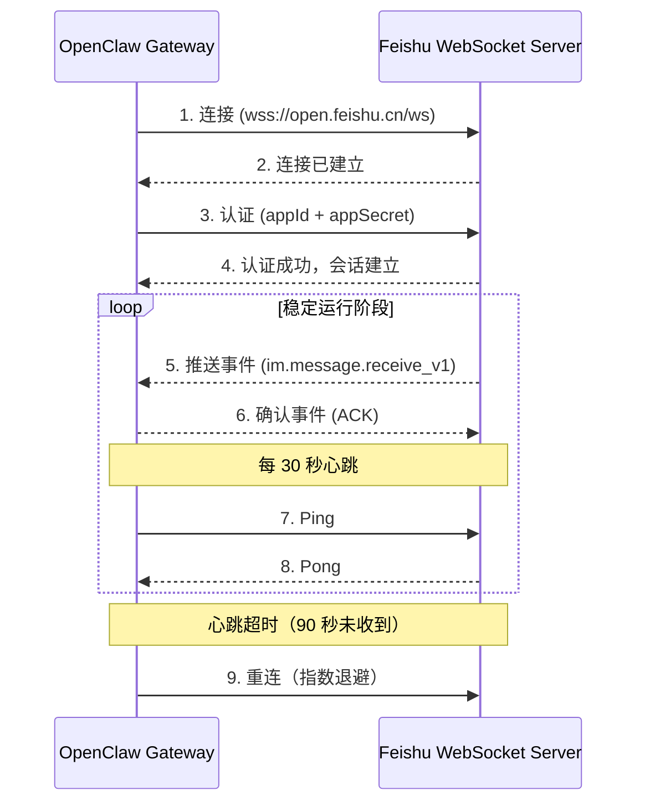
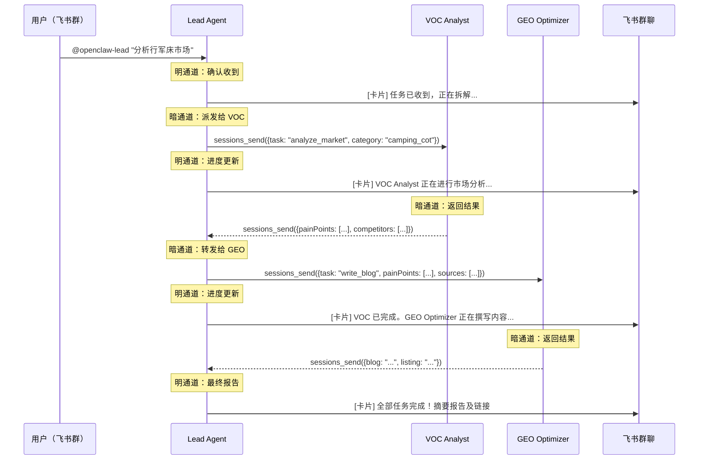
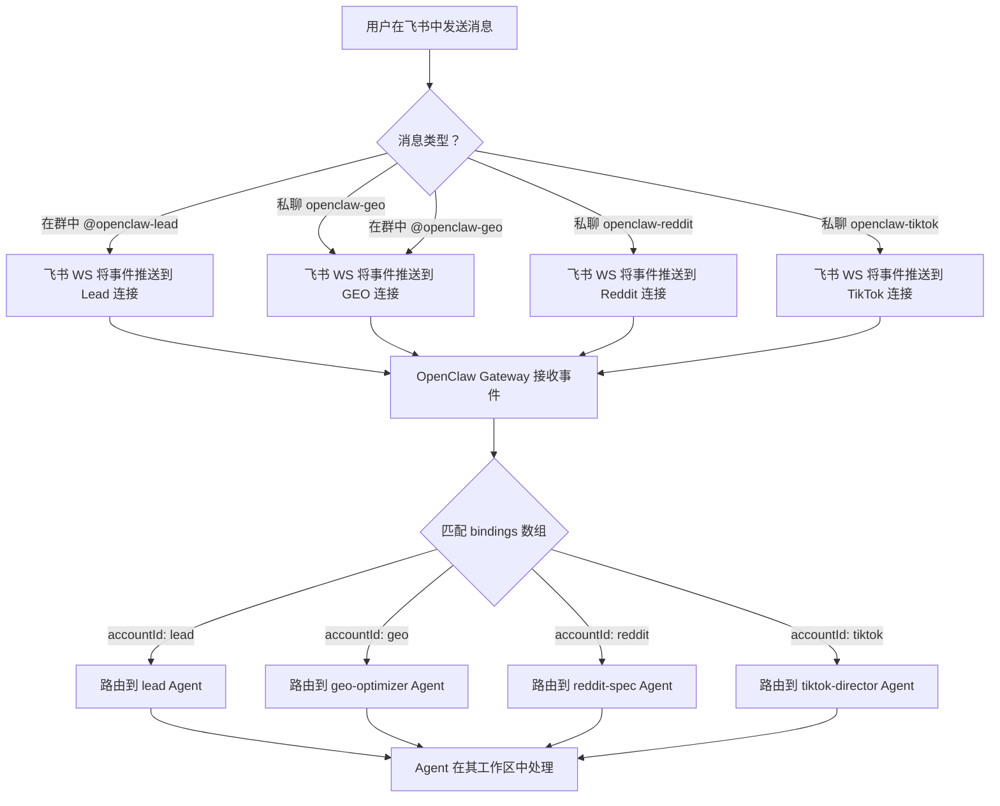

# 飞书（Lark）集成方案

**状态**: 未开始
**范围**: 5 个独立飞书应用、WebSocket 长连接、明暗双通道通信、互动卡片、消息路由、故障排查
**依赖**: openclaw.json 主配置（PLAN-config）

---

## 1. 飞书开放平台应用配置（分步指南）

### 1.1 应用清单

平台需要 **4 个飞书应用**（而非 5 个）。VOC Analyst 作为纯后端 Agent，不直接对接飞书 —— 仅通过 `sessions_send` 经 Lead 通信。

| 应用名称 | Account ID | Agent ID | 用途 |
|----------|-----------|----------|------|
| `openclaw-lead` | `lead` | `lead` | 主人机接口，接收所有 @提及，汇报进度 |
| `openclaw-geo` | `geo` | `geo-optimizer` | 直接 DM 通道，用于内容审核/审批 |
| `openclaw-reddit` | `reddit` | `reddit-spec` | 直接 DM 通道，用于 Reddit 推广管理 |
| `openclaw-tiktok` | `tiktok` | `tiktok-director` | 直接 DM 通道，用于视频审核/审批 |

VOC Analyst (`voc-analyst`) 不设飞书应用，原因：
- 无需接收人类直接消息
- 所有任务均由 Lead 通过 `sessions_send` 下发
- 结果回传给 Lead，由 Lead 发到飞书

### 1.2 逐应用创建步骤（4 个应用各重复一次）

**步骤一：创建应用**
1. 打开 [open.feishu.cn](https://open.feishu.cn)
2. 使用企业管理员账号登录
3. 点击"创建企业自建应用"（或"我的应用" > "创建应用"）
4. 填写：
   - 应用名称：`openclaw-lead`（或 `-geo`、`-reddit`、`-tiktok`）
   - 应用描述：简要描述 Agent 角色
   - 应用图标：每个 Agent 使用不同图标，便于群聊中区分
5. 在"凭证与基本信息"页面记下 **App ID**（`cli_xxxx`）和 **App Secret**

**步骤二：启用机器人能力**
1. 进入"添加应用能力" > "机器人"
2. 开启机器人能力
3. 应用需要此能力才能在群组中收发消息

**步骤三：配置权限**
1. 进入"权限管理"
2. 添加所需权限（完整列表见第 6 节）
3. 每个应用的最低权限：
   - `im:message` —— 发送消息
   - `im:message:send_as_bot` —— 以机器人身份发送
   - `im:message.group_at_msg` —— 接收群内 @提及事件
   - `im:message.group_at_msg:readonly` —— 读取 @提及消息内容
   - `im:chat` —— 访问群聊信息
   - `im:chat:readonly` —— 读取群聊列表
   - `contact:user.base:readonly` —— 读取基础用户信息（用于识别发送者）

**步骤四：配置事件订阅**
1. 进入"事件订阅"
2. 选择连接方式：**WebSocket**（不是 HTTP 回调）
3. 订阅以下事件：
   - `im.message.receive_v1` —— 接收消息（核心）
   - `im.chat.member.bot.added_v1` —— 机器人被加入群组（可选，用于自动配置）
   - `im.chat.member.bot.deleted_v1` —— 机器人被移出群组（可选，用于清理）

**步骤五：关键 —— 创建版本并申请发布**

> 这是最常见的坑。权限和事件订阅在发布之前**不会生效**。

1. 进入"应用发布" > "版本管理与发布"
2. 点击"创建版本"
3. 填写版本号（如 `1.0.0`）及更新说明
4. 点击"申请发布"
5. 若你是管理员，在管理后台立即审批
6. 等待状态变为"已发布"/"已启用"

**不执行此步骤，机器人将无法收到任何消息，即使所有权限已正确配置。**

**步骤六：在 openclaw.json 中记录凭证**
4 个应用全部创建并发布后，更新 `~/.openclaw/openclaw.json`：

```json
{
  "channels": {
    "feishu": {
      "enabled": true,
      "connectionMode": "websocket",
      "accounts": {
        "lead":   { "appId": "cli_a]REAL_APP_ID", "appSecret": "REAL_SECRET" },
        "geo":    { "appId": "cli_b]REAL_APP_ID", "appSecret": "REAL_SECRET" },
        "reddit": { "appId": "cli_c]REAL_APP_ID", "appSecret": "REAL_SECRET" },
        "tiktok": { "appId": "cli_d]REAL_APP_ID", "appSecret": "REAL_SECRET" }
      }
    }
  }
}
```

> **安全提示**：切勿将 `appSecret` 值提交到 git。使用环境变量或本地专用配置覆盖。详见第 10 节。

---

## 2. WebSocket 长连接架构

### 2.1 为什么选择 WebSocket 而非 HTTP 回调

| 维度 | WebSocket | HTTP 回调 |
|------|-----------|-----------|
| 部署要求 | 无需公网 IP/域名 | 需要公网可达的服务器 |
| 防火墙 | 仅出站（客户端发起） | 需要入站流量 |
| 延迟 | 持久连接，亚秒级 | 每个事件一次 HTTP 往返 |
| Mac Mini 适用性 | 理想（无需端口转发） | 需要隧道（ngrok/frp） |

OpenClaw 使用 WebSocket 模式，因为平台运行在本地 Mac Mini 上，没有公网 IP。

### 2.2 连接生命周期



### 2.3 各应用连接详情

OpenClaw 为**每个飞书账号维护一条 WebSocket 连接**（共 4 条）：

| 连接 | 账号 | 用途 | 认证凭证 |
|------|------|------|----------|
| WS-1 | `lead` | 主接口，群组 @提及 | `cli_lead` + secret |
| WS-2 | `geo` | GEO Optimizer 私聊 | `cli_geo` + secret |
| WS-3 | `reddit` | Reddit Specialist 私聊 | `cli_reddit` + secret |
| WS-4 | `tiktok` | TikTok Director 私聊 | `cli_tiktok` + secret |

### 2.4 重连策略

```
第 1 次：立即重试
第 2 次：等待 1 秒
第 3 次：等待 2 秒
第 4 次：等待 4 秒
第 5 次：等待 8 秒
第 6 次：等待 16 秒
第 7 次及之后：等待 30 秒（上限）
```

重连成功后，退避计数器归零。

若所有连接中断超过 5 分钟，记录错误日志并通过备用渠道（系统告警）发送通知。

### 2.5 心跳配置

| 参数 | 值 | 说明 |
|------|-----|------|
| 心跳间隔 | 30 秒 | 飞书服务端要求 |
| 超时阈值 | 90 秒 | 连续 3 次未收到心跳 = 连接已死 |
| 重连触发 | 超时后 | 自动带退避重连 |

### 2.6 资源消耗评估（Mac Mini）

在 Mac Mini 上运行 4 条持久 WebSocket 连接：

| 资源 | 影响 | 说明 |
|------|------|------|
| 内存 | 总计约 20-40 MB | 每条连接约 5-10 MB（可忽略） |
| CPU | 空闲时接近零 | 事件驱动，无轮询 |
| 网络 | 极小 | 空闲时仅心跳包 |
| 文件描述符 | 4 个 socket | 远低于系统限制 |
| 电池（若为笔记本） | 极小 | WebSocket 效率高 |

4 条连接无性能顾虑。Mac Mini 可轻松承载 20+ 条并发 WebSocket 连接。

---

## 3. Bot 间防循环机制变通方案（"明暗双通道"）

### 3.1 问题描述

飞书实现了 **Bot 间防循环机制**，防止无限消息循环。当 Bot A 在群聊中 @提及 Bot B 时：
- 消息在群里**正常显示**
- Bot B 的后端**不会收到** `im.message.receive_v1` 事件
- 飞书默默丢弃了给 Bot B 的事件推送

这意味着：**Agent 之间无法通过飞书群消息互相通信。**

### 3.2 解决方案架构：暗通道 + 明通道

```
暗通道（sessions_send）= Agent 间真实数据交换
明通道（飞书卡片）     = 群内人类可读的进度报告
```

| 方面 | 暗通道 | 明通道 |
|------|--------|--------|
| 协议 | `sessions_send`（A2A） | 飞书 Bot API（send_message） |
| 受众 | 仅 Agent | 仅人类 |
| 内容 | 结构化数据（JSON 载荷） | 格式化卡片/文本 |
| 可见性 | 飞书中不可见 | 飞书群中可见 |
| 防循环 | 不受影响（绕过飞书） | 不存在问题（单向发给人类） |
| 延迟 | 亚秒级（本地 IPC） | 1-2 秒（飞书 API 调用） |

### 3.3 时序图：双通道并行运作



### 3.4 何时使用哪个通道

| 场景 | 通道 | 原因 |
|------|------|------|
| Agent 将子任务派发给另一个 Agent | 暗通道 | 真实数据交换 |
| Agent 将结果返回给 Lead | 暗通道 | 结构化数据 |
| Lead 确认用户请求 | 明通道 | 人类需要确认 |
| Lead 中途汇报执行进度 | 明通道 | 人类需要可见性 |
| Lead 交付最终摘要 | 明通道 | 人类需要结果 |
| Agent 通过 Lead 向用户请求澄清 | 明通道（经 Lead） | 仅 Lead 有飞书访问权 |
| 错误通知 | 明通道 | 人类需要知道 |
| 定时任务结果 | 明通道 | 人类需要报告 |

### 3.5 示例

**暗通道消息（sessions_send）：**
```json
{
  "from": "lead",
  "to": "voc-analyst",
  "payload": {
    "task": "market_analysis",
    "category": "camping folding cot",
    "platforms": ["amazon", "reddit", "youtube"],
    "depth": "full",
    "output_format": "structured_report"
  }
}
```

**明通道消息（飞书群互动卡片）：**
一张飞书互动卡片，展示任务状态、完成百分比及 Agent 分工（卡片模板详见第 4 节）。

---

## 4. 飞书互动卡片模板

### 4.1 任务接收确认卡片

```json
{
  "msg_type": "interactive",
  "card": {
    "config": {
      "wide_screen_mode": true
    },
    "header": {
      "title": {
        "tag": "plain_text",
        "content": "Task Received"
      },
      "template": "blue"
    },
    "elements": [
      {
        "tag": "div",
        "text": {
          "tag": "lark_md",
          "content": "**Task**: Analyze camping folding cot market and create multi-channel content"
        }
      },
      {
        "tag": "div",
        "fields": [
          {
            "is_short": true,
            "text": {
              "tag": "lark_md",
              "content": "**Submitted by**\n@User"
            }
          },
          {
            "is_short": true,
            "text": {
              "tag": "lark_md",
              "content": "**Status**\nDecomposing subtasks..."
            }
          }
        ]
      },
      {
        "tag": "hr"
      },
      {
        "tag": "div",
        "text": {
          "tag": "lark_md",
          "content": "Dispatching to: VOC Analyst, GEO Optimizer, Reddit Specialist, TikTok Director"
        }
      }
    ]
  }
}
```

### 4.2 进度更新卡片（含进度条）

```json
{
  "msg_type": "interactive",
  "card": {
    "config": {
      "wide_screen_mode": true
    },
    "header": {
      "title": {
        "tag": "plain_text",
        "content": "Task Progress: Camping Cot Analysis"
      },
      "template": "orange"
    },
    "elements": [
      {
        "tag": "column_set",
        "flex_mode": "none",
        "background_style": "default",
        "columns": [
          {
            "tag": "column",
            "width": "weighted",
            "weight": 3,
            "vertical_align": "top",
            "elements": [
              {
                "tag": "div",
                "text": {
                  "tag": "lark_md",
                  "content": "**Overall Progress: 60%**"
                }
              }
            ]
          }
        ]
      },
      {
        "tag": "hr"
      },
      {
        "tag": "div",
        "fields": [
          {
            "is_short": true,
            "text": {
              "tag": "lark_md",
              "content": "**VOC Analyst**\nComplete"
            }
          },
          {
            "is_short": true,
            "text": {
              "tag": "lark_md",
              "content": "**GEO Optimizer**\nWriting blog..."
            }
          },
          {
            "is_short": true,
            "text": {
              "tag": "lark_md",
              "content": "**Reddit Specialist**\nSearching old posts..."
            }
          },
          {
            "is_short": true,
            "text": {
              "tag": "lark_md",
              "content": "**TikTok Director**\nPending (waiting for VOC)"
            }
          }
        ]
      },
      {
        "tag": "hr"
      },
      {
        "tag": "note",
        "elements": [
          {
            "tag": "plain_text",
            "content": "Estimated completion: ~12 minutes remaining"
          }
        ]
      }
    ]
  }
}
```

### 4.3 VOC 报告摘要卡片（含数据表格）

```json
{
  "msg_type": "interactive",
  "card": {
    "config": {
      "wide_screen_mode": true
    },
    "header": {
      "title": {
        "tag": "plain_text",
        "content": "VOC Report: Camping Folding Cot"
      },
      "template": "green"
    },
    "elements": [
      {
        "tag": "div",
        "text": {
          "tag": "lark_md",
          "content": "**Top Pain Points (Cross-validated from 3+ sources)**"
        }
      },
      {
        "tag": "div",
        "text": {
          "tag": "lark_md",
          "content": "| Rank | Pain Point | Frequency | Sources |\n|:---:|------|:---:|------|\n| 1 | Insufficient weight capacity | 42% | Amazon, Reddit, YouTube |\n| 2 | Difficult storage/folding | 31% | Amazon, Reddit |\n| 3 | Fabric tearing after 3 months | 18% | Amazon, YouTube |\n| 4 | Noisy joints | 9% | Reddit |"
        }
      },
      {
        "tag": "hr"
      },
      {
        "tag": "div",
        "fields": [
          {
            "is_short": true,
            "text": {
              "tag": "lark_md",
              "content": "**Price Range**\n$30 - $80"
            }
          },
          {
            "is_short": true,
            "text": {
              "tag": "lark_md",
              "content": "**BSR Range**\n#1,200 - #8,500"
            }
          },
          {
            "is_short": true,
            "text": {
              "tag": "lark_md",
              "content": "**Products Analyzed**\n50"
            }
          },
          {
            "is_short": true,
            "text": {
              "tag": "lark_md",
              "content": "**Reviews Processed**\n2,847"
            }
          }
        ]
      },
      {
        "tag": "hr"
      },
      {
        "tag": "note",
        "elements": [
          {
            "tag": "plain_text",
            "content": "Full report saved to workspace-voc/data/reports/"
          }
        ]
      }
    ]
  }
}
```

### 4.4 内容预览卡片（审批/修改/拒绝）

```json
{
  "msg_type": "interactive",
  "card": {
    "config": {
      "wide_screen_mode": true
    },
    "header": {
      "title": {
        "tag": "plain_text",
        "content": "Content Review: Blog Draft"
      },
      "template": "purple"
    },
    "elements": [
      {
        "tag": "div",
        "text": {
          "tag": "lark_md",
          "content": "**Title**: The Ultimate Guide to Choosing a Camping Folding Cot in 2026"
        }
      },
      {
        "tag": "div",
        "text": {
          "tag": "lark_md",
          "content": "**GEO Score**: 87/100\n**Word Count**: 2,450\n**Citations**: 6 (OutdoorGearLab, Wirecutter, REI Co-op)"
        }
      },
      {
        "tag": "div",
        "text": {
          "tag": "lark_md",
          "content": "**Preview**: This guide examines key factors for selecting a camping cot, including weight capacity (tested up to 450 lbs), fold-down dimensions, and fabric durability..."
        }
      },
      {
        "tag": "hr"
      },
      {
        "tag": "action",
        "actions": [
          {
            "tag": "button",
            "text": {
              "tag": "plain_text",
              "content": "Approve & Publish"
            },
            "type": "primary",
            "value": {
              "action": "approve",
              "content_id": "blog_camping_cot_001"
            }
          },
          {
            "tag": "button",
            "text": {
              "tag": "plain_text",
              "content": "Request Revision"
            },
            "type": "default",
            "value": {
              "action": "revise",
              "content_id": "blog_camping_cot_001"
            }
          },
          {
            "tag": "button",
            "text": {
              "tag": "plain_text",
              "content": "Reject"
            },
            "type": "danger",
            "value": {
              "action": "reject",
              "content_id": "blog_camping_cot_001"
            }
          }
        ]
      }
    ]
  }
}
```

### 4.5 价格预警卡片

```json
{
  "msg_type": "interactive",
  "card": {
    "config": {
      "wide_screen_mode": true
    },
    "header": {
      "title": {
        "tag": "plain_text",
        "content": "Price Alert: Competitor Price Change Detected"
      },
      "template": "red"
    },
    "elements": [
      {
        "tag": "div",
        "text": {
          "tag": "lark_md",
          "content": "**Product**: ASIN B09XYZ1234 - Folding Camping Cot Pro\n**Competitor**: OutdoorBrand Co."
        }
      },
      {
        "tag": "div",
        "fields": [
          {
            "is_short": true,
            "text": {
              "tag": "lark_md",
              "content": "**Previous Price**\n$59.99"
            }
          },
          {
            "is_short": true,
            "text": {
              "tag": "lark_md",
              "content": "**Current Price**\n$44.99"
            }
          },
          {
            "is_short": true,
            "text": {
              "tag": "lark_md",
              "content": "**Change**\n-25.0%"
            }
          },
          {
            "is_short": true,
            "text": {
              "tag": "lark_md",
              "content": "**Detected At**\n2026-03-05 03:12 CST"
            }
          }
        ]
      },
      {
        "tag": "hr"
      },
      {
        "tag": "div",
        "text": {
          "tag": "lark_md",
          "content": "**Recommendation**: Competitor likely running a Lightning Deal. Consider matching within 48 hours if your margin allows."
        }
      },
      {
        "tag": "action",
        "actions": [
          {
            "tag": "button",
            "text": {
              "tag": "plain_text",
              "content": "View Full Price History"
            },
            "type": "default",
            "value": {
              "action": "view_history",
              "asin": "B09XYZ1234"
            }
          }
        ]
      }
    ]
  }
}
```

### 4.6 错误通知卡片

```json
{
  "msg_type": "interactive",
  "card": {
    "config": {
      "wide_screen_mode": true
    },
    "header": {
      "title": {
        "tag": "plain_text",
        "content": "Agent Error: Task Failed"
      },
      "template": "red"
    },
    "elements": [
      {
        "tag": "div",
        "fields": [
          {
            "is_short": true,
            "text": {
              "tag": "lark_md",
              "content": "**Agent**\nReddit Specialist"
            }
          },
          {
            "is_short": true,
            "text": {
              "tag": "lark_md",
              "content": "**Error Type**\nScraping Failure"
            }
          }
        ]
      },
      {
        "tag": "div",
        "text": {
          "tag": "lark_md",
          "content": "**Details**: Reddit rate limit exceeded (429 Too Many Requests). The agent attempted 3 retries with exponential backoff but all failed."
        }
      },
      {
        "tag": "hr"
      },
      {
        "tag": "div",
        "text": {
          "tag": "lark_md",
          "content": "**Impact**: Reddit traffic hijacking subtask is paused. Other agents (GEO, TikTok) are unaffected and continue executing."
        }
      },
      {
        "tag": "action",
        "actions": [
          {
            "tag": "button",
            "text": {
              "tag": "plain_text",
              "content": "Retry Task"
            },
            "type": "primary",
            "value": {
              "action": "retry",
              "agent": "reddit-spec",
              "task_id": "task_reddit_001"
            }
          },
          {
            "tag": "button",
            "text": {
              "tag": "plain_text",
              "content": "Skip & Continue"
            },
            "type": "default",
            "value": {
              "action": "skip",
              "task_id": "task_reddit_001"
            }
          }
        ]
      }
    ]
  }
}
```

### 4.7 最终汇总报告卡片

```json
{
  "msg_type": "interactive",
  "card": {
    "config": {
      "wide_screen_mode": true
    },
    "header": {
      "title": {
        "tag": "plain_text",
        "content": "Task Complete: Camping Folding Cot - Full Pipeline"
      },
      "template": "green"
    },
    "elements": [
      {
        "tag": "div",
        "text": {
          "tag": "lark_md",
          "content": "All 4 agents have completed their subtasks. Total execution time: **18 minutes**."
        }
      },
      {
        "tag": "hr"
      },
      {
        "tag": "div",
        "text": {
          "tag": "lark_md",
          "content": "**Deliverables Summary**"
        }
      },
      {
        "tag": "div",
        "text": {
          "tag": "lark_md",
          "content": "| Agent | Output | Status |\n|------|------|:---:|\n| VOC Analyst | Market report (50 products, 2847 reviews) | Done |\n| GEO Optimizer | 1 blog post + 1 Amazon listing | Done |\n| Reddit Specialist | 3 comments on high-ranking posts | Done |\n| TikTok Director | 1x 15s UGC video + storyboard | Done |"
        }
      },
      {
        "tag": "hr"
      },
      {
        "tag": "div",
        "text": {
          "tag": "lark_md",
          "content": "**Key Insight**: Top consumer pain point is insufficient weight capacity (42% mention rate). Content has been optimized around \"450 lbs weight capacity\" with OutdoorGearLab citation."
        }
      },
      {
        "tag": "action",
        "actions": [
          {
            "tag": "button",
            "text": {
              "tag": "plain_text",
              "content": "View Full VOC Report"
            },
            "type": "default",
            "value": {
              "action": "view_report",
              "type": "voc"
            }
          },
          {
            "tag": "button",
            "text": {
              "tag": "plain_text",
              "content": "Review Blog Draft"
            },
            "type": "default",
            "value": {
              "action": "view_content",
              "type": "blog"
            }
          },
          {
            "tag": "button",
            "text": {
              "tag": "plain_text",
              "content": "Preview TikTok Video"
            },
            "type": "primary",
            "value": {
              "action": "view_content",
              "type": "video"
            }
          }
        ]
      },
      {
        "tag": "hr"
      },
      {
        "tag": "note",
        "elements": [
          {
            "tag": "plain_text",
            "content": "All files saved to respective agent workspaces. Reply to request changes or start a new task."
          }
        ]
      }
    ]
  }
}
```

---

## 5. 消息路由架构

### 5.1 入站消息流



### 5.2 bindings 数组如何路由消息

`openclaw.json` 中的 `bindings` 数组将飞书入站事件映射到 Agent：

```json
"bindings": [
  { "agentId": "lead",            "match": { "channel": "feishu", "accountId": "lead" } },
  { "agentId": "geo-optimizer",   "match": { "channel": "feishu", "accountId": "geo" } },
  { "agentId": "reddit-spec",     "match": { "channel": "feishu", "accountId": "reddit" } },
  { "agentId": "tiktok-director", "match": { "channel": "feishu", "accountId": "tiktok" } }
]
```

**路由逻辑：**
1. 飞书入站事件通过某条 WebSocket 连接到达
2. 每条 WebSocket 连接通过 `accountId` 标识（由认证时的 appId 决定）
3. Gateway 将 `accountId` 与 `bindings[].match.accountId` 匹配
4. 匹配的 `agentId` 在其工作区上下文中接收消息

### 5.3 @提及、群消息与私聊行为对比

| 交互方式 | 行为 | 哪个 Agent 接收 |
|---------|------|-----------------|
| 在群中 @openclaw-lead | 事件通过 Lead 的 WS 连接推送 | `lead` |
| 在群中 @openclaw-geo | 事件通过 GEO 的 WS 连接推送 | `geo-optimizer` |
| 私聊 openclaw-lead | 事件通过 Lead 的 WS 连接推送 | `lead` |
| 私聊 openclaw-reddit | 事件通过 Reddit 的 WS 连接推送 | `reddit-spec` |
| 群内普通消息（无 @） | 无机器人接收（飞书仅向机器人推送 @提及） | 无 |
| 群内 @all | 群内所有机器人各自独立接收 | 全部 4 个 Agent |

### 5.4 消息格式转换

```
飞书事件 (im.message.receive_v1)
  -> OpenClaw Gateway 提取：
       - 发送者（用户 ID、姓名）
       - 消息内容（文本、提及、图片）
       - 聊天上下文（群组 ID、聊天类型）
       - 事件元数据（时间戳、事件 ID）
  -> 转换为 OpenClaw 内部格式：
       {
         "channel": "feishu",
         "accountId": "lead",
         "sender": { "id": "ou_xxxx", "name": "Boss" },
         "content": "分析行军床市场",
         "chatId": "oc_xxxx",
         "chatType": "group",
         "timestamp": 1741132800
       }
  -> 通过 bindings 路由到匹配的 Agent
  -> Agent 接收到干净的、与渠道无关的消息
```

---

## 6. 飞书权限详解

### 6.1 完整权限表

| 权限 | 范围 | 用途 | Lead | GEO | Reddit | TikTok |
|------|------|------|:---:|:---:|:---:|:---:|
| `im:message` | 发送消息 | 向用户和群组发送文本/卡片消息 | 是 | 是 | 是 | 是 |
| `im:message:send_as_bot` | 以机器人身份发送 | 消息需要机器人身份标识 | 是 | 是 | 是 | 是 |
| `im:message.group_at_msg` | 群 @提及事件 | 接收群内 @提及触发 | 是 | 是 | 是 | 是 |
| `im:message.group_at_msg:readonly` | 读取 @提及消息 | 解析 @提及消息内容 | 是 | 是 | 是 | 是 |
| `im:message.p2p_msg` | 私聊消息事件 | 接收私聊（DM） | 是 | 是 | 是 | 是 |
| `im:message.p2p_msg:readonly` | 读取私聊消息 | 解析 DM 内容 | 是 | 是 | 是 | 是 |
| `im:chat` | 群聊管理 | 创建/管理群聊 | 是 | 否 | 否 | 否 |
| `im:chat:readonly` | 读取群聊信息 | 获取群成员列表、群信息 | 是 | 是 | 是 | 是 |
| `im:resource` | 访问消息资源 | 下载消息中的图片/文件 | 是 | 是 | 否 | 是 |
| `contact:user.base:readonly` | 读取用户信息 | 获取发送者姓名用于报告 | 是 | 否 | 否 | 否 |
| `im:message.card` | 互动卡片 | 发送互动卡片消息 | 是 | 是 | 是 | 是 |

### 6.2 "先发布后生效"要求

**这是最常见的配置坑。** 精确步骤如下：

```
1. 在"权限管理"页面添加权限
2. 在"事件订阅"页面添加事件订阅
3. 进入"应用发布" > "版本管理与发布"
4. 点击"创建版本"（不是仅保存）
5. 填写版本号（如 1.0.0）
6. 点击"申请发布"
7. 管理员在管理后台审批
8. 状态变为"已发布"/"已启用"
9. 此时权限和事件才真正生效
```

权限或事件订阅的变更**每次都需要新版本**。无法修改已发布的版本 —— 必须创建新版本（如 1.0.1）再次发布。

### 6.3 权限审核流程

- **企业自建应用**（组织内部）：管理员可自行审批，通常即时生效
- **ISV 应用**（发布到应用商店）：需飞书平台审核（3-5 个工作日）
- 我们的应用均为企业自建应用，若你是管理员则审批即时生效

### 6.4 最小权限 vs 完整权限

**最小可行权限**（仅系统基本运行）：
- `im:message`、`im:message:send_as_bot`、`im:message.group_at_msg`、`im:message.group_at_msg:readonly`

**完整权限**（包含私聊、卡片和资源访问等全部功能）：
- 上表中列出的所有权限

建议：一次性添加完整权限，避免多次发布。

---

## 7. 群组配置指南

### 7.1 方案 A：单群包含全部 4 个机器人（推荐）

**适合**：大多数用户、小团队、快速上手

**配置步骤：**
1. 创建一个新的飞书群（如"AI 电商团队"）
2. 将 4 个机器人加入群组：
   - openclaw-lead
   - openclaw-geo
   - openclaw-reddit
   - openclaw-tiktok
3. 添加需要查看进度的团队成员

**优点：**
- 所有进度更新（明通道）集中在一处
- 老板可一目了然看到所有 Agent 活动
- 管理简单

**缺点：**
- 多个 Agent 同时发卡片可能较嘈杂
- 所有团队成员都能看到所有 Agent 活动

### 7.2 方案 B：多个专业群（企业级）

**适合**：较大团队、需要基于角色的访问控制

| 群组 | 机器人 | 人类成员 | 用途 |
|------|--------|---------|------|
| "AI 指挥中心" | 仅 Lead | 老板、管理层 | 高层任务下发和最终报告 |
| "内容管线" | Lead、GEO | 内容团队 | 博客/Listing 草稿、审核、审批 |
| "社媒运营" | Lead、Reddit、TikTok | 社媒团队 | 推广状态、视频预览 |
| "市场情报" | 仅 Lead | 产品/采购团队 | VOC 报告、价格预警 |

### 7.3 如何将机器人添加到群组

1. 打开目标飞书群
2. 点击群名称/设置（顶部栏）
3. 进入"机器人"或"应用"
4. 搜索机器人名称（如"openclaw-lead"）
5. 点击"添加"
6. 对每个机器人重复上述步骤

**注意**：机器人必须"已发布"（第 1.2 节步骤五）才会出现在搜索结果中。

### 7.4 群组设置建议

| 设置项 | 推荐值 | 原因 |
|--------|--------|------|
| 谁可以 @所有人 | 仅管理员 | 防止机器人触发 @all 循环 |
| 谁可以添加机器人 | 仅管理员 | 安全 —— 防止未授权的机器人添加 |
| 消息可见性 | 全体成员 | 明通道透明可见 |
| 置顶消息 | 启用 | 置顶最终汇总卡片便于查找 |
| 新成员可见历史消息 | 全部可见 | 新加入的成员能看到过往报告 |

### 7.5 命名规范

| 实体 | 规范 | 示例 |
|------|------|------|
| 群组名称 | `[项目] AI 团队` | "行军床 AI 团队" |
| 机器人显示名 | `openclaw-[角色]` | "openclaw-lead" |
| 卡片消息标题 | `[动作]: [主题]` | "Task Complete: Camping Cot Analysis" |

---

## 8. 测试场景

### 8.1 测试 1：@Lead 触发任务拆解

**输入：**
在飞书群中输入：`@openclaw-lead 分析行军折叠床市场并创建全渠道内容`

**预期行为：**
1. Lead 通过 WebSocket 接收消息（在 OpenClaw 日志中验证）
2. Lead 向群发送"任务已收到"确认卡片（明通道）
3. Lead 将任务拆解为子任务
4. Lead 通过 `sessions_send` 向 VOC、GEO、Reddit、TikTok 派发子任务（暗通道）
5. Lead 发送"进度更新"卡片显示各 Agent 分工

**验证步骤：**
- [ ] 检查 OpenClaw Gateway 日志中 Lead 连接上的 `im.message.receive_v1` 事件
- [ ] 确认群内 5 秒内出现确认卡片
- [ ] 检查 `sessions_send` 日志中发往各 Agent 的出站消息
- [ ] 确认各 Agent 工作区显示已接收的任务

### 8.2 测试 2：多 Agent 执行期间的进度卡片

**输入：**
接续测试 1，等待各 Agent 开始处理。

**预期行为：**
1. VOC Analyst 完成时，Lead 发送进度卡片："VOC 已完成（1/4）"
2. GEO Optimizer 开始写作时，Lead 更新："GEO 正在撰写内容（2/4 进行中）"
3. 进度卡片逐步更新直到所有 Agent 完成
4. 发送最终汇总卡片，包含所有交付物

**验证步骤：**
- [ ] 统计进度卡片数量（应为 3-5 张，不应刷屏）
- [ ] 每张卡片正确反映当前状态
- [ ] 最终汇总卡片包含全部 4 个 Agent 的输出
- [ ] 显示的总执行时间合理（15-25 分钟）

### 8.3 测试 3：Agent 失败时的错误卡片

**输入：**
故意制造失败（如撤销 Reddit 爬虫凭证或为 Decodo 设置无效 API key）。

然后触发：`@openclaw-lead 检查无线耳机的 Reddit 舆情`

**预期行为：**
1. Lead 将任务派发给 Reddit Specialist
2. Reddit Specialist 遇到错误（爬虫失败 / API 认证错误）
3. Reddit Specialist 通过 `sessions_send` 将失败信息回报给 Lead
4. Lead 在群中发送"错误通知"卡片
5. 卡片包含错误详情、Agent 名称以及"重试"/"跳过"按钮

**验证步骤：**
- [ ] 错误卡片在失败后 30 秒内出现
- [ ] 错误信息具有描述性（非笼统的"出了点问题"）
- [ ] 其他 Agent 继续正常工作（故障隔离）
- [ ] 点击"重试"按钮触发新的尝试
- [ ] 点击"跳过"按钮允许 Lead 输出部分结果

### 8.4 测试 4：直接私聊特定 Agent 绕过 Lead

**输入：**
直接向 `openclaw-geo` 发送私聊："请重写行军床博客，强调防水面料"

**预期行为：**
1. GEO Optimizer 通过自己的 WebSocket 连接接收私聊
2. GEO Optimizer 直接处理请求（不经过 Lead）
3. GEO Optimizer 在私聊对话中回复更新后的内容
4. Lead 不会被通知（这是直接交互）

**验证步骤：**
- [ ] GEO 的 WebSocket 连接收到了事件
- [ ] Lead 的日志中对此交互无任何活动记录
- [ ] GEO 在私聊线程中回复，而非在群中
- [ ] 回复引用了其工作区中正确的博客内容

### 8.5 测试 5：定时任务通过飞书交付报告

**输入：**
等待每日价格监控定时任务（`0 3 * * *`）触发，或手动触发。

**预期行为：**
1. VOC Analyst 执行价格监控扫描
2. VOC Analyst 通过 `sessions_send` 将结果发送给 Lead
3. Lead 将结果格式化为价格预警卡片（若检测到变化）或"无变化"备注
4. 卡片发布到飞书群

**验证步骤：**
- [ ] 定时任务在预定时间触发（检查系统 cron 日志）
- [ ] VOC Analyst 执行了价格检查模板
- [ ] 结果通过 Lead 路由到飞书（非直接从 VOC 发出）
- [ ] 卡片出现在正确的群组中

---

## 9. 故障排查指南

### 9.1 机器人不响应 @提及

**症状：** 用户在群中 @提及机器人，完全无响应。

**排查清单：**
1. **版本已发布？** —— 前往 open.feishu.cn > 应用发布 > 版本管理。状态必须为"已发布"
2. **事件订阅已激活？** —— 检查 `im.message.receive_v1` 已订阅且已发布
3. **连接方式正确？** —— 必须为"WebSocket"，非"HTTP"
4. **WebSocket 已连接？** —— 检查 OpenClaw Gateway 日志中的活跃连接
5. **bindings 已配置？** —— 验证 `openclaw.json` bindings 中的 accountId 匹配
6. **机器人已加入群组？** —— 检查群成员列表中是否有该机器人
7. **机器人已启用？** —— "添加应用能力 > 机器人"必须已开启

### 9.2 权限配置后未生效

**症状：** API 调用返回 403 或"权限不足"错误。

**根本原因：** 权限已添加但未发布。

**解决方案：**
1. 进入"应用发布" > "版本管理与发布"
2. 创建新版本（即使只是补丁升级：1.0.0 -> 1.0.1）
3. 申请发布
4. 审批（若为管理员）
5. 等待状态变为"已发布"

### 9.3 WebSocket 频繁断开

**症状：** 机器人间歇性离线，消息丢失。

**排查清单：**
1. **网络稳定性** —— 检查 Mac Mini 的网络连接
2. **心跳间隔** —— 确保 OpenClaw 每 30 秒发送 Ping（不能更短）
3. **防火墙/代理** —— 确保出站 WebSocket（wss://）未被拦截
4. **多连接状态** —— 确认全部 4 条连接均在维护中（检查 Gateway 状态）
5. **重连机制** —— 检查日志中的重连尝试和成功记录

**长期方案：** 添加监控，任何 WebSocket 连接中断超过 2 分钟即告警。

### 9.4 卡片消息未正确渲染

**症状：** 卡片显示为原始 JSON 或纯文本，或发送失败。

**排查清单：**
1. **卡片 JSON 有效？** —— 在飞书卡片搭建工具验证：[open.feishu.cn/tool/cardbuilder](https://open.feishu.cn/tool/cardbuilder)
2. **msg_type 正确？** —— 卡片必须为 `"interactive"`（非 `"text"`）
3. **im:message.card 权限？** —— 检查此权限已授予且已发布
4. **卡片过大？** —— 飞书有卡片大小限制。如有必要请简化。
5. **lark_md 语法？** —— 飞书 Markdown 是子集；并非所有标准 Markdown 都支持

### 9.5 Skill 加载到错误工作区（层级隔离问题）

**症状：** Agent A 调用了属于 Agent B 的 Skill，或出现"工具未找到"错误。

**根本原因：** Skill 放置在错误的目录层级。

**解决方案：**
- **全局 Skill**（所有 Agent 共享）：`~/.openclaw/skills/`
- **Agent 专用 Skill**：`~/.openclaw/workspace-{agent}/skills/`

加载优先级：
1. Agent 工作区 `skills/` 目录（最高优先级）
2. 全局 `~/.openclaw/skills/` 目录（兜底）

若两个位置存在同名 Skill，工作区版本优先。

### 9.6 消息被错误 Agent 接收（bindings 不匹配）

**症状：** GEO 收到了本应发给 Reddit 的消息，或反之。

**根本原因：** bindings 中的 `accountId` 与实际飞书应用不匹配。

**解决方案：**
1. 确认 `openclaw.json` 中每个飞书应用的 `appId` 与实际应用一致
2. 确认 bindings 中每个 `accountId` 与 `channels.feishu.accounts` 中对应的 key 匹配
3. 每条 WebSocket 连接使用特定 `appId` 认证 —— 确保无重复

### 9.7 频率限制（飞书 API 限制）

**飞书 API 频率限制：**

| API | 限制 | 重置周期 |
|-----|------|----------|
| 发送消息 | 每应用 50 次/秒 | 每秒 |
| 发送卡片 | 每应用 50 次/秒 | 每秒 |
| 上传图片 | 每应用 10 次/秒 | 每秒 |

**缓解策略：**
- 进度卡片应限流（每个 Agent 每 10 秒最多 1 张卡片）
- 将更新合并为单张卡片，而非多张小卡片
- 若触发限流，将消息入队并指数退避重试

### 9.8 Bot 间 @提及静默失败

**症状：** Lead 在群消息中 @提及 GEO，GEO 无任何反应。

**根本原因：** 这就是 Bot 间防循环机制。这是飞书的设计。

**解决方案：** 所有 Agent 间通信使用暗通道（`sessions_send`）。飞书群仅用于面向人类的明通道消息。

---

## 10. 安全考量

### 10.1 appSecret 存储

**规则：切勿将 appSecret 值提交到 git。**

**推荐方案 —— 环境变量：**

```bash
# ~/.zshrc 或 ~/.bashrc（仅本地机器）
export FEISHU_LEAD_APP_ID="cli_actual_id"
export FEISHU_LEAD_APP_SECRET="actual_secret"
export FEISHU_GEO_APP_ID="cli_actual_id"
export FEISHU_GEO_APP_SECRET="actual_secret"
export FEISHU_REDDIT_APP_ID="cli_actual_id"
export FEISHU_REDDIT_APP_SECRET="actual_secret"
export FEISHU_TIKTOK_APP_ID="cli_actual_id"
export FEISHU_TIKTOK_APP_SECRET="actual_secret"
```

**openclaw.json 引用环境变量：**
```json
{
  "accounts": {
    "lead": {
      "appId": "${FEISHU_LEAD_APP_ID}",
      "appSecret": "${FEISHU_LEAD_APP_SECRET}"
    }
  }
}
```

**替代方案 —— .env 文件（加入 .gitignore）：**
```
# ~/.openclaw/.env（加入 .gitignore）
FEISHU_LEAD_APP_SECRET=xxxx
FEISHU_GEO_APP_SECRET=xxxx
FEISHU_REDDIT_APP_SECRET=xxxx
FEISHU_TIKTOK_APP_SECRET=xxxx
```

### 10.2 WebSocket 连接加密

- 所有飞书 WebSocket 连接使用 `wss://`（TLS 加密）
- 飞书不支持明文 `ws://` 连接
- 证书验证由运行时处理（请勿禁用）

### 10.3 Agent 间消息内容隐私

- 暗通道（`sessions_send`）消息留在本地（在 Mac Mini 上的 OpenClaw 运行时内部）
- 不经过互联网 —— 是本地 IPC
- 明通道消息通过飞书服务器（传输加密，由飞书存储）
- 敏感数据（API key、账号凭证）只能通过暗通道传输，绝不能放在明通道

**规则：** 绝不在飞书卡片消息中包含 API key、密码或账号令牌。

### 10.4 访问控制

| 控制项 | 实现方式 |
|--------|---------|
| 谁能触发任务 | 仅飞书群成员可 @提及机器人 |
| 谁能审批内容 | 卡片按钮回调会验证发送者身份 |
| Agent 通信范围 | openclaw.json 中的 `tools.agentToAgent.routing` 白名单 |
| 工作区数据隔离 | 每个 Agent 只能读写自己的工作区目录 |
| 定时任务范围 | 每个 cron 任务绑定到特定 Agent |

### 10.5 飞书应用可见性

- 将所有应用设为"企业内部"（仅组织内可见）
- 除非有意，否则不要发布到飞书应用商店
- 限制哪些部门/用户可以看到和使用每个机器人应用

---

## 附录 A：快速参考 —— 配置文件位置

| 文件 | 路径 | 用途 |
|------|------|------|
| 主配置 | `~/.openclaw/openclaw.json` | Agent 路由、飞书账号、bindings、cron |
| Lead 工作区 | `~/.openclaw/workspace-lead/` | SOUL.md、AGENTS.md |
| VOC 工作区 | `~/.openclaw/workspace-voc/` | 市场报告、价格快照 |
| GEO 工作区 | `~/.openclaw/workspace-geo/` | 博客草稿、Listing 内容 |
| Reddit 工作区 | `~/.openclaw/workspace-reddit/` | 账号档案、互动日志 |
| TikTok 工作区 | `~/.openclaw/workspace-tiktok/` | 分镜脚本、视频素材 |
| 全局 Skill | `~/.openclaw/skills/` | 共享 Skill（nano-banana-pro、seedance 等） |
| 密钥文件 | `~/.openclaw/.env` | appSecret 值（已加入 .gitignore） |

## 附录 B：卡片模板文件位置

所有卡片模板应存储在 Lead 工作区，因为 Lead 是明通道上唯一的飞书消息发送者：

```
~/.openclaw/workspace-lead/templates/cards/
  task-received.json
  progress-update.json
  voc-report.json
  content-preview.json
  price-alert.json
  error-notification.json
  final-summary.json
```

每个 Agent 可在其 `sessions_send` 响应中指定卡片数据载荷。Lead 将数据合并到对应卡片模板后再发送到飞书。

## 附录 C：上线前检查清单

- [ ] 4 个飞书应用已在 open.feishu.cn 创建
- [ ] 全部 4 个应用已启用机器人能力
- [ ] 已添加所有必需权限（第 6 节）
- [ ] 事件订阅已配置（WebSocket 模式）
- [ ] 全部 4 个应用已发布（版本已创建 + 已审批）
- [ ] appId 和 appSecret 已添加到 openclaw.json（或环境变量）
- [ ] bindings 数组已验证（4 条条目匹配 4 个账号）
- [ ] agentToAgent 路由白名单包含全部 5 个 Agent
- [ ] 飞书群已创建并添加全部 4 个机器人
- [ ] OpenClaw Gateway 已启动（`openclaw gateway restart`）
- [ ] 全部 4 条 WebSocket 连接在日志中显示"connected"
- [ ] 测试：在群中 @openclaw-lead 产生确认卡片
- [ ] 测试：私聊 openclaw-geo 产生响应
- [ ] 测试：错误场景产生错误卡片
- [ ] 卡片模板已在飞书卡片搭建工具中验证
- [ ] appSecret 值未提交到 git
