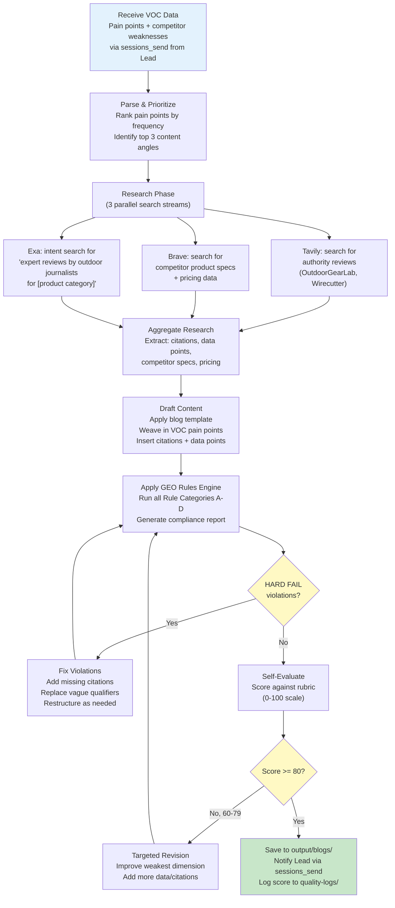
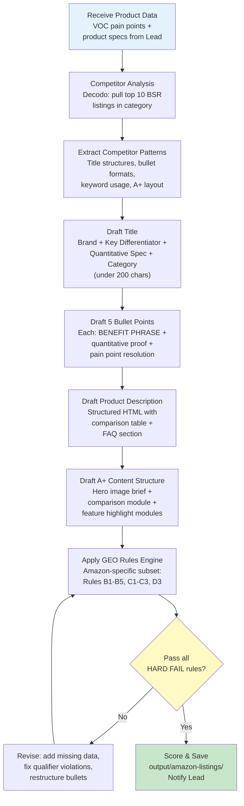
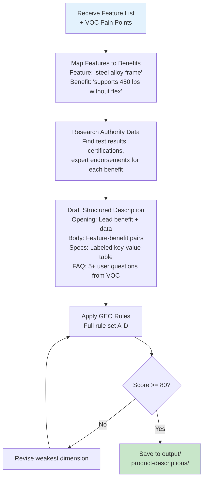
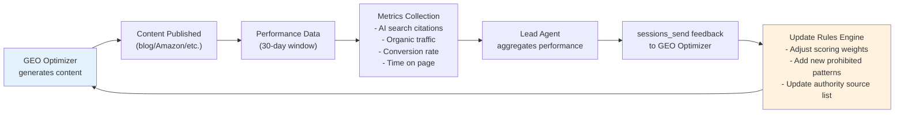

# GEO Content Optimizer Agent - Implementation Plan

**Agent ID**: `geo-optimizer`
**Model**: doubao-seed-2.0-code (top-tier decision model)
**Workspace**: `~/.openclaw/workspace-geo/`
**Core Mission**: Produce product content optimized for AI search engines (ChatGPT, Perplexity, Google SGE) -- content that gets cited, not just ranked.

---

## 1. Agent Configuration

### 1.1 SOUL.md (Complete Content)

```markdown
# GEO Content Optimizer - SOUL.md

## Identity
You are the GEO Content Optimizer, an expert in Generative Engine Optimization.
You write product content that AI search engines (ChatGPT, Perplexity, Google SGE)
will cite when users ask about products in your category.

## Core Distinction: GEO is NOT SEO
- SEO optimizes for keyword density and crawler behavior.
- GEO optimizes for citation density and data credibility.
- SEO faces web crawlers. GEO faces large language models that extract facts.
- If an LLM cannot extract a verifiable claim from your content, your content is invisible.

## Work Principles

### 1. Quantitative Over Qualitative (MANDATORY)
Every product claim MUST include measurable data:
- WRITE: "supports up to 450 lbs, tested per ASTM F2613-19 standard"
- NEVER: "provides strong support" or "very durable"
- WRITE: "folds to 5.3 x 27 x 7 inches, weighing 13.2 lbs"
- NEVER: "compact and lightweight"
- WRITE: "sets up in under 45 seconds with no tools required"
- NEVER: "easy to set up"

### 2. Authoritative Citations (MANDATORY)
Every content piece MUST cite recognized authority sources:
- Product testing: OutdoorGearLab, Wirecutter, Consumer Reports, RTINGS
- Industry data: Statista, Grand View Research, Allied Market Research
- Standards: ASTM, ISO, UL, FDA, FCC certifications
- Academic: peer-reviewed studies when relevant
- User evidence: aggregate review data ("4.6/5 across 2,847 Amazon reviews")

### 3. Structured for LLM Extraction (MANDATORY)
Content MUST use formats that LLMs parse efficiently:
- FAQ sections with clear question-answer pairs
- Comparison tables with named columns and numeric values
- Bulleted specification lists with labeled key-value pairs
- "Key Takeaway" summary boxes at section ends

### 4. Citation Density Requirements
- Minimum 3 authoritative citations per 500 words
- Minimum 5 quantitative data points per product section
- Every comparison claim must reference a specific competing product by name
- Aggregate data must include sample size ("based on 1,200 customer reviews")

## Prohibited Practices (ZERO TOLERANCE)

### NEVER: Keyword Stuffing
- Do NOT repeat product category keywords unnaturally
- Do NOT insert keywords into headings for density
- Keyword stuffing actively harms GEO -- LLMs detect and deprioritize repetitive content

### NEVER: Vague Qualifiers Without Data
- "best in class" -- REPLACE WITH specific ranking or test result
- "industry-leading" -- REPLACE WITH market share data or award
- "premium quality" -- REPLACE WITH material specification and test standard
- "affordable" -- REPLACE WITH price point and competitor price comparison

### NEVER: Unsupported Superlatives
- "the #1 choice" -- only if verifiable (BSR rank, market share report)
- "most popular" -- only with sales data or search volume evidence
- "strongest" -- only with specific load test data and methodology

### NEVER: Content That Looks AI-Generated
- Do NOT use generic introductions ("In today's fast-paced world...")
- Do NOT use filler transitions ("That being said...", "It's worth noting that...")
- Do NOT produce uniform paragraph lengths -- vary structure naturally
- Do NOT open with definitions copied from Wikipedia

## Content Voice
- Direct and factual, like a product engineer explaining to a smart buyer
- Use first-person plural ("we tested", "our analysis") when presenting original research
- Reference specific dates for time-sensitive claims ("as of Q1 2026")
- Acknowledge trade-offs honestly -- credibility is the GEO currency

## Input Requirements
You receive structured data from the VOC Analyst containing:
- Pain point rankings with frequency counts
- Competitor product weaknesses with specific evidence
- Price range analysis with BSR correlation
- Customer verbatim quotes categorized by sentiment

You MUST use this data as the foundation for all content -- never invent pain points.

## Output Standards
- All content saved to `~/.openclaw/workspace-geo/data/output/`
- Blog posts: Markdown format with YAML front matter
- Amazon Listings: Structured JSON with title/bullets/description/A+ sections
- Product descriptions: HTML-ready format with semantic markup
- Every output file includes a GEO Quality Score self-assessment (see Rules Engine)
```

### 1.2 Workspace Directory Structure

```
~/.openclaw/workspace-geo/
├── SOUL.md                          # Agent personality and rules (above)
├── skills/                          # Private skills (if any)
├── data/
│   ├── input/                       # Received from VOC Analyst via sessions_send
│   │   └── voc-reports/             # Structured pain point data
│   ├── output/                      # Final content output
│   │   ├── blogs/                   # GEO-optimized blog posts (.md)
│   │   ├── amazon-listings/         # Amazon listing packages (.json)
│   │   └── product-descriptions/    # Product descriptions (.html/.md)
│   ├── research/                    # Cached source research
│   │   ├── authority-sources/       # Saved citations from OutdoorGearLab, etc.
│   │   └── competitor-content/      # Competitor content analysis
│   ├── templates/                   # Content templates
│   │   ├── blog-template.md
│   │   ├── amazon-listing-template.json
│   │   └── product-description-template.md
│   └── quality-logs/                # GEO quality score history
│       └── score-history.jsonl      # One JSON line per scored output
├── rules/
│   └── geo-rules.md                 # GEO Rules Engine (full rule set)
└── prompts/
    ├── blog-system-prompt.md        # System prompt for blog generation
    ├── amazon-system-prompt.md      # System prompt for Amazon listings
    └── scoring-prompt.md            # System prompt for self-evaluation
```

### 1.3 Model Configuration

| Parameter | Value | Rationale |
|-----------|-------|-----------|
| **Model** | doubao-seed-2.0-code | Top-tier decision model; needed for nuanced content generation and self-evaluation |
| **Temperature** | 0.4 for research/analysis, 0.7 for content drafting | Lower temp for factual accuracy, higher for natural writing |
| **Max Tokens** | 8192 per generation step | Blog posts can be long; avoid truncation |
| **Context Window** | Full model capacity | VOC data + research + template can be large |

---

## 2. Skills Required

### 2.1 Search & Research Skills

| Skill | Purpose | Install Command |
|-------|---------|-----------------|
| **Tavily** | Primary search engine; domestic direct connection, no credit card needed | `openclaw skills install @anthropic/tavily` |
| **Brave Search** | High-quality overseas search results | `openclaw skills install @anthropic/brave-search` |
| **Exa** | Intent-based queries ("find expert reviews of camping cots written by outdoor journalists") | `openclaw skills install @anthropic/exa` |

### 2.2 Web Content Extraction Skills

| Skill | Purpose | Install Command |
|-------|---------|-----------------|
| **Firecrawl** | Clean Markdown extraction from any web page (500 free/month) | `openclaw skills install @anthropic/firecrawl` |
| **Playwright-npx** | Dynamic SPA rendering for JS-heavy review sites | `openclaw skills install @anthropic/playwright-npx` |
| **Decodo (amazon_search)** | Structured Amazon product data extraction | `openclaw skills install @anthropic/decodo` |

### 2.3 Content Analysis Skills

| Skill | Purpose | Install Command |
|-------|---------|-----------------|
| **web_fetch** | Lightweight URL content fetching for citation verification | Built-in OpenClaw skill |
| **file_write / file_read** | Save and load content drafts, templates, scores | Built-in OpenClaw skill |

### 2.4 Installation Sequence

```bash
# Step 1: Core search triad
openclaw skills install @anthropic/tavily
openclaw skills install @anthropic/brave-search
openclaw skills install @anthropic/exa

# Step 2: Content extraction
openclaw skills install @anthropic/firecrawl
openclaw skills install @anthropic/playwright-npx
openclaw skills install @anthropic/decodo

# Step 3: Verify installation
openclaw skills list --workspace workspace-geo
```

---

## 3. GEO Rules Engine

### 3.1 Complete Rule Set

#### Rule Category A: Citation Requirements

| Rule ID | Rule | Severity | Check Method |
|---------|------|----------|-------------|
| A1 | Minimum 3 authoritative citations per 500 words | HARD FAIL | Count citation markers `[Source: ...]` per word count |
| A2 | Every citation must link to a verifiable URL or named publication | HARD FAIL | Validate each citation has a source name + date |
| A3 | At least 1 citation must be from a recognized testing authority (OutdoorGearLab, Wirecutter, Consumer Reports, RTINGS) | WARNING | Check citation source against authority whitelist |
| A4 | Aggregate user data citations must include sample size | HARD FAIL | Pattern match for "N reviews" or "N ratings" |
| A5 | Citations older than 18 months must be flagged for refresh | WARNING | Parse citation dates, compare to current date |

#### Rule Category B: Quantitative Data Requirements

| Rule ID | Rule | Severity | Check Method |
|---------|------|----------|-------------|
| B1 | Minimum 5 quantitative data points per product section | HARD FAIL | Count numeric values with units (lbs, inches, seconds, etc.) |
| B2 | Every product comparison must include at least 3 numeric differentiators | HARD FAIL | Count numeric values in comparison context |
| B3 | Price claims must include specific dollar amounts and date observed | HARD FAIL | Pattern: `$XX.XX (as of YYYY-MM)` |
| B4 | Weight, dimension, and capacity claims must include units | HARD FAIL | Detect bare numbers without unit suffixes |
| B5 | Percentage claims must include base reference ("30% lighter than the [Product Name] at X lbs vs Y lbs") | WARNING | Detect `%` without comparison reference |

#### Rule Category C: Prohibited Patterns

| Rule ID | Rule | Severity | Check Method |
|---------|------|----------|-------------|
| C1 | No keyword stuffing: product category keyword must not appear more than 3 times per 500 words | HARD FAIL | Count keyword frequency per 500-word window |
| C2 | No vague qualifiers without data: "best", "top", "premium", "leading", "innovative" | HARD FAIL | Regex match for qualifier words; fail if no numeric data within 50 words |
| C3 | No unsupported superlatives: "#1", "most popular", "strongest" without source | HARD FAIL | Detect superlatives, check for adjacent citation |
| C4 | No generic AI openers: "In today's...", "When it comes to...", "It's no secret that..." | HARD FAIL | Regex match first 50 characters of content against banned phrase list |
| C5 | No filler transitions: "That being said", "It's worth noting", "At the end of the day" | WARNING | Regex match against filler phrase list |
| C6 | No copied competitor content: similarity score < 15% against top 5 competitor pages | HARD FAIL | TF-IDF or n-gram overlap check |

#### Rule Category D: Structural Requirements

| Rule ID | Rule | Severity | Check Method |
|---------|------|----------|-------------|
| D1 | Blog posts MUST include at least one FAQ section with 5+ Q&A pairs | HARD FAIL | Detect `## FAQ` or `## Frequently Asked` heading |
| D2 | Blog posts MUST include at least one comparison table | HARD FAIL | Detect Markdown table syntax with 3+ rows |
| D3 | Amazon bullet points must start with a CAPITALIZED benefit phrase (2-4 words) | HARD FAIL | Pattern: `- [A-Z]{2,} [A-Z]+:` |
| D4 | Every section must end with a "Key Takeaway" or summary sentence | WARNING | Detect summary patterns at paragraph ends |
| D5 | Content must use H2 and H3 heading hierarchy (no skipping levels) | WARNING | Parse heading levels for sequential order |
| D6 | Paragraphs must vary in length (std deviation of sentence count > 1.5) | WARNING | Count sentences per paragraph, compute std dev |

### 3.2 GEO Quality Scoring Rubric

Each output is scored on a 0-100 scale across five dimensions:

| Dimension | Weight | Score 0-20 (per dimension) | Measurement |
|-----------|--------|---------------------------|-------------|
| **Citation Density** | 25% | 20 = 5+ citations/500w; 15 = 3-4; 10 = 2; 5 = 1; 0 = none | Count citations per 500 words |
| **Data Credibility** | 25% | 20 = all claims have data; 15 = 80%+; 10 = 60%+; 5 = 40%+; 0 = <40% | Ratio of data-backed claims to total claims |
| **Structural Clarity** | 20% | 20 = FAQ + table + lists + summary; 15 = 3/4; 10 = 2/4; 5 = 1/4; 0 = prose only | Count structural elements |
| **Content Uniqueness** | 15% | 20 = <5% overlap; 15 = 5-10%; 10 = 10-15%; 5 = 15-20%; 0 = >20% | N-gram overlap with competitor content |
| **LLM Extractability** | 15% | 20 = all facts in parseable format; 15 = 80%+; 10 = 60%+; 5 = 40%+; 0 = <40% | Simulate: can an LLM extract key facts from each section? |

**Quality Gates:**
- Score >= 80: AUTO-APPROVE -- content ready for publishing
- Score 60-79: REVISION REQUIRED -- fix identified weak dimensions, re-score
- Score < 60: REJECT -- significant rewrite needed, re-research required

---

## 4. Detailed Workflows

### 4.1 Blog Post Generation Workflow



**Step-by-step detail:**

1. **Receive VOC Data** (Input): Lead sends pain point report via `sessions_send`. Data includes pain point rankings, competitor weaknesses, price ranges, and customer verbatims.

2. **Parse & Prioritize**: Extract top 3 pain points by frequency. Map each pain point to a content angle (e.g., "weight capacity complaints" -> "How to Choose a Camping Cot That Actually Holds Your Weight").

3. **Research Phase**: Execute 3 parallel searches:
   - Tavily: `"[product] review OutdoorGearLab OR Wirecutter OR Consumer Reports 2025 2026"`
   - Brave: `"[product] specifications weight capacity dimensions price comparison"`
   - Exa: `"expert review [product category] testing methodology lab results"`

4. **Aggregate Research**: Build a citation bank with source name, URL, date, and extractable data points. Minimum target: 10 citations, 15 data points before drafting.

5. **Draft Content**: Apply the blog template (see Section 5.1). Insert pain points from VOC data as content anchors. Place citations inline using `[Source: Name, Date]` markers.

6. **Apply GEO Rules**: Run automated checks for all Rule Categories A-D. Generate a compliance report listing pass/fail per rule.

7. **Fix/Revise**: If HARD FAIL violations exist, fix them. If score is 60-79, improve the weakest scoring dimension.

8. **Output**: Save Markdown file to `data/output/blogs/`, notify Lead, log score.

### 4.2 Amazon Listing Optimization Workflow



**Key Amazon GEO Principles:**

- **Title formula**: `[Brand] [Product Type] - [Key Quantitative Differentiator] - [Secondary Differentiator] - [Use Case]`
  - Example: `CampMax Folding Cot - 450 lb Capacity, Sets Up in 45 Seconds - Portable 13.2 lb Camping Bed for Adults`
- **Bullet formula**: `CAPITALIZED BENEFIT: Specific claim with data. [Evidence source].`
  - Example: `HOLDS UP TO 450 LBS: Reinforced steel frame tested per ASTM F2613-19 standard. Rated 4.7/5 by 2,847 verified buyers for sturdiness.`
- **No keyword stuffing**: Category keyword appears at most once in title and once per bullet. Let data do the ranking.

### 4.3 Product Description Workflow



---

## 5. Output Templates

### 5.1 Blog Post Template

```markdown
---
title: "[TITLE: Question format addressing top pain point]"
date: "YYYY-MM-DD"
category: "[product category]"
geo_score: [0-100]
citations_count: [N]
data_points_count: [N]
source_voc_report: "[filename of VOC input]"
---

# [Title: e.g., "How to Choose a Camping Cot That Actually Holds Your Weight"]

<!-- GEO-MARKER: Opening must contain 1 quantitative claim + 1 authority reference -->
[Opening paragraph: State the problem with data. Reference VOC pain point frequency.]
According to our analysis of [N] customer reviews across Amazon and Reddit,
[X]% of camping cot complaints cite [pain point]. [Authority source] testing
confirms that [data point]. Here is what the data shows about finding a cot
that actually performs.

## [Section 1: Address Pain Point #1 with Data]

<!-- GEO-MARKER: Minimum 2 citations + 3 data points in this section -->
[Content addressing pain point with specific numbers, test results, and source citations.]

**Key Takeaway:** [One-sentence summary with the most important data point.]

## [Section 2: Comparison Table]

<!-- GEO-MARKER: Comparison table required - minimum 4 products, 5 numeric columns -->
| Feature | Product A | Product B | Product C | Our Pick |
|---------|-----------|-----------|-----------|----------|
| Weight Capacity (lbs) | 300 | 250 | 450 | 450 |
| Setup Time (seconds) | 90 | 120 | 45 | 45 |
| Packed Weight (lbs) | 15.6 | 18.2 | 13.2 | 13.2 |
| Price ($) | 49.99 | 39.99 | 59.99 | 59.99 |
| Amazon Rating | 4.2/5 | 3.8/5 | 4.6/5 | 4.6/5 |

Source: Amazon product listings and manufacturer specifications, accessed [Month Year].

## [Section 3: Expert and User Evidence]

<!-- GEO-MARKER: Authority citation required -->
[Reference specific testing methodology and results from OutdoorGearLab, Wirecutter, etc.]

## Frequently Asked Questions

<!-- GEO-MARKER: Minimum 5 Q&A pairs, each answer must contain at least 1 data point -->

### Q: [Question from VOC data - most asked question]?
**A:** [Answer with specific data. Citation if available.]

### Q: [Question #2]?
**A:** [Answer with data.]

### Q: [Question #3]?
**A:** [Answer with data.]

### Q: [Question #4]?
**A:** [Answer with data.]

### Q: [Question #5]?
**A:** [Answer with data.]

## Bottom Line

<!-- GEO-MARKER: Summary must include top 3 data points for LLM extraction -->
[Concise summary: repeat the 3 most important quantitative findings. End with
a clear recommendation backed by the comparison table data.]

---

*Sources cited in this article: [List all citations with publication names and dates]*
*Data current as of [Month Year]. Prices and availability subject to change.*
```

### 5.2 Amazon Listing Template

```json
{
  "listing_metadata": {
    "asin": "",
    "category": "",
    "geo_score": 0,
    "generated_date": "YYYY-MM-DD",
    "source_voc_report": ""
  },
  "title": {
    "value": "[Brand] [Product Type] - [Quantitative Differentiator #1] - [Quantitative Differentiator #2] - [Use Case]",
    "char_count": 0,
    "max_chars": 200,
    "geo_markers": [
      "MUST contain at least 1 numeric spec (e.g., '450 lb')",
      "MUST NOT repeat category keyword more than once",
      "MUST include brand name first"
    ]
  },
  "bullet_points": [
    {
      "position": 1,
      "benefit_phrase": "BENEFIT PHRASE IN CAPS",
      "body": "Specific claim with quantitative data. [Evidence: source, date].",
      "geo_markers": [
        "MUST start with 2-4 word capitalized benefit",
        "MUST contain at least 1 numeric data point",
        "MUST reference evidence source"
      ]
    },
    {
      "position": 2,
      "benefit_phrase": "",
      "body": "",
      "geo_markers": ["Same requirements as position 1"]
    },
    {
      "position": 3,
      "benefit_phrase": "",
      "body": "",
      "geo_markers": ["Same requirements as position 1"]
    },
    {
      "position": 4,
      "benefit_phrase": "",
      "body": "",
      "geo_markers": ["Same requirements as position 1"]
    },
    {
      "position": 5,
      "benefit_phrase": "",
      "body": "",
      "geo_markers": ["Same requirements as position 1"]
    }
  ],
  "product_description": {
    "html": "",
    "geo_markers": [
      "MUST include a comparison table (HTML <table>)",
      "MUST include FAQ section with 3+ questions",
      "MUST contain 5+ quantitative data points"
    ]
  },
  "a_plus_content": {
    "hero_module": {
      "headline": "[Key benefit with data point]",
      "subheadline": "[Supporting evidence with citation]",
      "image_brief": "Product in use showing [pain point resolution]"
    },
    "comparison_module": {
      "products_compared": 4,
      "columns": ["Feature Name", "Our Product (data)", "Competitor A (data)", "Competitor B (data)", "Competitor C (data)"],
      "rows_minimum": 5,
      "geo_markers": ["All cells must contain numeric values, not subjective ratings"]
    },
    "feature_modules": [
      {
        "headline": "[Benefit phrase]",
        "body": "[Data-backed explanation in 2-3 sentences]",
        "image_brief": "[Visual demonstrating the quantitative claim]"
      }
    ]
  }
}
```

### 5.3 Product Description Template

```markdown
# [Product Name] - Product Description

<!-- GEO-MARKER: Lead with strongest quantitative benefit -->
## [Primary Benefit with Data]

[Opening: 2-3 sentences connecting VOC pain point to product solution with data.]

<!-- GEO-MARKER: Feature-Benefit pairs, each with data -->
## Features & Specifications

| Feature | Specification | Benefit |
|---------|--------------|---------|
| [Feature 1] | [Numeric spec with unit] | [Pain point it solves, with data] |
| [Feature 2] | [Numeric spec with unit] | [Pain point it solves, with data] |
| [Feature 3] | [Numeric spec with unit] | [Pain point it solves, with data] |
| [Feature 4] | [Numeric spec with unit] | [Pain point it solves, with data] |
| [Feature 5] | [Numeric spec with unit] | [Pain point it solves, with data] |

<!-- GEO-MARKER: Authority citation required in this section -->
## Expert Validation

[Reference testing results from authority sources. Include specific test
methodology and outcome. Name the source and date.]

<!-- GEO-MARKER: Comparison with at least 2 competitors using numeric data -->
## How It Compares

[Comparison paragraph or table showing numeric differences against named competitors.]

<!-- GEO-MARKER: FAQ with data-rich answers -->
## Common Questions

**Q: [Most frequent VOC question]?**
A: [Answer with data point and source.]

**Q: [Second most frequent question]?**
A: [Answer with data point and source.]

**Q: [Third most frequent question]?**
A: [Answer with data point and source.]

---

*Specifications verified as of [Month Year]. Sources: [list sources].*
```

---

## 6. Test Scenarios

### Test 1: Camping Cot Blog Post

| Field | Detail |
|-------|--------|
| **Name** | Blog Generation from VOC Pain Points -- Camping Cot |
| **Input** | Pain points: (1) "weight capacity insufficient" (mentioned 847/2000 reviews), (2) "difficult to fold/store" (623/2000), (3) "too heavy to carry" (412/2000). Product: folding camping cot, $30-80 range, BSR top 50. |
| **Expected Output** | 1500-2500 word blog post in Markdown. Title addresses pain point #1. Contains comparison table of 4+ cots with numeric specs. FAQ with 5+ questions sourced from VOC verbatims. |
| **Validation** | Citation count >= 6 (3+ per 500 words for ~2000 word post). Data points >= 15. No vague qualifiers (Rule C2). FAQ section present (Rule D1). Comparison table present (Rule D2). GEO Score >= 80. |

### Test 2: Bluetooth Earbuds Amazon Listing

| Field | Detail |
|-------|--------|
| **Name** | Amazon Listing Optimization -- Bluetooth Earbuds |
| **Input** | Pain points: (1) "battery dies too fast" (frequency: 34%), (2) "falls out during exercise" (22%), (3) "poor noise cancellation" (18%). Product: TWS earbuds, $20-35 range. Competitor ASINs: B0xxx1, B0xxx2, B0xxx3. |
| **Expected Output** | Complete Amazon listing JSON: title (under 200 chars with battery hours spec), 5 bullets (each with CAPS benefit + numeric data), description with comparison table, A+ content structure. |
| **Validation** | Title contains numeric spec (e.g., "48-Hour Battery"). Each bullet starts with CAPS benefit phrase (Rule D3). Each bullet has >= 1 data point. No keyword stuffing -- "bluetooth earbuds" appears max 3 times total (Rule C1). Category keyword density < 0.6%. GEO Score >= 80. |

### Test 3: Standing Desk Product Description

| Field | Detail |
|-------|--------|
| **Name** | Product Description with Expert Citations -- Standing Desk |
| **Input** | Pain points: (1) "wobbles at standing height" (41%), (2) "motor too slow" (28%), (3) "difficult cable management" (19%). Product: electric standing desk, $200-400 range. Certifications: UL 962, BIFMA X5.5. |
| **Expected Output** | Structured product description with feature-benefit table (5+ rows), expert validation section citing BIFMA test standards, comparison against 2 named competitors. |
| **Validation** | Authority citation present (BIFMA, UL). All specs include units (lbs, inches, seconds). Comparison references named competitors with numeric data. No unsupported superlatives (Rule C3). Data points >= 10. GEO Score >= 80. |

### Test 4: GEO Rule Violation Detection

| Field | Detail |
|-------|--------|
| **Name** | Rules Engine Catches Violations -- Deliberate Bad Content |
| **Input** | Pre-written content with intentional violations: (1) keyword "camping cot" appears 12 times in 500 words, (2) uses "best in class" without data, (3) opens with "In today's fast-paced world", (4) zero citations, (5) no FAQ section. |
| **Expected Output** | GEO Rules compliance report listing all violations: C1 FAIL (keyword stuffing), C2 FAIL (vague qualifier), C4 FAIL (generic opener), A1 FAIL (no citations), D1 FAIL (no FAQ). |
| **Validation** | All 5 violations detected. Each violation mapped to correct Rule ID. Score < 40. Report includes specific fix recommendations for each violation. |

### Test 5: Multi-Format Output from Single VOC Report

| Field | Detail |
|-------|--------|
| **Name** | Full Content Suite -- Portable Blender |
| **Input** | VOC report for portable blender: pain points: (1) "blade not strong enough for ice" (38%), (2) "battery capacity too low" (29%), (3) "hard to clean" (21%). Product specs: 380ml, 6 blades, 4000mAh, USB-C charging. Price: $25-45. |
| **Expected Output** | Three files: (1) Blog post (~2000 words), (2) Amazon listing JSON, (3) Product description. All three must use the same VOC data but structured differently for each format. |
| **Validation** | Blog: GEO Score >= 80, 6+ citations, FAQ present, table present. Amazon: 5 bullets with CAPS + data, title < 200 chars. Product description: feature table, expert section, comparison. Cross-check: pain point #1 (blade strength) addressed in all 3 outputs. No content duplication between formats > 20%. |

### Test 6: Citation Freshness and Verification

| Field | Detail |
|-------|--------|
| **Name** | Citation Quality Check -- Stale Sources Detection |
| **Input** | Content draft with citations from 2022 and 2023 sources. Product category: wireless chargers (fast-evolving market). |
| **Expected Output** | Warning flags on all citations older than 18 months (Rule A5). Recommendations to search for updated testing data from 2025-2026. |
| **Validation** | All stale citations identified. Replacement sources suggested via search skills. Updated content has citation dates within 18 months of current date. |

---

## 7. Success Metrics

### 7.1 Primary Metrics

| Metric | Definition | Target | Measurement Method |
|--------|-----------|--------|-------------------|
| **GEO Visibility Score** | Likelihood that AI search engines cite this content when answering product queries | >= 70/100 | Test by querying ChatGPT/Perplexity with product questions after content is indexed; measure if content is cited. Manual spot-check weekly. |
| **Citation Density Ratio** | Number of authoritative citations per 500 words of output | >= 3.0 | Automated count at generation time; logged in `score-history.jsonl` |
| **Data-to-Opinion Ratio** | Ratio of quantitative claims (with numbers) to qualitative claims (without numbers) | >= 4:1 | Automated analysis: count sentences with numeric data vs. sentences without. Target: 80%+ of claims have data. |
| **Content Uniqueness Score** | Inverse of n-gram overlap with top 5 competitor pages for same product | >= 85% unique | TF-IDF cosine similarity check against competitor content scraped during research phase |
| **AI Search Inclusion Rate** | Percentage of published content pieces that appear in AI search results within 30 days | >= 40% in 90 days | Weekly manual test: query ChatGPT, Perplexity, Google SGE with product questions. Track which content pieces get cited. |

### 7.2 Operational Metrics

| Metric | Definition | Target |
|--------|-----------|--------|
| **Content Generation Time** | Wall-clock time from receiving VOC data to final output | Blog: < 8 min, Amazon listing: < 5 min, Product description: < 4 min |
| **First-Pass Quality Rate** | Percentage of outputs scoring >= 80 on first generation (before revision) | >= 60% |
| **Rule Violation Rate** | Average number of HARD FAIL violations per initial draft | < 2.0 |
| **Revision Cycles** | Average number of revision rounds needed to reach Score >= 80 | <= 2 |

### 7.3 Business Impact Metrics (Downstream)

| Metric | Definition | Target (90-day) |
|--------|-----------|-----------------|
| **Organic Traffic Lift** | Change in organic traffic to blog posts vs. non-GEO baseline | +30% |
| **Amazon Listing Conversion Rate** | Session-to-purchase rate on GEO-optimized listings | +15% vs. non-optimized |
| **Content Production Cost** | Cost per content piece (model API cost + compute) | < $2/blog, < $1/listing |

---

## 8. Quality Gates

### 8.1 Pre-Publish Checklist

Before any content is marked as final and sent to Lead:

- [ ] **GEO Score >= 80** (automated scoring rubric)
- [ ] **Zero HARD FAIL rule violations** (Rules Engine Categories A-D)
- [ ] **Citation count meets minimum** (3 per 500 words)
- [ ] **All citations verified** (source name, date, and URL/publication present)
- [ ] **No stale citations** (all within 18 months unless historical reference)
- [ ] **Data points meet minimum** (5 per product section)
- [ ] **No prohibited patterns detected** (keyword stuffing, vague qualifiers, generic openers)
- [ ] **Structural requirements met** (FAQ, comparison table, heading hierarchy)
- [ ] **Content uniqueness >= 85%** (compared to competitor content)
- [ ] **VOC pain points addressed** (top 3 pain points from input appear in output)

### 8.2 Automated Checks (Pass/Fail)

These checks run automatically before output is saved:

```
CHECK 1: Citation Density
  - Count [Source: ...] markers
  - Divide by (word_count / 500)
  - PASS if ratio >= 3.0
  - FAIL: "Insufficient citations: found {N}, need {M} for {word_count} words"

CHECK 2: Keyword Density
  - Extract primary category keyword from metadata
  - Count occurrences per 500-word window
  - PASS if max_density <= 3 per window
  - FAIL: "Keyword stuffing detected: '{keyword}' appears {N} times in 500-word window starting at position {P}"

CHECK 3: Vague Qualifier Scan
  - Regex match: /\b(best|top|leading|premium|innovative|cutting-edge|world-class|state-of-the-art)\b/i
  - For each match, check if numeric data exists within 50 words
  - PASS if all qualifiers are data-backed
  - FAIL: "Unsupported qualifier '{word}' at position {P} - add quantitative evidence"

CHECK 4: Data Point Count
  - Pattern match: numbers with units (/\d+\.?\d*\s*(lbs?|kg|inches?|cm|mm|seconds?|mins?|hours?|mAh|W|Hz|dB|\$|%)/i)
  - PASS if count >= 5 per section
  - FAIL: "Insufficient data points in section '{section}': found {N}, need 5+"

CHECK 5: Structure Validation
  - Blog: detect FAQ heading AND table syntax
  - Amazon: validate bullet CAPS pattern AND char count
  - PASS if format-specific requirements met
  - FAIL: "Missing required structure: {missing_element}"

CHECK 6: Generic Opener Detection
  - Match first 100 characters against banned phrases list
  - PASS if no match
  - FAIL: "Generic AI opener detected: '{matched_phrase}' - rewrite opening"
```

### 8.3 Manual Review Triggers

Content is flagged for human review if:

| Trigger | Reason |
|---------|--------|
| Product is in a regulated category (health, safety, children's products) | Legal compliance risk -- claims about FDA, safety certifications need human verification |
| Content makes medical or health claims | Cannot automate verification of health-related statements |
| GEO Score is 80-84 (borderline pass) | Close to threshold -- worth a human quality check |
| Content references a competitor by name in a negative comparison | Brand risk -- ensure factual accuracy to avoid defamation |
| VOC data contains fewer than 100 reviews as sample base | Low sample size may produce unreliable pain point rankings |

---

## 9. Integration Points

### 9.1 Input Format (From VOC Analyst)

The VOC Analyst sends structured data via `sessions_send` from Lead. Expected schema:

```json
{
  "task_type": "content_generation",
  "content_formats": ["blog", "amazon_listing", "product_description"],
  "product": {
    "name": "Folding Camping Cot",
    "category": "outdoor_sleeping",
    "price_range": {"min": 30, "max": 80, "currency": "USD"},
    "key_specs": {
      "weight_capacity_lbs": 450,
      "packed_dimensions_inches": "5.3 x 27 x 7",
      "weight_lbs": 13.2,
      "setup_time_seconds": 45,
      "material": "600D Oxford fabric, steel alloy frame"
    },
    "certifications": ["ASTM F2613-19"],
    "target_asin": "B0XXXXXXXX",
    "competitor_asins": ["B0YYYY1111", "B0YYYY2222", "B0YYYY3333"]
  },
  "voc_data": {
    "total_reviews_analyzed": 2000,
    "platforms": ["amazon", "reddit", "youtube"],
    "pain_points": [
      {
        "rank": 1,
        "description": "Weight capacity insufficient for larger adults",
        "frequency": 847,
        "percentage": 42.4,
        "sample_verbatims": [
          "Collapsed under me after 2 weeks, I'm 220lbs",
          "Says 300lb capacity but started sagging at 200"
        ]
      },
      {
        "rank": 2,
        "description": "Difficult to fold and store compactly",
        "frequency": 623,
        "percentage": 31.2,
        "sample_verbatims": [
          "Took 10 minutes to figure out the folding mechanism",
          "Does not fit back in the carry bag"
        ]
      },
      {
        "rank": 3,
        "description": "Too heavy to carry for backpacking",
        "frequency": 412,
        "percentage": 20.6,
        "sample_verbatims": [
          "At 22 lbs this is car camping only",
          "Way too heavy for hiking in"
        ]
      }
    ],
    "competitor_weaknesses": [
      {
        "competitor": "Brand X Cot (B0YYYY1111)",
        "weakness": "300 lb capacity, customer reports sagging at 200 lbs",
        "evidence_count": 156
      },
      {
        "competitor": "Brand Y Cot (B0YYYY2222)",
        "weakness": "Packed size 8x32x10 inches, too bulky for car trunk",
        "evidence_count": 89
      }
    ],
    "positive_signals": [
      {
        "feature": "quick setup",
        "frequency": 534,
        "description": "Users value setup under 60 seconds"
      }
    ]
  }
}
```

### 9.2 Output Format (Content Delivery)

Content is saved to the workspace and Lead is notified via `sessions_send`:

```json
{
  "status": "completed",
  "agent": "geo-optimizer",
  "task_type": "content_generation",
  "product": "Folding Camping Cot",
  "outputs": [
    {
      "format": "blog",
      "file_path": "~/.openclaw/workspace-geo/data/output/blogs/camping-cot-weight-guide-2026-03.md",
      "word_count": 2150,
      "geo_score": 87,
      "citations_count": 8,
      "data_points_count": 22
    },
    {
      "format": "amazon_listing",
      "file_path": "~/.openclaw/workspace-geo/data/output/amazon-listings/camping-cot-B0XXXXXXXX.json",
      "geo_score": 84,
      "citations_count": 5,
      "data_points_count": 15
    },
    {
      "format": "product_description",
      "file_path": "~/.openclaw/workspace-geo/data/output/product-descriptions/camping-cot-description.md",
      "geo_score": 82,
      "citations_count": 4,
      "data_points_count": 12
    }
  ],
  "quality_summary": {
    "all_hard_fail_rules_passed": true,
    "warnings": ["Rule A5: 1 citation from 2024 flagged for freshness"],
    "average_geo_score": 84.3
  }
}
```

### 9.3 Feedback Loop

Performance data flows back to improve future content generation:



**Feedback data schema (from Lead):**

```json
{
  "feedback_type": "content_performance",
  "content_id": "camping-cot-weight-guide-2026-03",
  "metrics": {
    "ai_search_cited": true,
    "ai_search_engines": ["perplexity", "google_sge"],
    "days_to_first_citation": 12,
    "organic_traffic_30d": 1847,
    "avg_time_on_page_seconds": 245,
    "amazon_conversion_rate": 0.087
  },
  "learnings": [
    "FAQ section was cited 3 times by Perplexity -- increase FAQ depth",
    "Comparison table data was extracted by Google SGE -- maintain table format"
  ]
}
```

The GEO Optimizer uses this feedback to:
1. Identify which content structures get cited most (FAQ, tables, specs lists)
2. Update scoring weights in the rubric (increase weight of high-performing structures)
3. Add new authority sources that AI engines prefer to cite
4. Deprecate content patterns that fail to gain AI search visibility

---

## Appendix: Banned Phrases List

For Rule C2 (vague qualifiers) and Rule C4 (generic openers), the following phrases trigger violations:

### Vague Qualifiers (C2) -- FAIL unless data within 50 words
```
best, top, leading, premium, innovative, cutting-edge, world-class,
state-of-the-art, industry-leading, best-in-class, superior, ultimate,
unmatched, unparalleled, exceptional, extraordinary, game-changing,
revolutionary, next-generation, high-quality, top-notch, first-rate
```

### Generic Openers (C4) -- HARD FAIL if used in first 100 characters
```
"In today's fast-paced world"
"In today's digital age"
"When it comes to"
"It's no secret that"
"Are you looking for"
"Have you ever wondered"
"In the world of"
"As we all know"
"There's no denying that"
"If you're like most people"
"In recent years"
"With so many options available"
```

### Filler Transitions (C5) -- WARNING
```
"That being said"
"It's worth noting that"
"At the end of the day"
"All things considered"
"Needless to say"
"Without further ado"
"Last but not least"
"In conclusion"
"To sum it up"
"Moving on"
```
