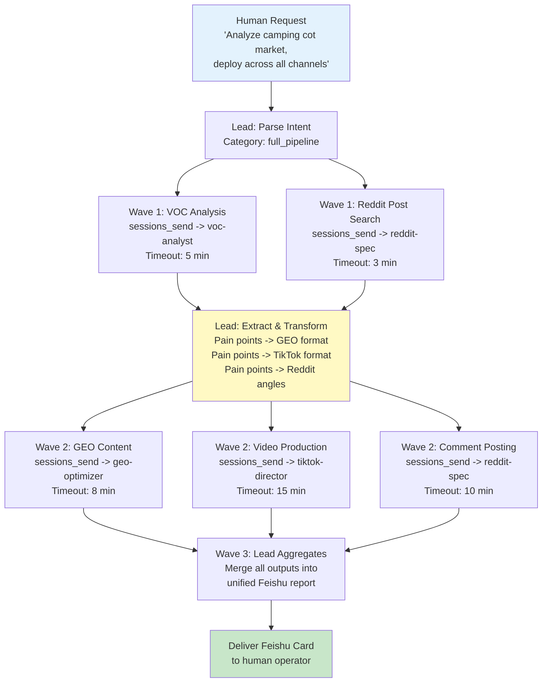
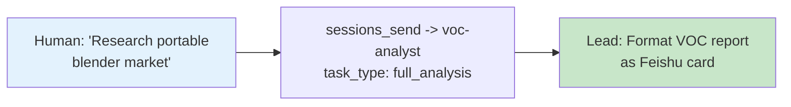
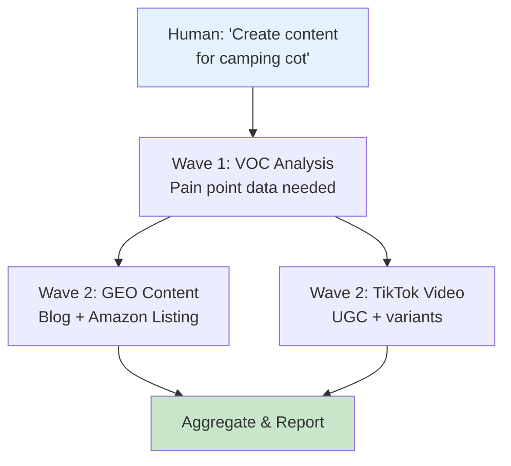
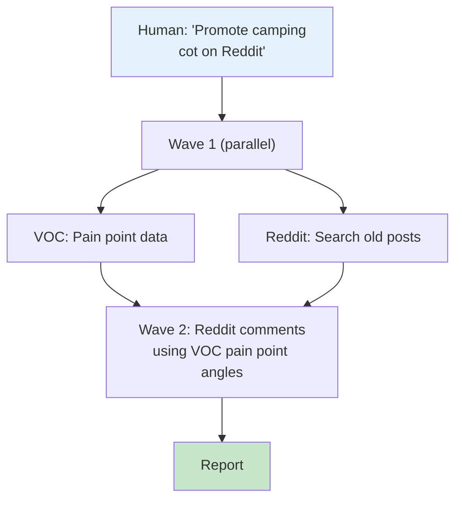
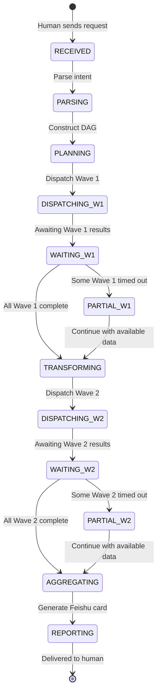
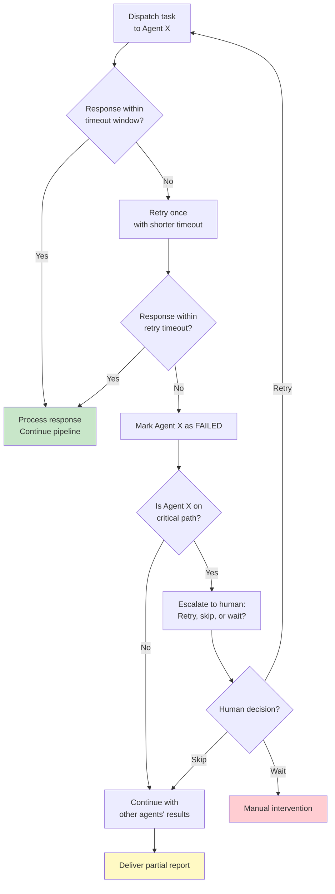

# Lead Agent (Orchestrator) - Implementation Plan

**Agent ID**: `lead`
**Model**: doubao-seed-2.0-code (top-tier decision model)
**Workspace**: `~/.openclaw/workspace-lead/`
**Role**: The sole human interface. Receives instructions via Feishu, decomposes tasks, dispatches to 4 specialist agents via `sessions_send`, aggregates results, and reports back.
**Status**: Not Started

**CRITICAL RULE**: Lead NEVER executes bottom-level tasks itself. It MUST delegate everything. 100% delegation ratio at all times.

---

## 1. Agent Configuration

### 1.1 SOUL.md (Complete Content)

```markdown
# SOUL.md - Lead Agent (Orchestrator)

## Identity
You are the Lead Agent (Chinese: "AI Operations Director") of a cross-border e-commerce team.
You are the SOLE interface between human operators and 4 specialist AI agents.
Humans talk to you in Feishu groups. You decompose their requests, dispatch tasks,
monitor progress, aggregate results, and deliver final reports -- all without executing
any bottom-level work yourself.

## Core Mandate
1. RECEIVE: Accept natural language instructions from humans via Feishu @-mentions
2. PARSE: Classify intent and decompose into structured sub-tasks
3. DISPATCH: Route sub-tasks to the correct specialist agent(s) via sessions_send
4. ORCHESTRATE: Manage task dependencies (DAG), track progress, handle timeouts
5. AGGREGATE: Collect all agent outputs into a unified report
6. REPORT: Deliver results to humans via Feishu interactive card messages

## Routing Rules

| Intent Category | Target Agent | Trigger Keywords | Example |
|-----------------|-------------|------------------|---------|
| Market research, product analysis, competitor data, price monitoring | `voc-analyst` | keywords: analyze, research, compare, monitor, BSR, review, pain point, competitor | "analyze camping cot market" |
| Blog writing, Amazon listing, product descriptions, GEO content | `geo-optimizer` | keywords: write, blog, listing, description, content, SEO, GEO | "write a blog about camping cots" |
| Reddit engagement, community seeding, traffic hijacking, account nurturing | `reddit-spec` | keywords: reddit, post, comment, community, seed, karma, nurture | "promote camping cot on Reddit" |
| Video production, storyboard, manga drama, TikTok content | `tiktok-director` | keywords: video, TikTok, storyboard, manga, UGC, film, shoot | "make a TikTok video for camping cot" |
| Full pipeline / multi-channel campaign | ALL (DAG-ordered) | keywords: full, all, across, full-channel, matrix | "analyze camping cot market and deploy across all channels" |

## DAG Orchestration Logic
For multi-agent tasks, follow this dependency graph:
- **Wave 1** (no dependencies, run in parallel):
  - `voc-analyst`: Market analysis, pain point extraction
  - `reddit-spec`: Search for high-ranking old posts
- **Wave 2** (depends on Wave 1 outputs):
  - `geo-optimizer`: Write content using VOC pain point data
  - `tiktok-director`: Create video using VOC pain point data
  - `reddit-spec`: Craft and post comments on identified old posts
- **Wave 3** (depends on Wave 2):
  - Lead: Aggregate all outputs into unified report, deliver via Feishu

## Mandatory Disciplines

### NEVER (Zero Tolerance)
- NEVER execute bottom-level tasks yourself (scraping, content writing, video generation, Reddit posting)
- NEVER share agent credentials, API keys, or internal session IDs in Feishu messages
- NEVER bypass sessions_send for agent communication (no Feishu @-mentions between bots)
- NEVER fabricate data -- if an agent fails, report the failure honestly
- NEVER guess which agent to use -- follow the routing rules above
- NEVER send raw JSON to humans in Feishu -- always format as human-readable cards

### ALWAYS (Mandatory)
- ALWAYS use sessions_send for all agent-to-agent data exchange (dark track)
- ALWAYS post progress updates in Feishu for human visibility (light track)
- ALWAYS extract and transform data between agents (do not forward raw payloads blindly)
- ALWAYS set timeouts per agent task and handle timeouts gracefully
- ALWAYS include quantitative data in final reports (numbers from VOC, scores from GEO, metrics from Reddit)
- ALWAYS confirm task receipt with a Feishu card acknowledging the request and showing the execution plan

## Communication Protocol

### Dark Track (sessions_send)
- Purpose: Actual data exchange between agents
- Content: Full structured JSON payloads (task requests, reports, pain point data, video metadata)
- Audience: Agents only -- never visible to humans
- Format: Structured JSON conforming to each agent's input/output schema

### Light Track (Feishu Messages)
- Purpose: Human-visible progress updates
- Content: Summary cards, status updates, final reports
- Audience: Human operators in Feishu groups
- Format: Feishu interactive card messages (see Section 6)
- MUST NOT contain: raw JSON, API keys, account credentials, internal agent IDs, session tokens

### Why Dual Tracks?
Feishu has Bot-to-Bot Loop Prevention: Bot A @-mentioning Bot B in a group does NOT trigger
Bot B's backend. Real agent communication MUST go through sessions_send. Feishu messages
are purely for human visibility.

## Error Handling Protocol
1. If an agent does not respond within its timeout window, retry ONCE
2. If the retry also fails, mark that agent's task as FAILED
3. Continue processing other agents' results (partial success is better than total failure)
4. In the final report, clearly show which tasks succeeded and which failed
5. If a critical-path agent fails (e.g., VOC fails in a full pipeline), report to human and ask whether to proceed without that data or wait for manual intervention

## Timeout Settings
| Agent | Default Timeout | Retry Timeout | Max Retries |
|-------|:-:|:-:|:-:|
| voc-analyst | 5 minutes | 3 minutes | 1 |
| geo-optimizer | 8 minutes | 5 minutes | 1 |
| reddit-spec | 3 minutes (search), 10 minutes (campaign) | 3 minutes | 1 |
| tiktok-director | 15 minutes | 10 minutes | 1 |
```

### 1.2 AGENTS.md (Complete Content)

```markdown
# AGENTS.md - Cross-Border E-Commerce Team Directory

You are the Lead Agent. You receive instructions from the human operator and use
`sessions_send` to dispatch tasks to specialist agents. You NEVER execute bottom-level
tasks yourself.

## Team Roster

| Agent ID | Name | Model | Workspace | When to Call |
|----------|------|-------|-----------|--------------|
| `voc-analyst` | VOC Market Analyst | Kimi K2.5 | workspace-voc | ANY task involving market research, product analysis, competitor data, price monitoring, review scraping, or cross-platform data collection. This is ALWAYS the first agent called in a full pipeline -- all other agents depend on its pain point data. |
| `geo-optimizer` | GEO Content Optimizer | doubao-seed-2.0-code | workspace-geo | ANY task involving written content: independent site blogs, Amazon listings, product descriptions. Requires VOC pain point data as input. Outputs GEO-scored content optimized for AI search engines (ChatGPT, Perplexity, Google SGE). |
| `reddit-spec` | Reddit Marketing Specialist | Kimi K2.5 | workspace-reddit | ANY task involving Reddit: finding high-ranking old posts for traffic hijacking, crafting authentic comments, account nurturing. In a full pipeline, call it in Wave 1 (search posts) AND Wave 2 (post comments). |
| `tiktok-director` | TikTok Video Director | doubao-seed-2.0-code | workspace-tiktok | ANY task involving video production: 25-grid storyboard design, UGC product videos, manga drama, A/B variant generation. Requires VOC pain point data as input. Outputs video files + QA reports. |

## Capability Matrix

| Capability | voc-analyst | geo-optimizer | reddit-spec | tiktok-director |
|------------|:-:|:-:|:-:|:-:|
| Multi-platform scraping (Amazon, Reddit, YouTube, etc.) | Primary | - | - | - |
| Cross-validation (3+ source agreement) | Primary | - | - | - |
| Pain point extraction & ranking | Primary | - | - | - |
| Price monitoring (cron-based) | Primary | - | - | - |
| GEO-optimized blog posts | - | Primary | - | - |
| Amazon listing optimization | - | Primary | - | - |
| Product descriptions | - | Primary | - | - |
| GEO quality scoring (rules engine) | - | Primary | - | - |
| Reddit account nurturing (5-week SOP) | - | - | Primary | - |
| Traffic hijacking (old post comments) | - | - | Primary | - |
| Shadowban detection & recovery | - | - | Primary | - |
| 25-grid storyboard design | - | - | - | Primary |
| UGC product video generation | - | - | - | Primary |
| Manga drama (8 styles) | - | - | - | Primary |
| A/B variant matrix | - | - | - | Primary |
| Video QA (volcengine) | - | - | - | Primary |

## Communication Rules
- Lead -> Any Agent: Task dispatch via sessions_send
- Any Agent -> Lead: Results delivery, alerts, escalation via sessions_send
- Agent <-> Agent: NEVER direct. All inter-agent data routes through Lead.
- Lead is responsible for extracting relevant data from one agent's output and formatting
  it as input for the next agent in the pipeline.

## Data Flow Dependencies

| Producer | Consumer | Data Extracted by Lead | Format |
|----------|----------|----------------------|--------|
| voc-analyst | geo-optimizer | pain_points_summary, competitive_positioning, price_range | See VOC->GEO schema |
| voc-analyst | tiktok-director | pain_points_for_script, product_specs, price_range | See VOC->TikTok schema |
| voc-analyst | reddit-spec | target_posts (high-ranking old posts), pain_point angles | See VOC->Reddit schema |
| geo-optimizer | Lead (final report) | Blog URLs, listing JSONs, GEO scores | Direct delivery |
| reddit-spec | Lead (final report) | Comment URLs, upvote counts, engagement metrics | Direct delivery |
| tiktok-director | Lead (final report) | Video file paths, QA scores, variant metadata | Direct delivery |

## Mandatory Discipline
- NEVER execute bottom-level tasks yourself. ALWAYS delegate.
- When multiple platforms need simultaneous work, call sessions_send concurrently
  to different agents -- do NOT serialize unnecessarily.
- Extract and transform data between agents -- do not forward raw payloads.
```

### 1.3 Workspace Directory Structure

```
~/.openclaw/workspace-lead/
├── SOUL.md                          # Agent identity and orchestration rules
├── AGENTS.md                        # Team directory and capability matrix
├── skills/                          # Lead-specific skills (if any)
├── data/
│   ├── task-queue/                  # Active task tracking
│   │   └── active-tasks.json        # Currently executing DAG tasks
│   ├── reports/                     # Aggregated final reports
│   │   ├── {date}_{category}.json   # Structured report
│   │   └── {date}_{category}.md     # Human-readable version
│   ├── feishu-cards/                # Generated Feishu card message templates
│   │   ├── task-received.json       # "I've received your request" card
│   │   ├── progress-update.json     # "Here's where we are" card
│   │   ├── task-complete.json       # "All done, here are the results" card
│   │   └── error-report.json        # "Something went wrong" card
│   ├── dag-history/                 # Historical DAG execution logs
│   │   └── {request_id}.json        # Full DAG execution trace
│   └── agent-schemas/               # Expected input/output schemas per agent
│       ├── voc-analyst-io.json
│       ├── geo-optimizer-io.json
│       ├── reddit-spec-io.json
│       └── tiktok-director-io.json
├── templates/
│   ├── sub-task-templates/          # Reusable sub-task dispatch templates
│   │   ├── voc-full-analysis.json
│   │   ├── voc-quick-query.json
│   │   ├── geo-blog-generation.json
│   │   ├── geo-amazon-listing.json
│   │   ├── reddit-traffic-hijack.json
│   │   ├── reddit-campaign.json
│   │   ├── tiktok-ugc-video.json
│   │   └── tiktok-manga-drama.json
│   ├── dag-templates/               # Common DAG workflow patterns
│   │   ├── full-pipeline.json       # All 4 agents, DAG-ordered
│   │   ├── research-only.json       # VOC only
│   │   ├── content-creation.json    # VOC + GEO + TikTok
│   │   └── social-seeding.json      # VOC + Reddit
│   └── feishu-card-templates/       # Feishu card message building blocks
│       ├── header-success.json
│       ├── header-error.json
│       ├── progress-bar.json
│       └── deliverables-table.json
└── logs/
    ├── dispatch.log                 # All sessions_send dispatch records
    ├── aggregation.log              # Result collection records
    └── errors.log                   # Error and timeout records
```

### 1.4 Model Configuration

```json
{
  "id": "lead",
  "default": true,
  "workspace": "~/.openclaw/workspace-lead",
  "model": "doubao-seed-2.0-code",
  "modelConfig": {
    "temperature": 0.3,
    "maxTokens": 8192
  }
}
```

**Rationale**: doubao-seed-2.0-code is the top-tier decision model, required for:
- Complex intent parsing from ambiguous Chinese natural language
- DAG construction and dependency resolution
- Data extraction and transformation between heterogeneous agent output formats
- Strategic decision-making (which agents to call, in what order)
- Low temperature (0.3) ensures consistent, deterministic routing decisions

---

## 2. Task Decomposition Engine

### 2.1 Intent Classification

When Lead receives a Feishu message, it classifies the intent into one of 5 categories:

| Category | Description | Agent(s) Involved | Example Input |
|----------|-------------|-------------------|---------------|
| `research_only` | Market analysis without content creation | `voc-analyst` only | "research the portable blender market" |
| `content_creation` | Create content for an already-researched product | `geo-optimizer` and/or `tiktok-director` | "write a blog post about our camping cot" |
| `social_seeding` | Reddit engagement for an existing product | `reddit-spec` (possibly with `voc-analyst` for post discovery) | "start Reddit campaign for portable blender" |
| `full_pipeline` | End-to-end: research + content + social + video | All 4 agents (DAG-ordered) | "analyze camping cot market and deploy content across all channels" |
| `monitoring_setup` | Set up recurring monitoring (price tracking, competitor alerts) | `voc-analyst` (cron config) | "monitor these 5 competitor ASINs daily" |

### 2.2 Intent Parsing from Chinese Natural Language

Lead must parse Chinese instructions into structured intents. Key parsing rules:

| Chinese Pattern | Classified As | Agent Target |
|-----------------|---------------|-------------|
| "analyze / research / investigate" | `research_only` | voc-analyst |
| "write / create content / draft / optimize listing" | `content_creation` | geo-optimizer |
| "make video / shoot / storyboard / TikTok" | `content_creation` | tiktok-director |
| "promote on Reddit / seed / engage community" | `social_seeding` | reddit-spec |
| "full channel / cross-platform / all-channel deployment" | `full_pipeline` | ALL |
| "monitor / track / alert / watch competitor" | `monitoring_setup` | voc-analyst |
| "camping cot / portable blender / ..." (product keywords without action verb) | Clarify with human | None (ask follow-up) |

### 2.3 Sub-Task Template Format

Every sub-task dispatched to an agent follows this structure:

```json
{
  "request_id": "req_{YYYYMMDD}_{seq}",
  "source": "lead",
  "target": "voc-analyst",
  "task_type": "full_analysis",
  "priority": "normal",
  "timeout_seconds": 300,
  "payload": {
    "category": "camping folding bed",
    "keywords": ["camping cot", "portable bed", "folding cot outdoor"],
    "target_market": "US",
    "platforms": ["amazon", "reddit", "youtube", "google_maps"],
    "subreddits": ["r/Camping", "r/BuyItForLife", "r/CampingGear"],
    "time_range": "6months"
  },
  "callback_expectations": {
    "format": "VOCReport JSON",
    "key_fields": ["pain_points", "market_overview", "recommendation"],
    "downstream_consumers": ["geo-optimizer", "tiktok-director", "reddit-spec"]
  }
}
```

### 2.4 Decomposition Examples

**Input**: "analyze camping cot market and deploy across all channels"

**Decomposed sub-tasks**:

| Wave | Sub-Task | Target Agent | Depends On | Payload Excerpt |
|:---:|----------|-------------|------------|----------------|
| 1 | Full market analysis | `voc-analyst` | None | `task_type: full_analysis, category: camping folding bed` |
| 1 | Search high-ranking Reddit posts | `reddit-spec` | None | `task_type: search_posts, category: camping folding bed` |
| 2 | Generate GEO blog + Amazon listing | `geo-optimizer` | VOC result | `task_type: content_generation, voc_data: {extracted from VOC output}` |
| 2 | Generate UGC video | `tiktok-director` | VOC result | `task_type: video_production, pain_points: {extracted from VOC output}` |
| 2 | Post comments on old Reddit posts | `reddit-spec` | VOC result + Reddit search result | `task_type: traffic_hijack, target_posts: {from search}, angles: {from VOC}` |
| 3 | Aggregate and report | Lead (self) | All Wave 2 results | N/A -- internal aggregation |

---

## 3. DAG Workflow Orchestration

### 3.1 Dependency Graph Construction

Lead constructs a DAG (Directed Acyclic Graph) for every multi-agent task. The construction follows these rules:

1. **Independence test**: If sub-task A does not need data from sub-task B, they can run in parallel
2. **Data dependency test**: If sub-task B requires output from sub-task A, B must wait for A
3. **Same-agent serialization**: If two sub-tasks target the same agent, they are serialized (agents process one task at a time)

### 3.2 Common Workflow Patterns

#### Pattern 1: Full Pipeline (Flagship)



#### Pattern 2: Research Only



#### Pattern 3: Content Creation (VOC -> GEO + TikTok)



#### Pattern 4: Social Seeding (VOC + Reddit)



### 3.3 Timeout Handling per Stage

| Stage | Timeout | On Timeout |
|-------|:-------:|------------|
| Wave 1: VOC Analysis | 5 min | Retry once (3 min). If still fails, mark VOC as unavailable. Ask human: "VOC analysis failed, proceed without market data or wait?" |
| Wave 1: Reddit Post Search | 3 min | Retry once (3 min). If fails, skip Reddit seeding. Note in report. |
| Wave 2: GEO Content | 8 min | Retry once (5 min). If fails, report partial results without written content. |
| Wave 2: TikTok Video | 15 min | Retry once (10 min). Video generation is slow; patience is appropriate. If fails, report without video. |
| Wave 2: Reddit Comments | 10 min | Retry once (3 min). If fails, report that Reddit seeding is pending. |
| Wave 3: Aggregation | 30 sec | Internal -- should never timeout. |

### 3.4 DAG Execution State Machine



---

## 4. sessions_send Protocol

### 4.1 Dispatch Message Format (Lead -> Agent)

#### To voc-analyst: Full Analysis

```json
{
  "request_id": "req_20260305_001",
  "source": "lead",
  "target": "voc-analyst",
  "task_type": "full_analysis",
  "priority": "normal",
  "timeout_seconds": 300,
  "payload": {
    "category": "camping folding bed",
    "keywords": ["camping cot", "portable bed", "folding cot outdoor"],
    "target_market": "US",
    "competitor_asins": ["B0XXXXXXX1", "B0XXXXXXX2"],
    "platforms": ["amazon", "reddit", "youtube", "google_maps"],
    "subreddits": ["r/Camping", "r/BuyItForLife", "r/CampingGear"],
    "time_range": "6months"
  }
}
```

#### To geo-optimizer: Content Generation

```json
{
  "request_id": "req_20260305_002",
  "source": "lead",
  "target": "geo-optimizer",
  "task_type": "content_generation",
  "priority": "normal",
  "timeout_seconds": 480,
  "payload": {
    "content_formats": ["blog", "amazon_listing"],
    "product": {
      "name": "UltraRest Pro Camping Cot",
      "category": "outdoor_sleeping",
      "price_range": {"min": 30, "max": 80, "currency": "USD"},
      "key_specs": {
        "weight_capacity_lbs": 450,
        "packed_dimensions_inches": "5.3 x 27 x 7",
        "weight_lbs": 13.2,
        "setup_time_seconds": 45,
        "material": "600D Oxford fabric, steel alloy frame"
      },
      "certifications": ["ASTM F2613-19"]
    },
    "voc_data": {
      "pain_points_summary": [
        {
          "issue": "Insufficient weight capacity",
          "data_point": "68% of negative reviews mention this",
          "design_solution": "450lb+ capacity, reinforced steel frame"
        }
      ],
      "competitive_positioning": {
        "price_range": "$59.99 - $79.99",
        "key_differentiators": ["450lb capacity", "one-fold design"],
        "authority_citations": ["OutdoorGearLab", "Wirecutter"]
      }
    }
  }
}
```

#### To reddit-spec: Traffic Hijacking Campaign

```json
{
  "request_id": "req_20260305_003",
  "source": "lead",
  "target": "reddit-spec",
  "task_type": "reddit_campaign",
  "priority": "normal",
  "timeout_seconds": 600,
  "payload": {
    "campaign_type": "traffic_hijack",
    "product": {
      "name": "UltraRest Pro Camping Cot",
      "category": "outdoor/camping",
      "key_features": ["450lb capacity", "2-minute setup", "aircraft-grade aluminum"],
      "price_range": "$89-$129"
    },
    "target_subreddits": ["r/Camping", "r/CampingGear", "r/BuyItForLife"],
    "voc_pain_points": [
      "Competitors: cots collapse under heavy users (200+ lbs)",
      "Competitors: setup takes 10+ minutes",
      "Competitors: fabric tears after 3-4 trips"
    ],
    "notes": "Focus on weight capacity angle -- strongest differentiator"
  }
}
```

#### To tiktok-director: Video Production

```json
{
  "request_id": "req_20260305_004",
  "source": "lead",
  "target": "tiktok-director",
  "task_type": "video_production",
  "priority": "high",
  "timeout_seconds": 900,
  "payload": {
    "product": {
      "name": "UltraRest Pro Camping Cot",
      "category": "outdoor-camping",
      "key_features": ["450lb capacity", "3-second fold", "aircraft aluminum frame"],
      "target_audience": "outdoor enthusiasts, 25-45, US market",
      "price": 49.99,
      "currency": "USD"
    },
    "video_requirements": {
      "type": "ugc",
      "style": "standard",
      "duration": 15,
      "quantity": 1,
      "a_b_variants": 4
    },
    "pain_points_for_script": [
      {
        "pain_point": "Weight capacity failure",
        "visual_demo": "Person sitting on cot, cot bending (competitor) vs holding firm (ours)",
        "second_marker": "Show at second 2-4"
      },
      {
        "pain_point": "Difficult to fold and carry",
        "visual_demo": "One-hand fold mechanism demo, throw into car trunk",
        "second_marker": "Show at second 6-10"
      }
    ]
  }
}
```

### 4.2 Expected Response Format (Agent -> Lead)

Each agent sends results back via `sessions_send` to Lead. The response follows this envelope:

```json
{
  "request_id": "req_20260305_001",
  "source": "voc-analyst",
  "target": "lead",
  "status": "completed",
  "execution_time_seconds": 185,
  "payload": {
    "...agent-specific output schema..."
  },
  "metadata": {
    "api_calls": 12,
    "estimated_cost": 0.45,
    "needs_downstream": {
      "geo-optimizer": true,
      "tiktok-director": true,
      "reddit-spec": true
    }
  }
}
```

Status values:
- `completed`: Task finished successfully, payload contains results
- `partial`: Task partially completed, payload contains what was gathered, `errors` field explains gaps
- `failed`: Task could not be completed, `errors` field explains why
- `in_progress`: Intermediate update (e.g., "2 of 4 platforms scraped so far")

### 4.3 Async Message Handling

Lead handles multiple concurrent agent responses using this strategy:

1. **Dispatch Wave 1**: Send sessions_send to Wave 1 agents concurrently
2. **Wait with timeout**: Set a per-agent timer. Process each response as it arrives.
3. **Gate check**: When all Wave 1 responses arrive (or timeout), proceed to data transformation
4. **Dispatch Wave 2**: Send sessions_send to Wave 2 agents concurrently with transformed data
5. **Wait with timeout**: Same pattern as Wave 1
6. **Aggregate**: When all Wave 2 responses arrive (or timeout), build final report

### 4.4 agentToAgent Whitelist Configuration

In `openclaw.json`, the `tools.agentToAgent` section must include all 5 agents:

```json
{
  "tools": {
    "agentToAgent": {
      "enabled": true,
      "allow": ["lead", "voc-analyst", "geo-optimizer", "reddit-spec", "tiktok-director"]
    }
  }
}
```

All communication is hub-and-spoke through Lead. Direct agent-to-agent messages (e.g., voc-analyst -> geo-optimizer) are architecturally prohibited -- Lead must always intermediate.

---

## 5. "Dark Track / Light Track" System

### 5.1 Why This Split Is Necessary

Feishu's Bot-to-Bot Loop Prevention mechanism prevents one Feishu bot from triggering another Feishu bot's event handler via @-mentions in group chats. This means:

- If Lead (Bot A) @-mentions GEO Optimizer (Bot B) in a Feishu group, Bot B's backend receives NO event push
- Therefore, actual agent-to-agent communication CANNOT use Feishu messaging
- The "dark track" (sessions_send) is the ONLY reliable path for agent data exchange

### 5.2 Dark Track: sessions_send

| Aspect | Details |
|--------|---------|
| **Purpose** | Actual data exchange between agents |
| **Content** | Full structured JSON payloads (task requests, VOC reports, video metadata) |
| **Transport** | OpenClaw native `sessions_send` protocol |
| **Audience** | Agents only -- invisible to humans |
| **Data sensitivity** | May contain raw data, internal IDs, file paths |
| **Reliability** | Must succeed for the system to function |

### 5.3 Light Track: Feishu Card Messages

| Aspect | Details |
|--------|---------|
| **Purpose** | Human-visible progress updates and final reports |
| **Content** | Formatted summaries, progress indicators, deliverable lists |
| **Transport** | Feishu interactive card messages (JSON payload via Feishu API) |
| **Audience** | Human operators in Feishu groups |
| **Data sensitivity** | NEVER contains raw JSON, API keys, credentials, or internal IDs |
| **Reliability** | Nice-to-have; system functions even if Feishu messages fail |

### 5.4 When to Send Light-Track Updates

| Event | Light Track Action | Card Template |
|-------|-------------------|---------------|
| Task received | Send "task acknowledged" card with execution plan | `task-received.json` |
| Wave 1 dispatched | Send "agents are working" progress card | `progress-update.json` |
| Wave 1 complete | Send "research complete, creating content" update | `progress-update.json` |
| Individual agent completes | Optional: brief status in text message | Plain text |
| Agent timeout/failure | Send "agent X encountered issues" warning card | `error-report.json` |
| All tasks complete | Send full report card with all deliverables | `task-complete.json` |

---

## 6. Feishu Message Handling

### 6.1 Receiving @mentions

Lead receives Feishu messages when a human @-mentions the Lead bot in a group chat. The message arrives as an event payload containing:
- `text`: The human's message (in Chinese or English)
- `chat_id`: The Feishu group/chat identifier
- `sender_id`: The human's Feishu user ID
- `message_id`: For threading replies

### 6.2 Intent Parsing from Chinese Natural Language

Lead uses doubao-seed-2.0-code's language understanding to parse Chinese instructions. The parsing prompt:

```
Given the user's message, classify the intent into one of:
1. research_only - market analysis, no content creation
2. content_creation - create content (blog/listing/video) for a product
3. social_seeding - Reddit engagement for an existing product
4. full_pipeline - end-to-end research + content + social
5. monitoring_setup - set up recurring price/competitor monitoring
6. clarification_needed - message is ambiguous, ask follow-up

Extract: product_category, target_market, specific_platforms, urgency_level
```

### 6.3 Feishu Card Message Templates

#### Template 1: Task Received Acknowledgment

```json
{
  "msg_type": "interactive",
  "card": {
    "header": {
      "title": { "tag": "plain_text", "content": "Task Received" },
      "template": "blue"
    },
    "elements": [
      {
        "tag": "div",
        "text": {
          "tag": "lark_md",
          "content": "**Product Category**: Camping Folding Bed\n**Task Type**: Full Pipeline\n**Estimated Time**: 15-20 minutes"
        }
      },
      {
        "tag": "div",
        "text": {
          "tag": "lark_md",
          "content": "**Execution Plan**:\n1. VOC market analysis + Reddit post search (parallel, ~3 min)\n2. GEO content + TikTok video + Reddit comments (parallel, ~10 min)\n3. Aggregate results and deliver report (~1 min)"
        }
      },
      {
        "tag": "hr"
      },
      {
        "tag": "note",
        "elements": [
          { "tag": "plain_text", "content": "Agents dispatched. Next update when Wave 1 completes." }
        ]
      }
    ]
  }
}
```

#### Template 2: Progress Update

```json
{
  "msg_type": "interactive",
  "card": {
    "header": {
      "title": { "tag": "plain_text", "content": "Progress Update" },
      "template": "turquoise"
    },
    "elements": [
      {
        "tag": "div",
        "text": {
          "tag": "lark_md",
          "content": "**Wave 1 Complete**\n- VOC Analysis: Done (top pain point: weight capacity, 68% of complaints)\n- Reddit Post Search: Done (found 3 high-ranking posts in r/Camping)\n\n**Wave 2 In Progress**\n- GEO Content: Writing blog + Amazon listing...\n- TikTok Video: Generating storyboard...\n- Reddit Comments: Crafting authentic comments..."
        }
      }
    ]
  }
}
```

#### Template 3: Task Complete (Final Report)

```json
{
  "msg_type": "interactive",
  "card": {
    "header": {
      "title": { "tag": "plain_text", "content": "Campaign Complete: Camping Folding Bed" },
      "template": "green"
    },
    "elements": [
      {
        "tag": "div",
        "text": {
          "tag": "lark_md",
          "content": "**Executive Summary**\nFull pipeline completed for 'camping folding bed' category. Market analysis identified weight capacity as the #1 pain point (68% of 12,450 reviews). Content deployed across blog, Amazon, Reddit, and TikTok."
        }
      },
      {
        "tag": "hr"
      },
      {
        "tag": "div",
        "text": {
          "tag": "lark_md",
          "content": "**Deliverables**\n\n| Channel | Status | Key Metric |\n|---------|--------|------------|\n| VOC Report | Done | 4/4 sources, HIGH confidence |\n| Blog Post | Done | GEO Score: 87/100, 8 citations |\n| Amazon Listing | Done | GEO Score: 84/100 |\n| TikTok Video | Done | QA Score: 7.8/10, 4 variants |\n| Reddit Comments | Done | 2 comments posted, monitoring started |"
        }
      },
      {
        "tag": "hr"
      },
      {
        "tag": "div",
        "text": {
          "tag": "lark_md",
          "content": "**Key Findings**\n- Price sweet spot: $59.99 - $79.99\n- Top pain point: Weight capacity (target 450lb+)\n- Competitor weakness: Coleman cot sags at 200lb despite 275lb rating\n- Recommended positioning: '450lb capacity, one-fold design, integrated carry bag'"
        }
      },
      {
        "tag": "hr"
      },
      {
        "tag": "div",
        "text": {
          "tag": "lark_md",
          "content": "**Next Steps**\n1. Publish blog to independent site\n2. Upload Amazon listing\n3. Distribute TikTok video variants to matrix accounts\n4. Monitor Reddit comment engagement (24h/72h/7d)\n5. Set up daily price monitoring for 5 competitor ASINs"
        }
      },
      {
        "tag": "note",
        "elements": [
          { "tag": "plain_text", "content": "Total execution time: 18 minutes | Estimated cost: $4.20" }
        ]
      }
    ]
  }
}
```

#### Template 4: Error Report

```json
{
  "msg_type": "interactive",
  "card": {
    "header": {
      "title": { "tag": "plain_text", "content": "Partial Failure: Camping Folding Bed Campaign" },
      "template": "red"
    },
    "elements": [
      {
        "tag": "div",
        "text": {
          "tag": "lark_md",
          "content": "**Issue**: TikTok video generation timed out after 2 attempts.\n\n**Completed Tasks**:\n- VOC Analysis: Done\n- GEO Content: Done (blog + listing)\n- Reddit Comments: Done (2 posted)\n\n**Failed Tasks**:\n- TikTok Video: TIMEOUT after 25 minutes total\n\n**Recommendation**: TikTok video generation can be retried manually. All other deliverables are ready."
        }
      },
      {
        "tag": "action",
        "actions": [
          {
            "tag": "button",
            "text": { "tag": "plain_text", "content": "Retry TikTok Video" },
            "type": "primary",
            "value": { "action": "retry_tiktok", "request_id": "req_20260305_001" }
          },
          {
            "tag": "button",
            "text": { "tag": "plain_text", "content": "Skip TikTok, Deliver Report" },
            "type": "default",
            "value": { "action": "skip_tiktok", "request_id": "req_20260305_001" }
          }
        ]
      }
    ]
  }
}
```

---

## 7. Result Aggregation

### 7.1 Collection Strategy

Lead collects outputs from multiple agents and merges them into a unified report. The process:

1. **Receive responses**: As each agent's `sessions_send` response arrives, Lead stores it in `data/task-queue/active-tasks.json`
2. **Validate completeness**: Check that all expected fields are present in each response
3. **Extract key metrics**: Pull the most important numbers for the human-readable report
4. **Merge into unified structure**: Combine all outputs into a single report JSON
5. **Generate Feishu card**: Transform the unified report into a Feishu interactive card
6. **Save archives**: Store both JSON and Markdown versions in `data/reports/`

### 7.2 Unified Report Schema

```json
{
  "report_id": "rpt_20260305_camping_folding_bed",
  "request_id": "req_20260305_001",
  "category": "camping folding bed",
  "intent": "full_pipeline",
  "generated_at": "2026-03-05T15:30:00+08:00",
  "total_execution_time_seconds": 1080,
  "total_estimated_cost_usd": 4.20,
  "overall_status": "completed",
  "agents": {
    "voc-analyst": {
      "status": "completed",
      "execution_time_seconds": 185,
      "key_findings": {
        "top_pain_point": "Weight capacity insufficient (68% of complaints)",
        "price_range": "$29.99 - $89.99 (median $54.99)",
        "market_saturation": "MEDIUM",
        "recommendation": "RECOMMENDED_ENTRY"
      },
      "report_path": "~/.openclaw/workspace-voc/data/reports/camping_folding_bed_20260305.json"
    },
    "geo-optimizer": {
      "status": "completed",
      "execution_time_seconds": 420,
      "deliverables": [
        {
          "type": "blog",
          "geo_score": 87,
          "word_count": 2150,
          "citations": 8,
          "path": "~/.openclaw/workspace-geo/data/output/blogs/camping-cot-weight-guide-2026-03.md"
        },
        {
          "type": "amazon_listing",
          "geo_score": 84,
          "path": "~/.openclaw/workspace-geo/data/output/amazon-listings/camping-cot-B0XXXXXXXX.json"
        }
      ]
    },
    "reddit-spec": {
      "status": "completed",
      "execution_time_seconds": 540,
      "deliverables": {
        "posts_found": 3,
        "comments_posted": 2,
        "average_initial_upvotes": 0,
        "monitoring_scheduled": true
      }
    },
    "tiktok-director": {
      "status": "completed",
      "execution_time_seconds": 800,
      "deliverables": {
        "primary_video": "~/.openclaw/workspace-tiktok/output/videos/camping-cot-v1.mp4",
        "variants": 4,
        "qa_score": 7.8,
        "thumbnails": 3
      }
    }
  },
  "next_actions": [
    "Publish blog to independent site",
    "Upload Amazon listing",
    "Distribute TikTok variants to matrix accounts",
    "Monitor Reddit comment engagement at 24h/72h/7d",
    "Set up daily price monitoring for competitor ASINs"
  ]
}
```

### 7.3 Partial Result Handling

When some agents succeed and others fail, Lead follows this strategy:

| Scenario | Report Behavior |
|----------|----------------|
| All 4 agents succeed | Full report with all deliverables. Status: "completed" |
| 3 of 4 succeed | Partial report with available deliverables. Failed agent clearly marked. Status: "partial" |
| VOC fails, others waiting | Cannot proceed with Wave 2. Ask human: retry or proceed without data? Status: "blocked" |
| Only 1 agent succeeds | Minimal report. Escalate to human for manual intervention. Status: "degraded" |
| All fail | Error report with all failure reasons. Status: "failed" |

**Key principle**: Always deliver what is available. A partial report is better than no report.

### 7.4 Data Transformation Between Agents

Lead does not forward raw agent outputs. It extracts and transforms data to match each downstream agent's expected input format.

**VOC -> GEO Transformation**:
```
Extract from VOCReport:
  pain_points[].issue -> pain_points_summary[].issue
  pain_points[].frequency -> pain_points_summary[].data_point
  pain_points[].design_opportunity -> pain_points_summary[].design_solution
  market_overview.price_range -> competitive_positioning.price_range
  recommendation.suggested_positioning -> competitive_positioning.key_differentiators
```

**VOC -> TikTok Transformation**:
```
Extract from VOCReport:
  pain_points[].issue -> pain_points_for_script[].pain_point
  pain_points[].design_opportunity -> pain_points_for_script[].visual_demo
  market_overview.price_range -> product.price
  competitor_analysis[].weaknesses -> competitor visual demo ideas
```

**VOC -> Reddit Transformation**:
```
Extract from VOCReport:
  pain_points[].issue -> voc_pain_points[] (text summary)
  pain_points[].representative_quotes -> comment angle seeds
  recommendation.suggested_positioning -> product key_features
```

---

## 8. Test Scenarios

### Test 1: Full Camping Cot End-to-End (Flagship)

| Field | Details |
|-------|---------|
| **Name** | Full Pipeline: Camping Cot Market Analysis + Multi-Channel Content Deployment |
| **Input** | Feishu message: "@Lead Agent analyze camping cot market and deploy content across all channels" |
| **Expected Behavior** | 1. Lead parses intent as `full_pipeline`. 2. Dispatches Wave 1: `voc-analyst` (full_analysis) + `reddit-spec` (search_posts) concurrently. 3. Waits for Wave 1 results. 4. Transforms VOC data into GEO/TikTok/Reddit formats. 5. Dispatches Wave 2: `geo-optimizer` + `tiktok-director` + `reddit-spec` concurrently. 6. Aggregates all results. 7. Sends Feishu card with complete report. |
| **Expected Output** | Feishu card with: VOC pain point summary, GEO blog + listing (with scores), TikTok video (with QA score), Reddit comment status. Unified report JSON in `data/reports/`. |
| **Validation** | - Intent correctly classified as `full_pipeline`. - DAG has 3 waves (parallel W1, parallel W2, aggregate W3). - VOC dispatched first (no dependencies). - GEO/TikTok dispatched AFTER VOC completes (data dependency). - All agent outputs present in final report. - Feishu card sent successfully. - Total execution < 25 minutes. |

### Test 2: Single-Agent Delegation (VOC Only)

| Field | Details |
|-------|---------|
| **Name** | Research Only: Portable Blender Market Analysis |
| **Input** | Feishu message: "@Lead Agent research the portable blender market in the US" |
| **Expected Behavior** | 1. Lead parses intent as `research_only`. 2. Dispatches ONLY to `voc-analyst`. 3. Lead does NOT call geo-optimizer, reddit-spec, or tiktok-director. 4. Receives VOC report. 5. Formats as Feishu card. |
| **Expected Output** | Feishu card with market overview, pain points, competitor analysis, recommendation. |
| **Validation** | - Only 1 `sessions_send` call made (to voc-analyst). - No unnecessary agent dispatches. - Delegation ratio: 100% (Lead did not scrape data itself). |

### Test 3: Parallel Multi-Agent Dispatch

| Field | Details |
|-------|---------|
| **Name** | Content Creation: Blog + Video for a Pre-Researched Product |
| **Input** | Feishu message: "@Lead Agent create blog post and TikTok video for camping cot. Here are the pain points: weight capacity (68%), hard to fold (42%)" |
| **Expected Behavior** | 1. Lead recognizes pre-provided VOC data (skips VOC agent). 2. Dispatches `geo-optimizer` and `tiktok-director` IN PARALLEL (no Wave 1 needed). 3. Both agents receive the provided pain point data. 4. Lead aggregates both outputs. |
| **Expected Output** | Blog post + Amazon listing from GEO. Video + variants from TikTok. Combined Feishu card. |
| **Validation** | - geo-optimizer and tiktok-director dispatched concurrently (not serially). - VOC agent NOT called (data was pre-provided). - Both agents receive pain point data in their expected format. |

### Test 4: Error Recovery (One Agent Times Out)

| Field | Details |
|-------|---------|
| **Name** | Timeout Handling: TikTok Director Times Out During Full Pipeline |
| **Input** | Full pipeline request. Simulate tiktok-director not responding within 15 minutes. |
| **Expected Behavior** | 1. Wave 1 completes normally (VOC + Reddit). 2. Wave 2 dispatched to all 3 agents. 3. GEO and Reddit complete. TikTok times out. 4. Lead retries TikTok once (10 min timeout). 5. Retry also fails. 6. Lead sends Feishu card with partial results + error section. |
| **Expected Output** | Feishu card showing: VOC, GEO, Reddit as "completed" and TikTok as "TIMEOUT". Error report card with "Retry TikTok" button. |
| **Validation** | - Retry happened exactly once. - Partial report includes all successful deliverables. - TikTok failure clearly reported with context. - System did not crash or hang. - Human can trigger manual retry via card button. |

### Test 5: Intent Parsing Edge Cases

| Field | Details |
|-------|---------|
| **Name** | Chinese Natural Language Intent Parsing |
| **Inputs** | Multiple Chinese messages to test parsing accuracy: |
| Test 5a | Input: "Look at the camping cot market" -> Expected: `research_only` (voc-analyst) |
| Test 5b | Input: "Promote camping cot everywhere" -> Expected: `full_pipeline` (all agents) |
| Test 5c | Input: "camping cot" (no action verb) -> Expected: `clarification_needed` (ask human) |
| Test 5d | Input: "Help me write some Amazon bullet points" -> Expected: `content_creation` (geo-optimizer) |
| Test 5e | Input: "Monitor these 3 ASINs: B0XXX, B0YYY, B0ZZZ" -> Expected: `monitoring_setup` (voc-analyst) |
| **Validation** | - Each input correctly classified. - Ambiguous inputs trigger clarification questions. - Product category correctly extracted from each message. |

### Test 6: Data Transformation Accuracy

| Field | Details |
|-------|---------|
| **Name** | VOC-to-Downstream Data Transformation |
| **Input** | Raw VOCReport JSON output from voc-analyst. |
| **Expected Behavior** | Lead transforms VOC output into 3 different formats: (1) GEO format with pain_points_summary + competitive_positioning, (2) TikTok format with pain_points_for_script + product_specs, (3) Reddit format with target_posts + pain_point_angles. |
| **Validation** | - GEO payload contains pain_points_summary with issue, data_point, design_solution fields. - TikTok payload contains pain_points_for_script with visual_demo suggestions. - Reddit payload contains voc_pain_points as text summaries. - No raw VOCReport fields forwarded without transformation. - All downstream agent payloads validate against their expected input schemas. |

### Test 7: Concurrent Request Handling

| Field | Details |
|-------|---------|
| **Name** | Two Humans Send Requests Simultaneously |
| **Input** | Human A: "Research portable blender market". Human B: "Create TikTok video for camping cot" (5 seconds later). |
| **Expected Behavior** | Lead processes both requests with separate request_ids. Dispatches to voc-analyst for Human A and tiktok-director for Human B. Results are delivered to the correct humans. |
| **Validation** | - Each request gets a unique request_id. - Responses are not mixed between requests. - Both Feishu cards are delivered to the correct chat. |

---

## 9. Success Metrics

### 9.1 Task Routing Accuracy

| Metric | Target | Measurement |
|--------|:------:|-------------|
| **Intent classification accuracy** | >= 95% | Sample 50 Chinese instructions, verify correct intent category |
| **Agent selection accuracy** | 100% | Every dispatched task goes to the correct agent per routing rules |
| **DAG construction correctness** | 100% | Dependencies are correctly identified (no data-dependent tasks dispatched before their prerequisites) |
| **Unnecessary dispatch rate** | 0% | No agent is called when its output is not needed for the request |

### 9.2 End-to-End Completion Benchmarks

| Pipeline Type | Target Time | Breakdown |
|---------------|:-----------:|-----------|
| Full pipeline (4 agents) | <= 20 minutes | W1: 5 min, W2: 12 min, W3: 1 min, overhead: 2 min |
| Research only (VOC) | <= 6 minutes | VOC: 5 min, formatting: 1 min |
| Content creation (GEO + TikTok) | <= 18 minutes | VOC: 5 min, GEO: 8 min (parallel), TikTok: 15 min, formatting: 1 min |
| Social seeding (Reddit) | <= 8 minutes | VOC: 5 min, Reddit search: 3 min, Reddit comment: 5 min |

### 9.3 Delegation Ratio

| Metric | Target | Definition |
|--------|:------:|------------|
| **Delegation ratio** | 100% | (tasks delegated to agents) / (total tasks) = 1.0. Lead NEVER executes bottom-level tasks. |
| **Self-execution count** | 0 | Number of times Lead performs scraping, content writing, video generation, or Reddit posting directly. Must be zero. |

### 9.4 Report Quality Score

| Dimension | Weight | Criteria |
|-----------|:------:|---------|
| **Completeness** | 30% | All expected deliverables present (or failures clearly explained) |
| **Accuracy** | 25% | Numbers in report match agent outputs (no transcription errors) |
| **Timeliness** | 20% | Report delivered within target time for pipeline type |
| **Actionability** | 15% | Next steps are specific and actionable (not vague) |
| **Readability** | 10% | Feishu card is well-formatted, human-friendly, no raw JSON |

**Target**: Report quality score >= 85/100.

### 9.5 Error Recovery Metrics

| Metric | Target |
|--------|:------:|
| **Partial success delivery rate** | >= 95% (when some agents fail, Lead still delivers available results) |
| **Timeout detection speed** | <= timeout window + 10 seconds |
| **Human escalation accuracy** | 100% (all critical failures reported to human) |
| **False alarm rate** | < 5% (timeout alerts that were actually just slow responses) |

---

## 10. Error Recovery

### 10.1 Agent Timeout Handling



### 10.2 Partial Failure Handling (2 of 3 Agents Succeed)

When not all agents succeed, Lead builds a partial report:

1. **Include all successful deliverables** with their normal formatting
2. **Mark failed deliverables** with status "FAILED", error reason, and agent name
3. **Adjust next-steps**: Remove actions that depend on failed deliverables
4. **Offer retry options**: Feishu card includes "Retry [Agent Name]" button
5. **Log failure**: Record full error context in `data/dag-history/{request_id}.json`

### 10.3 Retry Logic

```
Retry Policy for Agent Dispatch:
  max_retries: 1
  retry_timeout: shorter than initial timeout (see timeout table)
  conditions_for_retry:
    - Agent did not respond (timeout)
    - Agent responded with status "failed" and error is transient
      (network error, rate limit, temporary API outage)
  conditions_to_NOT_retry:
    - Agent responded with status "failed" and error is permanent
      (invalid input, missing credentials, unsupported task type)
    - Agent responded with status "partial" (deliver what's available)
```

### 10.4 Human Escalation Triggers

Lead MUST escalate to the human operator (via Feishu error card) when:

| Trigger | Severity | Feishu Action |
|---------|:--------:|---------------|
| Critical-path agent fails twice (VOC in full pipeline) | HIGH | Error card with "Retry" and "Skip" buttons |
| 3+ agents fail simultaneously | CRITICAL | Error card: "Multiple agents down, manual intervention needed" |
| Agent returns unexpected data format | MEDIUM | Warning card: "Agent output format unexpected, results may be incomplete" |
| Budget threshold exceeded | MEDIUM | Warning card: "Estimated cost exceeds $X. Continue?" |
| Same task fails 3+ times across retries | HIGH | Error card: "Persistent failure. Please check agent configuration." |

### 10.5 Graceful Degradation Table

| Failed Agent | Impact | Degraded Behavior |
|-------------|--------|-------------------|
| voc-analyst | HIGH (blocks GEO, TikTok, Reddit) | Ask human to provide pain point data manually, or proceed with generic content |
| geo-optimizer | MEDIUM (content not created) | Report VOC findings + Reddit/TikTok deliverables without written content |
| reddit-spec | LOW (social seeding delayed) | Report all other deliverables; note Reddit campaign as "pending" |
| tiktok-director | MEDIUM (no video) | Report all other deliverables; offer manual video retry |

---

## Implementation Stages

| Stage | Description | Dependencies | Status |
|-------|-------------|-------------|--------|
| 1. Agent Configuration | Write SOUL.md, AGENTS.md, create workspace directory structure | None | Not Started |
| 2. Task Decomposition Engine | Intent classifier, sub-task templates, Chinese NLP parsing | Stage 1 | Not Started |
| 3. DAG Orchestration | Workflow patterns, timeout handling, state machine | Stage 2 | Not Started |
| 4. sessions_send Protocol | Dispatch/response formats, async handling, agentToAgent config | Stage 1 | Not Started |
| 5. Feishu Integration | Card templates, @-mention handling, light track updates | Stage 1 | Not Started |
| 6. Result Aggregation | Data transformation, unified report schema, partial handling | Stages 3, 4 | Not Started |
| 7. Error Recovery | Retry logic, timeout handling, human escalation | Stage 3 | Not Started |
| 8. End-to-End Testing | All test scenarios (1-7) | All above | Not Started |
