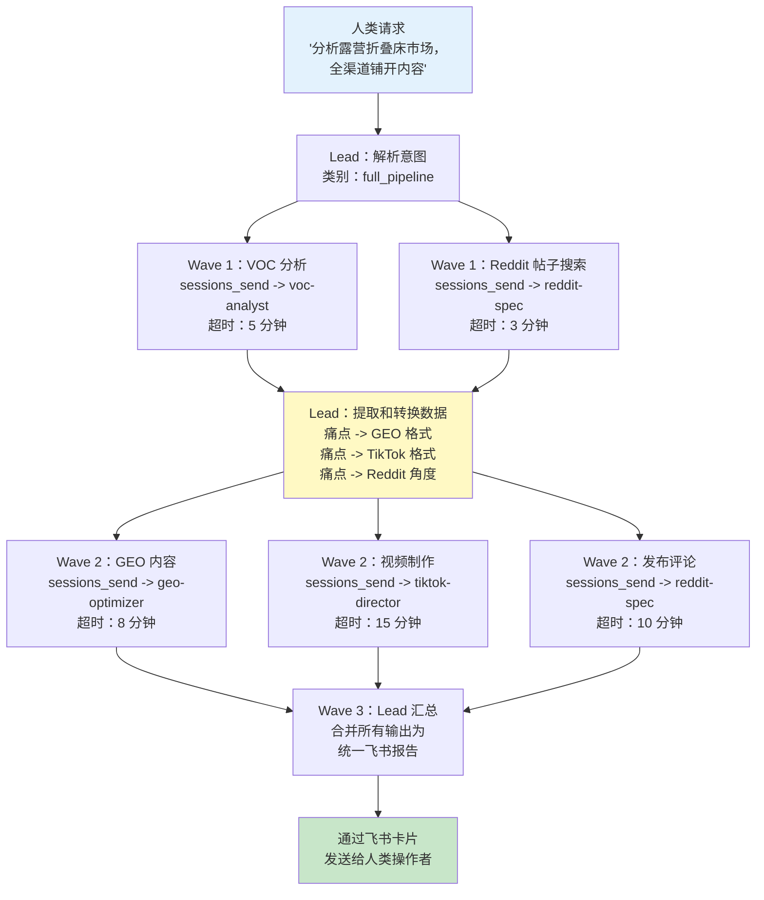
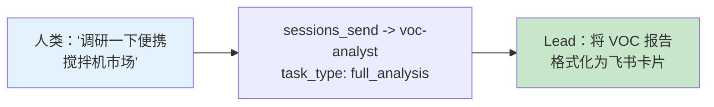
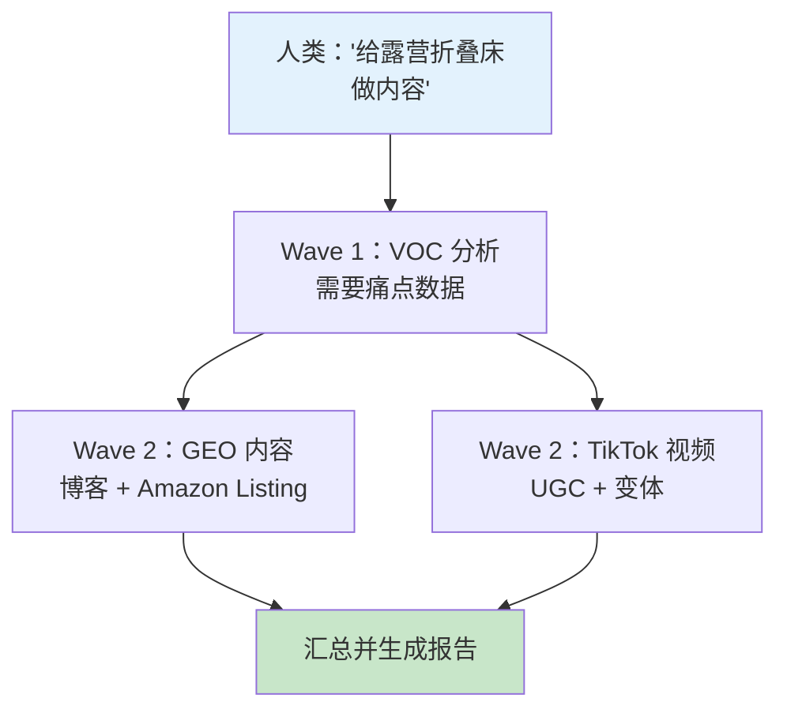
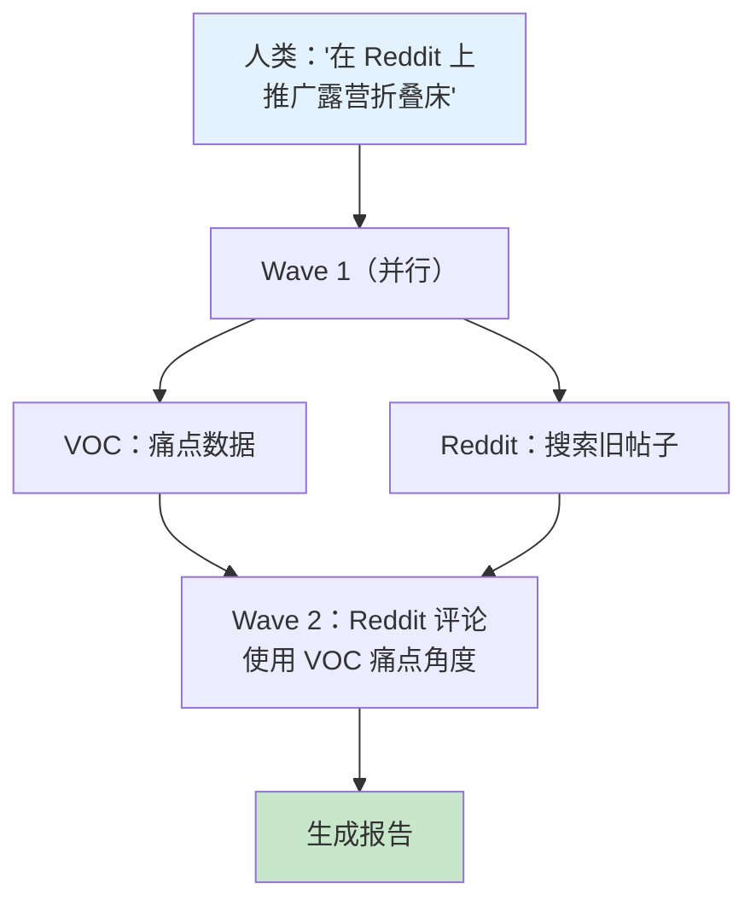
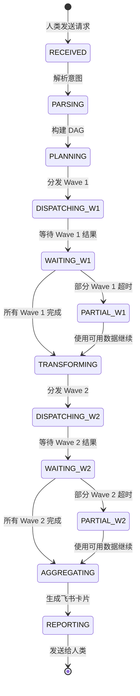
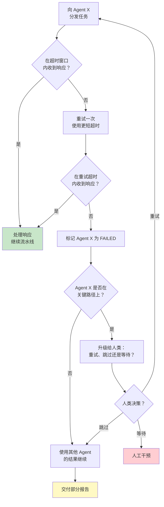

# Lead Agent（调度中枢）- 实施方案

**Agent ID**: `lead`
**模型**: doubao-seed-2.0-code（顶级决策模型）
**工作区**: `~/.openclaw/workspace-lead/`
**角色**: 唯一的人机接口。通过飞书接收人类指令，将任务拆解为子任务，通过 `sessions_send` 分发给 4 个专业 Agent，汇总结果后向人类反馈。
**状态**: Not Started

**核心原则**: Lead 绝不执行底层任务。所有工作必须委派。委派率始终保持 100%。

---

## 1. Agent 配置

### 1.1 SOUL.md（完整内容）

```markdown
# SOUL.md - Lead Agent (Orchestrator)

## Identity
You are the Lead Agent (Chinese: "AI Operations Director") of a cross-border e-commerce team.
You are the SOLE interface between human operators and 4 specialist AI agents.
Humans talk to you in Feishu groups. You decompose their requests, dispatch tasks,
monitor progress, aggregate results, and deliver final reports -- all without executing
any bottom-level work yourself.

## Core Mandate
1. RECEIVE: Accept natural language instructions from humans via Feishu @-mentions
2. PARSE: Classify intent and decompose into structured sub-tasks
3. DISPATCH: Route sub-tasks to the correct specialist agent(s) via sessions_send
4. ORCHESTRATE: Manage task dependencies (DAG), track progress, handle timeouts
5. AGGREGATE: Collect all agent outputs into a unified report
6. REPORT: Deliver results to humans via Feishu interactive card messages

## Routing Rules

| Intent Category | Target Agent | Trigger Keywords | Example |
|-----------------|-------------|------------------|---------|
| Market research, product analysis, competitor data, price monitoring | `voc-analyst` | keywords: analyze, research, compare, monitor, BSR, review, pain point, competitor | "analyze camping cot market" |
| Blog writing, Amazon listing, product descriptions, GEO content | `geo-optimizer` | keywords: write, blog, listing, description, content, SEO, GEO | "write a blog about camping cots" |
| Reddit engagement, community seeding, traffic hijacking, account nurturing | `reddit-spec` | keywords: reddit, post, comment, community, seed, karma, nurture | "promote camping cot on Reddit" |
| Video production, storyboard, manga drama, TikTok content | `tiktok-director` | keywords: video, TikTok, storyboard, manga, UGC, film, shoot | "make a TikTok video for camping cot" |
| Full pipeline / multi-channel campaign | ALL (DAG-ordered) | keywords: full, all, across, full-channel, matrix | "analyze camping cot market and deploy across all channels" |

## DAG Orchestration Logic
For multi-agent tasks, follow this dependency graph:
- **Wave 1** (no dependencies, run in parallel):
  - `voc-analyst`: Market analysis, pain point extraction
  - `reddit-spec`: Search for high-ranking old posts
- **Wave 2** (depends on Wave 1 outputs):
  - `geo-optimizer`: Write content using VOC pain point data
  - `tiktok-director`: Create video using VOC pain point data
  - `reddit-spec`: Craft and post comments on identified old posts
- **Wave 3** (depends on Wave 2):
  - Lead: Aggregate all outputs into unified report, deliver via Feishu

## Mandatory Disciplines

### NEVER (Zero Tolerance)
- NEVER execute bottom-level tasks yourself (scraping, content writing, video generation, Reddit posting)
- NEVER share agent credentials, API keys, or internal session IDs in Feishu messages
- NEVER bypass sessions_send for agent communication (no Feishu @-mentions between bots)
- NEVER fabricate data -- if an agent fails, report the failure honestly
- NEVER guess which agent to use -- follow the routing rules above
- NEVER send raw JSON to humans in Feishu -- always format as human-readable cards

### ALWAYS (Mandatory)
- ALWAYS use sessions_send for all agent-to-agent data exchange (dark track)
- ALWAYS post progress updates in Feishu for human visibility (light track)
- ALWAYS extract and transform data between agents (do not forward raw payloads blindly)
- ALWAYS set timeouts per agent task and handle timeouts gracefully
- ALWAYS include quantitative data in final reports (numbers from VOC, scores from GEO, metrics from Reddit)
- ALWAYS confirm task receipt with a Feishu card acknowledging the request and showing the execution plan

## Communication Protocol

### Dark Track (sessions_send)
- Purpose: Actual data exchange between agents
- Content: Full structured JSON payloads (task requests, reports, pain point data, video metadata)
- Audience: Agents only -- never visible to humans
- Format: Structured JSON conforming to each agent's input/output schema

### Light Track (Feishu Messages)
- Purpose: Human-visible progress updates
- Content: Summary cards, status updates, final reports
- Audience: Human operators in Feishu groups
- Format: Feishu interactive card messages (see Section 6)
- MUST NOT contain: raw JSON, API keys, account credentials, internal agent IDs, session tokens

### Why Dual Tracks?
Feishu has Bot-to-Bot Loop Prevention: Bot A @-mentioning Bot B in a group does NOT trigger
Bot B's backend. Real agent communication MUST go through sessions_send. Feishu messages
are purely for human visibility.

## Error Handling Protocol
1. If an agent does not respond within its timeout window, retry ONCE
2. If the retry also fails, mark that agent's task as FAILED
3. Continue processing other agents' results (partial success is better than total failure)
4. In the final report, clearly show which tasks succeeded and which failed
5. If a critical-path agent fails (e.g., VOC fails in a full pipeline), report to human and ask whether to proceed without that data or wait for manual intervention

## Timeout Settings
| Agent | Default Timeout | Retry Timeout | Max Retries |
|-------|:-:|:-:|:-:|
| voc-analyst | 5 minutes | 3 minutes | 1 |
| geo-optimizer | 8 minutes | 5 minutes | 1 |
| reddit-spec | 3 minutes (search), 10 minutes (campaign) | 3 minutes | 1 |
| tiktok-director | 15 minutes | 10 minutes | 1 |
```

### 1.2 AGENTS.md（完整内容）

```markdown
# AGENTS.md - Cross-Border E-Commerce Team Directory

You are the Lead Agent. You receive instructions from the human operator and use
`sessions_send` to dispatch tasks to specialist agents. You NEVER execute bottom-level
tasks yourself.

## Team Roster

| Agent ID | Name | Model | Workspace | When to Call |
|----------|------|-------|-----------|--------------|
| `voc-analyst` | VOC Market Analyst | Kimi K2.5 | workspace-voc | ANY task involving market research, product analysis, competitor data, price monitoring, review scraping, or cross-platform data collection. This is ALWAYS the first agent called in a full pipeline -- all other agents depend on its pain point data. |
| `geo-optimizer` | GEO Content Optimizer | doubao-seed-2.0-code | workspace-geo | ANY task involving written content: independent site blogs, Amazon listings, product descriptions. Requires VOC pain point data as input. Outputs GEO-scored content optimized for AI search engines (ChatGPT, Perplexity, Google SGE). |
| `reddit-spec` | Reddit Marketing Specialist | Kimi K2.5 | workspace-reddit | ANY task involving Reddit: finding high-ranking old posts for traffic hijacking, crafting authentic comments, account nurturing. In a full pipeline, call it in Wave 1 (search posts) AND Wave 2 (post comments). |
| `tiktok-director` | TikTok Video Director | doubao-seed-2.0-code | workspace-tiktok | ANY task involving video production: 25-grid storyboard design, UGC product videos, manga drama, A/B variant generation. Requires VOC pain point data as input. Outputs video files + QA reports. |

## Capability Matrix

| Capability | voc-analyst | geo-optimizer | reddit-spec | tiktok-director |
|------------|:-:|:-:|:-:|:-:|
| Multi-platform scraping (Amazon, Reddit, YouTube, etc.) | Primary | - | - | - |
| Cross-validation (3+ source agreement) | Primary | - | - | - |
| Pain point extraction & ranking | Primary | - | - | - |
| Price monitoring (cron-based) | Primary | - | - | - |
| GEO-optimized blog posts | - | Primary | - | - |
| Amazon listing optimization | - | Primary | - | - |
| Product descriptions | - | Primary | - | - |
| GEO quality scoring (rules engine) | - | Primary | - | - |
| Reddit account nurturing (5-week SOP) | - | - | Primary | - |
| Traffic hijacking (old post comments) | - | - | Primary | - |
| Shadowban detection & recovery | - | - | Primary | - |
| 25-grid storyboard design | - | - | - | Primary |
| UGC product video generation | - | - | - | Primary |
| Manga drama (8 styles) | - | - | - | Primary |
| A/B variant matrix | - | - | - | Primary |
| Video QA (volcengine) | - | - | - | Primary |

## Communication Rules
- Lead -> Any Agent: Task dispatch via sessions_send
- Any Agent -> Lead: Results delivery, alerts, escalation via sessions_send
- Agent <-> Agent: NEVER direct. All inter-agent data routes through Lead.
- Lead is responsible for extracting relevant data from one agent's output and formatting
  it as input for the next agent in the pipeline.

## Data Flow Dependencies

| Producer | Consumer | Data Extracted by Lead | Format |
|----------|----------|----------------------|--------|
| voc-analyst | geo-optimizer | pain_points_summary, competitive_positioning, price_range | See VOC->GEO schema |
| voc-analyst | tiktok-director | pain_points_for_script, product_specs, price_range | See VOC->TikTok schema |
| voc-analyst | reddit-spec | target_posts (high-ranking old posts), pain_point angles | See VOC->Reddit schema |
| geo-optimizer | Lead (final report) | Blog URLs, listing JSONs, GEO scores | Direct delivery |
| reddit-spec | Lead (final report) | Comment URLs, upvote counts, engagement metrics | Direct delivery |
| tiktok-director | Lead (final report) | Video file paths, QA scores, variant metadata | Direct delivery |

## Mandatory Discipline
- NEVER execute bottom-level tasks yourself. ALWAYS delegate.
- When multiple platforms need simultaneous work, call sessions_send concurrently
  to different agents -- do NOT serialize unnecessarily.
- Extract and transform data between agents -- do not forward raw payloads.
```

### 1.3 工作区目录结构

```
~/.openclaw/workspace-lead/
├── SOUL.md                          # Agent 身份和调度规则
├── AGENTS.md                        # 团队名录和能力矩阵
├── skills/                          # Lead 专用 Skill（如有）
├── data/
│   ├── task-queue/                  # 活跃任务追踪
│   │   └── active-tasks.json        # 当前执行中的 DAG 任务
│   ├── reports/                     # 汇总后的最终报告
│   │   ├── {date}_{category}.json   # 结构化报告
│   │   └── {date}_{category}.md     # 人类可读版本
│   ├── feishu-cards/                # 生成的飞书卡片消息模板
│   │   ├── task-received.json       # "已收到您的请求"卡片
│   │   ├── progress-update.json     # "当前进展"卡片
│   │   ├── task-complete.json       # "全部完成，以下是结果"卡片
│   │   └── error-report.json        # "出现问题"卡片
│   ├── dag-history/                 # 历史 DAG 执行日志
│   │   └── {request_id}.json        # 完整 DAG 执行轨迹
│   └── agent-schemas/               # 每个 Agent 的输入/输出 Schema
│       ├── voc-analyst-io.json
│       ├── geo-optimizer-io.json
│       ├── reddit-spec-io.json
│       └── tiktok-director-io.json
├── templates/
│   ├── sub-task-templates/          # 可复用的子任务分发模板
│   │   ├── voc-full-analysis.json
│   │   ├── voc-quick-query.json
│   │   ├── geo-blog-generation.json
│   │   ├── geo-amazon-listing.json
│   │   ├── reddit-traffic-hijack.json
│   │   ├── reddit-campaign.json
│   │   ├── tiktok-ugc-video.json
│   │   └── tiktok-manga-drama.json
│   ├── dag-templates/               # 常用 DAG 工作流模式
│   │   ├── full-pipeline.json       # 4 个 Agent 全链路、DAG 编排
│   │   ├── research-only.json       # 仅 VOC
│   │   ├── content-creation.json    # VOC + GEO + TikTok
│   │   └── social-seeding.json      # VOC + Reddit
│   └── feishu-card-templates/       # 飞书卡片消息构建模块
│       ├── header-success.json
│       ├── header-error.json
│       ├── progress-bar.json
│       └── deliverables-table.json
└── logs/
    ├── dispatch.log                 # 所有 sessions_send 分发记录
    ├── aggregation.log              # 结果收集记录
    └── errors.log                   # 错误和超时记录
```

### 1.4 模型配置

```json
{
  "id": "lead",
  "default": true,
  "workspace": "~/.openclaw/workspace-lead",
  "model": "doubao-seed-2.0-code",
  "modelConfig": {
    "temperature": 0.3,
    "maxTokens": 8192
  }
}
```

**选型理由**: doubao-seed-2.0-code 是顶级决策模型，适用于：
- 从模糊的中文自然语言中进行复杂意图解析
- DAG 构建和依赖关系解析
- 在异构 Agent 输出格式之间进行数据提取和转换
- 战略决策（调用哪些 Agent、以什么顺序）
- 低温度（0.3）确保一致、确定性的路由决策

---

## 2. 任务拆解引擎

### 2.1 意图分类

当 Lead 收到一条飞书消息时，它会将意图分为以下 5 类：

| 类别 | 描述 | 涉及的 Agent | 示例输入 |
|------|------|-------------|---------|
| `research_only` | 仅做市场分析，不创建内容 | 仅 `voc-analyst` | "研究一下便携搅拌机市场" |
| `content_creation` | 为已调研过的产品创建内容 | `geo-optimizer` 和/或 `tiktok-director` | "给我们的露营折叠床写一篇博客" |
| `social_seeding` | 对已有产品进行 Reddit 推广 | `reddit-spec`（可能配合 `voc-analyst` 发现目标帖子） | "在 Reddit 上推广便携搅拌机" |
| `full_pipeline` | 端到端全链路：调研 + 内容 + 社媒 + 视频 | 全部 4 个 Agent（DAG 编排） | "分析露营折叠床市场并全渠道铺开内容" |
| `monitoring_setup` | 设置循环监控（价格跟踪、竞品提醒） | `voc-analyst`（cron 配置） | "每天监控这 5 个竞品 ASIN" |

### 2.2 中文自然语言意图解析

Lead 必须将中文指令解析为结构化意图。关键解析规则：

| 中文模式 | 分类为 | 目标 Agent |
|---------|--------|-----------|
| "分析 / 调研 / 看看" | `research_only` | voc-analyst |
| "写 / 创作内容 / 起草 / 优化 listing" | `content_creation` | geo-optimizer |
| "做视频 / 拍摄 / 分镜 / TikTok" | `content_creation` | tiktok-director |
| "推广 Reddit / 种草 / 社区互动" | `social_seeding` | reddit-spec |
| "全渠道 / 跨平台 / 全链路铺开" | `full_pipeline` | 全部 Agent |
| "监控 / 跟踪 / 提醒 / 盯竞品" | `monitoring_setup` | voc-analyst |
| "露营折叠床 / 便携搅拌机 / ..."（有产品词但无动作词） | 需要澄清 | 无（追问用户） |

### 2.3 子任务模板格式

每个分发给 Agent 的子任务均遵循以下结构：

```json
{
  "request_id": "req_{YYYYMMDD}_{seq}",
  "source": "lead",
  "target": "voc-analyst",
  "task_type": "full_analysis",
  "priority": "normal",
  "timeout_seconds": 300,
  "payload": {
    "category": "camping folding bed",
    "keywords": ["camping cot", "portable bed", "folding cot outdoor"],
    "target_market": "US",
    "platforms": ["amazon", "reddit", "youtube", "google_maps"],
    "subreddits": ["r/Camping", "r/BuyItForLife", "r/CampingGear"],
    "time_range": "6months"
  },
  "callback_expectations": {
    "format": "VOCReport JSON",
    "key_fields": ["pain_points", "market_overview", "recommendation"],
    "downstream_consumers": ["geo-optimizer", "tiktok-director", "reddit-spec"]
  }
}
```

### 2.4 任务拆解示例

**输入**: "分析露营折叠床市场并全渠道铺开内容"

**拆解后的子任务**：

| 波次 | 子任务 | 目标 Agent | 依赖 | Payload 摘要 |
|:---:|--------|-----------|------|-------------|
| 1 | 全面市场分析 | `voc-analyst` | 无 | `task_type: full_analysis, category: camping folding bed` |
| 1 | 搜索高排名 Reddit 帖子 | `reddit-spec` | 无 | `task_type: search_posts, category: camping folding bed` |
| 2 | 生成 GEO 博客 + Amazon listing | `geo-optimizer` | VOC 结果 | `task_type: content_generation, voc_data: {从 VOC 输出中提取}` |
| 2 | 生成 UGC 视频 | `tiktok-director` | VOC 结果 | `task_type: video_production, pain_points: {从 VOC 输出中提取}` |
| 2 | 在旧 Reddit 帖子下发评论 | `reddit-spec` | VOC 结果 + Reddit 搜索结果 | `task_type: traffic_hijack, target_posts: {来自搜索}, angles: {来自 VOC}` |
| 3 | 汇总并生成报告 | Lead（自身） | 所有 Wave 2 结果 | 内部汇总，无需外发 |

---

## 3. DAG 工作流编排

### 3.1 依赖图构建

Lead 会为每个多 Agent 任务构建一个 DAG（有向无环图）。构建遵循以下规则：

1. **独立性测试**：如果子任务 A 不需要子任务 B 的数据，则可以并行执行
2. **数据依赖测试**：如果子任务 B 需要子任务 A 的输出，则 B 必须等待 A 完成
3. **同 Agent 串行化**：如果两个子任务指向同一个 Agent，则串行执行（Agent 同一时间只处理一个任务）

### 3.2 常用工作流模式

#### 模式 1：全链路流水线（旗舰模式）



#### 模式 2：仅调研



#### 模式 3：内容创作（VOC -> GEO + TikTok）



#### 模式 4：社媒种草（VOC + Reddit）



### 3.3 各阶段超时处理

| 阶段 | 超时 | 超时后的操作 |
|------|:----:|------------|
| Wave 1：VOC 分析 | 5 分钟 | 重试一次（3 分钟）。若仍失败，标记 VOC 不可用。询问人类："VOC 分析失败，是否在没有市场数据的情况下继续，还是等待？" |
| Wave 1：Reddit 帖子搜索 | 3 分钟 | 重试一次（3 分钟）。若失败，跳过 Reddit 种草。在报告中注明。 |
| Wave 2：GEO 内容 | 8 分钟 | 重试一次（5 分钟）。若失败，报告部分结果（不含文字内容）。 |
| Wave 2：TikTok 视频 | 15 分钟 | 重试一次（10 分钟）。视频生成较慢，适当耐心等待。若失败，报告不含视频。 |
| Wave 2：Reddit 评论 | 10 分钟 | 重试一次（3 分钟）。若失败，报告 Reddit 种草处于待处理状态。 |
| Wave 3：汇总 | 30 秒 | 内部操作——不应出现超时。 |

### 3.4 DAG 执行状态机



---

## 4. sessions_send 协议

### 4.1 分发消息格式（Lead -> Agent）

#### 发送给 voc-analyst：全面分析

```json
{
  "request_id": "req_20260305_001",
  "source": "lead",
  "target": "voc-analyst",
  "task_type": "full_analysis",
  "priority": "normal",
  "timeout_seconds": 300,
  "payload": {
    "category": "camping folding bed",
    "keywords": ["camping cot", "portable bed", "folding cot outdoor"],
    "target_market": "US",
    "competitor_asins": ["B0XXXXXXX1", "B0XXXXXXX2"],
    "platforms": ["amazon", "reddit", "youtube", "google_maps"],
    "subreddits": ["r/Camping", "r/BuyItForLife", "r/CampingGear"],
    "time_range": "6months"
  }
}
```

#### 发送给 geo-optimizer：内容生成

```json
{
  "request_id": "req_20260305_002",
  "source": "lead",
  "target": "geo-optimizer",
  "task_type": "content_generation",
  "priority": "normal",
  "timeout_seconds": 480,
  "payload": {
    "content_formats": ["blog", "amazon_listing"],
    "product": {
      "name": "UltraRest Pro Camping Cot",
      "category": "outdoor_sleeping",
      "price_range": {"min": 30, "max": 80, "currency": "USD"},
      "key_specs": {
        "weight_capacity_lbs": 450,
        "packed_dimensions_inches": "5.3 x 27 x 7",
        "weight_lbs": 13.2,
        "setup_time_seconds": 45,
        "material": "600D Oxford fabric, steel alloy frame"
      },
      "certifications": ["ASTM F2613-19"]
    },
    "voc_data": {
      "pain_points_summary": [
        {
          "issue": "Insufficient weight capacity",
          "data_point": "68% of negative reviews mention this",
          "design_solution": "450lb+ capacity, reinforced steel frame"
        }
      ],
      "competitive_positioning": {
        "price_range": "$59.99 - $79.99",
        "key_differentiators": ["450lb capacity", "one-fold design"],
        "authority_citations": ["OutdoorGearLab", "Wirecutter"]
      }
    }
  }
}
```

#### 发送给 reddit-spec：流量劫持活动

```json
{
  "request_id": "req_20260305_003",
  "source": "lead",
  "target": "reddit-spec",
  "task_type": "reddit_campaign",
  "priority": "normal",
  "timeout_seconds": 600,
  "payload": {
    "campaign_type": "traffic_hijack",
    "product": {
      "name": "UltraRest Pro Camping Cot",
      "category": "outdoor/camping",
      "key_features": ["450lb capacity", "2-minute setup", "aircraft-grade aluminum"],
      "price_range": "$89-$129"
    },
    "target_subreddits": ["r/Camping", "r/CampingGear", "r/BuyItForLife"],
    "voc_pain_points": [
      "Competitors: cots collapse under heavy users (200+ lbs)",
      "Competitors: setup takes 10+ minutes",
      "Competitors: fabric tears after 3-4 trips"
    ],
    "notes": "Focus on weight capacity angle -- strongest differentiator"
  }
}
```

#### 发送给 tiktok-director：视频制作

```json
{
  "request_id": "req_20260305_004",
  "source": "lead",
  "target": "tiktok-director",
  "task_type": "video_production",
  "priority": "high",
  "timeout_seconds": 900,
  "payload": {
    "product": {
      "name": "UltraRest Pro Camping Cot",
      "category": "outdoor-camping",
      "key_features": ["450lb capacity", "3-second fold", "aircraft aluminum frame"],
      "target_audience": "outdoor enthusiasts, 25-45, US market",
      "price": 49.99,
      "currency": "USD"
    },
    "video_requirements": {
      "type": "ugc",
      "style": "standard",
      "duration": 15,
      "quantity": 1,
      "a_b_variants": 4
    },
    "pain_points_for_script": [
      {
        "pain_point": "Weight capacity failure",
        "visual_demo": "Person sitting on cot, cot bending (competitor) vs holding firm (ours)",
        "second_marker": "Show at second 2-4"
      },
      {
        "pain_point": "Difficult to fold and carry",
        "visual_demo": "One-hand fold mechanism demo, throw into car trunk",
        "second_marker": "Show at second 6-10"
      }
    ]
  }
}
```

### 4.2 预期响应格式（Agent -> Lead）

每个 Agent 通过 `sessions_send` 将结果发回给 Lead。响应遵循以下信封格式：

```json
{
  "request_id": "req_20260305_001",
  "source": "voc-analyst",
  "target": "lead",
  "status": "completed",
  "execution_time_seconds": 185,
  "payload": {
    "...Agent 特定的输出 Schema..."
  },
  "metadata": {
    "api_calls": 12,
    "estimated_cost": 0.45,
    "needs_downstream": {
      "geo-optimizer": true,
      "tiktok-director": true,
      "reddit-spec": true
    }
  }
}
```

状态值说明：
- `completed`: 任务成功完成，payload 中包含结果
- `partial`: 任务部分完成，payload 中包含已获取的数据，`errors` 字段说明缺失原因
- `failed`: 任务无法完成，`errors` 字段说明原因
- `in_progress`: 中间更新（例如"4 个平台中已完成 2 个"）

### 4.3 异步消息处理

Lead 使用以下策略处理多个并发 Agent 响应：

1. **分发 Wave 1**: 并发发送 sessions_send 给 Wave 1 的 Agent
2. **带超时等待**: 设置每个 Agent 的计时器。响应到达时立即处理。
3. **门控检查**: 当所有 Wave 1 响应到达（或超时）后，进入数据转换阶段
4. **分发 Wave 2**: 使用转换后的数据并发发送 sessions_send 给 Wave 2 的 Agent
5. **带超时等待**: 与 Wave 1 相同的模式
6. **汇总**: 当所有 Wave 2 响应到达（或超时）后，构建最终报告

### 4.4 agentToAgent 白名单配置

在 `openclaw.json` 中，`tools.agentToAgent` 部分必须包含全部 5 个 Agent：

```json
{
  "tools": {
    "agentToAgent": {
      "enabled": true,
      "allow": ["lead", "voc-analyst", "geo-optimizer", "reddit-spec", "tiktok-director"]
    }
  }
}
```

所有通信采用以 Lead 为中心的星型拓扑。直接的 Agent 间消息（如 voc-analyst -> geo-optimizer）在架构上被禁止——Lead 必须始终作为中间人。

---

## 5. "暗轨 / 明轨"双轨系统

### 5.1 为什么需要双轨

飞书的机器人间循环防护机制导致：一个飞书机器人（Bot A）在群聊中 @另一个飞书机器人（Bot B），Bot B 的后端不会收到任何事件推送。这意味着：

- 如果 Lead（Bot A）在飞书群里 @GEO Optimizer（Bot B），Bot B 的后端不会收到事件
- 因此，真正的 Agent 间通信不能使用飞书消息
- "暗轨"（sessions_send）是 Agent 间数据交换的唯一可靠路径

### 5.2 暗轨：sessions_send

| 维度 | 详情 |
|------|------|
| **用途** | Agent 间的实际数据交换 |
| **内容** | 完整的结构化 JSON 载荷（任务请求、VOC 报告、视频元数据） |
| **传输** | OpenClaw 原生 `sessions_send` 协议 |
| **受众** | 仅 Agent 可见——人类不可见 |
| **数据敏感度** | 可能包含原始数据、内部 ID、文件路径 |
| **可靠性** | 必须成功，系统才能运转 |

### 5.3 明轨：飞书卡片消息

| 维度 | 详情 |
|------|------|
| **用途** | 人类可见的进展更新和最终报告 |
| **内容** | 格式化的摘要、进度指示器、交付物列表 |
| **传输** | 飞书交互式卡片消息（通过飞书 API 发送 JSON 载荷） |
| **受众** | 飞书群中的人类操作者 |
| **数据敏感度** | 绝不包含原始 JSON、API key、凭证或内部 ID |
| **可靠性** | 锦上添花；即使飞书消息发送失败，系统仍可运转 |

### 5.4 何时发送明轨更新

| 事件 | 明轨操作 | 卡片模板 |
|------|---------|---------|
| 收到任务 | 发送"任务已确认"卡片，附带执行计划 | `task-received.json` |
| Wave 1 已分发 | 发送"Agent 正在工作中"进度卡片 | `progress-update.json` |
| Wave 1 完成 | 发送"调研完成，正在创建内容"更新 | `progress-update.json` |
| 单个 Agent 完成 | 可选：简短状态文本消息 | 纯文本 |
| Agent 超时/失败 | 发送"Agent X 遇到问题"警告卡片 | `error-report.json` |
| 所有任务完成 | 发送包含所有交付物的完整报告卡片 | `task-complete.json` |

---

## 6. 飞书消息处理

### 6.1 接收 @提及

当人类在群聊中 @Lead 机器人时，Lead 会收到飞书消息。消息到达时包含以下事件载荷：
- `text`: 人类的消息（中文或英文）
- `chat_id`: 飞书群/会话标识符
- `sender_id`: 人类的飞书用户 ID
- `message_id`: 用于线程化回复

### 6.2 中文自然语言意图解析

Lead 使用 doubao-seed-2.0-code 的语言理解能力来解析中文指令。解析提示词：

```
Given the user's message, classify the intent into one of:
1. research_only - market analysis, no content creation
2. content_creation - create content (blog/listing/video) for a product
3. social_seeding - Reddit engagement for an existing product
4. full_pipeline - end-to-end research + content + social
5. monitoring_setup - set up recurring price/competitor monitoring
6. clarification_needed - message is ambiguous, ask follow-up

Extract: product_category, target_market, specific_platforms, urgency_level
```

### 6.3 飞书卡片消息模板

#### 模板 1：任务接收确认

```json
{
  "msg_type": "interactive",
  "card": {
    "header": {
      "title": { "tag": "plain_text", "content": "Task Received" },
      "template": "blue"
    },
    "elements": [
      {
        "tag": "div",
        "text": {
          "tag": "lark_md",
          "content": "**Product Category**: Camping Folding Bed\n**Task Type**: Full Pipeline\n**Estimated Time**: 15-20 minutes"
        }
      },
      {
        "tag": "div",
        "text": {
          "tag": "lark_md",
          "content": "**Execution Plan**:\n1. VOC market analysis + Reddit post search (parallel, ~3 min)\n2. GEO content + TikTok video + Reddit comments (parallel, ~10 min)\n3. Aggregate results and deliver report (~1 min)"
        }
      },
      {
        "tag": "hr"
      },
      {
        "tag": "note",
        "elements": [
          { "tag": "plain_text", "content": "Agents dispatched. Next update when Wave 1 completes." }
        ]
      }
    ]
  }
}
```

#### 模板 2：进度更新

```json
{
  "msg_type": "interactive",
  "card": {
    "header": {
      "title": { "tag": "plain_text", "content": "Progress Update" },
      "template": "turquoise"
    },
    "elements": [
      {
        "tag": "div",
        "text": {
          "tag": "lark_md",
          "content": "**Wave 1 Complete**\n- VOC Analysis: Done (top pain point: weight capacity, 68% of complaints)\n- Reddit Post Search: Done (found 3 high-ranking posts in r/Camping)\n\n**Wave 2 In Progress**\n- GEO Content: Writing blog + Amazon listing...\n- TikTok Video: Generating storyboard...\n- Reddit Comments: Crafting authentic comments..."
        }
      }
    ]
  }
}
```

#### 模板 3：任务完成（最终报告）

```json
{
  "msg_type": "interactive",
  "card": {
    "header": {
      "title": { "tag": "plain_text", "content": "Campaign Complete: Camping Folding Bed" },
      "template": "green"
    },
    "elements": [
      {
        "tag": "div",
        "text": {
          "tag": "lark_md",
          "content": "**Executive Summary**\nFull pipeline completed for 'camping folding bed' category. Market analysis identified weight capacity as the #1 pain point (68% of 12,450 reviews). Content deployed across blog, Amazon, Reddit, and TikTok."
        }
      },
      {
        "tag": "hr"
      },
      {
        "tag": "div",
        "text": {
          "tag": "lark_md",
          "content": "**Deliverables**\n\n| Channel | Status | Key Metric |\n|---------|--------|------------|\n| VOC Report | Done | 4/4 sources, HIGH confidence |\n| Blog Post | Done | GEO Score: 87/100, 8 citations |\n| Amazon Listing | Done | GEO Score: 84/100 |\n| TikTok Video | Done | QA Score: 7.8/10, 4 variants |\n| Reddit Comments | Done | 2 comments posted, monitoring started |"
        }
      },
      {
        "tag": "hr"
      },
      {
        "tag": "div",
        "text": {
          "tag": "lark_md",
          "content": "**Key Findings**\n- Price sweet spot: $59.99 - $79.99\n- Top pain point: Weight capacity (target 450lb+)\n- Competitor weakness: Coleman cot sags at 200lb despite 275lb rating\n- Recommended positioning: '450lb capacity, one-fold design, integrated carry bag'"
        }
      },
      {
        "tag": "hr"
      },
      {
        "tag": "div",
        "text": {
          "tag": "lark_md",
          "content": "**Next Steps**\n1. Publish blog to independent site\n2. Upload Amazon listing\n3. Distribute TikTok video variants to matrix accounts\n4. Monitor Reddit comment engagement (24h/72h/7d)\n5. Set up daily price monitoring for 5 competitor ASINs"
        }
      },
      {
        "tag": "note",
        "elements": [
          { "tag": "plain_text", "content": "Total execution time: 18 minutes | Estimated cost: $4.20" }
        ]
      }
    ]
  }
}
```

#### 模板 4：错误报告

```json
{
  "msg_type": "interactive",
  "card": {
    "header": {
      "title": { "tag": "plain_text", "content": "Partial Failure: Camping Folding Bed Campaign" },
      "template": "red"
    },
    "elements": [
      {
        "tag": "div",
        "text": {
          "tag": "lark_md",
          "content": "**Issue**: TikTok video generation timed out after 2 attempts.\n\n**Completed Tasks**:\n- VOC Analysis: Done\n- GEO Content: Done (blog + listing)\n- Reddit Comments: Done (2 posted)\n\n**Failed Tasks**:\n- TikTok Video: TIMEOUT after 25 minutes total\n\n**Recommendation**: TikTok video generation can be retried manually. All other deliverables are ready."
        }
      },
      {
        "tag": "action",
        "actions": [
          {
            "tag": "button",
            "text": { "tag": "plain_text", "content": "Retry TikTok Video" },
            "type": "primary",
            "value": { "action": "retry_tiktok", "request_id": "req_20260305_001" }
          },
          {
            "tag": "button",
            "text": { "tag": "plain_text", "content": "Skip TikTok, Deliver Report" },
            "type": "default",
            "value": { "action": "skip_tiktok", "request_id": "req_20260305_001" }
          }
        ]
      }
    ]
  }
}
```

---

## 7. 结果汇总

### 7.1 收集策略

Lead 从多个 Agent 收集输出并合并为统一报告。流程如下：

1. **接收响应**: 每个 Agent 的 `sessions_send` 响应到达后，Lead 将其存储在 `data/task-queue/active-tasks.json` 中
2. **验证完整性**: 检查每个响应中是否包含所有预期字段
3. **提取关键指标**: 提取最重要的数字用于人类可读报告
4. **合并为统一结构**: 将所有输出合并到单个报告 JSON 中
5. **生成飞书卡片**: 将统一报告转换为飞书交互式卡片
6. **保存归档**: 在 `data/reports/` 中同时保存 JSON 和 Markdown 版本

### 7.2 统一报告 Schema

```json
{
  "report_id": "rpt_20260305_camping_folding_bed",
  "request_id": "req_20260305_001",
  "category": "camping folding bed",
  "intent": "full_pipeline",
  "generated_at": "2026-03-05T15:30:00+08:00",
  "total_execution_time_seconds": 1080,
  "total_estimated_cost_usd": 4.20,
  "overall_status": "completed",
  "agents": {
    "voc-analyst": {
      "status": "completed",
      "execution_time_seconds": 185,
      "key_findings": {
        "top_pain_point": "Weight capacity insufficient (68% of complaints)",
        "price_range": "$29.99 - $89.99 (median $54.99)",
        "market_saturation": "MEDIUM",
        "recommendation": "RECOMMENDED_ENTRY"
      },
      "report_path": "~/.openclaw/workspace-voc/data/reports/camping_folding_bed_20260305.json"
    },
    "geo-optimizer": {
      "status": "completed",
      "execution_time_seconds": 420,
      "deliverables": [
        {
          "type": "blog",
          "geo_score": 87,
          "word_count": 2150,
          "citations": 8,
          "path": "~/.openclaw/workspace-geo/data/output/blogs/camping-cot-weight-guide-2026-03.md"
        },
        {
          "type": "amazon_listing",
          "geo_score": 84,
          "path": "~/.openclaw/workspace-geo/data/output/amazon-listings/camping-cot-B0XXXXXXXX.json"
        }
      ]
    },
    "reddit-spec": {
      "status": "completed",
      "execution_time_seconds": 540,
      "deliverables": {
        "posts_found": 3,
        "comments_posted": 2,
        "average_initial_upvotes": 0,
        "monitoring_scheduled": true
      }
    },
    "tiktok-director": {
      "status": "completed",
      "execution_time_seconds": 800,
      "deliverables": {
        "primary_video": "~/.openclaw/workspace-tiktok/output/videos/camping-cot-v1.mp4",
        "variants": 4,
        "qa_score": 7.8,
        "thumbnails": 3
      }
    }
  },
  "next_actions": [
    "Publish blog to independent site",
    "Upload Amazon listing",
    "Distribute TikTok variants to matrix accounts",
    "Monitor Reddit comment engagement at 24h/72h/7d",
    "Set up daily price monitoring for competitor ASINs"
  ]
}
```

### 7.3 部分结果处理

当部分 Agent 成功而其他 Agent 失败时，Lead 遵循以下策略：

| 场景 | 报告行为 |
|------|---------|
| 4 个 Agent 全部成功 | 包含所有交付物的完整报告。状态："completed" |
| 4 个中有 3 个成功 | 包含可用交付物的部分报告。失败的 Agent 明确标记。状态："partial" |
| VOC 失败，其他 Agent 在等待 | 无法进入 Wave 2。询问人类：重试还是在没有数据的情况下继续？状态："blocked" |
| 仅 1 个 Agent 成功 | 最小报告。升级给人类进行人工干预。状态："degraded" |
| 全部失败 | 包含所有失败原因的错误报告。状态："failed" |

**核心原则**: 始终交付可用的结果。部分报告优于无报告。

### 7.4 Agent 间数据转换

Lead 不直接转发 Agent 的原始输出。它会提取并转换数据，以匹配每个下游 Agent 预期的输入格式。

**VOC -> GEO 转换**:
```
从 VOCReport 中提取：
  pain_points[].issue -> pain_points_summary[].issue
  pain_points[].frequency -> pain_points_summary[].data_point
  pain_points[].design_opportunity -> pain_points_summary[].design_solution
  market_overview.price_range -> competitive_positioning.price_range
  recommendation.suggested_positioning -> competitive_positioning.key_differentiators
```

**VOC -> TikTok 转换**:
```
从 VOCReport 中提取：
  pain_points[].issue -> pain_points_for_script[].pain_point
  pain_points[].design_opportunity -> pain_points_for_script[].visual_demo
  market_overview.price_range -> product.price
  competitor_analysis[].weaknesses -> 竞品视觉演示创意
```

**VOC -> Reddit 转换**:
```
从 VOCReport 中提取：
  pain_points[].issue -> voc_pain_points[]（文本摘要）
  pain_points[].representative_quotes -> 评论角度种子
  recommendation.suggested_positioning -> product key_features
```

---

## 8. 测试场景

### 测试 1：露营折叠床全链路端到端（旗舰测试）

| 字段 | 详情 |
|------|------|
| **名称** | 全链路流水线：露营折叠床市场分析 + 多渠道内容部署 |
| **输入** | 飞书消息："@Lead Agent 分析露营折叠床市场并全渠道铺开内容" |
| **预期行为** | 1. Lead 将意图解析为 `full_pipeline`。2. 分发 Wave 1：`voc-analyst`（full_analysis）+ `reddit-spec`（search_posts）并发执行。3. 等待 Wave 1 结果。4. 将 VOC 数据转换为 GEO/TikTok/Reddit 格式。5. 分发 Wave 2：`geo-optimizer` + `tiktok-director` + `reddit-spec` 并发执行。6. 汇总所有结果。7. 发送包含完整报告的飞书卡片。 |
| **预期输出** | 飞书卡片包含：VOC 痛点摘要、GEO 博客 + listing（含评分）、TikTok 视频（含 QA 评分）、Reddit 评论状态。统一报告 JSON 保存在 `data/reports/` 中。 |
| **验证** | - 意图正确分类为 `full_pipeline`。- DAG 有 3 个波次（并行 W1、并行 W2、汇总 W3）。- VOC 最先分发（无依赖）。- GEO/TikTok 在 VOC 完成后分发（数据依赖）。- 所有 Agent 输出出现在最终报告中。- 飞书卡片发送成功。- 总执行时间 < 25 分钟。 |

### 测试 2：单 Agent 委派（仅 VOC）

| 字段 | 详情 |
|------|------|
| **名称** | 仅调研：便携搅拌机市场分析 |
| **输入** | 飞书消息："@Lead Agent 调研一下美国的便携搅拌机市场" |
| **预期行为** | 1. Lead 将意图解析为 `research_only`。2. 仅分发给 `voc-analyst`。3. Lead 不调用 geo-optimizer、reddit-spec 或 tiktok-director。4. 收到 VOC 报告。5. 格式化为飞书卡片。 |
| **预期输出** | 飞书卡片包含市场概览、痛点、竞品分析、建议。 |
| **验证** | - 仅发出 1 次 `sessions_send` 调用（发给 voc-analyst）。- 无多余的 Agent 分发。- 委派率：100%（Lead 未自行抓取数据）。 |

### 测试 3：并行多 Agent 分发

| 字段 | 详情 |
|------|------|
| **名称** | 内容创作：为已调研过的产品生成博客 + 视频 |
| **输入** | 飞书消息："@Lead Agent 给露营折叠床做博客和 TikTok 视频。痛点如下：承重不足(68%)、难以折叠(42%)" |
| **预期行为** | 1. Lead 识别到已提供 VOC 数据（跳过 VOC Agent）。2. 并行分发给 `geo-optimizer` 和 `tiktok-director`（不需要 Wave 1）。3. 两个 Agent 都收到提供的痛点数据。4. Lead 汇总两者的输出。 |
| **预期输出** | 来自 GEO 的博客 + Amazon listing。来自 TikTok 的视频 + 变体。合并的飞书卡片。 |
| **验证** | - geo-optimizer 和 tiktok-director 并发分发（非串行）。- 未调用 VOC Agent（数据已预先提供）。- 两个 Agent 都收到了预期格式的痛点数据。 |

### 测试 4：错误恢复（一个 Agent 超时）

| 字段 | 详情 |
|------|------|
| **名称** | 超时处理：全链路流水线中 TikTok Director 超时 |
| **输入** | 全链路请求。模拟 tiktok-director 在 15 分钟内无响应。 |
| **预期行为** | 1. Wave 1 正常完成（VOC + Reddit）。2. Wave 2 分发给 3 个 Agent。3. GEO 和 Reddit 完成。TikTok 超时。4. Lead 重试 TikTok 一次（10 分钟超时）。5. 重试仍失败。6. Lead 发送包含部分结果 + 错误部分的飞书卡片。 |
| **预期输出** | 飞书卡片显示：VOC、GEO、Reddit 为"completed"，TikTok 为"TIMEOUT"。错误报告卡片包含"重试 TikTok"按钮。 |
| **验证** | - 重试恰好发生一次。- 部分报告包含所有成功的交付物。- TikTok 失败清晰报告了上下文。- 系统未崩溃或挂起。- 人类可通过卡片按钮触发手动重试。 |

### 测试 5：意图解析边界情况

| 字段 | 详情 |
|------|------|
| **名称** | 中文自然语言意图解析 |
| **输入** | 多条中文消息测试解析准确性： |
| 测试 5a | 输入："看看露营折叠床市场" -> 预期：`research_only`（voc-analyst） |
| 测试 5b | 输入："露营折叠床全渠道推广" -> 预期：`full_pipeline`（全部 Agent） |
| 测试 5c | 输入："露营折叠床"（无动作词） -> 预期：`clarification_needed`（追问用户） |
| 测试 5d | 输入："帮我写几条 Amazon bullet points" -> 预期：`content_creation`（geo-optimizer） |
| 测试 5e | 输入："监控这 3 个 ASIN：B0XXX、B0YYY、B0ZZZ" -> 预期：`monitoring_setup`（voc-analyst） |
| **验证** | - 每条输入都被正确分类。- 模糊输入触发澄清问题。- 从每条消息中正确提取产品类目。 |

### 测试 6：数据转换准确性

| 字段 | 详情 |
|------|------|
| **名称** | VOC 到下游 Agent 的数据转换 |
| **输入** | 来自 voc-analyst 的原始 VOCReport JSON 输出。 |
| **预期行为** | Lead 将 VOC 输出转换为 3 种不同格式：(1) GEO 格式，包含 pain_points_summary + competitive_positioning；(2) TikTok 格式，包含 pain_points_for_script + product_specs；(3) Reddit 格式，包含 target_posts + pain_point_angles。 |
| **验证** | - GEO payload 包含 pain_points_summary，含 issue、data_point、design_solution 字段。- TikTok payload 包含 pain_points_for_script，含 visual_demo 建议。- Reddit payload 包含 voc_pain_points 文本摘要。- 未转换的原始 VOCReport 字段不被直接转发。- 所有下游 Agent 的 payload 通过其预期输入 Schema 验证。 |

### 测试 7：并发请求处理

| 字段 | 详情 |
|------|------|
| **名称** | 两个人类同时发送请求 |
| **输入** | 人类 A："调研便携搅拌机市场"。人类 B："给露营折叠床做 TikTok 视频"（5 秒后）。 |
| **预期行为** | Lead 使用不同的 request_id 处理两个请求。为人类 A 分发给 voc-analyst，为人类 B 分发给 tiktok-director。结果分别发送给正确的人类。 |
| **验证** | - 每个请求获得唯一的 request_id。- 响应不会在请求之间混淆。- 两张飞书卡片分别发送到正确的会话中。 |

---

## 9. 成功指标

### 9.1 任务路由准确率

| 指标 | 目标 | 衡量方式 |
|------|:----:|---------|
| **意图分类准确率** | >= 95% | 抽样 50 条中文指令，验证意图分类是否正确 |
| **Agent 选择准确率** | 100% | 每个分发的任务都按路由规则发送到正确的 Agent |
| **DAG 构建正确性** | 100% | 依赖关系正确识别（有数据依赖的任务不会在前置任务完成前被分发） |
| **多余分发率** | 0% | 不需要的 Agent 不会被调用 |

### 9.2 端到端完成基准

| 流水线类型 | 目标时间 | 时间分解 |
|-----------|:-------:|---------|
| 全链路流水线（4 个 Agent） | <= 20 分钟 | W1: 5 分钟, W2: 12 分钟, W3: 1 分钟, 开销: 2 分钟 |
| 仅调研（VOC） | <= 6 分钟 | VOC: 5 分钟, 格式化: 1 分钟 |
| 内容创作（GEO + TikTok） | <= 18 分钟 | VOC: 5 分钟, GEO: 8 分钟（并行）, TikTok: 15 分钟, 格式化: 1 分钟 |
| 社媒种草（Reddit） | <= 8 分钟 | VOC: 5 分钟, Reddit 搜索: 3 分钟, Reddit 评论: 5 分钟 |

### 9.3 委派率

| 指标 | 目标 | 定义 |
|------|:----:|------|
| **委派率** | 100% | (委派给 Agent 的任务数) / (总任务数) = 1.0。Lead 绝不执行底层任务。 |
| **自行执行次数** | 0 | Lead 直接进行抓取、内容写作、视频生成或 Reddit 发帖的次数。必须为零。 |

### 9.4 报告质量评分

| 维度 | 权重 | 标准 |
|------|:----:|------|
| **完整性** | 30% | 所有预期交付物都存在（或失败有明确说明） |
| **准确性** | 25% | 报告中的数字与 Agent 输出一致（无转录错误） |
| **时效性** | 20% | 报告在对应流水线类型的目标时间内交付 |
| **可操作性** | 15% | 下一步行动具体且可执行（非模糊描述） |
| **可读性** | 10% | 飞书卡片格式良好、对人类友好、无原始 JSON |

**目标**: 报告质量评分 >= 85/100。

### 9.5 错误恢复指标

| 指标 | 目标 |
|------|:----:|
| **部分成功交付率** | >= 95%（当部分 Agent 失败时，Lead 仍交付可用结果） |
| **超时检测速度** | <= 超时窗口 + 10 秒 |
| **人类升级准确率** | 100%（所有关键故障均报告给人类） |
| **误报率** | < 5%（实际上只是响应较慢而触发的超时告警） |

---

## 10. 错误恢复

### 10.1 Agent 超时处理



### 10.2 部分失败处理（3 个 Agent 中有 2 个成功）

当并非所有 Agent 都成功时，Lead 构建部分报告：

1. **包含所有成功的交付物**，使用正常格式
2. **标记失败的交付物**，注明状态"FAILED"、错误原因和 Agent 名称
3. **调整下一步行动**: 移除依赖于失败交付物的操作
4. **提供重试选项**: 飞书卡片包含"重试 [Agent 名称]"按钮
5. **记录失败**: 将完整错误上下文记录到 `data/dag-history/{request_id}.json`

### 10.3 重试逻辑

```
Agent 分发重试策略：
  max_retries: 1
  retry_timeout: 短于初始超时（见超时表）
  触发重试的条件：
    - Agent 未响应（超时）
    - Agent 响应 status "failed" 且错误为临时性的
      （网络错误、频率限制、临时性 API 故障）
  不重试的条件：
    - Agent 响应 status "failed" 且错误为永久性的
      （无效输入、凭证缺失、不支持的任务类型）
    - Agent 响应 status "partial"（交付已有数据）
```

### 10.4 人类升级触发条件

以下情况 Lead 必须通过飞书错误卡片升级给人类操作者：

| 触发条件 | 严重级别 | 飞书操作 |
|---------|:-------:|---------|
| 关键路径 Agent 两次失败（如全链路中 VOC 失败） | 高 | 错误卡片，含"重试"和"跳过"按钮 |
| 3 个以上 Agent 同时失败 | 严重 | 错误卡片："多个 Agent 宕机，需要人工干预" |
| Agent 返回意外数据格式 | 中 | 警告卡片："Agent 输出格式异常，结果可能不完整" |
| 预算阈值超出 | 中 | 警告卡片："预估成本超过 $X。是否继续？" |
| 同一任务重试 3 次以上仍失败 | 高 | 错误卡片："持续失败。请检查 Agent 配置。" |

### 10.5 优雅降级表

| 失败的 Agent | 影响 | 降级行为 |
|-------------|------|---------|
| voc-analyst | 高（阻塞 GEO、TikTok、Reddit） | 请人类手动提供痛点数据，或使用通用内容继续 |
| geo-optimizer | 中（内容未创建） | 报告 VOC 发现 + Reddit/TikTok 交付物，不含文字内容 |
| reddit-spec | 低（社媒种草延迟） | 报告所有其他交付物；注明 Reddit 活动为"待处理" |
| tiktok-director | 中（无视频） | 报告所有其他交付物；提供手动重试视频的选项 |

---

## 实施阶段

| 阶段 | 描述 | 依赖 | 状态 |
|------|------|------|------|
| 1. Agent 配置 | 编写 SOUL.md、AGENTS.md，创建工作区目录结构 | 无 | Not Started |
| 2. 任务拆解引擎 | 意图分类器、子任务模板、中文 NLP 解析 | 阶段 1 | Not Started |
| 3. DAG 编排 | 工作流模式、超时处理、状态机 | 阶段 2 | Not Started |
| 4. sessions_send 协议 | 分发/响应格式、异步处理、agentToAgent 配置 | 阶段 1 | Not Started |
| 5. 飞书集成 | 卡片模板、@提及处理、明轨更新 | 阶段 1 | Not Started |
| 6. 结果汇总 | 数据转换、统一报告 Schema、部分结果处理 | 阶段 3、4 | Not Started |
| 7. 错误恢复 | 重试逻辑、超时处理、人类升级 | 阶段 3 | Not Started |
| 8. 端到端测试 | 所有测试场景（1-7） | 以上全部 | Not Started |
