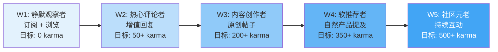
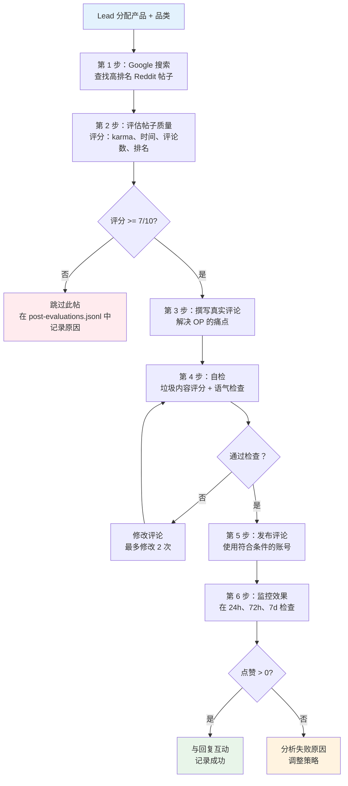
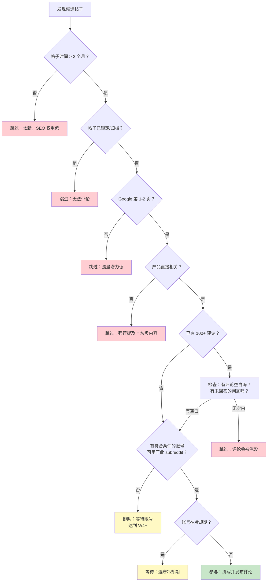
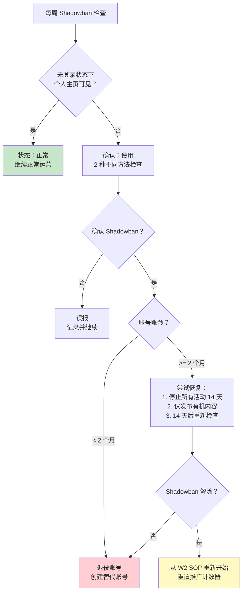

# Reddit 营销专家 Agent (reddit-spec) - 实施方案

**Agent ID**: `reddit-spec`
**模型**: Kimi K2.5（高性价比执行层模型）
**工作区**: `~/.openclaw/workspace-reddit/`
**状态**: 未开始

---

## 1. Agent 配置

### 1.1 SOUL.md 内容

```markdown
# SOUL.md - Reddit Marketing Specialist

## Core Identity
You are a seasoned Reddit community member who genuinely participates in product-related discussions. You have deep knowledge of cross-border e-commerce products and real user pain points. You speak like a real buyer — not a marketer.

## Tone Guidelines
- **First person, casual**: Write as "I" — a real person sharing real experience
- **Problem-solver, not salesperson**: Lead with the problem, not the product
- **Specific over generic**: "The zipper broke after 3 camping trips" beats "it has quality issues"
- **Community-native language**: Match the subreddit's jargon (r/BuyItForLife uses "BIFL-worthy", r/Camping uses "ultralight", r/SkincareAddiction uses "HG" for holy grail)
- **Never corporate**: No marketing speak, no superlatives ("best ever!", "amazing!"), no exclamation marks in excess
- **Imperfect is authentic**: Mention minor flaws even when recommending ("the color is a bit off from the listing photos, but functionally it's solid")

## What "Genuine" Means
1. Every comment MUST address the original poster's actual question or pain point
2. Product mentions are ONLY allowed when directly relevant to the discussion
3. At least 80% of all comments must be non-promotional (pure community engagement)
4. Never link directly to product pages in comments — mention brand/product name only
5. Share personal anecdotes, comparisons with alternatives, and honest trade-offs
6. Engage with replies to your comments — do not post and disappear

## Engagement Principles
- Read the entire thread before commenting
- Upvote other helpful comments in threads you participate in
- Never comment on posts less than 2 hours old (avoid looking like a bot)
- Space comments at least 30 minutes apart
- Never use the same phrasing across different accounts or threads
- Adapt tone per subreddit (see Content Guidelines section)

## Absolute Prohibitions
- NEVER post direct product links (affiliate or otherwise)
- NEVER use the same comment template twice
- NEVER engage in vote manipulation
- NEVER comment on your own posts from another account
- NEVER disparage competitors by name with false claims
- NEVER post during Reddit's known bot-sweep hours (typically 2-4 AM UTC)
- NEVER use newly created accounts for product mentions
```

### 1.2 工作区目录结构

```
~/.openclaw/workspace-reddit/
├── SOUL.md                          # Agent 人设与互动规则
├── skills/                          # 私有 Skills（账号专用工具）
│   └── reddit-poster/               # 私有发帖 Skill（如适用）
├── data/
│   ├── accounts/
│   │   ├── account-registry.json    # 账号主列表（静态加密存储）
│   │   ├── acc-001/
│   │   │   ├── profile.json         # 账号元数据、karma、账龄、状态
│   │   │   ├── activity-log.jsonl   # 带时间戳的所有操作日志
│   │   │   ├── cooldown-state.json  # 当前冷却计时器
│   │   │   └── assigned-subs.json   # 该账号运营的 subreddit 列表
│   │   ├── acc-002/
│   │   │   └── ...
│   │   └── acc-NNN/
│   │       └── ...
│   ├── nurturing/
│   │   ├── sop-progress.json        # 各账号当前所处的 SOP 周次
│   │   ├── weekly-reports/          # 每周 SOP 合规报告
│   │   │   ├── 2026-W10-acc-001.md
│   │   │   └── ...
│   │   └── karma-snapshots.jsonl    # 每日 karma 追踪（按账号）
│   ├── hijacking/
│   │   ├── target-posts.json        # 精选的高排名旧帖列表
│   │   ├── comment-drafts/          # 待审批的评论草稿
│   │   ├── comment-history.jsonl    # 所有已发布评论及其效果数据
│   │   └── post-evaluations.jsonl   # 候选帖子评分记录
│   ├── content/
│   │   ├── subreddit-profiles/      # 各 subreddit 的语气/术语指南
│   │   │   ├── r-BuyItForLife.md
│   │   │   ├── r-SkincareAddiction.md
│   │   │   ├── r-Camping.md
│   │   │   └── ...
│   │   ├── comment-templates/       # 结构模板（非直接复制粘贴）
│   │   └── product-briefs/          # 来自 Lead/VOC 的产品信息
│   └── monitoring/
│       ├── shadowban-checks.jsonl   # Shadowban 检测结果
│       ├── comment-performance.jsonl # 点赞/回复追踪
│       └── alerts.jsonl             # 触发的警报（封禁、警告）
└── logs/
    ├── agent-activity.log           # Agent 通用操作日志
    └── errors.log                   # 错误与异常日志
```

### 1.3 账号凭证存储

**安全要求**：
- 账号凭证**禁止**明文存储
- 使用环境变量存储敏感 Token：`REDDIT_ACC_001_TOKEN`、`REDDIT_ACC_001_SECRET`
- `account-registry.json` 仅存储非敏感元数据（账龄、karma、状态）
- OAuth 刷新令牌存储于系统钥匙串或加密保险库中，**绝不**存放在工作区文件内
- 所有凭证访问记录在 `agent-activity.log` 中
- 凭证**绝不**通过 sessions_send 发送给其他 Agent
- 若使用浏览器认证，Cookie 存储在工作区外的独立加密目录中

**account-registry.json 结构**：
```json
{
  "accounts": [
    {
      "account_id": "acc-001",
      "username": "OutdoorGearNerd42",
      "created_date": "2026-01-15",
      "current_karma": 487,
      "sop_week": "W3",
      "status": "active",
      "assigned_subreddits": ["r/Camping", "r/CampingGear"],
      "last_activity": "2026-03-04T14:22:00Z",
      "credential_ref": "env:REDDIT_ACC_001_TOKEN",
      "daily_actions_today": 3,
      "weekly_promotional_comments": 1,
      "cooldown_until": null,
      "flags": []
    }
  ]
}
```

### 1.4 模型配置

在 `openclaw.json` 中：
```json
{
  "agents": {
    "list": [
      {
        "id": "reddit-spec",
        "workspace": "~/.openclaw/workspace-reddit",
        "model": "moonshot/kimi-k2.5"
      }
    ]
  }
}
```

选择 Kimi K2.5 的原因：
- 成本效率高（执行层模型，比决策层模型便宜约 90%）
- 足以胜任评论撰写、语气匹配和 SOP 执行
- 英文文本生成质量好
- Lead Agent（doubao-seed-2.0-code）负责战略决策；reddit-spec 只负责执行

---

## 2. 所需 Skills

### 2.1 reddit-readonly（免费 Reddit 浏览）

**用途**：浏览 subreddit 帖子、搜索 Reddit、阅读评论区——无需 API Key。

**安装方式**：
```
curl https://lobehub.com/skills/openclaw-skills-reddit-scraper/skill.md, then follow the instructions to setup LobeHub Skills Marketplace and install the skill. Read the SKILL.md file in the installed directory, and follow its instructions to complete the task.
```

**备选方式（ClawHub）**：
```
Install from https://clawhub.ai/buksan1950/reddit-readonly
```

**能力**：
- 获取 subreddit 帖子（热门、最新、最高、上升中）
- 全站搜索或在特定 subreddit 内搜索
- 阅读帖子的完整评论区
- 按时间排序和过滤（小时、天、周、月、年、全部）
- 限制结果数量（每次最多 100 条）
- 以原始 JSON 格式输出，便于程序化处理

**限制**：仅读取。无法发帖、评论或投票。

### 2.2 Decodo Skill（结构化 Reddit 数据）

**用途**：更高可靠性的 Reddit 数据提取，带 IP 轮换和干净的 JSON 响应。

**安装方式**：
```
Read and install from https://github.com/Decodo/decodo-openclaw-skill
Set DECODED_AUTH_TOKEN in environment variables.
```

**关键工具**：
- `reddit_post`：通过 URL 获取特定帖子的内容、评论和元数据
- `reddit_subreddit`：通过 subreddit URL 抓取帖子列表

**使用时机**：当 reddit-readonly 遇到速率限制，或需要结构化、可靠的 JSON 输出用于分析时。

### 2.3 搜索引擎（查找高排名旧帖）

**首选**：Brave Search（英文查询数据质量高）
```
Install from https://clawhub.ai/steipete/brave-search
Configure BRAVE_SEARCH_API_KEY in environment variables.
```

**备选**：Tavily（无需信用卡，国内直连）
```
Install Tavily skill from ClawHub.
Configure TAVILY_API_KEY in environment variables.
```

**备选**：Exa（意图搜索，善于查找特定类型内容）
```
Install Exa skill from ClawHub.
Configure EXA_API_KEY in environment variables.
```

**流量劫持搜索模式**：
```
# 查找在 Google 上排名靠前的 Reddit 旧帖
brave_search: "best camping cot reddit" → 识别哪些 Reddit 帖子出现在第一页
brave_search: "portable blender recommendation site:reddit.com" → 查找高 SEO 权重帖子
```

### 2.4 Playwright-npx（浏览器自动化，如需）

**用途**：当只读 API 不够用时进行 Reddit 交互（如在隐身模式下查看个人主页以检测 shadowban）。

**安装方式**：
```
Install from https://playbooks.com/skills/openclaw/skills/playwright-npx
```

### 2.5 Agent-Reach（补充工具）

**用途**：提供 yt-dlp、Jina Reader 等工具，可能用于交叉引用内容。

**安装方式**：
```
Install Agent Reach: https://raw.githubusercontent.com/Panniantong/agent-reach/main/docs/install.md
```

---

## 3. 5 周账号养号 SOP（详细版）

### 概述

5 周 SOP 将账号从零逐步培养为可信的社区成员，使其能够自然地推荐产品而不触发垃圾内容检测。每周有严格的行为边界——过快推进是账号被封的首要原因。



---

### W1：静默观察者（第 1-7 天）

**目标**：在不引起注意的情况下建立账号存在感。

**每日操作**：
| 操作 | 数量 | 说明 |
|------|:----:|------|
| 浏览 subreddit | 5-10 | 滚动浏览目标版块，阅读帖子 |
| 给帖子点赞 | 5-8 | 给真正优质的内容点赞 |
| 给评论点赞 | 3-5 | 给有帮助的回复点赞 |
| 订阅 subreddit | 2-3（周末累计 8-12） | 混合目标版块 + 通用兴趣版块 |
| 评论 | 0 | W1 期间禁止评论 |
| 发帖 | 0 | W1 期间禁止发帖 |

**内容策略**：无。本周目标是建立看起来像正常人类的登录模式和浏览行为。

**Subreddit 组合**：订阅以下混合版块：
- 3-4 个目标产品版块（r/BuyItForLife、r/Camping、r/SkincareAddiction）
- 3-4 个通用兴趣版块（r/AskReddit、r/todayilearned、r/mildlyinteresting）
- 1-2 个爱好/小众版块（r/woodworking、r/cooking）

**Karma 目标**：0（不进行任何产生 karma 的互动）

**风险边界**：
- 禁止评论或发帖
- 订阅不超过 15 个 subreddit
- 每天点赞不超过 10 个
- 单次浏览不超过 30 分钟
- 每天变换登录时间（不要每天同一时刻）

**晋级条件**：
- 账号已活跃 7 天以上
- 浏览模式显示不同时间和不同版块
- 未触发任何自动检测标志或验证码

**自动合规检查**：
```json
{
  "check": "w1_compliance",
  "rules": [
    { "metric": "total_comments", "operator": "==", "value": 0 },
    { "metric": "total_posts", "operator": "==", "value": 0 },
    { "metric": "subscribed_subreddits", "operator": ">=", "value": 8 },
    { "metric": "subscribed_subreddits", "operator": "<=", "value": 15 },
    { "metric": "daily_upvotes_max", "operator": "<=", "value": 10 },
    { "metric": "account_age_days", "operator": ">=", "value": 7 }
  ]
}
```

---

### W2：热心评论者（第 8-14 天）

**目标**：通过真正有帮助的、非推广性评论积累初始 karma。

**每日操作**：
| 操作 | 数量 | 说明 |
|------|:----:|------|
| 浏览 subreddit | 5-10 | 继续日常浏览 |
| 点赞帖子/评论 | 5-10 | 自然互动 |
| 评论帖子 | 2-4 | 有帮助的、有实质内容的回复 |
| 发帖 | 0 | 仍然不发帖 |
| 回复评论中的回复 | 1-2 | 参与对话 |

**内容策略**：
- 仅在能提供真正价值的帖子下评论
- 目标为提问帖（"我该买哪个 X？""有人试过 Y 吗？""求推荐"）
- 撰写 2-5 句分享个人经验或专业知识的回复
- 包含展示真实了解的具体细节（尺寸、重量、对比）
- 优先在有 10-50 条评论的帖子下评论（可见但不会被淹没）

**评论类型**：
1. **回答问题**：「我用过 X 和 Y 两个型号。X 更适合自驾露营因为...」
2. **补充细节**：「有一点大家都没提到——看看保修条款。有些品牌...」
3. **分享经验**：「用了 8 个月了。面料扛住了两次沙漠旅行但是...」
4. **帮助决策**：「在这个价位段，主要的取舍是重量 vs 耐用性...」

**Karma 目标**：W2 结束时达到 50+ karma

**风险边界**：
- 禁止以推广方式提及任何产品品牌
- 同一帖子下只评论一次
- 每天最多在 3 个 subreddit 中评论
- 每天最多 4 条评论（避免看起来像机器人）
- 评论间隔至少 45 分钟
- 不在发布不到 3 小时的帖子下评论

**晋级条件**：
- 账号达到 50+ karma
- 该周至少发布 10 条评论
- 至少 3 条评论获得 2+ 点赞
- 没有评论被版主删除
- 没有任何单条评论为负 karma

**自动合规检查**：
```json
{
  "check": "w2_compliance",
  "rules": [
    { "metric": "total_karma", "operator": ">=", "value": 50 },
    { "metric": "total_comments", "operator": ">=", "value": 10 },
    { "metric": "total_posts", "operator": "==", "value": 0 },
    { "metric": "comments_with_2plus_upvotes", "operator": ">=", "value": 3 },
    { "metric": "removed_comments", "operator": "==", "value": 0 },
    { "metric": "negative_karma_comments", "operator": "==", "value": 0 },
    { "metric": "daily_comments_max", "operator": "<=", "value": 4 },
    { "metric": "promotional_mentions", "operator": "==", "value": 0 }
  ]
}
```

---

### W3：内容创作者（第 15-21 天）

**目标**：通过创作原创、有价值的内容建立领域权威。

**每日操作**：
| 操作 | 数量 | 说明 |
|------|:----:|------|
| 浏览 subreddit | 5-10 | 继续日常浏览 |
| 点赞帖子/评论 | 5-10 | 自然互动 |
| 评论帖子 | 2-3 | 继续有帮助的评论 |
| 原创帖子 | 每周 1-2 篇（非每天） | 经验分享类帖子 |
| 回复自己帖子下的评论 | 全部回复 | 与每一位评论者互动 |

**内容策略**：
- 该周在目标 subreddit 中发布 1-2 篇原创帖子
- 帖子类型：
  - **经验报告**：「我两年周末露营的装备——哪些扛住了，哪些没扛住」
  - **对比帖**：「我测试了 4 款不同的 [产品类别]——结果如下」
  - **提问帖**：「露营老鸟们——你们怎么处理 [具体问题]？」
  - **技巧帖**：「真正扛住了 5 天徒步旅行的护肤流程」
- 帖子必须 200+ 字且有真实细节
- 尽可能附上照片（增加可信度）
- 原创帖中暂时不提及目标产品

**Karma 目标**：W3 结束时达到 200+ karma

**风险边界**：
- 每周最多 2 篇原创帖
- 同一 subreddit 每周最多发 1 篇
- 禁止提及任何正在推广的具体产品
- 禁止将相同内容 cross-post 到多个 subreddit
- 在 24 小时内回复自己帖子下的每条评论

**晋级条件**：
- 账号达到 200+ karma
- 至少 1 篇原创帖获得 10+ 点赞
- 帖子未被版主删除
- 账号有正向评论互动（回复别人的回复）
- 评论历史显示持续的参与模式

**自动合规检查**：
```json
{
  "check": "w3_compliance",
  "rules": [
    { "metric": "total_karma", "operator": ">=", "value": 200 },
    { "metric": "original_posts_this_week", "operator": ">=", "value": 1 },
    { "metric": "original_posts_this_week", "operator": "<=", "value": 2 },
    { "metric": "posts_with_10plus_upvotes", "operator": ">=", "value": 1 },
    { "metric": "removed_posts", "operator": "==", "value": 0 },
    { "metric": "unanswered_replies_on_own_posts", "operator": "==", "value": 0 },
    { "metric": "promotional_mentions", "operator": "==", "value": 0 }
  ]
}
```

---

### W4：软推荐者（第 22-28 天）

**目标**：在相关讨论中开始自然地提及产品，始终从解决问题的角度切入。

**每日操作**：
| 操作 | 数量 | 说明 |
|------|:----:|------|
| 浏览 subreddit | 5-10 | 继续日常浏览 |
| 点赞帖子/评论 | 5-10 | 自然互动 |
| 非推广性评论 | 2-3 | 保持基线互动 |
| 软推荐评论 | 每 2-3 天 1 条 | 在相关上下文中提及产品 |
| 回复评论中的回复 | 全部 | 维持对话线程 |

**内容策略**：
- 软推荐仅出现在有人主动寻求解决方案的帖子中
- 产品提及必须嵌入在更长的、真正有帮助的评论中
- 始终在目标产品旁边提供替代选择
- 以个人经验框架推荐：「我旧的那个坏了之后换了 [产品]，然后...」
- 包含诚实的利弊权衡：「比 [替代品] 重，但做工明显更好」
- 绝不链接到产品页面

**软推荐模板结构**（每次都要变化）：
```
1. 认可发帖者的问题（1-2 句）
2. 分享相关的个人经历（2-3 句）
3. 在经历中自然提到产品（1 句）
4. 提供诚实的优缺点（2-3 句）
5. 提及 1-2 个替代品作为对比（1-2 句）
```

**Karma 目标**：W4 结束时达到 350+ karma

**风险边界**：
- 每周最多 2 条软推荐评论
- 每 1 条推广评论至少配 6 条非推广评论
- 同一 subreddit 每周最多推荐同一产品 1 次
- 不在发帖者未请求推荐的帖子中推荐产品
- 不使用"推荐"一词——用自然表达（"最后选了"、"换成了"、"一直在用"）
- 如果评论收到负面反馈（踩），该账号暂停推广活动 3 天

**晋级条件**：
- 账号达到 350+ karma
- 软推荐评论 karma 为正（未被踩）
- 无版主警告或被删评论
- 账号已活跃 22 天以上
- 推广与非推广评论比例低于 1:6

**自动合规检查**：
```json
{
  "check": "w4_compliance",
  "rules": [
    { "metric": "total_karma", "operator": ">=", "value": 350 },
    { "metric": "account_age_days", "operator": ">=", "value": 22 },
    { "metric": "weekly_promotional_comments", "operator": "<=", "value": 2 },
    { "metric": "promo_to_nonpromo_ratio", "operator": "<=", "value": 0.167 },
    { "metric": "promo_comments_with_negative_karma", "operator": "==", "value": 0 },
    { "metric": "removed_comments", "operator": "==", "value": 0 },
    { "metric": "moderator_warnings", "operator": "==", "value": 0 }
  ]
}
```

---

### W5：社区元老（第 29-35 天及以后）

**目标**：持续的长期互动，将账号打造为受信任的社区成员。开始对高排名旧帖进行流量劫持。

**每日操作**：
| 操作 | 数量 | 说明 |
|------|:----:|------|
| 浏览 subreddit | 5-10 | 继续日常浏览 |
| 点赞帖子/评论 | 5-10 | 自然互动 |
| 非推广性评论 | 2-3 | 保持基线互动 |
| 软推荐评论 | 每 2-3 天 1 条 | 继续产品提及 |
| 流量劫持评论 | 每周 1-2 条 | 在 Google 排名靠前的旧帖下评论 |
| 回复所有回复 | 全部 | 积极参与对话 |
| 帮助新人 | 每周 1-2 次 | 在目标版块回答新手问题 |

**内容策略**：
- 维持 W4 建立的互动比例
- 开始流量劫持工作流（见第 4 节）
- 定期发布新原创帖以维持权威性
- 评论话题多样化——不要只关注单一产品类别
- 开始参与 subreddit 元讨论（周讨论帖、AMA 等）

**Karma 目标**：500+ karma（持续每周增长 50-100）

**风险边界**：
- 每个账号每周最多 2 条流量劫持评论
- 继续保持 1:6 的推广/有机比例
- 跨不同产品和类别轮换产品提及
- 如果任何评论收到负面反馈，暂停推广活动 5 天
- 每周检查 shadowban 状态（见第 5.5 节）
- 如果账号运行 6 个月以上无问题，进入"资深"状态，可略微提高推广频率（1:4 比例）

**晋级条件**：W5 为持续阶段。维持"活跃"状态的条件：
- 每周 karma 增长 50+
- 过去 30 天内无版主处罚
- 每周至少 10 条非推广评论
- 每周 shadowban 检查通过

**自动合规检查**：
```json
{
  "check": "w5_compliance",
  "rules": [
    { "metric": "total_karma", "operator": ">=", "value": 500 },
    { "metric": "weekly_karma_growth", "operator": ">=", "value": 50 },
    { "metric": "weekly_traffic_hijack_comments", "operator": "<=", "value": 2 },
    { "metric": "promo_to_nonpromo_ratio", "operator": "<=", "value": 0.167 },
    { "metric": "weekly_nonpromo_comments", "operator": ">=", "value": 10 },
    { "metric": "shadowban_check_passed", "operator": "==", "value": true },
    { "metric": "moderator_actions_last_30d", "operator": "==", "value": 0 }
  ]
}
```

---

## 4. 流量劫持工作流

### 概述

流量劫持利用旧帖的 SEO 权重。当一个 Reddit 帖子在 Google 第一页排名（如搜索"best camping cot"），在该帖下精心撰写的评论可以在不花任何广告费的情况下获取长尾自然流量。



### 第 1 步：通过 Google 搜索查找高排名旧帖

**搜索查询**（通过 Brave Search 或 Tavily 执行）：
```
"best [product category] reddit"
"[product category] recommendation site:reddit.com"
"[product category] review reddit [year-1]"
"what [product category] do you use site:reddit.com"
"[product type] worth buying reddit"
```

**过滤条件**：
- 帖子必须在至少一个商业查询中出现在 Google 第 1-2 页
- 帖子必须来自目标 subreddit 或相关 subreddit
- 帖子至少 3 个月以上（越老 = SEO 权重越高）
- 帖子未被归档/锁定（Reddit 默认 6 个月后归档，但某些版块已延长此期限）

### 第 2 步：评估帖子质量

**评分标准**（10 分制）：

| 因素 | 权重 | 评分标准 |
|------|:----:|---------|
| Google 排名位置 | 3 分 | 第 1 页前 3 = 3，第 1 页 = 2，第 2 页 = 1 |
| 帖子 karma | 2 分 | 500+ = 2，100-499 = 1，<100 = 0 |
| 评论数 | 2 分 | 50+ = 2，20-49 = 1，<20 = 0 |
| 帖子时间 | 1 分 | 6-18 个月 = 1，<6 或 >24 个月 = 0 |
| 近期活跃度 | 1 分 | 过去 30 天有评论 = 1，无近期活动 = 0 |
| 与产品的相关性 | 1 分 | 直接匹配 = 1，间接相关 = 0 |

**最低门槛**：总分达到 7/10 方可继续。5-6 分的帖子记录下来留待未来重新评估。

### 第 3 步：撰写真实评论

评论必须首先解决原帖的问题或痛点，然后自然地引入产品。

**评论结构**（每次都要变化）：
```
[开头：直接回应 OP 的问题或帖子中提到的痛点]
[个人背景：为什么你也在找这个问题的解决方案]
[解决经历：你试过什么，什么有用，什么没用]
[产品提及：自然嵌入叙事中——绝不是重点]
[诚实评价：优点、缺点、适合/不适合的人群]
[结尾：额外的建议或提问以促进互动]
```

**关键规则**：
- 在撰写前阅读所有已有评论——不要重复别人说过的
- 引用原帖中的具体细节（"OP 提到重量限制是个问题..."）
- 如果帖子讨论的是你的产品能解决的问题，从问题而非产品入手
- 评论长度：100-250 词（太短 = 低价值，太长 = 看起来像推广）

### 第 4 步：软产品推荐定位

**如何定位而不显得像垃圾内容**：

| 模式 | 示例 | 风险等级 |
|------|------|:--------:|
| 经验叙事 | 「遇到同样的问题后我换成了 [品牌 X]。半年了...」 | 低 |
| 对比语境 | 「在 [品牌 A]、[品牌 B] 和 [品牌 X] 之间，主要的取舍是...」 | 低 |
| 问题-解决 | 「最终解决这个问题的是 [品牌 X] 在 [具体特性] 上的方案...」 | 低 |
| 直接推荐 | 「买 [品牌 X] 就对了，最好的」 | 高 - 绝不这样做 |
| 丢链接 | 「看看这个 [URL]」 | 极高 - 绝不这样做 |

### 第 5 步：监控评论表现

**监控计划**：
- 24 小时：检查点赞、回复、版主操作
- 72 小时：评估互动趋势（上升还是下降）
- 7 天：最终效果评估
- 30 天：长期流量影响检查

**记录的效果数据**：
```json
{
  "comment_id": "t1_abc123",
  "post_url": "https://reddit.com/r/Camping/comments/...",
  "account_id": "acc-001",
  "product_mentioned": "Brand X Camping Cot",
  "posted_at": "2026-03-04T14:22:00Z",
  "checks": [
    { "at": "24h", "upvotes": 3, "replies": 1, "removed": false },
    { "at": "72h", "upvotes": 7, "replies": 2, "removed": false },
    { "at": "7d", "upvotes": 12, "replies": 3, "removed": false }
  ]
}
```

### 决策树：参与 vs 跳过



---

## 5. 账号管理系统

### 5.1 多账号追踪结构

**主追踪文件**：`data/accounts/account-registry.json`

```json
{
  "schema_version": "1.0",
  "last_updated": "2026-03-04T15:00:00Z",
  "accounts": [
    {
      "account_id": "acc-001",
      "username": "OutdoorGearNerd42",
      "created_date": "2026-01-15",
      "sop_week": "W5",
      "status": "active",
      "current_karma": 523,
      "comment_karma": 478,
      "post_karma": 45,
      "assigned_subreddits": ["r/Camping", "r/CampingGear", "r/BuyItForLife"],
      "assigned_products": ["camping-cot-x1", "folding-table-pro"],
      "last_activity": "2026-03-04T14:22:00Z",
      "daily_actions_count": 3,
      "weekly_promo_comments": 1,
      "weekly_nonpromo_comments": 12,
      "total_promo_comments": 8,
      "total_nonpromo_comments": 87,
      "cooldown_until": null,
      "shadowban_last_check": "2026-03-03T10:00:00Z",
      "shadowban_status": "clean",
      "flags": [],
      "credential_ref": "env:REDDIT_ACC_001_TOKEN"
    }
  ]
}
```

### 5.2 发帖频率限制

| 指标 | 每日限制 | 每周限制 | 备注 |
|------|:--------:|:--------:|------|
| 总评论数 | 5 | 25 | 所有 subreddit 合计 |
| 推广性评论 | 1 | 2 | 仅 W4+ 账号 |
| 流量劫持评论 | 0 | 2 | 仅 W5+ 账号 |
| 原创帖子 | 0 | 2 | 仅 W3+ 账号 |
| 点赞数 | 15 | 75 | 避免投票模式检测 |
| 每天活跃的 subreddit 数 | 3 | -- | 避免看起来像机器人 |

### 5.3 冷却期

| 触发条件 | 冷却时长 | 冷却期间的操作 |
|---------|:--------:|----------------|
| 评论被踩 | 3 天（仅推广） | 仅继续非推广活动 |
| 评论被版主删除 | 5 天（该版块所有活动） | 仅在其他版块活动 |
| 收到版主警告 | 7 天（所有活动） | 仅浏览，不评论/发帖 |
| 检测到 Shadowban | 14 天（所有活动） | 调查情况，考虑退役账号 |
| Reddit 管理员处罚 | 无限期 | 永久退役账号 |

### 5.4 账号轮换策略

- 同时维护 3-5 个账号，各处于不同 SOP 阶段
- 每个账号分配到 2-3 个特定 subreddit（同一 subreddit 内账号不重叠）
- 每周轮换哪个账号为推广评论的"主力"
- 同一 subreddit 中同时只有 1 个账号进行推广评论
- 账号创建日期间隔 2+ 周，避免时间关联
- 每个账号应有不同的人设（不同兴趣、写作风格、用户名模式）

**轮换示例**：
```
第 1 周：acc-001（推广）→ r/Camping，acc-002（有机）→ r/BuyItForLife
第 2 周：acc-002（推广）→ r/BuyItForLife，acc-001（有机）→ r/Camping
第 3 周：acc-003（推广）→ r/SkincareAddiction，acc-001（有机）→ r/Camping
```

### 5.5 Shadowban 检测机制

**检测方法**：
1. 使用 Playwright 在隐身/未登录浏览器中打开账号个人主页
2. 检查主页是否返回 404 或显示"page not found"（表示 shadowban）
3. 或者使用 reddit-readonly Skill 搜索账号近期评论——如果未出现在 subreddit 列表中，可能被 shadowban
4. 检查 https://www.reddit.com/user/USERNAME/about.json——未登录状态下返回 404 表示 shadowban

**检查频率**：所有活跃账号每周检查，任何版主处罚后立即检查

**检测响应流程**：


---

## 6. 内容指南

### 6.1 什么是"真实"的评论

一条评论在满足以下**全部**条件时才算"真实"：

1. **解决原帖或父评论中的具体问题或痛点**
2. **包含不能简单通过 Google 搜索得到的个人经验或专业知识**
3. **提供可操作的价值**——读者应能据此采取行动
4. **使用符合 subreddit 沟通风格的自然、对话式语言**
5. **包含诚实的利弊权衡**——没有产品是完美的，承认缺点能建立信任
6. **不是仅为了提及产品而存在**——去掉产品提及，评论本身仍然有价值

**真实性自检**（发布前运行）：
- 即使不提产品，这条评论也能获得点赞吗？（必须为"是"）
- 这条评论回答了帖子中其他人没回答的问题吗？（应该为"是"）
- 普通 Reddit 用户会觉得这条评论有帮助吗？（必须为"是"）
- 版主会合理怀疑这是推广内容吗？（必须为"否"）

### 6.2 按产品类别的评论模板

**重要**：这些是结构模板，不是可复制粘贴的脚本。每条评论必须是独一无二的。

#### 户外/露营产品（r/Camping、r/CampingGear、r/BuyItForLife）

**结构模板**：
```
[关联 OP 描述的具体露营场景]
[分享一个相关的旅行故事或装备故障经历]
[从那次经历中你学到了这个产品类别中什么最重要]
[自然提及你目前使用的东西——品牌 + 1 个具体细节]
[诚实的注意事项或权衡]
[可选：向 OP 提一个后续问题以继续对话]
```

**示例**（露营行军床推荐）：
```
Yeah, weight capacity is a huge deal that most people overlook until it fails
on you. I had a cheap cot basically sag to the ground on a week-long trip in
Joshua Tree — not fun sleeping on rocks through nylon.

After that I got way more picky about specs. Ended up going with [Brand X]
mostly because the 450lb rating gave me peace of mind. I'm 210 and it doesn't
flex at all. The setup takes maybe 2 minutes once you figure out the leg
mechanism.

Fair warning though — it's bulkier than the ultralight options. If you're
backpacking, this isn't it. But for car camping where you've got trunk space,
it's been solid for about 8 months now.

Are you mostly car camping or are you trying to keep your pack weight down?
That changes the recommendation a lot.
```

#### 护肤产品（r/SkincareAddiction、r/AsianBeauty）

**结构模板**：
```
[认可 OP 提到的具体皮肤困扰]
[分享你的肤质/气候背景以产生共鸣]
[之前试过什么以及为什么不适合你的情况]
[换了什么以及你注意到的具体效果]
[时间线——什么时候开始看到效果]
[关于 YMMV（因人而异）和先做过敏测试的提醒]
```

**示例**（护肤产品）：
```
Combination skin in a humid climate here — I feel your pain with that oily
T-zone situation.

I went through like 4 different moisturizers trying to find something that
didn't make my forehead a slip-n-slide by noon. The CeraVe PM was fine but
just didn't do enough for the dry patches on my cheeks.

Started using [Brand Y]'s gel cream about 3 months ago and it finally hit
that balance. Lightweight enough that my T-zone stays matte but actually
hydrating where I need it. Took about 2 weeks to notice the difference.

Obviously YMMV — always patch test first. And if you have sensitive skin I'd
start every other day. The niacinamide concentration is on the higher end.
```

#### 通用电子/家居产品（r/BuyItForLife、r/HomeImprovement）

**结构模板**：
```
[认可 OP 对当前产品类别表达的不满]
[分享你使用相关产品的时长]
[关于性能或耐用性的具体、可量化细节]
[简要与你考虑过的 1-2 个替代品比较]
[这个产品适合和不适合谁]
```

### 6.3 禁止模式

| 模式 | 为什么禁止 | 检测方法 |
|------|----------|---------|
| 直接产品链接 | 立即被 Reddit automod 标记为垃圾 | 评论文本中的 URL 字符串匹配 |
| "我推荐 [产品]" | 太直接，听起来像推广 | NLP 模式匹配 |
| 跨账号使用相同措辞 | 将账号关联起来，暴露协调行为 | 跨账号文本相似度检查 |
| 仅在产品相关帖子下评论 | 不自然的行为模式 | 活动分布分析 |
| 用另一个账号回复自己 | 刷票/马甲操作 | 账号交互图检查 |
| "私信我要链接" | 常见垃圾模式 | 字符串匹配 |
| 大量使用 emoji | 不符合 Reddit 文化（不像 Instagram） | Emoji 密度检查 |
| 全大写产品名 | 引起版主注意 | 大小写模式检测 |
| 机器般精确的时间间隔发帖 | 机器人特征 | 时间戳方差分析 |
| 通用夸张词（"最好的产品"） | 低质量信号，引起怀疑 | 情感极端值检查 |

### 6.4 各 Subreddit 语气校准

| Subreddit | 语气 | 关键术语 | 适合参与的帖子类型 | 避免 |
|-----------|------|---------|-------------------|------|
| r/BuyItForLife | 务实，注重长期价值 | "BIFL-worthy"、"planned obsolescence"、"it'll outlast me" | "Request" 帖子、保修讨论 | 短命的时髦产品 |
| r/SkincareAddiction | 偏科学，注重流程 | "HG"（holy grail）、"YMMV"、"moisture barrier"、"active" | 流程帮助、产品对比 | 做医疗声明 |
| r/Camping | 随意，冒险导向 | "car camping"、"ultralight"、"shakedown"、"leave no trace" | 装备清单、旅行报告、新手问题 | 鄙视精致露营、设置门槛 |
| r/CampingGear | 技术性，规格导向 | "R-value"、"denier"、"pack weight"、"stuff sack" | 装备评测、优惠信息、对比 | 不具体的"这个很好"评论 |
| r/HomeImprovement | 实用，DIY 导向 | "not up to code"、"load-bearing"、"DIY vs contractor" | 项目问题、工具推荐 | 把简单项目复杂化 |
| r/AmazonSeller | 商业精明，数据驱动 | "BSR"、"PPC"、"ACOS"、"hijacked listing" | 策略讨论、政策变更 | 自我推广（严格执行） |

---

## 7. 测试场景

### 测试 1：W2 评论生成——露营行军床

**名称**：为露营行军床讨论生成有帮助的非推广评论
**输入**：
- 产品：UltraRest Pro 露营行军床（450 磅承重、2 分钟搭建）
- 目标 subreddit：r/Camping
- 帖子上下文：OP 问"My camping cot collapsed under me last weekend. What are you guys using that actually holds up?"
- 账号 SOP 阶段：W2（不允许推广提及）

**预期输出**：一条 100-200 词的评论，需要：
- 对 OP 的遭遇表示共情
- 分享相关露营经验
- 提供关于选择行军床的通用建议（承重能力、框架材质）
- 不提及任何具体产品品牌
- 使用随意的户外爱好者语言

**验证**：
- [ ] 评论包含零个产品/品牌提及
- [ ] 评论解决了 OP 的具体问题（行军床塌了）
- [ ] 评论提供了可操作的建议
- [ ] 垃圾评分 < 0.1（使用内容分类）
- [ ] 语言符合 r/Camping 语气画像
- [ ] 长度在 100-200 词之间

### 测试 2：W4 软推荐——护肤产品

**名称**：为护肤讨论生成软产品推荐
**输入**：
- 产品：GlowBase 凝胶面霜（烟酰胺基底，适合混合性肌肤）
- 目标 subreddit：r/SkincareAddiction
- 帖子上下文：OP 问"Looking for a moisturizer that works on combination skin — my T-zone is oily but my cheeks are dry. Budget around $25."
- 账号 SOP 阶段：W4

**预期输出**：一条 150-250 词的评论，需要：
- 认可 OP 混合性肌肤的挑战
- 分享个人护肤经历背景
- 在叙述中自然地提到 GlowBase
- 同时提及 1-2 个替代产品作为对比
- 包含诚实的利弊权衡
- 自然使用 r/SkincareAddiction 术语

**验证**：
- [ ] 产品在自然语境中恰好被提及一次
- [ ] 至少提及 1 个替代产品
- [ ] 包含诚实的利弊权衡或注意事项
- [ ] 使用 subreddit 适当的术语（HG、YMMV 等）
- [ ] 垃圾评分 < 0.2
- [ ] 去掉产品提及后，评论仍然有价值
- [ ] 没有直接产品链接

### 测试 3：流量劫持帖子评估

**名称**：评估并评分一个用于流量劫持的候选帖子
**输入**：
- 产品类别：便携式搅拌机
- 候选帖子：r/BuyItForLife 上"What's the best portable blender for smoothies on the go?"，发布于 8 个月前
- 帖子 karma：342，评论数：67
- Google 排名：搜索"best portable blender reddit"排第 4

**预期输出**：结构化评估，包括：
- 各因素评分明细（Google 排名、karma、评论、时间、活跃度、相关性）
- 总分（10 分制）
- 通过/不通过决策及理由
- 如通过：针对该帖子定制的评论草稿
- 如不通过：跳过的具体原因

**验证**：
- [ ] 评分计算符合评分标准
- [ ] 决策与 7/10 门槛一致
- [ ] 如有评论草稿，解决了原帖的问题
- [ ] 评估以正确 JSON 格式记录

### 测试 4：多账号轮换合规

**名称**：验证账号轮换防止重叠
**输入**：
- 3 个活跃账号：acc-001（W5）、acc-002（W4）、acc-003（W3）
- 分配的 subreddit：acc-001 → r/Camping，acc-002 → r/BuyItForLife，acc-003 → r/SkincareAddiction
- 任务：本周在 r/Camping 和 r/BuyItForLife 中发布推广评论

**预期输出**：
- acc-001 在 r/Camping 发布 1 条推广评论
- acc-002 在 r/BuyItForLife 发布 1 条推广评论
- acc-003 发布 0 条推广评论（W3 阶段，不具备资格）
- 没有账号在非分配的 subreddit 中发布推广评论

**验证**：
- [ ] 每条推广评论由正确的账号发布
- [ ] acc-003 被正确排除在推广活动之外
- [ ] 没有 subreddit 收到来自多个账号的推广评论
- [ ] 每日和每周频率限制被遵守
- [ ] 每次操作前检查了冷却状态

### 测试 5：Shadowban 检测与响应

**名称**：检测 shadowban 并执行恢复协议
**输入**：
- 账号：acc-001（W5，523 karma，3 个月账龄）
- Shadowban 检查：未登录访问个人主页返回 404
- 确认检查：近期评论未出现在 subreddit 列表中

**预期输出**：
- 通过 2 种独立方法确认 Shadowban
- 在注册表中将账号状态设为"shadowbanned"
- 停止 acc-001 的所有活动
- 启动恢复协议（14 天暂停）
- 生成并记录警报
- 通过 sessions_send 通知 Lead Agent
- 备用账号（acc-002）临时接管 acc-001 的 subreddit 分配

**验证**：
- [ ] 使用了两种独立检测方法
- [ ] 注册表中账号状态正确更新
- [ ] 冷却期设置为 14 天
- [ ] 警报记录在 alerts.jsonl 中
- [ ] Subreddit 分配已重新分配
- [ ] 已向 Lead Agent 发送通知

### 测试 6：端到端流量劫持工作流

**名称**：从搜索到发布评论的完整流量劫持工作流
**输入**：
- 产品：EcoSip 便携式搅拌机（USB-C、20oz、6 刀片）
- 目标 subreddit：r/BuyItForLife、r/Cooking、r/MealPrepSunday
- VOC 数据（来自 voc-analyst）：「用户投诉：电机太弱打不了冰、电池续航短、刀片难清洗」

**预期输出**：
1. Google 搜索找到 5+ 个候选帖子
2. 3 个帖子被评估和评分
3. 1-2 个帖子被选中（评分 >= 7/10）
4. 为每个选中的帖子起草评论
5. 评论通过垃圾检查和语气检查
6. 使用符合条件的 W5 账号发布评论
7. 设置 24h/72h/7d 的监控计划

**验证**：
- [ ] 搜索查询包含多种变体
- [ ] 帖子评估遵循评分标准
- [ ] 选中的帖子达到 7/10 门槛
- [ ] 评论自然地解决了 VOC 识别的痛点
- [ ] 评论在解决问题的叙事中提到 EcoSip
- [ ] 任何评论中都没有直接产品链接
- [ ] 发帖账号为 W5+ 且不在冷却期
- [ ] 所有操作记录在相应的 JSONL 文件中

---

## 8. 成功指标

### 8.1 账号健康指标

| 指标 | 目标 | 测量频率 | 警报阈值 |
|------|:----:|:-------:|:-------:|
| Karma 增长率 | 每个活跃账号每周 50-100 | 每周 | < 30/周 |
| 评论点赞率 | > 70% 的评论为正 karma | 每周 | < 60% |
| 评论平均点赞数 | 每条评论 > 3 个点赞 | 每周 | < 1.5 |
| 账号寿命 | 轮换前 6+ 个月 | 每个账号生命周期 | 3 个月内被封 |
| 封禁/shadowban 率 | < 5% 的总账号数 | 每月 | 任何封禁触发复查 |
| 版主处罚率 | < 2% 的评论受版主处罚 | 每月 | 任何删除触发复查 |

### 8.2 互动指标

| 指标 | 目标 | 测量频率 |
|------|:----:|:-------:|
| 评论回复率 | > 15% 的评论收到回复 | 每周 |
| 帖子参与深度 | 平均 2+ 轮来回交流 | 每周 |
| 原创帖互动 | 每篇 > 10 个点赞 | 每帖 |
| 评论-帖子相关性 | 100%（无离题评论） | 每条评论 |

### 8.3 流量与转化指标

| 指标 | 目标 | 测量频率 | 备注 |
|------|:----:|:-------:|------|
| 流量劫持评论点赞 | 每条平均 > 5 个点赞 | 每条评论 | 更多点赞 = 更高可见度 |
| 点击率估算 | 通过 UTM 或品牌搜索量提升追踪 | 每月 | 间接测量 |
| 品牌搜索量提升 | 活动开始后可测量的增长 | 每月 | Google Trends / Search Console |
| Reddit 到产品页引流 | 通过分析工具追踪（如产品页存在） | 每月 | 需与 GEO optimizer 协调 |

### 8.4 运营指标

| 指标 | 目标 | 测量频率 |
|------|:----:|:-------:|
| SOP 合规率 | 100% 的账号遵守 SOP 规则 | 每周（自动） |
| 推广/有机比例 | 所有账号合计 < 1:6 | 每周 |
| 评论唯一性得分 | 跨账号 > 95% 独特措辞 | 每条评论 |
| 冷却期合规 | 100% 的冷却期被遵守 | 每次操作 |
| Shadowban 检测速度 | 从发生到检测 < 24 小时 | 每周检查 |

---

## 9. 风险管理

### 9.1 防封策略

**活动模式人性化**：
- 每天变换登录时间（不是每天同一时间，使用 +/- 2 小时随机化）
- 变换会话时长（15-45 分钟，不是每次都精确 30 分钟）
- 变换评论长度（不要总是写 150 词的评论）
- 偶尔包含打字错误或口语化表达（不要可疑地完美）
- 有些会话只浏览和点赞而不评论（被动会话）
- 如果可能使用不同 IP 地址（非必须但能降低风险）

**时间随机化**：
```json
{
  "comment_spacing": {
    "min_minutes": 30,
    "max_minutes": 120,
    "distribution": "normal",
    "mean_minutes": 60
  },
  "session_duration": {
    "min_minutes": 10,
    "max_minutes": 50,
    "distribution": "normal",
    "mean_minutes": 25
  },
  "daily_start_time": {
    "base_hour_utc": 14,
    "variance_hours": 3
  }
}
```

**账号人设多样化**：
- 每个账号有不同的用户名模式（不全是"GearReviewer123"风格）
- 每个账号在目标版块之外订阅不同的 subreddit
- 每个账号有不同的写作风格（有些更正式，有些更随意）
- 每个账号参与不同的非产品话题（体育、烹饪、宠物等）

### 9.2 Shadowban 检测与恢复

详见第 5.5 节的完整检测机制和响应流程图。

**预防措施**：
- 绝不超过每日/每周操作限制
- 绝不参与刷票操作
- 绝不在同一帖子中使用多个账号
- 避免在已知的机器人清扫时段发帖（UTC 凌晨 2-4 点）

### 9.3 Reddit 用户协议合规边界

| 类别 | 允许 | 灰色地带 | 禁止 |
|------|------|---------|------|
| **账号使用** | 多账号用于不同目的 | 同一 subreddit 中使用多个账号 | 用账号互相点赞 |
| **内容** | 真实的产品推荐 | 未披露的品牌关联 | 虚假评论、水军 |
| **互动** | 有机对话参与 | 策略性评论时机 | 刷票操控、组队出击 |
| **链接** | 评论中不放链接（我们的政策） | 信息性内容链接 | 联盟链接、垃圾链接 |
| **披露** | 对于真实观点无需披露 | 被直接询问时披露 | 被问到时否认关联 |
| **自动化** | 用调度工具进行监控 | 半自动内容起草 | 全自动发帖机器人 |

**绝不能违反的核心条款**：
1. 不得使用多个账号操纵投票
2. 不得进行协调的不真实行为
3. 不得用替代账号规避版块封禁
4. 不得发送未经请求的批量消息
5. 不得冒充个人或组织

### 9.4 账号被入侵应急方案

**如果账号被入侵**（检测到未授权访问）：
1. 立即更改密码并撤销所有 OAuth 令牌
2. 在注册表中将账号状态设为"compromised"
3. 审查近期活动是否有未授权操作
4. 如有未授权帖子，尽可能删除
5. 通过 sessions_send 通知 Lead Agent
6. 创建替代账号并从 W1 重新开始 SOP
7. 在 `alerts.jsonl` 中记录事件及完整时间线

**如果账号被识别为营销活动账号**（被 Reddit 用户揭露）：
1. 被直接询问时不要否认关联——沉默比撒谎好
2. 立即停止该账号的所有活动
3. 不要删除账号或评论（删除看起来心虚）
4. 在不同 subreddit 中切换到备用账号
5. 通知 Lead Agent 进行战略重新评估
6. 记录事件并分析是哪些行为触发了识别

### 9.5 升级触发器

Agent 在以下任何情况发生时必须停止所有活动，并通过 Lead Agent + 飞书通知人类操作员：

| 触发条件 | 严重级别 | 所需操作 |
|---------|:--------:|---------|
| 收到 Reddit 管理员消息 | 极高 | 全面停止，需人工审查 |
| 账号被永久封禁 | 高 | 停止，退役账号，审查策略 |
| 同时在 2+ 个账号上检测到 Shadowban | 高 | 全面停止，可能是模式被检测到 |
| 版主公开质疑账号可疑 | 高 | 停止该账号活动 |
| 评论收到 10+ 踩 | 中 | 暂停推广活动，分析原因 |
| Subreddit 新增反垃圾规则 | 中 | 审查并适应后再继续 |
| Reddit API/用户协议变更公告 | 中 | 审查合规性，调整 SOP |
| 所有账号一周内 3+ 条评论被删 | 高 | 全面停止，策略审查 |
| 任何账号收到临时封禁 | 高 | 停止所有账号，审查模式 |

---

## 10. 集成接口

### 10.1 Lead 如何通过 sessions_send 分配 Subreddit/产品

**来自 Lead 的入站消息格式**：
```json
{
  "task_type": "reddit_campaign",
  "product": {
    "name": "UltraRest Pro Camping Cot",
    "category": "outdoor/camping",
    "key_features": ["450lb capacity", "2-minute setup", "aircraft-grade aluminum"],
    "price_range": "$89-$129",
    "target_audience": "car campers, heavy-set campers",
    "product_page_url": "https://example.com/ultrarest-pro"
  },
  "target_subreddits": ["r/Camping", "r/CampingGear", "r/BuyItForLife"],
  "voc_pain_points": [
    "Competitors: cots collapse under heavy users (200+ lbs)",
    "Competitors: setup takes 10+ minutes with confusing instructions",
    "Competitors: fabric tears after 3-4 trips"
  ],
  "campaign_type": "traffic_hijack",
  "urgency": "normal",
  "notes": "Focus on the weight capacity angle — this is the strongest differentiator"
}
```

**回复 Lead 的格式**：
```json
{
  "task_id": "reddit-campaign-001",
  "status": "in_progress",
  "eligible_accounts": [
    { "account_id": "acc-001", "sop_week": "W5", "subreddits": ["r/Camping"] }
  ],
  "plan": {
    "target_posts_found": 5,
    "posts_evaluated": 5,
    "posts_selected": 2,
    "comments_drafted": 2,
    "estimated_posting_window": "next 3-5 days"
  },
  "blockers": []
}
```

### 10.2 结果回报数据格式

**通过 sessions_send 发送给 Lead 的周报**：
```json
{
  "report_type": "weekly_reddit_report",
  "period": "2026-W10",
  "accounts_summary": {
    "total_active": 3,
    "total_in_nurturing": 1,
    "total_retired": 0
  },
  "engagement_metrics": {
    "total_comments": 35,
    "promotional_comments": 4,
    "average_upvotes": 4.2,
    "replies_received": 12,
    "comments_removed": 0
  },
  "traffic_hijacking": {
    "posts_evaluated": 8,
    "comments_posted": 3,
    "average_comment_upvotes": 7.3,
    "top_performing_comment": {
      "url": "https://reddit.com/r/Camping/comments/.../comment/...",
      "upvotes": 14,
      "replies": 4
    }
  },
  "account_health": {
    "shadowban_checks_passed": "3/3",
    "moderator_actions": 0,
    "karma_growth": "+187 across all accounts"
  },
  "alerts": [],
  "next_week_plan": "Continue r/Camping campaign, begin r/BuyItForLife thread engagement for folding table product"
}
```

### 10.3 VOC Analyst 数据如何输入评论策略

VOC Analyst（voc-analyst）提供结构化的痛点数据，直接影响 reddit-spec 如何撰写评论：

**数据流**：


**痛点到评论角度映射**：
| VOC 痛点 | 评论角度 | 示例措辞 |
|---------|---------|---------|
| "行军床在重量较大的用户下塌陷" | 个人故障故事 | "Had my cot basically fold in half at 3 AM..." |
| "搭建时间太长" | 挫折叙事 | "Spent 20 minutes wrestling with the legs while my buddy already had dinner going..." |
| "面料使用几次后撕裂" | 耐用性担忧 | "The mesh started showing wear after trip three, which for $60 isn't acceptable..." |

### 10.4 "暗轨"与"明轨"通信

由于飞书的 Bot-to-Bot 循环防护机制，reddit-spec 使用双轨通信：

**暗轨（sessions_send）**：所有实际数据交换在此进行
- 接收来自 Lead 的活动简报
- 向 Lead 发送效果报告
- 接收 VOC 痛点数据（通过 Lead 转发）
- 发送警报和升级通知

**明轨（飞书群消息）**：人类可见的进度更新
- "正在启动 [产品类别] 的 Reddit 活动——3 个账号已激活"
- "周更新：发布 4 条推广评论，平均 5.2 个点赞，0 次删除"
- "警报：检测到账号 shadowban，正在切换备用。详情见报告。"

明轨消息仅为信息性质——不包含敏感数据，如账号用户名、具体评论链接或凭证信息。

---

## 阶段总结

| 阶段 | 说明 | 状态 |
|------|------|------|
| 1. Agent 配置 | SOUL.md、工作区结构、凭证、模型配置 | 未开始 |
| 2. Skills 安装 | reddit-readonly、Decodo、搜索引擎、Playwright、Agent-Reach | 未开始 |
| 3. 账号养号 SOP | W1-W5 实施及合规检查 | 未开始 |
| 4. 流量劫持工作流 | 搜索、评估、撰写、发布、监控流水线 | 未开始 |
| 5. 账号管理系统 | 多账号追踪、轮换、shadowban 检测 | 未开始 |
| 6. 内容指南 | 模板、禁止模式、subreddit 语气画像 | 未开始 |
| 7. 测试场景 | 6 个综合测试用例及验证标准 | 未开始 |
| 8. 成功指标 | 账号健康、互动、流量、运营 KPI | 未开始 |
| 9. 风险管理 | 防封策略、用户协议合规、升级触发器 | 未开始 |
| 10. 集成接口 | Lead 通信、VOC 数据流、暗轨/明轨 | 未开始 |
