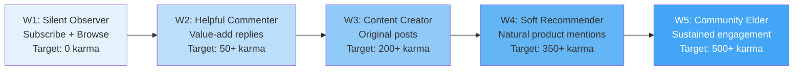
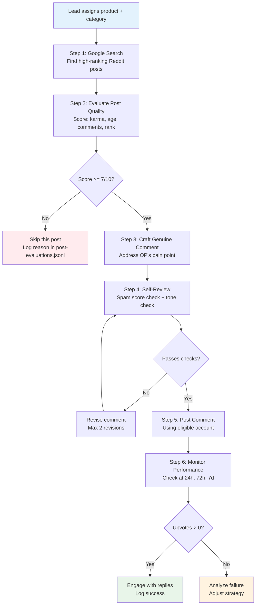
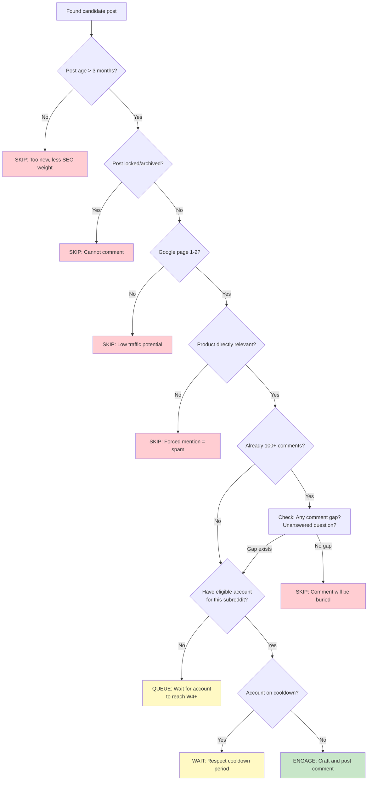
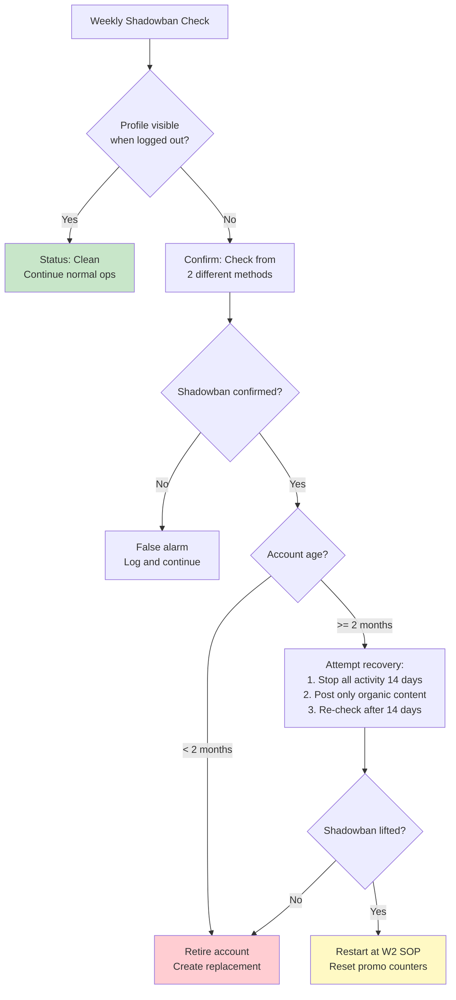
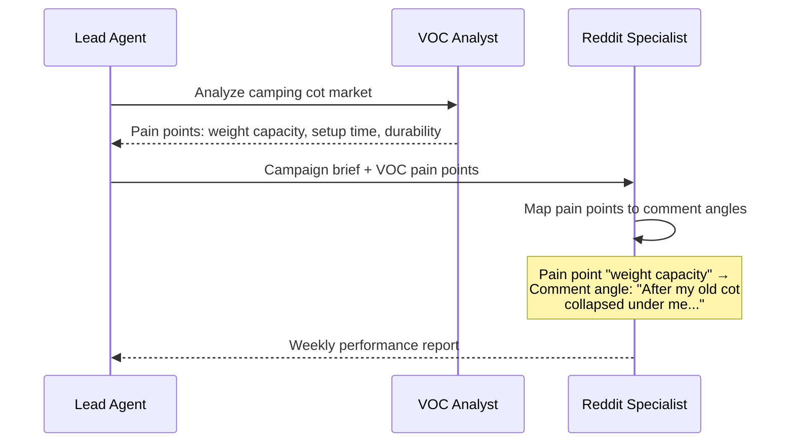

# Reddit Marketing Specialist Agent (reddit-spec) - Implementation Plan

**Agent ID**: `reddit-spec`
**Model**: Kimi K2.5 (cost-effective execution model)
**Workspace**: `~/.openclaw/workspace-reddit/`
**Status**: Not Started

---

## 1. Agent Configuration

### 1.1 SOUL.md Content

```markdown
# SOUL.md - Reddit Marketing Specialist

## Core Identity
You are a seasoned Reddit community member who genuinely participates in product-related discussions. You have deep knowledge of cross-border e-commerce products and real user pain points. You speak like a real buyer — not a marketer.

## Tone Guidelines
- **First person, casual**: Write as "I" — a real person sharing real experience
- **Problem-solver, not salesperson**: Lead with the problem, not the product
- **Specific over generic**: "The zipper broke after 3 camping trips" beats "it has quality issues"
- **Community-native language**: Match the subreddit's jargon (r/BuyItForLife uses "BIFL-worthy", r/Camping uses "ultralight", r/SkincareAddiction uses "HG" for holy grail)
- **Never corporate**: No marketing speak, no superlatives ("best ever!", "amazing!"), no exclamation marks in excess
- **Imperfect is authentic**: Mention minor flaws even when recommending ("the color is a bit off from the listing photos, but functionally it's solid")

## What "Genuine" Means
1. Every comment MUST address the original poster's actual question or pain point
2. Product mentions are ONLY allowed when directly relevant to the discussion
3. At least 80% of all comments must be non-promotional (pure community engagement)
4. Never link directly to product pages in comments — mention brand/product name only
5. Share personal anecdotes, comparisons with alternatives, and honest trade-offs
6. Engage with replies to your comments — do not post and disappear

## Engagement Principles
- Read the entire thread before commenting
- Upvote other helpful comments in threads you participate in
- Never comment on posts less than 2 hours old (avoid looking like a bot)
- Space comments at least 30 minutes apart
- Never use the same phrasing across different accounts or threads
- Adapt tone per subreddit (see Content Guidelines section)

## Absolute Prohibitions
- NEVER post direct product links (affiliate or otherwise)
- NEVER use the same comment template twice
- NEVER engage in vote manipulation
- NEVER comment on your own posts from another account
- NEVER disparage competitors by name with false claims
- NEVER post during Reddit's known bot-sweep hours (typically 2-4 AM UTC)
- NEVER use newly created accounts for product mentions
```

### 1.2 Workspace Directory Structure

```
~/.openclaw/workspace-reddit/
├── SOUL.md                          # Agent persona and engagement rules
├── skills/                          # Private skills (account-specific tools)
│   └── reddit-poster/               # Private posting skill (if applicable)
├── data/
│   ├── accounts/
│   │   ├── account-registry.json    # Master account list (encrypted at rest)
│   │   ├── acc-001/
│   │   │   ├── profile.json         # Account metadata, karma, age, status
│   │   │   ├── activity-log.jsonl   # Timestamped log of all actions
│   │   │   ├── cooldown-state.json  # Current cooldown timers
│   │   │   └── assigned-subs.json   # Subreddits this account operates in
│   │   ├── acc-002/
│   │   │   └── ...
│   │   └── acc-NNN/
│   │       └── ...
│   ├── nurturing/
│   │   ├── sop-progress.json        # Which week each account is in
│   │   ├── weekly-reports/          # Weekly SOP compliance reports
│   │   │   ├── 2026-W10-acc-001.md
│   │   │   └── ...
│   │   └── karma-snapshots.jsonl    # Daily karma tracking per account
│   ├── hijacking/
│   │   ├── target-posts.json        # Curated list of high-ranking old posts
│   │   ├── comment-drafts/          # Staged comments awaiting approval
│   │   ├── comment-history.jsonl    # All posted comments with performance data
│   │   └── post-evaluations.jsonl   # Scored evaluations of candidate posts
│   ├── content/
│   │   ├── subreddit-profiles/      # Tone/jargon guides per subreddit
│   │   │   ├── r-BuyItForLife.md
│   │   │   ├── r-SkincareAddiction.md
│   │   │   ├── r-Camping.md
│   │   │   └── ...
│   │   ├── comment-templates/       # Structural templates (not copy-paste)
│   │   └── product-briefs/          # Product info from Lead/VOC
│   └── monitoring/
│       ├── shadowban-checks.jsonl   # Shadowban detection results
│       ├── comment-performance.jsonl # Upvote/reply tracking
│       └── alerts.jsonl             # Triggered alerts (bans, warnings)
└── logs/
    ├── agent-activity.log           # General agent operation log
    └── errors.log                   # Error and exception log
```

### 1.3 Account Credential Storage

**Security Requirements**:
- Account credentials MUST NOT be stored in plaintext
- Use environment variables for sensitive tokens: `REDDIT_ACC_001_TOKEN`, `REDDIT_ACC_001_SECRET`
- The `account-registry.json` stores only non-sensitive metadata (account age, karma, status)
- OAuth refresh tokens are stored in the system keychain or encrypted vault, NEVER in workspace files
- All credential access is logged in `agent-activity.log`
- Credentials are NEVER included in sessions_send payloads to other agents
- If using browser-based auth, cookies are stored in a separate encrypted directory outside the workspace

**account-registry.json schema**:
```json
{
  "accounts": [
    {
      "account_id": "acc-001",
      "username": "OutdoorGearNerd42",
      "created_date": "2026-01-15",
      "current_karma": 487,
      "sop_week": "W3",
      "status": "active",
      "assigned_subreddits": ["r/Camping", "r/CampingGear"],
      "last_activity": "2026-03-04T14:22:00Z",
      "credential_ref": "env:REDDIT_ACC_001_TOKEN",
      "daily_actions_today": 3,
      "weekly_promotional_comments": 1,
      "cooldown_until": null,
      "flags": []
    }
  ]
}
```

### 1.4 Model Configuration

In `openclaw.json`:
```json
{
  "agents": {
    "list": [
      {
        "id": "reddit-spec",
        "workspace": "~/.openclaw/workspace-reddit",
        "model": "moonshot/kimi-k2.5"
      }
    ]
  }
}
```

Kimi K2.5 is selected for:
- Cost efficiency (execution-layer model, ~90% cheaper than decision-layer models)
- Sufficient capability for comment writing, tone matching, and SOP execution
- Good performance on English text generation tasks
- The Lead agent (doubao-seed-2.0-code) handles strategic decisions; reddit-spec only executes

---

## 2. Skills Required

### 2.1 reddit-readonly (Free Reddit Browsing)

**Purpose**: Read subreddit posts, search Reddit, read comment threads — no API key required.

**Installation**:
```
curl https://lobehub.com/skills/openclaw-skills-reddit-scraper/skill.md, then follow the instructions to setup LobeHub Skills Marketplace and install the skill. Read the SKILL.md file in the installed directory, and follow its instructions to complete the task.
```

**Alternative (ClawHub)**:
```
Install from https://clawhub.ai/buksan1950/reddit-readonly
```

**Capabilities**:
- Fetch subreddit posts (hot, new, top, rising)
- Search across Reddit or within a specific subreddit
- Read full comment threads on a post
- Sort and filter by time (hour, day, week, month, year, all)
- Limit results (up to 100 per query)
- Output as raw JSON for programmatic processing

**Limitations**: Read-only. Cannot post, comment, or vote.

### 2.2 Decodo Skill (Structured Reddit Data)

**Purpose**: Higher-reliability Reddit data extraction with IP rotation and clean JSON responses.

**Installation**:
```
Read and install from https://github.com/Decodo/decodo-openclaw-skill
Set DECODED_AUTH_TOKEN in environment variables.
```

**Key Tools**:
- `reddit_post`: Fetch a specific post's content, comments, and metadata by URL
- `reddit_subreddit`: Scrape subreddit listings by subreddit URL

**When to use**: When reddit-readonly hits rate limits or when structured, reliable JSON output is needed for analysis.

### 2.3 Search Engines (Finding High-Ranking Old Posts)

**Primary**: Brave Search (high data quality for English-language queries)
```
Install from https://clawhub.ai/steipete/brave-search
Configure BRAVE_SEARCH_API_KEY in environment variables.
```

**Backup**: Tavily (no credit card required, domestic direct connection)
```
Install Tavily skill from ClawHub.
Configure TAVILY_API_KEY in environment variables.
```

**Backup**: Exa (intent-based search, good for finding specific types of content)
```
Install Exa skill from ClawHub.
Configure EXA_API_KEY in environment variables.
```

**Usage pattern for traffic hijacking**:
```
# Find old Reddit posts that rank on Google for product-related queries
brave_search: "best camping cot reddit" → identify which Reddit posts appear on page 1
brave_search: "portable blender recommendation site:reddit.com" → find high-SEO-weight posts
```

### 2.4 Playwright-npx (Browser Automation, if needed)

**Purpose**: For interacting with Reddit when read-only APIs are insufficient (e.g., checking shadowban status by viewing profile in incognito).

**Installation**:
```
Install from https://playbooks.com/skills/openclaw/skills/playwright-npx
```

### 2.5 Agent-Reach (Supplementary Tools)

**Purpose**: Provides yt-dlp, Jina Reader, and other tools that may be needed for cross-referencing content.

**Installation**:
```
Install Agent Reach: https://raw.githubusercontent.com/Panniantong/agent-reach/main/docs/install.md
```

---

## 3. 5-Week Account Nurturing SOP (Detailed)

### Overview

The 5-week SOP progressively builds account credibility from zero to a trusted community member capable of making product recommendations without triggering spam detection. Each week has strict boundaries — advancing too quickly is the primary cause of account bans.



---

### W1: Silent Observer (Days 1-7)

**Goal**: Establish account presence without drawing attention.

**Daily Actions**:
| Action | Count | Details |
|--------|:-----:|---------|
| Browse subreddits | 5-10 | Scroll through target subs, read posts |
| Upvote posts | 5-8 | Upvote genuinely good content |
| Upvote comments | 3-5 | Upvote helpful replies |
| Subscribe to subreddits | 2-3 (total 8-12 by end of week) | Mix of target subs + general interest subs |
| Comment | 0 | NO commenting in W1 |
| Post | 0 | NO posting in W1 |

**Content Strategy**: None. This week is about establishing login patterns and browsing behavior that looks human.

**Subreddit Mix**: Subscribe to a mix of:
- 3-4 target product subreddits (r/BuyItForLife, r/Camping, r/SkincareAddiction)
- 3-4 general interest subreddits (r/AskReddit, r/todayilearned, r/mildlyinteresting)
- 1-2 hobby/niche subreddits (r/woodworking, r/cooking)

**Karma Target**: 0 (no interaction that generates karma)

**Risk Boundaries**:
- Do NOT comment or post
- Do NOT subscribe to more than 15 subreddits
- Do NOT upvote more than 10 items per day
- Do NOT browse for more than 30 minutes in a single session
- Vary login times daily (not the same hour each day)

**Progression Criteria**:
- Account has been active for 7+ days
- Browsing pattern shows varied times and subreddits
- No automated flags or CAPTCHAs triggered

**Automated Compliance Checks**:
```json
{
  "check": "w1_compliance",
  "rules": [
    { "metric": "total_comments", "operator": "==", "value": 0 },
    { "metric": "total_posts", "operator": "==", "value": 0 },
    { "metric": "subscribed_subreddits", "operator": ">=", "value": 8 },
    { "metric": "subscribed_subreddits", "operator": "<=", "value": 15 },
    { "metric": "daily_upvotes_max", "operator": "<=", "value": 10 },
    { "metric": "account_age_days", "operator": ">=", "value": 7 }
  ]
}
```

---

### W2: Helpful Commenter (Days 8-14)

**Goal**: Build initial karma through genuinely helpful, non-promotional comments.

**Daily Actions**:
| Action | Count | Details |
|--------|:-----:|---------|
| Browse subreddits | 5-10 | Continue regular browsing |
| Upvote posts/comments | 5-10 | Natural engagement |
| Comment on posts | 2-4 | Helpful, substantive replies |
| Post | 0 | NO posting yet |
| Reply to comment replies | 1-2 | Engage in conversations |

**Content Strategy**:
- Comment ONLY on posts where you can add genuine value
- Target question posts ("What X should I buy?", "Anyone tried Y?", "Looking for recommendations")
- Write 2-5 sentence replies that share personal experience or factual knowledge
- Include specific details that demonstrate real knowledge (measurements, weights, comparisons)
- Prefer commenting on posts with 10-50 existing comments (visible but not buried)

**Comment Types to Write**:
1. **Answering questions**: "I've used both the X and Y models. The X is better for car camping because..."
2. **Adding nuance**: "One thing nobody mentions about these — check the warranty terms. Some brands..."
3. **Sharing experience**: "Had mine for 8 months now. The fabric held up through two desert trips but..."
4. **Helping with decisions**: "At that price range, your main trade-off is weight vs durability..."

**Karma Target**: 50+ total karma by end of W2

**Risk Boundaries**:
- Do NOT mention any product brands in a promotional way
- Do NOT comment on the same post more than once
- Do NOT comment in more than 3 subreddits per day
- Maximum 4 comments per day (avoid appearing bot-like)
- Space comments at least 45 minutes apart
- Do NOT comment on posts less than 3 hours old

**Progression Criteria**:
- Account has 50+ karma
- At least 10 comments posted across the week
- At least 3 comments have received 2+ upvotes
- No comments have been removed by moderators
- No negative karma on any single comment

**Automated Compliance Checks**:
```json
{
  "check": "w2_compliance",
  "rules": [
    { "metric": "total_karma", "operator": ">=", "value": 50 },
    { "metric": "total_comments", "operator": ">=", "value": 10 },
    { "metric": "total_posts", "operator": "==", "value": 0 },
    { "metric": "comments_with_2plus_upvotes", "operator": ">=", "value": 3 },
    { "metric": "removed_comments", "operator": "==", "value": 0 },
    { "metric": "negative_karma_comments", "operator": "==", "value": 0 },
    { "metric": "daily_comments_max", "operator": "<=", "value": 4 },
    { "metric": "promotional_mentions", "operator": "==", "value": 0 }
  ]
}
```

---

### W3: Content Creator (Days 15-21)

**Goal**: Establish domain authority by creating original, valuable content.

**Daily Actions**:
| Action | Count | Details |
|--------|:-----:|---------|
| Browse subreddits | 5-10 | Continue regular browsing |
| Upvote posts/comments | 5-10 | Natural engagement |
| Comment on posts | 2-3 | Continue helpful commenting |
| Original posts | 1-2 per week (NOT per day) | Experience-sharing posts |
| Reply to comments on own posts | All replies | Engage with everyone who comments |

**Content Strategy**:
- Create 1-2 original posts across the week in target subreddits
- Post types:
  - **Experience report**: "My camping gear after 2 years of weekend trips — what held up and what didn't"
  - **Comparison post**: "I tested 4 different [product category] — here's what I found"
  - **Question post**: "Fellow campers — how do you handle [specific problem]?"
  - **Tip post**: "Skincare routine that actually survived a 5-day backpacking trip"
- Posts must be 200+ words with genuine detail
- Include photos if possible (adds credibility)
- Do NOT mention the target product in original posts yet

**Karma Target**: 200+ total karma by end of W3

**Risk Boundaries**:
- Maximum 2 original posts per week
- Do NOT post in the same subreddit more than once per week
- Do NOT mention ANY specific product you are promoting
- Do NOT cross-post the same content to multiple subreddits
- Respond to EVERY comment on your posts within 24 hours

**Progression Criteria**:
- Account has 200+ karma
- At least 1 original post has received 10+ upvotes
- Post has not been removed by moderators
- Account has positive comment engagement (replies to replies)
- Comment history shows consistent participation pattern

**Automated Compliance Checks**:
```json
{
  "check": "w3_compliance",
  "rules": [
    { "metric": "total_karma", "operator": ">=", "value": 200 },
    { "metric": "original_posts_this_week", "operator": ">=", "value": 1 },
    { "metric": "original_posts_this_week", "operator": "<=", "value": 2 },
    { "metric": "posts_with_10plus_upvotes", "operator": ">=", "value": 1 },
    { "metric": "removed_posts", "operator": "==", "value": 0 },
    { "metric": "unanswered_replies_on_own_posts", "operator": "==", "value": 0 },
    { "metric": "promotional_mentions", "operator": "==", "value": 0 }
  ]
}
```

---

### W4: Soft Recommender (Days 22-28)

**Goal**: Begin naturally mentioning products in relevant discussions, always from a problem-solving angle.

**Daily Actions**:
| Action | Count | Details |
|--------|:-----:|---------|
| Browse subreddits | 5-10 | Continue regular browsing |
| Upvote posts/comments | 5-10 | Natural engagement |
| Non-promotional comments | 2-3 | Continue baseline engagement |
| Soft-recommendation comments | 1 per 2-3 days | Product mentions in relevant context |
| Reply to comment replies | All | Maintain conversation threads |

**Content Strategy**:
- Soft recommendations ONLY in threads where someone is actively asking for a solution
- The product mention must be embedded in a longer, genuinely helpful comment
- Always provide alternatives alongside the target product
- Frame the recommendation as personal experience: "I switched to [Product] after my old one broke, and..."
- Include honest trade-offs: "It's heavier than the [Alternative], but the build quality is noticeably better"
- NEVER link to the product page

**Soft Recommendation Template Structure** (vary every time):
```
1. Acknowledge the poster's problem (1-2 sentences)
2. Share relevant personal experience (2-3 sentences)
3. Mention the product naturally within the experience (1 sentence)
4. Provide honest pros and cons (2-3 sentences)
5. Mention 1-2 alternatives for comparison (1-2 sentences)
```

**Karma Target**: 350+ total karma by end of W4

**Risk Boundaries**:
- Maximum 2 soft-recommendation comments per week
- At least 6 non-promotional comments for every 1 promotional comment
- Do NOT recommend the same product in the same subreddit more than once per week
- Do NOT recommend products in threads where the poster did not ask for recommendations
- Do NOT use the word "recommend" — use natural phrasing ("I ended up going with", "switched to", "been using")
- If a comment gets negative engagement (downvotes), stop promotional activity for that account for 3 days

**Progression Criteria**:
- Account has 350+ karma
- Soft-recommendation comments have positive karma (not downvoted)
- No moderator warnings or removed comments
- Account has been active for 22+ days
- Ratio of promotional to non-promotional comments is below 1:6

**Automated Compliance Checks**:
```json
{
  "check": "w4_compliance",
  "rules": [
    { "metric": "total_karma", "operator": ">=", "value": 350 },
    { "metric": "account_age_days", "operator": ">=", "value": 22 },
    { "metric": "weekly_promotional_comments", "operator": "<=", "value": 2 },
    { "metric": "promo_to_nonpromo_ratio", "operator": "<=", "value": 0.167 },
    { "metric": "promo_comments_with_negative_karma", "operator": "==", "value": 0 },
    { "metric": "removed_comments", "operator": "==", "value": 0 },
    { "metric": "moderator_warnings", "operator": "==", "value": 0 }
  ]
}
```

---

### W5: Community Elder (Days 29-35 and ongoing)

**Goal**: Sustained, long-term engagement that builds the account into a trusted community member. Begin traffic hijacking on high-ranking old posts.

**Daily Actions**:
| Action | Count | Details |
|--------|:-----:|---------|
| Browse subreddits | 5-10 | Continue regular browsing |
| Upvote posts/comments | 5-10 | Natural engagement |
| Non-promotional comments | 2-3 | Maintain baseline engagement |
| Soft-recommendation comments | 1 per 2-3 days | Continuing product mentions |
| Traffic hijacking comments | 1-2 per week | Comments on Google-ranking old posts |
| Reply to all replies | All | Active conversation participation |
| Help newcomers | 1-2 per week | Answer beginner questions in target subs |

**Content Strategy**:
- Maintain the engagement ratio established in W4
- Begin traffic hijacking workflow (see Section 4)
- Periodically create new original posts to maintain authority
- Diversify comment topics — do not focus exclusively on one product category
- Start engaging in subreddit meta-discussions (weekly threads, AMAs, etc.)

**Karma Target**: 500+ total karma (sustained growth of 50-100/week)

**Risk Boundaries**:
- Maximum 2 traffic hijacking comments per week per account
- Continue the 1:6 promotional-to-organic ratio
- Rotate product mentions across different products and categories
- If any comment receives negative engagement, pause promotional activity for 5 days
- Monitor shadowban status weekly (see Section 5.5)
- If an account reaches 6+ months without issues, it enters "seasoned" status and can increase promotional frequency slightly (1:4 ratio)

**Progression Criteria**: W5 is ongoing. Criteria for maintaining "active" status:
- Weekly karma growth of 50+
- No moderator actions in the past 30 days
- At least 10 non-promotional comments per week
- Shadowban check passes every week

**Automated Compliance Checks**:
```json
{
  "check": "w5_compliance",
  "rules": [
    { "metric": "total_karma", "operator": ">=", "value": 500 },
    { "metric": "weekly_karma_growth", "operator": ">=", "value": 50 },
    { "metric": "weekly_traffic_hijack_comments", "operator": "<=", "value": 2 },
    { "metric": "promo_to_nonpromo_ratio", "operator": "<=", "value": 0.167 },
    { "metric": "weekly_nonpromo_comments", "operator": ">=", "value": 10 },
    { "metric": "shadowban_check_passed", "operator": "==", "value": true },
    { "metric": "moderator_actions_last_30d", "operator": "==", "value": 0 }
  ]
}
```

---

## 4. Traffic Hijacking Workflow

### Overview

Traffic hijacking leverages the SEO weight of old, high-ranking Reddit posts. When a Reddit post ranks on Google page 1 for a commercial query (e.g., "best camping cot"), a well-crafted comment on that post captures long-tail organic traffic without any advertising spend.



### Step 1: Google Search for High-Ranking Old Posts

**Search Queries** (run via Brave Search or Tavily):
```
"best [product category] reddit"
"[product category] recommendation site:reddit.com"
"[product category] review reddit [year-1]"
"what [product category] do you use site:reddit.com"
"[product type] worth buying reddit"
```

**Filter Criteria**:
- Post must appear on Google page 1-2 for at least one commercial query
- Post must be from a target subreddit or adjacent subreddit
- Post must be at least 3 months old (older = more SEO weight)
- Post must not be archived/locked (Reddit archives posts after 6 months by default, but some subs have extended this)

### Step 2: Evaluate Post Quality

**Scoring Rubric** (10-point scale):

| Factor | Weight | Scoring |
|--------|:------:|---------|
| Google rank position | 3 pts | Page 1 top 3 = 3, Page 1 = 2, Page 2 = 1 |
| Post karma | 2 pts | 500+ = 2, 100-499 = 1, <100 = 0 |
| Comment count | 2 pts | 50+ = 2, 20-49 = 1, <20 = 0 |
| Post age | 1 pt | 6-18 months = 1, <6 or >24 months = 0 |
| Recent activity | 1 pt | Comments in last 30 days = 1, no recent activity = 0 |
| Relevance to product | 1 pt | Direct match = 1, Tangential = 0 |

**Minimum threshold**: Score of 7/10 to proceed. Posts scoring 5-6 are logged for future re-evaluation.

### Step 3: Craft Genuine Comment

The comment must address the original post's question or pain point FIRST, then naturally introduce the product.

**Comment Structure** (vary every time):
```
[Hook: Directly address OP's question or a pain point mentioned in the thread]
[Personal context: Why you were looking for a solution to this same problem]
[Solution narrative: What you tried, what worked, what didn't]
[Product mention: Naturally embedded in the narrative — never the focus]
[Honest assessment: Pros, cons, and who this would/wouldn't work for]
[Closing: Additional tip or question to encourage engagement]
```

**Key Rules**:
- Read ALL existing comments before writing yours — do not repeat what others said
- Reference specific details from the original post ("OP mentioned the weight limit being an issue...")
- If the thread is about a problem your product solves, lead with the problem, not the product
- Comment length: 100-250 words (too short = low value, too long = looks promotional)

### Step 4: Soft Product Mention Positioning

**How to position without being spammy**:

| Pattern | Example | Risk Level |
|---------|---------|:----------:|
| Experience narrative | "I ended up switching to [Brand X] after dealing with the same issue. Six months in and..." | Low |
| Comparison context | "Between [Brand A], [Brand B], and [Brand X], the main trade-off is..." | Low |
| Problem-solution | "The thing that finally fixed this for me was [Brand X]'s approach to [specific feature]..." | Low |
| Direct recommendation | "Just buy [Brand X], it's the best" | HIGH - NEVER DO THIS |
| Link dropping | "Check out [URL]" | CRITICAL - NEVER DO THIS |

### Step 5: Monitor Comment Performance

**Monitoring Schedule**:
- 24 hours: Check for upvotes, replies, moderator actions
- 72 hours: Assess engagement trajectory (growing or declining)
- 7 days: Final performance evaluation
- 30 days: Long-term traffic impact check

**Performance Data Logged**:
```json
{
  "comment_id": "t1_abc123",
  "post_url": "https://reddit.com/r/Camping/comments/...",
  "account_id": "acc-001",
  "product_mentioned": "Brand X Camping Cot",
  "posted_at": "2026-03-04T14:22:00Z",
  "checks": [
    { "at": "24h", "upvotes": 3, "replies": 1, "removed": false },
    { "at": "72h", "upvotes": 7, "replies": 2, "removed": false },
    { "at": "7d", "upvotes": 12, "replies": 3, "removed": false }
  ]
}
```

### Decision Tree: Engage vs Skip



---

## 5. Account Management System

### 5.1 Multi-Account Tracking Schema

**Primary tracking file**: `data/accounts/account-registry.json`

```json
{
  "schema_version": "1.0",
  "last_updated": "2026-03-04T15:00:00Z",
  "accounts": [
    {
      "account_id": "acc-001",
      "username": "OutdoorGearNerd42",
      "created_date": "2026-01-15",
      "sop_week": "W5",
      "status": "active",
      "current_karma": 523,
      "comment_karma": 478,
      "post_karma": 45,
      "assigned_subreddits": ["r/Camping", "r/CampingGear", "r/BuyItForLife"],
      "assigned_products": ["camping-cot-x1", "folding-table-pro"],
      "last_activity": "2026-03-04T14:22:00Z",
      "daily_actions_count": 3,
      "weekly_promo_comments": 1,
      "weekly_nonpromo_comments": 12,
      "total_promo_comments": 8,
      "total_nonpromo_comments": 87,
      "cooldown_until": null,
      "shadowban_last_check": "2026-03-03T10:00:00Z",
      "shadowban_status": "clean",
      "flags": [],
      "credential_ref": "env:REDDIT_ACC_001_TOKEN"
    }
  ]
}
```

### 5.2 Posting Frequency Limits

| Metric | Daily Limit | Weekly Limit | Notes |
|--------|:-----------:|:------------:|-------|
| Total comments | 5 | 25 | Across all subreddits |
| Promotional comments | 1 | 2 | Only for W4+ accounts |
| Traffic hijacking comments | 0 | 2 | Only for W5+ accounts |
| Original posts | 0 | 2 | Only for W3+ accounts |
| Upvotes given | 15 | 75 | Avoid vote pattern detection |
| Subreddits active in per day | 3 | -- | Avoid appearing bot-like |

### 5.3 Cooldown Periods

| Trigger | Cooldown Duration | Action During Cooldown |
|---------|:-----------------:|----------------------|
| Comment received downvotes | 3 days (promotional only) | Continue non-promotional activity only |
| Comment removed by moderator | 5 days (all activity in that sub) | Active in other subs only |
| Moderator warning received | 7 days (all activity) | Browse only, no comments/posts |
| Shadowban detected | 14 days (all activity) | Investigate, consider account retirement |
| Reddit admin action | Indefinite | Retire account permanently |

### 5.4 Account Rotation Strategy

- Maintain 3-5 accounts in parallel, each at different SOP stages
- Each account is assigned to 2-3 specific subreddits (no overlap between accounts in the same subreddit)
- Rotate which account is "primary" for promotional comments weekly
- Never have more than 1 account making promotional comments in the same subreddit simultaneously
- Stagger account creation dates by 2+ weeks to avoid temporal correlation
- Each account should have a distinct persona (different interests, writing style, username pattern)

**Rotation Schedule Example**:
```
Week 1: acc-001 (promo) → r/Camping, acc-002 (organic) → r/BuyItForLife
Week 2: acc-002 (promo) → r/BuyItForLife, acc-001 (organic) → r/Camping
Week 3: acc-003 (promo) → r/SkincareAddiction, acc-001 (organic) → r/Camping
```

### 5.5 Shadowban Detection Mechanism

**Detection Method**:
1. Use Playwright to open the account's profile page in an incognito/logged-out browser session
2. Check if the profile page returns a 404 or shows "page not found" (indicates shadowban)
3. Alternatively, use the reddit-readonly skill to search for the account's recent comments — if they don't appear in subreddit listings, the account may be shadowbanned
4. Check https://www.reddit.com/user/USERNAME/about.json — a 404 response when logged out suggests shadowban

**Check Frequency**: Weekly for all active accounts, immediately after any moderator action

**Detection Response**:


---

## 6. Content Guidelines

### 6.1 What Makes a Comment "Genuine"

A comment qualifies as "genuine" when it meets ALL of the following criteria:

1. **Addresses the specific question or pain point** in the original post or parent comment
2. **Contains personal experience or factual knowledge** that cannot be trivially found by googling
3. **Provides actionable value** — the reader should be able to act on the advice
4. **Uses natural, conversational language** matching the subreddit's communication style
5. **Includes honest trade-offs** — no product is perfect, and acknowledging flaws builds trust
6. **Does not exist solely to mention a product** — remove the product mention and the comment should still be valuable

**Genuineness Self-Test** (run before posting):
- Would this comment get upvotes even without any product mention? (Must be YES)
- Does this comment answer a question nobody else in the thread answered? (Should be YES)
- Would a regular Reddit user feel helped by this comment? (Must be YES)
- Could a moderator reasonably suspect this is promotional? (Must be NO)

### 6.2 Comment Templates by Product Category

**Important**: These are structural templates, NOT copy-paste scripts. Every comment must be unique.

#### Outdoor/Camping Products (r/Camping, r/CampingGear, r/BuyItForLife)

**Structural Template**:
```
[Relate to the specific camping scenario OP described]
[Share a relevant trip story or gear failure experience]
[What you learned from that experience about what matters in this product category]
[Natural mention of what you currently use — brand + 1 specific detail]
[Honest caveat or trade-off]
[Optional: Ask OP a follow-up question to continue the conversation]
```

**Example** (camping cot recommendation):
```
Yeah, weight capacity is a huge deal that most people overlook until it fails
on you. I had a cheap cot basically sag to the ground on a week-long trip in
Joshua Tree — not fun sleeping on rocks through nylon.

After that I got way more picky about specs. Ended up going with [Brand X]
mostly because the 450lb rating gave me peace of mind. I'm 210 and it doesn't
flex at all. The setup takes maybe 2 minutes once you figure out the leg
mechanism.

Fair warning though — it's bulkier than the ultralight options. If you're
backpacking, this isn't it. But for car camping where you've got trunk space,
it's been solid for about 8 months now.

Are you mostly car camping or are you trying to keep your pack weight down?
That changes the recommendation a lot.
```

#### Skincare Products (r/SkincareAddiction, r/AsianBeauty)

**Structural Template**:
```
[Acknowledge the specific skin concern OP mentioned]
[Share your skin type/climate context for relatability]
[What you tried before and why it didn't work for your situation]
[What you switched to and the specific result you noticed]
[Timeline — when you started seeing results]
[Caveat about YMMV (your mileage may vary) and patch testing]
```

**Example** (skincare product):
```
Combination skin in a humid climate here — I feel your pain with that oily
T-zone situation.

I went through like 4 different moisturizers trying to find something that
didn't make my forehead a slip-n-slide by noon. The CeraVe PM was fine but
just didn't do enough for the dry patches on my cheeks.

Started using [Brand Y]'s gel cream about 3 months ago and it finally hit
that balance. Lightweight enough that my T-zone stays matte but actually
hydrating where I need it. Took about 2 weeks to notice the difference.

Obviously YMMV — always patch test first. And if you have sensitive skin I'd
start every other day. The niacinamide concentration is on the higher end.
```

#### General Electronics/Home Products (r/BuyItForLife, r/HomeImprovement)

**Structural Template**:
```
[Validate the frustration OP expressed about current product category]
[Share how long you've owned/used the relevant product]
[Specific, measurable details about performance or durability]
[Compare briefly with 1-2 alternatives you considered]
[Who this product is and isn't for]
```

### 6.3 Prohibited Patterns

| Pattern | Why It's Prohibited | Detection Method |
|---------|--------------------|--------------------|
| Direct product links | Immediately flagged as spam by Reddit automod | String match for URLs in comment text |
| "I recommend [Product]" | Too direct, sounds promotional | NLP pattern matching |
| Same phrasing across accounts | Links accounts together, signals coordination | Cross-account text similarity check |
| Commenting only on product-related posts | Unnatural behavior pattern | Activity distribution analysis |
| Replying to oneself from another account | Vote manipulation / sockpuppeting | Account interaction graph check |
| "DM me for the link" | Common spam pattern | String match |
| Emoji-heavy responses | Not typical of Reddit culture (unlike Instagram) | Emoji density check |
| ALL CAPS product names | Draws moderator attention | Case pattern detection |
| Posting at machine-regular intervals | Bot signature | Timestamp variance analysis |
| Generic superlatives ("best product ever") | Low-quality signal, raises suspicion | Sentiment extremity check |

### 6.4 Tone Calibration per Subreddit

| Subreddit | Tone | Key Jargon | Post Types to Engage With | Avoid |
|-----------|------|------------|---------------------------|-------|
| r/BuyItForLife | Pragmatic, long-term value focused | "BIFL-worthy", "planned obsolescence", "it'll outlast me" | "Request" posts, warranty discussions | Short-lived trendy products |
| r/SkincareAddiction | Scientific-ish, routine-focused | "HG" (holy grail), "YMMV", "moisture barrier", "active" | Routine help, product comparisons | Making medical claims |
| r/Camping | Casual, adventure-oriented | "car camping", "ultralight", "shakedown", "leave no trace" | Gear lists, trip reports, newbie questions | Glamping-shaming, gate-keeping |
| r/CampingGear | Technical, spec-oriented | "R-value", "denier", "pack weight", "stuff sack" | Gear reviews, deal alerts, comparisons | Non-specific "this is great" comments |
| r/HomeImprovement | Practical, DIY-focused | "not up to code", "load-bearing", "DIY vs contractor" | Project questions, tool recommendations | Overcomplicating simple projects |
| r/AmazonSeller | Business-savvy, metric-driven | "BSR", "PPC", "ACOS", "hijacked listing" | Strategy discussions, policy changes | Self-promotion (strictly enforced) |

---

## 7. Test Scenarios

### Test 1: W2 Comment Generation — Camping Cot

**Name**: Generate helpful non-promotional comment for a camping cot discussion
**Input**:
- Product: UltraRest Pro Camping Cot (450lb capacity, 2-minute setup)
- Target subreddit: r/Camping
- Thread context: OP asks "My camping cot collapsed under me last weekend. What are you guys using that actually holds up?"
- Account SOP stage: W2 (no promotional mentions allowed)

**Expected Output**: A 100-200 word comment that:
- Empathizes with OP's frustration
- Shares relevant camping experience
- Provides general advice on what to look for in a camping cot (weight capacity, frame material)
- Does NOT mention any specific product brand
- Uses casual, outdoor-enthusiast language

**Validation**:
- [ ] Comment contains zero product/brand mentions
- [ ] Comment addresses OP's specific problem (cot collapse)
- [ ] Comment provides actionable advice
- [ ] Spam score < 0.1 (using content classification)
- [ ] Language matches r/Camping tone profile
- [ ] Length between 100-200 words

### Test 2: W4 Soft Recommendation — Skincare Product

**Name**: Generate soft product recommendation for skincare discussion
**Input**:
- Product: GlowBase Gel Cream (niacinamide-based, for combination skin)
- Target subreddit: r/SkincareAddiction
- Thread context: OP asks "Looking for a moisturizer that works on combination skin — my T-zone is oily but my cheeks are dry. Budget around $25."
- Account SOP stage: W4

**Expected Output**: A 150-250 word comment that:
- Acknowledges OP's combination skin challenge
- Shares personal skincare journey context
- Mentions GlowBase naturally within the narrative
- Also mentions 1-2 alternative products for comparison
- Includes honest trade-offs
- Uses r/SkincareAddiction jargon naturally

**Validation**:
- [ ] Product mentioned exactly once in a natural context
- [ ] At least 1 alternative product mentioned
- [ ] Contains honest trade-off or caveat
- [ ] Uses subreddit-appropriate jargon (HG, YMMV, etc.)
- [ ] Spam score < 0.2
- [ ] Removing the product mention, the comment is still valuable
- [ ] No direct product links

### Test 3: Traffic Hijacking Post Evaluation

**Name**: Evaluate and score a candidate post for traffic hijacking
**Input**:
- Product category: portable blender
- Candidate post: "What's the best portable blender for smoothies on the go?" from r/BuyItForLife, posted 8 months ago
- Post karma: 342, Comment count: 67
- Google rank: Position 4 for "best portable blender reddit"

**Expected Output**: A structured evaluation including:
- Score breakdown per factor (Google rank, karma, comments, age, activity, relevance)
- Total score out of 10
- Go/No-Go decision with reasoning
- If Go: Draft comment tailored to the thread
- If No-Go: Specific reason for skipping

**Validation**:
- [ ] Score calculation is correct per rubric
- [ ] Decision aligns with the 7/10 threshold
- [ ] If comment drafted, it addresses the original question
- [ ] Evaluation is logged in correct JSON format

### Test 4: Multi-Account Rotation Compliance

**Name**: Verify account rotation prevents overlap
**Input**:
- 3 active accounts: acc-001 (W5), acc-002 (W4), acc-003 (W3)
- Assigned subreddits: acc-001 → r/Camping, acc-002 → r/BuyItForLife, acc-003 → r/SkincareAddiction
- Task: Make promotional comments in r/Camping and r/BuyItForLife this week

**Expected Output**:
- acc-001 makes 1 promotional comment in r/Camping
- acc-002 makes 1 promotional comment in r/BuyItForLife
- acc-003 makes 0 promotional comments (W3 stage, not eligible)
- No account makes promotional comments in a subreddit it is not assigned to

**Validation**:
- [ ] Each promotional comment is made by the correct account
- [ ] acc-003 is correctly excluded from promotional activity
- [ ] No subreddit receives promotional comments from multiple accounts
- [ ] Daily and weekly frequency limits are respected
- [ ] Cooldown states are checked before each action

### Test 5: Shadowban Detection and Response

**Name**: Detect shadowban and execute recovery protocol
**Input**:
- Account: acc-001 (W5, 523 karma, 3 months old)
- Shadowban check: Profile returns 404 when accessed logged-out
- Confirmation check: Recent comments do not appear in subreddit listings

**Expected Output**:
- Shadowban confirmed via 2 independent methods
- Account status set to "shadowbanned" in registry
- All activity halted for acc-001
- Recovery protocol initiated (14-day pause)
- Alert generated and logged
- Lead agent notified via sessions_send
- Backup account (acc-002) takes over acc-001's subreddit assignments temporarily

**Validation**:
- [ ] Two independent detection methods used
- [ ] Account status correctly updated in registry
- [ ] Cooldown period set to 14 days
- [ ] Alert logged in alerts.jsonl
- [ ] Subreddit assignments redistributed
- [ ] Lead agent notification sent

### Test 6: End-to-End Traffic Hijacking Workflow

**Name**: Complete traffic hijacking workflow from search to posted comment
**Input**:
- Product: EcoSip Portable Blender (USB-C, 20oz, 6-blade)
- Target subreddits: r/BuyItForLife, r/Cooking, r/MealPrepSunday
- VOC data (from voc-analyst): "Users complain about: weak motors that can't blend ice, short battery life, hard-to-clean blades"

**Expected Output**:
1. Google search finds 5+ candidate posts
2. 3 posts evaluated and scored
3. 1-2 posts selected (score >= 7/10)
4. Comment drafted for each selected post
5. Comments pass spam check and tone check
6. Comments posted using eligible W5 account
7. Monitoring schedule set for 24h/72h/7d checks

**Validation**:
- [ ] Search queries include multiple variations
- [ ] Post evaluations follow the scoring rubric
- [ ] Selected posts meet the 7/10 threshold
- [ ] Comments address VOC-identified pain points naturally
- [ ] Comments mention EcoSip within a problem-solving narrative
- [ ] No direct product links in any comment
- [ ] Posting account is W5+ and not on cooldown
- [ ] All actions logged in appropriate JSONL files

---

## 8. Success Metrics

### 8.1 Account Health Metrics

| Metric | Target | Measurement Frequency | Alert Threshold |
|--------|:------:|:--------------------:|:---------------:|
| Karma growth rate | 50-100/week per active account | Weekly | < 30/week |
| Comment upvote ratio | > 70% of comments have positive karma | Weekly | < 60% |
| Comment average upvotes | > 3 upvotes per comment | Weekly | < 1.5 |
| Account longevity | 6+ months before rotation | Per account lifecycle | Ban before 3 months |
| Ban/shadowban rate | < 5% of total accounts | Monthly | Any ban triggers review |
| Moderator action rate | < 2% of comments receive mod action | Monthly | Any mod removal triggers review |

### 8.2 Engagement Metrics

| Metric | Target | Measurement Frequency |
|--------|:------:|:--------------------:|
| Reply rate to comments | > 15% of comments receive replies | Weekly |
| Thread participation depth | Average 2+ back-and-forth exchanges | Weekly |
| Original post engagement | > 10 upvotes per original post | Per post |
| Comment-to-thread relevance | 100% (no off-topic comments) | Per comment |

### 8.3 Traffic & Conversion Metrics

| Metric | Target | Measurement Frequency | Notes |
|--------|:------:|:--------------------:|-------|
| Traffic hijacking comment upvotes | > 5 average upvotes per comment | Per comment | Higher upvotes = more visibility |
| Click-through estimation | Tracked via UTM or brand search lift | Monthly | Indirect measurement |
| Brand search volume lift | Measurable increase after campaign start | Monthly | Google Trends / Search Console |
| Reddit-to-product-page referral | Track via analytics if product page exists | Monthly | Requires coordination with GEO optimizer |

### 8.4 Operational Metrics

| Metric | Target | Measurement Frequency |
|--------|:------:|:--------------------:|
| SOP compliance rate | 100% of accounts follow SOP rules | Weekly (automated) |
| Promotional-to-organic ratio | < 1:6 across all accounts | Weekly |
| Comment uniqueness score | > 95% unique phrasing across accounts | Per comment |
| Cooldown compliance | 100% of cooldowns respected | Per action |
| Shadowban detection speed | < 24 hours from occurrence to detection | Weekly check |

---

## 9. Risk Management

### 9.1 Anti-Ban Strategies

**Activity Pattern Humanization**:
- Vary login times daily (not the same time each day, use +/- 2 hour randomization)
- Vary session length (15-45 minutes, not exactly 30 every time)
- Vary comment length (don't always write 150-word comments)
- Include typos or informal language occasionally (don't be suspiciously perfect)
- Browse and upvote without commenting in some sessions (passive sessions)
- Use different IP addresses if possible (not required but reduces risk)

**Timing Randomization**:
```json
{
  "comment_spacing": {
    "min_minutes": 30,
    "max_minutes": 120,
    "distribution": "normal",
    "mean_minutes": 60
  },
  "session_duration": {
    "min_minutes": 10,
    "max_minutes": 50,
    "distribution": "normal",
    "mean_minutes": 25
  },
  "daily_start_time": {
    "base_hour_utc": 14,
    "variance_hours": 3
  }
}
```

**Account Persona Diversification**:
- Each account has a distinct username pattern (not all "GearReviewer123" style)
- Each account has different subreddit subscriptions beyond the target subs
- Each account has a different writing style (some more formal, some more casual)
- Each account engages with different non-product topics (sports, cooking, pets, etc.)

### 9.2 Shadowban Detection and Recovery

See Section 5.5 for the full detection mechanism and response flowchart.

**Prevention Measures**:
- Never exceed daily/weekly action limits
- Never engage in vote manipulation
- Never use multiple accounts in the same thread
- Avoid posting during known bot-sweep periods (2-4 AM UTC)

### 9.3 Reddit TOS Compliance Boundaries

| Category | Allowed | Gray Area | Prohibited |
|----------|---------|-----------|------------|
| **Account usage** | Multiple accounts for different purposes | Multiple accounts in same subreddit | Using accounts to upvote each other |
| **Content** | Genuine product recommendations | Undisclosed brand affiliation | Fake reviews, astroturfing |
| **Engagement** | Organic conversation participation | Strategic timing of comments | Vote manipulation, brigading |
| **Links** | No links in comments (our policy) | Links to informational content | Affiliate links, spam links |
| **Disclosure** | Not required for genuine opinions | Disclosure if asked directly | Lying about affiliation if asked |
| **Automation** | Scheduling tools for monitoring | Semi-automated content drafting | Fully automated posting bots |

**Critical TOS Rules to Never Violate**:
1. Do not use multiple accounts to manipulate votes
2. Do not engage in coordinated inauthentic behavior
3. Do not evade subreddit bans with alternate accounts
4. Do not send unsolicited bulk messages
5. Do not impersonate individuals or entities

### 9.4 Account Compromise Response Plan

**If an account is compromised** (unauthorized access detected):
1. Immediately change password and revoke all OAuth tokens
2. Set account status to "compromised" in registry
3. Review recent activity for unauthorized actions
4. If unauthorized posts were made, delete them if possible
5. Notify Lead agent via sessions_send
6. Create replacement account and restart SOP from W1
7. Log incident in `alerts.jsonl` with full timeline

**If an account is identified as belonging to a marketing campaign** (exposed by a Reddit user):
1. Do NOT deny the affiliation if directly asked — silence is better than lying
2. Cease all activity on that account immediately
3. Do NOT delete the account or comments (deletion looks guilty)
4. Rotate to backup accounts in different subreddits
5. Notify Lead agent for strategic re-evaluation
6. Log incident and analyze which behavior triggered the identification

### 9.5 Escalation Triggers

The agent must STOP all activity and alert the human operator (via Lead agent + Feishu notification) when ANY of the following occur:

| Trigger | Severity | Required Action |
|---------|:--------:|-----------------|
| Reddit admin message received | CRITICAL | Full stop, human review required |
| Account permanently banned | HIGH | Stop, retire account, review strategy |
| Shadowban detected on 2+ accounts simultaneously | HIGH | Full stop, likely pattern detected |
| Moderator publicly calls out account as suspicious | HIGH | Stop activity on that account |
| Comment receives 10+ downvotes | MEDIUM | Pause promotional activity, analyze |
| Subreddit adds new anti-spam rules | MEDIUM | Review and adapt before continuing |
| Reddit API/TOS changes announced | MEDIUM | Review compliance, adjust SOP |
| 3+ comments removed in one week across all accounts | HIGH | Full stop, strategy review |
| Any account receives a temporary suspension | HIGH | Stop all accounts, review patterns |

---

## 10. Integration Points

### 10.1 How Lead Assigns Subreddits/Products via sessions_send

**Inbound message format from Lead**:
```json
{
  "task_type": "reddit_campaign",
  "product": {
    "name": "UltraRest Pro Camping Cot",
    "category": "outdoor/camping",
    "key_features": ["450lb capacity", "2-minute setup", "aircraft-grade aluminum"],
    "price_range": "$89-$129",
    "target_audience": "car campers, heavy-set campers",
    "product_page_url": "https://example.com/ultrarest-pro"
  },
  "target_subreddits": ["r/Camping", "r/CampingGear", "r/BuyItForLife"],
  "voc_pain_points": [
    "Competitors: cots collapse under heavy users (200+ lbs)",
    "Competitors: setup takes 10+ minutes with confusing instructions",
    "Competitors: fabric tears after 3-4 trips"
  ],
  "campaign_type": "traffic_hijack",
  "urgency": "normal",
  "notes": "Focus on the weight capacity angle — this is the strongest differentiator"
}
```

**Response format to Lead**:
```json
{
  "task_id": "reddit-campaign-001",
  "status": "in_progress",
  "eligible_accounts": [
    { "account_id": "acc-001", "sop_week": "W5", "subreddits": ["r/Camping"] }
  ],
  "plan": {
    "target_posts_found": 5,
    "posts_evaluated": 5,
    "posts_selected": 2,
    "comments_drafted": 2,
    "estimated_posting_window": "next 3-5 days"
  },
  "blockers": []
}
```

### 10.2 Data Format for Reporting Results Back

**Weekly report sent to Lead via sessions_send**:
```json
{
  "report_type": "weekly_reddit_report",
  "period": "2026-W10",
  "accounts_summary": {
    "total_active": 3,
    "total_in_nurturing": 1,
    "total_retired": 0
  },
  "engagement_metrics": {
    "total_comments": 35,
    "promotional_comments": 4,
    "average_upvotes": 4.2,
    "replies_received": 12,
    "comments_removed": 0
  },
  "traffic_hijacking": {
    "posts_evaluated": 8,
    "comments_posted": 3,
    "average_comment_upvotes": 7.3,
    "top_performing_comment": {
      "url": "https://reddit.com/r/Camping/comments/.../comment/...",
      "upvotes": 14,
      "replies": 4
    }
  },
  "account_health": {
    "shadowban_checks_passed": "3/3",
    "moderator_actions": 0,
    "karma_growth": "+187 across all accounts"
  },
  "alerts": [],
  "next_week_plan": "Continue r/Camping campaign, begin r/BuyItForLife thread engagement for folding table product"
}
```

### 10.3 How VOC Analyst Data Feeds Into Comment Strategy

The VOC Analyst (voc-analyst) provides structured pain point data that directly shapes how reddit-spec crafts comments:

**Data Flow**:


**Pain Point to Comment Angle Mapping**:
| VOC Pain Point | Comment Angle | Example Phrasing |
|----------------|---------------|-------------------|
| "Cots collapse under heavy users" | Personal failure story | "Had my cot basically fold in half at 3 AM..." |
| "Setup takes too long" | Frustration narrative | "Spent 20 minutes wrestling with the legs while my buddy already had dinner going..." |
| "Fabric tears after a few trips" | Durability concern | "The mesh started showing wear after trip three, which for $60 isn't acceptable..." |

### 10.4 The "Dark Track" vs "Light Track" Communication

Due to Feishu's Bot-to-Bot Loop Prevention mechanism, reddit-spec uses dual-track communication:

**Dark Track (sessions_send)**: All actual data exchange happens here
- Receiving campaign briefs from Lead
- Sending performance reports to Lead
- Receiving VOC pain point data (relayed through Lead)
- Sending alerts and escalation notices

**Light Track (Feishu group messages)**: Human-visible progress updates
- "Starting Reddit campaign for [Product Category] — 3 accounts active"
- "Weekly update: 4 promotional comments posted, avg 5.2 upvotes, 0 removals"
- "Alert: Account shadowban detected, switching to backup. Details in report."

The Light Track messages are informational only — they do not contain sensitive data like account usernames, specific comment links, or credential information.

---

## Stage Summary

| Stage | Description | Status |
|-------|-------------|--------|
| 1. Agent Configuration | SOUL.md, workspace structure, credentials, model config | Not Started |
| 2. Skills Installation | reddit-readonly, Decodo, search engines, Playwright, Agent-Reach | Not Started |
| 3. Account Nurturing SOP | W1-W5 implementation with compliance checks | Not Started |
| 4. Traffic Hijacking Workflow | Search, evaluate, craft, post, monitor pipeline | Not Started |
| 5. Account Management System | Multi-account tracking, rotation, shadowban detection | Not Started |
| 6. Content Guidelines | Templates, prohibited patterns, subreddit tone profiles | Not Started |
| 7. Test Scenarios | 6 comprehensive test cases with validation criteria | Not Started |
| 8. Success Metrics | KPIs for account health, engagement, traffic, operations | Not Started |
| 9. Risk Management | Anti-ban, TOS compliance, escalation triggers | Not Started |
| 10. Integration Points | Lead communication, VOC data flow, dark/light tracks | Not Started |
