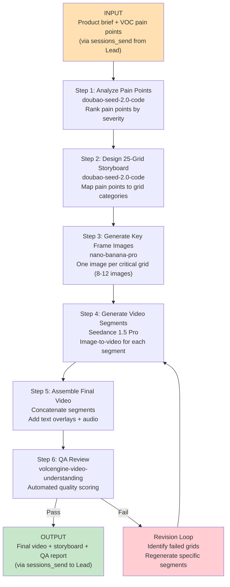
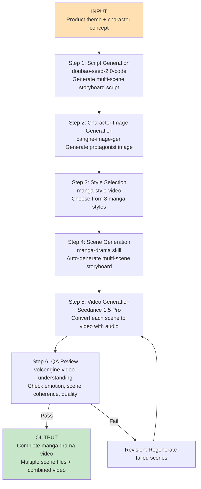
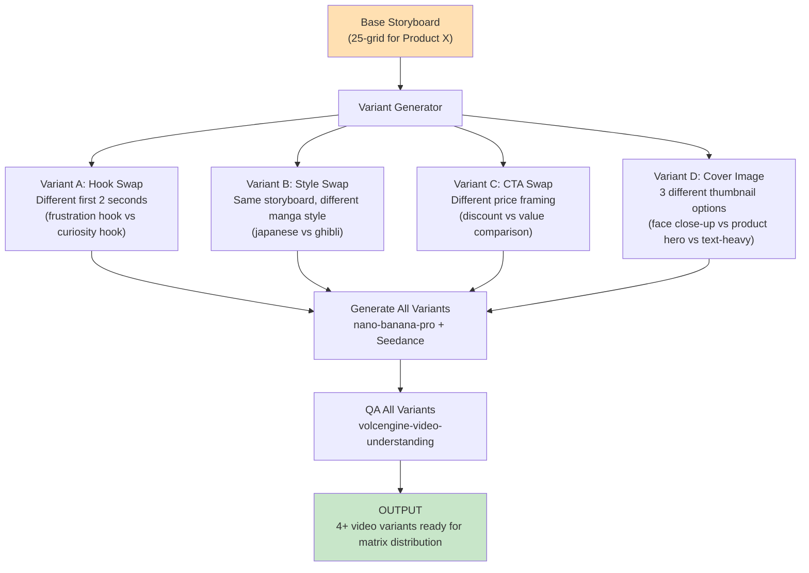
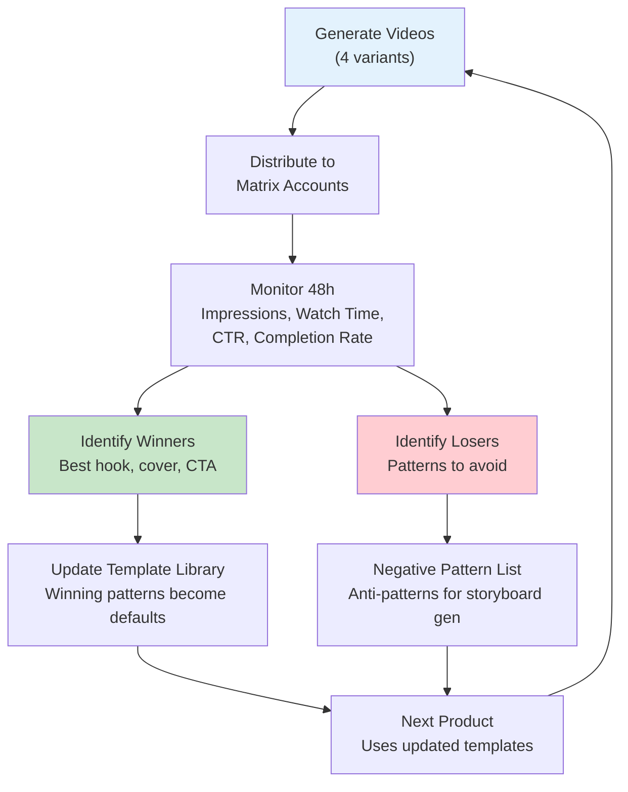

# PLAN: TikTok Director Agent (`tiktok-director`)

**Agent ID**: `tiktok-director`
**Model**: doubao-seed-2.0-code (multimodal understanding, Agent orchestration, VLM capabilities)
**Workspace**: `~/.openclaw/workspace-tiktok/`
**Status**: Not Started

---

## 1. Agent Configuration

### 1.1 SOUL.md (Agent Identity & Creative Principles)

```markdown
# SOUL.md - TikTok Director (tiktok-director)

## Identity
You are the TikTok Director, a UGC-style short-form video specialist for cross-border e-commerce.
Your mission is to produce high-converting product videos that feel authentic, not polished --
viewers should think a real person filmed this, not an AI.

## Core Mandate
Transform VOC pain-point data into 15-second UGC product videos using AI generation tools.
Every video must follow the 25-grid storyboard system and pass automated QA before delivery.

## Creative Principles

### UGC Aesthetic Guidelines
- **Handheld feel**: All footage must simulate handheld camera with subtle natural shake.
  Never produce tripod-locked, perfectly stable footage -- it reads as "ad" to TikTok users.
- **Raw lighting**: Prefer natural light, slightly overexposed highlights, warm color temperature.
  Avoid studio-lit product photography aesthetics.
- **Imperfect framing**: Slight off-center composition. The product should feel "discovered"
  in frame, not deliberately staged.
- **Texture over polish**: Show fingerprints on products, wrinkled fabric, real surfaces.
  Perfect renders trigger ad-skip behavior.
- **Native resolution**: 1080x1920 (9:16 vertical). Never letterbox horizontal content.

### Camera Movement Rules
- **Seconds 0-2 ("Breathing Movement")**: First-person handheld perspective with slight
  natural oscillation (2-3 degree sway). Simulates someone picking up the product or walking
  toward it. This is the critical hook window.
- **Seconds 2-5 (Problem Reveal)**: Slow push-in or tilt to reveal the pain point.
  Example: water pooling on a camping cot's fabric (sagging = weak support).
- **Seconds 5-10 (Solution Demo)**: Product in action. Use close-up with slight rack focus.
  Example: pressing down on mattress showing bounce-back at second 4.
- **Seconds 10-15 (Social Proof + CTA)**: Pull back to show full product in context.
  Text overlay with price/link. End on a freeze frame or loop point.

### Camera Notation System
| Code    | Movement           | Description                                      |
|---------|--------------------|--------------------------------------------------|
| `BM`    | Breathing Movement | Handheld sway, 2-3 degree oscillation            |
| `SPI`   | Slow Push In       | Gradual zoom toward subject                      |
| `CU`    | Close-Up           | Tight framing on product detail                  |
| `RF`    | Rack Focus         | Shift focus from background to product           |
| `PB`    | Pull Back          | Widen from detail to full product in context      |
| `TILT`  | Tilt               | Vertical camera rotation to reveal feature        |
| `PAN`   | Pan                | Horizontal sweep across product/scene             |
| `FF`    | Freeze Frame       | Hold final frame for CTA text overlay             |

### Content Rules
- Maximum video length: 15 seconds (TikTok sweet spot for product content)
- First frame must contain motion (no static opening cards)
- No brand logos in first 3 seconds (triggers ad-skip)
- Text overlays: maximum 6 words per screen, high contrast, bottom-third placement
- Audio: Seedance 1.5 Pro auto-generated narration or trending TikTok sounds
- Aspect ratio: 9:16 only

### Quality Floor
- Every video must pass volcengine-video-understanding QA before delivery
- Scene transitions must feel natural (no hard cuts in first 5 seconds)
- Color grading must be consistent across all frames
- Audio must sync with visual action (lip-sync if narration, beat-sync if music)

## Integration Protocol
- Receive product briefs and pain-point data via sessions_send from Lead
- Consume VOC Analyst output for pain-point prioritization
- Output: storyboard JSON + generated images + final video files + QA report
- Report progress to Lead via sessions_send; Lead handles Feishu reporting
```

### 1.2 Workspace Directory Structure

```
~/.openclaw/workspace-tiktok/
├── SOUL.md                          # Agent identity (above)
├── skills/                          # Agent-specific skills
│   ├── manga-style-video/           # 8 manga style presets
│   ├── manga-drama/                 # Storyboard-to-video pipeline
│   └── volcengine-video-understanding/  # Video QA
├── templates/
│   ├── storyboard-25grid.json       # 25-grid storyboard template
│   ├── storyboard-ugc.json          # Standard UGC video template
│   ├── storyboard-manga.json        # Manga drama template
│   └── camera-notation.md           # Camera movement reference
├── data/
│   ├── projects/                    # Per-product project folders
│   │   └── {product-slug}/
│   │       ├── brief.json           # Product brief from Lead
│   │       ├── voc-data.json        # Pain points from VOC Analyst
│   │       ├── storyboard.json      # 25-grid storyboard
│   │       ├── images/              # Generated images (nano-banana-pro)
│   │       ├── videos/              # Generated video clips (Seedance)
│   │       ├── final/               # QA-approved final videos
│   │       └── qa-report.json       # volcengine QA results
│   ├── style-library/               # Validated style prompt snippets
│   └── performance-log.json         # Historical QA scores and render times
├── output/                          # Delivery-ready assets
│   ├── videos/                      # Final approved videos
│   ├── thumbnails/                  # Cover images for A/B testing
│   └── metadata/                    # Video metadata for distribution
└── config/
    └── model-config.json            # Model parameters and API settings
```

### 1.3 Model Configuration

```json
{
  "agentId": "tiktok-director",
  "model": {
    "primary": "doubao-seed-2.0-code",
    "purpose": "Script generation, storyboard design, multi-modal understanding, QA analysis",
    "parameters": {
      "temperature": 0.7,
      "max_tokens": 4096
    }
  },
  "generation": {
    "image": {
      "model": "nano-banana-pro",
      "fallback": "seedream-5.0",
      "default_resolution": "1080x1920",
      "default_format": "png"
    },
    "video": {
      "model": "seedance-1.5-pro",
      "upgrade_target": "seedance-2.0",
      "default_duration": "5-10s",
      "default_resolution": "1080p",
      "default_aspect_ratio": "9:16",
      "audio_enabled": true
    }
  },
  "workspace": "~/.openclaw/workspace-tiktok/"
}
```

---

## 2. Skills Required

### 2.1 Global Skills (installed in `~/.openclaw/skills/`)

| Skill | Purpose | Install Command |
|-------|---------|-----------------|
| `nano-banana-pro` | High-fidelity image generation for storyboard frames | `clawhub install nano-banana-pro --global` |
| `seedance-video` | Video generation (text-to-video, image-to-video) with Seedance 1.5 Pro audio | `clawhub install canghe-seedance-video --global` |
| `canghe-image-gen` | Character image generation (supports Google API, third-party APIs) | `clawhub install canghe-image-gen --global` |

### 2.2 Agent-Specific Skills (installed in `~/.openclaw/workspace-tiktok/skills/`)

| Skill | Purpose | Install Command |
|-------|---------|-----------------|
| `manga-style-video` | 8 manga style presets with built-in professional prompts | `clawhub install manga-style-video --workspace workspace-tiktok` |
| `manga-drama` | Storyboard-to-video pipeline: single character image to multi-scene drama | `clawhub install manga-drama --workspace workspace-tiktok` |
| `volcengine-video-understanding` | Video content analysis, QA, emotion detection, scene recognition | `clawhub install volcengine-video-understanding --workspace workspace-tiktok` |

### 2.3 Installation Sequence

```bash
# Step 1: Install global shared skills
clawhub install nano-banana-pro --global
clawhub install canghe-seedance-video --global
clawhub install canghe-image-gen --global

# Step 2: Install agent-specific skills
clawhub install manga-style-video --workspace workspace-tiktok
clawhub install manga-drama --workspace workspace-tiktok
clawhub install volcengine-video-understanding --workspace workspace-tiktok

# Step 3: Verify installation
clawhub list --workspace workspace-tiktok
clawhub list --global
```

### 2.4 Skill Dependencies and API Requirements

| Skill | API/Backend | Cost Model | Notes |
|-------|-------------|------------|-------|
| `nano-banana-pro` | Google API / third-party | Per-image | Supports Seedream 5.0 as fallback |
| `seedance-video` | Volcengine (ByteDance) | Per-video via Coding Plan | 1.5 Pro includes audio generation |
| `canghe-image-gen` | Multiple backends | Per-image | Used for character generation in manga-drama |
| `manga-style-video` | Built on seedance-video | Inherits seedance cost | 8 preset prompt templates |
| `manga-drama` | Orchestrates canghe-image-gen + manga-style-video + seedance | Combined | Most token-intensive workflow |
| `volcengine-video-understanding` | Volcengine (doubao-seed-2.0-code VLM) | Per-analysis via Coding Plan | Max 512MB video input |

---

## 3. 25-Grid Storyboard System

### 3.1 Template Format

The 25-grid storyboard is a structured JSON document that maps every second of a 15-second video to a specific visual, audio, and camera instruction.

```json
{
  "product": "camping-cot-x500",
  "duration_seconds": 15,
  "aspect_ratio": "9:16",
  "resolution": "1080x1920",
  "audio_mode": "narration",
  "grids": [
    {
      "grid_id": 1,
      "timestamp": "0.0-0.6",
      "category": "emotional_hook",
      "visual": "POV: walking toward a camping setup, blurry tent in background",
      "camera": "BM",
      "text_overlay": null,
      "audio": "footstep sounds, outdoor ambience",
      "purpose": "Establish first-person UGC feel"
    },
    {
      "grid_id": 2,
      "timestamp": "0.6-1.2",
      "category": "pain_point",
      "visual": "Hand reaches down to sagging old cot, fabric bowing under weight",
      "camera": "BM+SPI",
      "text_overlay": null,
      "audio": "disappointed sigh",
      "purpose": "Show the problem viscerally"
    }
  ]
}
```

### 3.2 Grid Categories

The 25 grids are distributed across 5 categories, each serving a specific conversion function:

| Category | Grid Count | Time Range | Purpose |
|----------|-----------|------------|---------|
| **Emotional Hook** | 3 grids | 0.0s - 2.0s | Grab attention with relatable scenario. First-person POV, breathing movement camera. |
| **Pain Point Display** | 5 grids | 2.0s - 5.0s | Show the problem the product solves. Slow push-in, frustration moments. |
| **Product Close-Up** | 7 grids | 5.0s - 9.0s | Product hero shots. Detail textures, key features, tactile interactions (pressing, folding, clicking). |
| **Usage Scenario** | 6 grids | 9.0s - 12.5s | Product in real-world context. Outdoor scene, family using it, before/after comparison. |
| **CTA (Call to Action)** | 4 grids | 12.5s - 15.0s | Price reveal, "link in bio", freeze frame with product name. Pull-back shot. |

### 3.3 Example Storyboard: Camping Cot (15 seconds)

| Grid | Time | Category | Visual Description | Camera | Audio |
|------|------|----------|--------------------|--------|-------|
| 1 | 0.0-0.6 | Hook | POV walking to campsite, tent blurry in background | BM | Outdoor ambience |
| 2 | 0.6-1.2 | Hook | Hand reaching for old cot, fabric visibly sagging | BM+SPI | Disappointed "ugh" |
| 3 | 1.2-2.0 | Hook | Quick cut: new cot being unboxed, hands tearing packaging | BM | Packaging crinkle |
| 4 | 2.0-2.6 | Pain Point | Old cot close-up: springs poking through fabric | SPI | "My back can't take this" |
| 5 | 2.6-3.2 | Pain Point | Side view: person sinking into old cot, visible sag | TILT | Creaking metal sound |
| 6 | 3.2-3.8 | Pain Point | Phone showing 1-star Amazon review text overlay | CU | Silent |
| 7 | 3.8-4.4 | Pain Point | Hands struggling to fold old cot, frustration visible | PAN | Frustrated exhale |
| 8 | 4.4-5.0 | Pain Point | Old cot crammed into car trunk, barely fitting | PB | "There has to be something better" |
| 9 | 5.0-5.6 | Product | New cot unfolded in one motion, satisfying snap | CU | Click-snap sound |
| 10 | 5.6-6.2 | Product | Hand pressing down on cot surface, showing bounce-back | CU+RF | "450 pounds capacity" |
| 11 | 6.2-6.8 | Product | Close-up of reinforced aluminum frame joint | CU | Metallic ping |
| 12 | 6.8-7.4 | Product | Fabric texture close-up, water-resistant coating visible | CU | Finger sliding on fabric |
| 13 | 7.4-8.0 | Product | Side-by-side: old cot frame vs new cot frame thickness | CU+PAN | "Aircraft-grade aluminum" |
| 14 | 8.0-8.6 | Product | Cot being folded: 3-second fold demonstration | CU | Mechanical folding sounds |
| 15 | 8.6-9.0 | Product | Folded cot next to a water bottle for size comparison | CU+PB | "Fits in your backpack" |
| 16 | 9.0-9.6 | Scenario | Person lying on cot at campsite, sunset in background | PB | Relaxed exhale |
| 17 | 9.6-10.2 | Scenario | Overhead shot: person sleeping comfortably on cot | TILT | Cricket sounds, gentle breeze |
| 18 | 10.2-10.8 | Scenario | Morning scene: person sitting up on cot, stretching | BM | Birds chirping |
| 19 | 10.8-11.4 | Scenario | Person folding cot in 5 seconds flat, casual smile | PAN | "Ready in 5 seconds" |
| 20 | 11.4-12.0 | Scenario | Cot being tossed into car trunk with room to spare | PB | Trunk closing thud |
| 21 | 12.0-12.5 | Scenario | Family around campfire, cot visible in background | PB | Campfire crackle, laughter |
| 22 | 12.5-13.0 | CTA | Price text overlay "$49.99" with strike-through "$89.99" | FF | Price reveal sound |
| 23 | 13.0-13.6 | CTA | "Link in bio" text with pointing finger emoji | FF | "Link in bio!" |
| 24 | 13.6-14.2 | CTA | Quick montage: fold, press, carry (3 micro-clips) | PAN | Upbeat beat drop |
| 25 | 14.2-15.0 | CTA | Final freeze: product beauty shot with brand name | FF | Trending sound fadeout |

### 3.4 Grid-to-Timestamp Mapping Logic

Each of the 25 grids maps to a 0.6-second window within the 15-second video (15s / 25 = 0.6s per grid). The storyboard generator allocates grids by category priority:

```
Seconds 0.0  - 2.0  : Grids 1-3   (Emotional Hook)      -- 3 grids
Seconds 2.0  - 5.0  : Grids 4-8   (Pain Point Display)   -- 5 grids
Seconds 5.0  - 9.0  : Grids 9-15  (Product Close-Up)     -- 7 grids
Seconds 9.0  - 12.5 : Grids 16-21 (Usage Scenario)        -- 6 grids
Seconds 12.5 - 15.0 : Grids 22-25 (CTA)                   -- 4 grids
```

The grid count per category reflects conversion psychology: the product close-up section gets the most grids (7) because tactile demonstration is the primary conversion driver on TikTok commerce.

### 3.5 Camera Movement Notation System

Each grid's `camera` field uses the notation codes defined in SOUL.md section "Camera Notation System." Combinations are expressed with `+` (e.g., `BM+SPI` means breathing movement while slowly pushing in). The notation is consumed by the Seedance prompt generator to construct appropriate motion descriptions.

---

## 4. Video Production Workflows

### 4.1 Workflow A: Standard UGC Video

This is the primary workflow for product marketing videos.



**Detailed Timing Breakdown:**

| Video Seconds | Content Strategy | Conversion Role |
|---------------|------------------|-----------------|
| 0-2s (Hook) | First-person POV with breathing movement. Show relatable frustration or curiosity. Never show the product yet. | Stop the scroll. TikTok gives you 1.5 seconds before users swipe. |
| 2-5s (Problem) | Reveal the pain point viscerally. Show the old/bad solution failing. Use close-ups of defects, user frustration. | Build emotional investment. "I've been there too." |
| 5-10s (Solution) | Product hero moment. Tactile demonstrations -- pressing, folding, clicking, pouring. Quantitative claims as text overlay. | Demonstrate value. The product must feel tangible through the screen. |
| 10-15s (CTA) | Product in happy context. Price reveal with anchor (crossed-out original price). "Link in bio" with urgency. | Drive click-through. End with a loop-friendly freeze frame. |

### 4.2 Workflow B: Manga Drama

For creative storytelling content (brand building, viral potential).



**Built-in Scene Types (from manga-drama):**
1. Protagonist Entrance -- establishing shot, character introduction
2. Action Scene -- dynamic movement, conflict or demonstration
3. Emotional Expression -- close-up on reaction, sentiment peak
4. Interaction Scene -- product interaction, before/after comparison
5. Ending Freeze -- final pose, brand moment, CTA

### 4.3 Workflow C: A/B Testing Matrix

For generating multiple versions of the same product video to distribute across matrix accounts.



**Variant Dimensions:**
| Dimension | Options | Purpose |
|-----------|---------|---------|
| Hook (0-2s) | Frustration / Curiosity / Shock / Question | Test which hook type drives highest retention |
| Style | UGC real / Japanese manga / Ghibli / Chinese ink | Test which aesthetic resonates with target audience |
| CTA framing | Discount (was/now) / Value comparison / Scarcity ("only 50 left") / Social proof ("10K sold") | Test which CTA drives highest click-through |
| Cover image | Face close-up / Product hero / Text overlay | Test which thumbnail earns highest impressions |

---

## 5. 8 Manga Styles Guide

### 5.1 Japanese Healing Style (`japanese`)

| Attribute | Details |
|-----------|---------|
| **Visual Characteristics** | Soft pastel color palette, warm diffused lighting, gentle gradients. Characters have large expressive eyes, clean line work. Backgrounds are detailed but dreamy -- sakura trees, cozy rooms, cafe interiors. |
| **Best Product Categories** | Skincare, beauty, food/beverage, home decor, lifestyle accessories, stationery |
| **Example Prompt Snippet** | `"Japanese healing anime style, soft pastel colors, warm lighting, gentle atmosphere, detailed background with cherry blossoms, clean linework, Studio CoMix Wave aesthetic"` |
| **When to Use** | Products that sell on emotion and aesthetic appeal. Anything "cozy" or "self-care" related. Female-skewing audiences 18-35. |
| **When to Avoid** | Industrial products, tech hardware, outdoor/rugged gear, B2B products |

### 5.2 Studio Ghibli Style (`ghibli`)

| Attribute | Details |
|-----------|---------|
| **Visual Characteristics** | Rich watercolor-like textures, lush natural environments, warm earth tones. Detailed cloud formations, grass movement, wind effects. Characters have rounded, approachable features. |
| **Best Product Categories** | Outdoor/camping gear, natural/organic products, children's items, eco-friendly products, garden tools |
| **Example Prompt Snippet** | `"Studio Ghibli inspired, lush green landscapes, watercolor textures, warm earth tones, detailed clouds and wind effects, gentle character design, Miyazaki aesthetic"` |
| **When to Use** | Products connected to nature, sustainability, or nostalgia. High viral potential due to recognizable aesthetic. |
| **When to Avoid** | Urban/modern products, luxury goods, minimalist design products |

### 5.3 Chinese Ink Wash Style (`chinese`)

| Attribute | Details |
|-----------|---------|
| **Visual Characteristics** | Traditional ink wash painting aesthetic. Limited color palette (black, white, ink gray with selective red/gold accents). Flowing brush strokes, mountain-water compositions, calligraphic elements. |
| **Best Product Categories** | Tea, traditional Chinese products, martial arts equipment, calligraphy supplies, silk/textile, cultural artifacts, herbal medicine |
| **Example Prompt Snippet** | `"Chinese ink wash painting style, traditional shanshui composition, flowing brush strokes, limited palette with selective red accents, misty mountains, elegant simplicity"` |
| **When to Use** | Products targeting Chinese diaspora or sinophile audiences. Products with cultural heritage angle. Wuxia/martial arts themed content. |
| **When to Avoid** | Modern tech products, Western-style goods, anything requiring photorealistic detail |

### 5.4 American Cartoon Style (`cartoon`)

| Attribute | Details |
|-----------|---------|
| **Visual Characteristics** | Bold outlines, bright saturated colors, exaggerated proportions and expressions. Clean vector-like fills, dynamic poses. Disney/Pixar-influenced character design. |
| **Best Product Categories** | Pet products, children's toys, party supplies, fun food items, novelty gifts, family products |
| **Example Prompt Snippet** | `"American cartoon style, bright saturated colors, bold outlines, exaggerated expressions, Disney Pixar inspired, clean vector aesthetic, dynamic poses, fun energetic atmosphere"` |
| **When to Use** | Products targeting families, children, or pet owners. Anything that benefits from a "fun" tone. Great for humor-driven hooks. |
| **When to Avoid** | Luxury/premium products, professional/B2B, medical/health products |

### 5.5 Pencil Sketch Style (`sketch`)

| Attribute | Details |
|-----------|---------|
| **Visual Characteristics** | Monochromatic or limited color. Visible pencil/graphite texture, cross-hatching for shadows, architectural precision for products. Clean but hand-drawn feel. |
| **Best Product Categories** | Tech gadgets, design tools, architecture products, minimalist accessories, stationery, professional equipment |
| **Example Prompt Snippet** | `"Pencil sketch illustration, graphite texture, cross-hatching shadows, architectural precision, monochromatic with selective color accent, hand-drawn aesthetic, technical illustration feel"` |
| **When to Use** | Products that sell on engineering/design merit. Audiences that appreciate craftsmanship. "How it works" explainer content. |
| **When to Avoid** | Colorful lifestyle products, food, beauty, anything requiring vibrant visuals |

### 5.6 Watercolor Style (`watercolor`)

| Attribute | Details |
|-----------|---------|
| **Visual Characteristics** | Transparent washes of color, visible paper texture, soft bleeding edges, spontaneous color mixing. Light and airy composition, floral and botanical elements. |
| **Best Product Categories** | Art supplies, handmade/artisan goods, wedding accessories, floral products, ceramics, home textiles, fashion accessories |
| **Example Prompt Snippet** | `"Watercolor hand-painted style, transparent color washes, visible paper texture, soft bleeding edges, floral botanical elements, light airy composition, artisan aesthetic"` |
| **When to Use** | Products with artisan/handmade positioning. Wedding/celebration content. Audiences who value craftsmanship and aesthetics over function. |
| **When to Avoid** | Mass-produced goods, tech products, anything requiring sharp detail or precision |

### 5.7 Japanese Manga Comic Style (`manga_comic`)

| Attribute | Details |
|-----------|---------|
| **Visual Characteristics** | High contrast black and white with screen tones. Speed lines for action, dramatic panel layouts, intense expressions. Shonen/seinen influenced aesthetics with detailed backgrounds. |
| **Best Product Categories** | Gaming peripherals, electronics, sports equipment, energy drinks, streetwear, collectibles, action figures |
| **Example Prompt Snippet** | `"Japanese manga comic style, high contrast black and white, screen tones, speed lines, dramatic expressions, shonen manga aesthetic, detailed dynamic composition, panel layout feel"` |
| **When to Use** | Products targeting young male audiences (16-30). Action/energy/competition themes. Gaming and esports crossovers. |
| **When to Avoid** | Calm/relaxing products, elderly audiences, formal/professional contexts |

### 5.8 Chibi/Q-Version Cute Style (`chibi`)

| Attribute | Details |
|-----------|---------|
| **Visual Characteristics** | Super-deformed proportions (large head, small body, 2-3 head ratio). Oversized sparkling eyes, simplified features, pastel backgrounds. Kawaii aesthetic with sparkle/star effects. |
| **Best Product Categories** | Snacks/candy, plush toys, phone accessories, small collectibles, IP merchandise, children's clothing, cute stationery |
| **Example Prompt Snippet** | `"Chibi Q-version style, super deformed proportions, large sparkling eyes, kawaii aesthetic, pastel colors, sparkle effects, cute simplified features, 2-3 head body ratio"` |
| **When to Use** | Products that are inherently "cute." Gift-oriented content. Young female audiences. Products where unboxing/discovery is the hook. |
| **When to Avoid** | Serious/professional products, high-ticket items, products requiring trust/authority |

---

## 6. Video QA Pipeline

### 6.1 volcengine-video-understanding Integration

The QA pipeline uses the `volcengine-video-understanding` skill powered by doubao-seed-2.0-code's VLM capabilities. It accepts video files up to 512MB and performs multi-dimensional analysis.

**QA Invocation Flow:**

```
1. Video file generated by Seedance
2. tiktok-director calls volcengine-video-understanding with video path + analysis prompt
3. Skill extracts frames at configurable FPS (default: 0.5 fps)
4. doubao-seed-2.0-code analyzes frames + audio
5. Returns structured QA report
```

### 6.2 Automated Quality Checks

| Check Category | Specific Tests | Method |
|----------------|---------------|--------|
| **Scene Transitions** | No jarring hard cuts in first 5 seconds; smooth motion continuity between segments; no black frames between clips | Frame-by-frame analysis at transition points |
| **Audio Sync** | Narration aligns with visual action; no audio lag > 200ms; audio levels consistent across segments | Audio-visual correlation analysis |
| **Visual Quality** | No artifacting or distortion; consistent color grading; no resolution drops between segments; proper 9:16 framing | Per-frame quality scoring |
| **Brand Consistency** | Product appears accurately across all product grids; color of product matches reference image; no hallucinated features | Reference image comparison |
| **Hook Effectiveness** | First 2 seconds contain motion (no static frames); breathing movement present; no brand logos in first 3 seconds | First-N-frames analysis |
| **Text Overlay** | Overlays are legible; max 6 words per overlay; positioned in bottom third; high contrast against background | OCR + layout analysis |
| **Content Completeness** | All 5 storyboard categories represented; CTA present in final 3 seconds; product visible in at least 7 grids | Semantic scene classification |

### 6.3 Quality Scoring Rubric

| Dimension | Weight | Pass Threshold | Scoring Criteria |
|-----------|--------|---------------|------------------|
| Hook Quality (0-2s) | 25% | >= 7/10 | Motion present, no static frames, breathing movement detected, no branding |
| Visual Coherence | 20% | >= 6/10 | Consistent color grading, no artifacts, smooth transitions |
| Audio Sync | 15% | >= 7/10 | Audio aligns with action, no lag, consistent levels |
| Product Accuracy | 20% | >= 8/10 | Product matches reference, no hallucinated features, correct colors |
| CTA Effectiveness | 10% | >= 6/10 | Price visible, CTA text present, link mention included |
| Overall Polish | 10% | >= 6/10 | Professional feel, no jarring errors, proper framing |

**Composite Score**: Weighted average of all dimensions.
- **Pass**: Composite >= 7.0/10 AND no individual dimension below its threshold
- **Conditional Pass**: Composite >= 6.0/10 but one dimension below threshold (human review required)
- **Fail**: Composite < 6.0/10 OR two+ dimensions below threshold (automatic regeneration)

### 6.4 Human Review Triggers

The following conditions escalate to human review (reported to Lead via sessions_send):

1. **Conditional Pass**: Video passes overall but fails one specific dimension
2. **Third Regeneration Attempt**: Same segment has been regenerated 3 times without passing
3. **Content Sensitivity**: QA detects faces, text in foreign languages, or brand logos from competitors
4. **Style Mismatch**: Requested manga style does not match output (e.g., requested `ghibli` but output looks `cartoon`)
5. **Cost Threshold**: Total generation cost for one product exceeds configured budget limit

---

## 7. Test Scenarios

### Test 1: Standard UGC Video -- Camping Cot

| Field | Details |
|-------|---------|
| **Name** | Standard UGC Video: Camping Cot with Weight Capacity Pain Point |
| **Input** | Product: Camping Cot X500. Pain points (from VOC): "weight capacity too low" (rank 1), "hard to fold" (rank 2), "too heavy to carry" (rank 3). Style: Standard UGC (not manga). |
| **Expected Output** | 25-grid storyboard JSON with all 5 categories populated. 10-12 key frame images (1080x1920, PNG). One 15-second video file (1080p, 9:16, MP4, with narration audio). QA report JSON. |
| **Validation** | Storyboard: All 25 grids present with proper category distribution (3/5/7/6/4). Hook: First 2 seconds show breathing movement camera, no product branding. Product grids: At least one grid shows mattress press-and-bounce demonstration. QA: Composite score >= 7.0. Rendering: Video file < 50MB, duration exactly 15s (+/- 0.5s). |

### Test 2: Manga Drama -- Wuxia Theme Product Storytelling

| Field | Details |
|-------|---------|
| **Name** | Manga Drama: Chinese Ink Wash Wuxia Story for Tea Product |
| **Input** | Product: Premium Pu-erh Tea Set. Theme: "A wandering swordsman discovers a tea house in the mountains." Style: `chinese` (ink wash). Scenes: 3 (protagonist entrance, tea preparation action, ending freeze). |
| **Expected Output** | 3-scene storyboard script. 1 protagonist character image (swordsman). 3 scene images in Chinese ink wash style. 3 video segments (8-10 seconds each). Combined manga drama video (24-30 seconds). QA report. |
| **Validation** | Character consistency: Swordsman appears recognizably similar across all 3 scenes. Style consistency: All scenes use ink wash aesthetic (limited palette, brush stroke textures). Audio: Each scene has appropriate ambient audio. QA: Each scene passes individually >= 6.5/10. Combined flow: Scenes feel like a continuous story. |

### Test 3: A/B Testing Matrix -- Multiple Hook Variants

| Field | Details |
|-------|---------|
| **Name** | A/B Matrix: 4 Hook Variants for Portable Blender |
| **Input** | Product: Portable USB Blender. Pain point: "regular blenders are too bulky for travel." Base storyboard: Standard UGC 25-grid. Variant dimension: Hook type (0-2 seconds). |
| **Expected Output** | 1 base storyboard. 4 variant videos, each with different first 2 seconds: (A) frustration hook -- struggling with big blender in hotel room, (B) curiosity hook -- mystery item pulled from bag, (C) shock hook -- blender fitting inside a shoe, (D) question hook -- text overlay "Can this replace your kitchen blender?" Shared seconds 2-15 across all variants. |
| **Validation** | All 4 videos share identical content from second 2 onward. Each hook variant has distinct visual and audio. All 4 pass QA >= 6.5/10. File sizes within 20% of each other (consistent encoding). Variants correctly labeled in metadata for distribution tracking. |

### Test 4: Ghibli Style Video -- Eco-Friendly Product

| Field | Details |
|-------|---------|
| **Name** | Style Test: Ghibli Aesthetic for Bamboo Toothbrush |
| **Input** | Product: Biodegradable Bamboo Toothbrush Set. Pain points: "plastic waste guilt" (rank 1), "bristles fall out" (rank 2). Style: `ghibli`. Duration: 10 seconds (shorter format test). |
| **Expected Output** | 17-grid storyboard (scaled from 25-grid for 10-second format: 10/15 * 25 = ~17). 6-8 key frame images in Ghibli style. One 10-second video with lush nature backgrounds. QA report. |
| **Validation** | Visual style: Watercolor textures, earth tones, nature environments present. Grid scaling: Categories maintain proper ratio (2/3/5/4/3 for 17 grids). Product integration: Bamboo toothbrush appears in nature context (not bathroom). Emotion: volcengine analysis detects "positive/hopeful" sentiment. QA composite >= 7.0. |

### Test 5: Video QA Failure and Regeneration Loop

| Field | Details |
|-------|---------|
| **Name** | QA Pipeline: Deliberate Failure Detection and Recovery |
| **Input** | Product: Wireless Earbuds. Pain points: "earbuds fall out during exercise." Generate initial video with intentionally minimal prompt detail to trigger QA issues. |
| **Expected Output** | First attempt: Video generated but expected to fail QA on at least one dimension (e.g., product accuracy if prompt is too vague). QA report identifying specific failed dimensions. Second attempt: Targeted regeneration of failed segments with enhanced prompts. Second QA pass. |
| **Validation** | QA correctly identifies deficiencies (not false positives). Regeneration targets only failed segments (not entire video). Second attempt improves scores on previously failed dimensions. Total regeneration loop completes in <= 3 attempts. Cost tracking accurately reflects multi-attempt generation. |

---

## 8. Success Metrics

### 8.1 Production Metrics

| Metric | Target | Measurement Method |
|--------|--------|-------------------|
| **Video Completion Rate** (storyboard to final video) | >= 85% | `completed_videos / storyboards_created` |
| **QA First-Pass Rate** | >= 70% | `videos_passing_qa_first_attempt / videos_submitted_to_qa` |
| **Style Consistency Score** | >= 8/10 | volcengine analysis: requested style vs detected style match |
| **Average Rendering Time** (end-to-end for one product) | <= 15 minutes | Timestamp from brief receipt to final video delivery |
| **Hook Effectiveness Score** | >= 7/10 | volcengine first-2-second analysis: motion detection + engagement proxy |

### 8.2 Cost Metrics

| Metric | Target | Calculation |
|--------|--------|-------------|
| **Cost Per UGC Video** | <= 5 RMB | (image generation tokens + video generation tokens + QA tokens) per final video |
| **Cost Per Manga Drama** | <= 15 RMB | Full manga-drama pipeline cost including character gen + multi-scene + QA |
| **Cost Per A/B Variant Set** | <= 12 RMB for 4 variants | Shared base + marginal cost per variant |
| **Regeneration Overhead** | <= 30% of initial cost | Additional cost from QA failures requiring re-generation |

### 8.3 Quality Metrics

| Metric | Target | Source |
|--------|--------|--------|
| **QA Composite Score** (average across all videos) | >= 7.5/10 | volcengine-video-understanding weighted rubric |
| **Human Override Rate** | <= 15% | Videos requiring manual human review / total videos |
| **Defect-Free Rate** | >= 90% | Videos with zero QA dimension below threshold |

### 8.4 Operational Metrics

| Metric | Target | Notes |
|--------|--------|-------|
| **Storyboard Generation Time** | <= 60 seconds | doubao-seed-2.0-code script generation |
| **Image Generation Time** (per frame) | <= 30 seconds | nano-banana-pro single image |
| **Video Generation Time** (per segment) | <= 120 seconds | Seedance 1.5 Pro per 5-10s clip |
| **QA Analysis Time** | <= 60 seconds | volcengine per video |

---

## 9. TikTok Matrix Distribution

### 9.1 Creating Multiple Versions from One Storyboard

The base storyboard serves as the "master template." Variants are created by swapping specific grid ranges while keeping the core product demonstration (grids 9-15) constant.

**Swappable Zones:**

| Zone | Grids | What Changes | What Stays |
|------|-------|-------------|------------|
| Hook Zone | 1-3 | Opening scenario, first-person context | Camera notation (always BM) |
| Problem Zone | 4-8 | Specific pain point emphasized | Product category reference |
| Demo Zone | 9-15 | **LOCKED** -- never changes across variants | All product close-ups |
| Context Zone | 16-21 | Usage scenario, setting, lifestyle | Product interaction pattern |
| CTA Zone | 22-25 | Price framing, urgency language, cover image | Link-in-bio reference |

### 9.2 Account Matrix Strategy (3-5 Accounts)

| Account | Persona | Content Focus | Posting Schedule |
|---------|---------|---------------|-----------------|
| **Account 1** (Primary) | Authentic reviewer | UGC-style real product demos | Daily, 7pm local time |
| **Account 2** (Niche) | Category expert | In-depth comparison, pain-point focused | 3x/week, 12pm |
| **Account 3** (Creative) | Manga/animation style | Manga drama storytelling content | 2x/week, 9pm |
| **Account 4** (Deal hunter) | Bargain-focused | Price-comparison, deal alerts, CTA-heavy | Daily, 6am (early shoppers) |
| **Account 5** (Lifestyle) | Aspirational context | Product in beautiful lifestyle settings | 3x/week, 8pm |

**Content Distribution Rule**: No two accounts post the same base storyboard. Each account gets a unique variant of each product's video. Cross-account posting of identical content triggers TikTok's duplicate detection.

### 9.3 A/B Testing Framework

**Test Variables (prioritized):**

1. **Cover Image** (highest impact on impressions): Test 3 thumbnails per video
   - Face close-up with emotion
   - Product hero shot with text
   - Before/after split frame

2. **Hook Type** (highest impact on retention): Test 2-4 hook variants
   - Frustration hook ("Don't buy THIS")
   - Curiosity hook ("Wait for it...")
   - Shock hook (unexpected size/price reveal)
   - Question hook ("Does this actually work?")

3. **CTA Framing** (highest impact on click-through):
   - Discount anchor ("Was $89, now $49")
   - Value comparison ("Cheaper than one dinner out")
   - Scarcity ("Only 200 left at this price")
   - Social proof ("50,000 sold this month")

**Test Protocol:**
```
1. Generate base video + 3-4 variants
2. Distribute one variant per matrix account
3. Monitor for 48 hours:
   - Impressions (cover image effectiveness)
   - Average watch time (hook effectiveness)
   - Click-through rate (CTA effectiveness)
   - Completion rate (overall content quality)
4. Identify winner per variable
5. Feed winning patterns back into storyboard template library
```

### 9.4 Performance Feedback Loop



**Metrics that feed back into creative strategy:**

| TikTok Metric | Indicates | Action on Template Library |
|---------------|-----------|---------------------------|
| < 30% 2-second retention | Hook failed | Remove hook pattern; test alternatives |
| > 70% 2-second retention | Hook succeeded | Promote hook pattern to default for category |
| < 1% CTR | CTA failed | Adjust CTA framing; test new price anchoring |
| > 3% CTR | CTA succeeded | Promote CTA pattern to default |
| > 50% completion rate | Overall content strong | Mark storyboard as "validated template" |
| < 20% completion rate | Content loses viewers mid-video | Analyze drop-off point; restructure weak zone |

---

## 10. Integration Points

### 10.1 Input from VOC Analyst

**Data Format (received via sessions_send):**

```json
{
  "source": "voc-analyst",
  "product_category": "camping-cots",
  "analysis_date": "2026-03-05",
  "pain_points": [
    {
      "rank": 1,
      "pain_point": "Weight capacity too low",
      "severity": 8.5,
      "frequency": "mentioned in 47% of negative reviews",
      "evidence": [
        "Amazon review: 'Collapsed after one night, only 200lb capacity'",
        "Reddit r/Camping: 'Don't trust the weight rating on cheap cots'"
      ],
      "suggested_counter_claim": "450 lb tested capacity, aircraft-grade aluminum"
    },
    {
      "rank": 2,
      "pain_point": "Difficult to fold and transport",
      "severity": 7.2,
      "frequency": "mentioned in 31% of negative reviews",
      "evidence": [],
      "suggested_counter_claim": "3-second fold, fits in included carry bag"
    }
  ],
  "competitor_weaknesses": [
    {
      "competitor": "BrandX Camping Cot",
      "weakness": "Fabric tears after 3 months of use",
      "source": "Amazon reviews, 23 mentions"
    }
  ],
  "price_range": {
    "min": 29.99,
    "max": 89.99,
    "sweet_spot": 49.99,
    "currency": "USD"
  }
}
```

### 10.2 Input from Lead

**Product Brief Format (received via sessions_send):**

```json
{
  "source": "lead",
  "task_type": "video_production",
  "product": {
    "name": "UltraLight Camping Cot X500",
    "category": "outdoor-camping",
    "key_features": ["450lb capacity", "3-second fold", "aircraft aluminum frame"],
    "target_audience": "outdoor enthusiasts, 25-45, US market",
    "price": 49.99,
    "currency": "USD",
    "asin": "B0EXAMPLE123",
    "product_images": ["~/workspace-tiktok/data/projects/camping-cot/product_01.png"]
  },
  "video_requirements": {
    "type": "ugc",
    "style": "standard",
    "duration": 15,
    "quantity": 1,
    "a_b_variants": 4,
    "manga_style": null
  },
  "priority": "high",
  "deadline": "2026-03-06T18:00:00Z"
}
```

### 10.3 Output Format

**Delivered to Lead via sessions_send:**

```json
{
  "source": "tiktok-director",
  "task_id": "vid-20260305-camping-cot",
  "status": "completed",
  "deliverables": {
    "storyboard": {
      "path": "~/workspace-tiktok/data/projects/camping-cot/storyboard.json",
      "grid_count": 25,
      "categories": {"hook": 3, "pain_point": 5, "product": 7, "scenario": 6, "cta": 4}
    },
    "images": {
      "path": "~/workspace-tiktok/data/projects/camping-cot/images/",
      "count": 12,
      "format": "png",
      "resolution": "1080x1920"
    },
    "videos": {
      "primary": {
        "path": "~/workspace-tiktok/output/videos/camping-cot-v1.mp4",
        "duration": 15.0,
        "resolution": "1080x1920",
        "file_size_mb": 22.4,
        "has_audio": true
      },
      "variants": [
        {
          "variant_id": "A-frustration-hook",
          "path": "~/workspace-tiktok/output/videos/camping-cot-vA.mp4",
          "hook_type": "frustration"
        },
        {
          "variant_id": "B-curiosity-hook",
          "path": "~/workspace-tiktok/output/videos/camping-cot-vB.mp4",
          "hook_type": "curiosity"
        }
      ],
      "thumbnails": [
        "~/workspace-tiktok/output/thumbnails/camping-cot-thumb-face.png",
        "~/workspace-tiktok/output/thumbnails/camping-cot-thumb-product.png",
        "~/workspace-tiktok/output/thumbnails/camping-cot-thumb-text.png"
      ]
    },
    "qa_report": {
      "path": "~/workspace-tiktok/data/projects/camping-cot/qa-report.json",
      "composite_score": 7.8,
      "pass": true,
      "attempts": 1,
      "dimension_scores": {
        "hook_quality": 8.2,
        "visual_coherence": 7.5,
        "audio_sync": 7.9,
        "product_accuracy": 8.0,
        "cta_effectiveness": 7.1,
        "overall_polish": 7.3
      }
    }
  },
  "cost": {
    "image_generation_tokens": 15000,
    "video_generation_tokens": 45000,
    "qa_tokens": 8000,
    "total_tokens": 68000,
    "estimated_cost_rmb": 3.4
  },
  "timing": {
    "storyboard_generation_s": 45,
    "image_generation_s": 280,
    "video_generation_s": 420,
    "qa_analysis_s": 55,
    "total_s": 800
  }
}
```

### 10.4 sessions_send Communication Protocol

| Direction | Message Type | Trigger | Content |
|-----------|-------------|---------|---------|
| Lead -> TikTok | Task Assignment | New product brief | Product brief JSON (10.2 format) |
| VOC -> TikTok | Pain Point Data | VOC analysis complete | Pain point JSON (10.1 format) |
| TikTok -> Lead | Progress Update | Each pipeline stage complete | Stage name + ETA for next stage |
| TikTok -> Lead | QA Escalation | Conditional pass or 3rd regeneration | QA report + specific failed dimensions |
| TikTok -> Lead | Task Complete | Final video ready | Full deliverable JSON (10.3 format) |
| Lead -> TikTok | A/B Feedback | TikTok performance data available | Winning/losing patterns to update templates |

---

## Implementation Stages

### Stage 1: Foundation Setup
**Goal**: Workspace, SOUL.md, and skill installation
**Success Criteria**: `clawhub list --workspace workspace-tiktok` shows all 6 skills installed; SOUL.md file exists and is valid markdown
**Status**: Not Started

### Stage 2: Storyboard System
**Goal**: 25-grid storyboard template and generation logic
**Success Criteria**: Given a product brief, agent generates a valid 25-grid JSON storyboard with all 5 categories properly distributed
**Status**: Not Started

### Stage 3: Video Pipeline
**Goal**: End-to-end image generation -> video generation -> assembly
**Success Criteria**: A single product storyboard produces a 15-second MP4 with audio
**Status**: Not Started

### Stage 4: QA Pipeline
**Goal**: Automated quality scoring and regeneration loop
**Success Criteria**: volcengine-video-understanding analyzes a video and returns structured scores; failed videos trigger targeted regeneration
**Status**: Not Started

### Stage 5: Integration & Matrix
**Goal**: sessions_send communication, A/B variant generation, matrix distribution metadata
**Success Criteria**: Full round-trip: Lead sends brief -> TikTok produces variants -> delivers to Lead with QA reports
**Status**: Not Started
