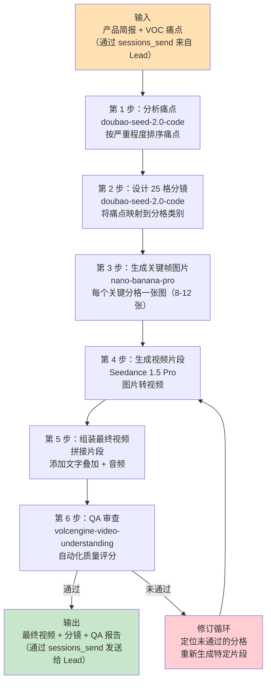
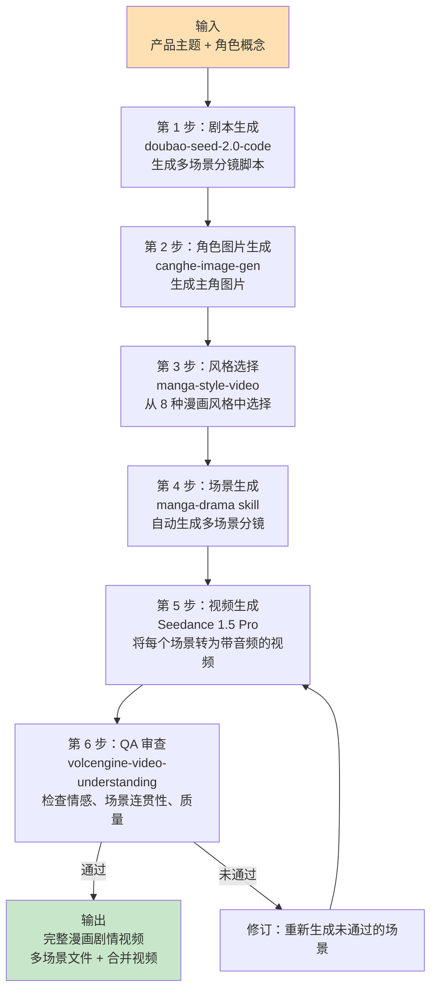
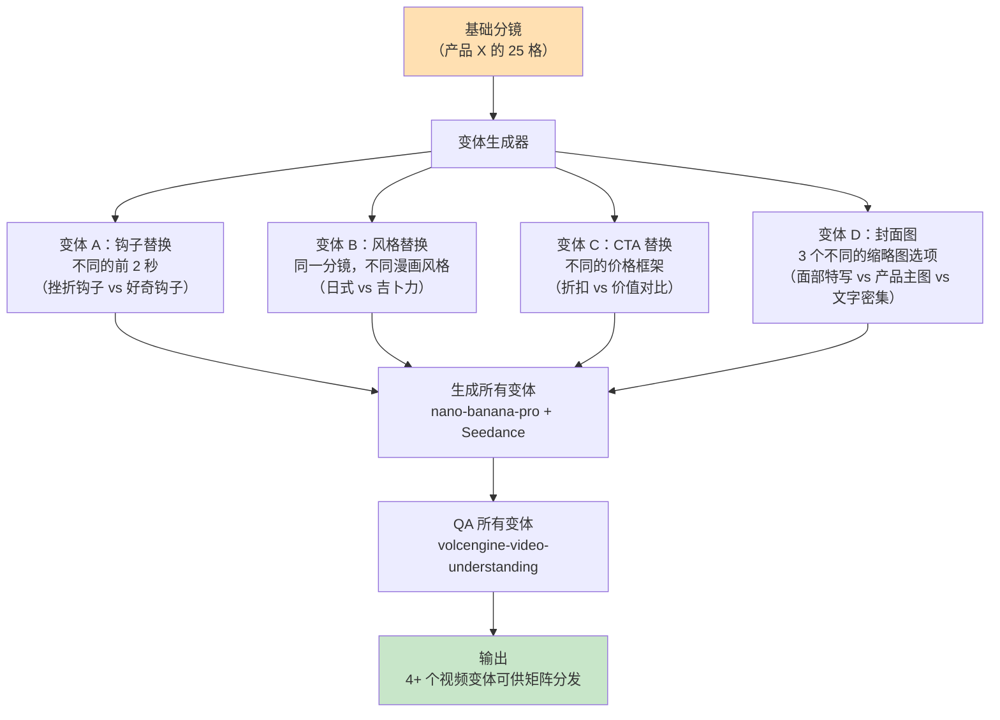
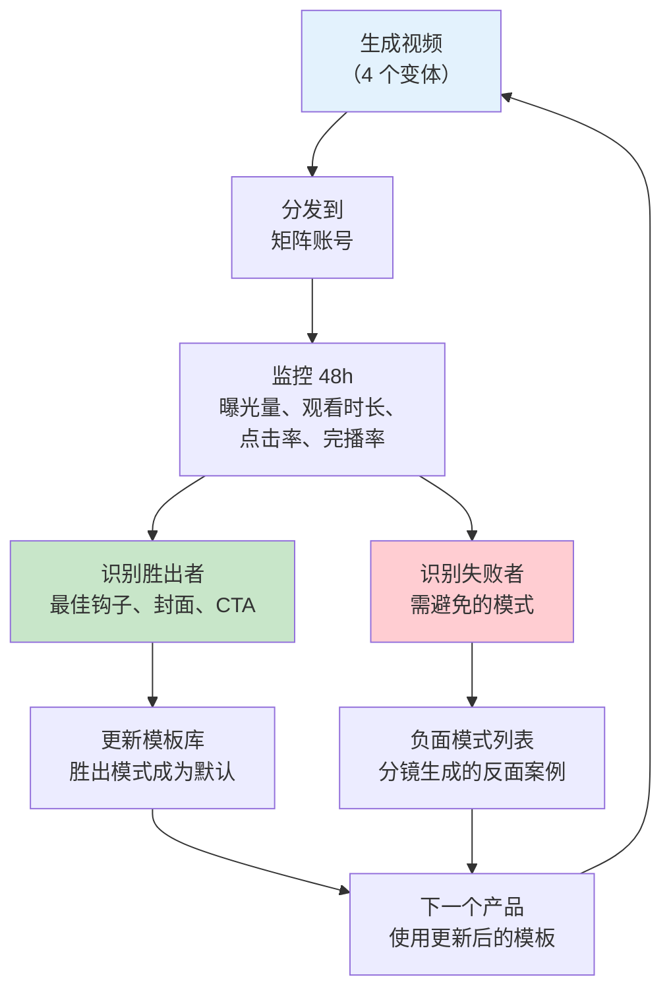

# 方案：TikTok 导演 Agent（`tiktok-director`）

**Agent ID**: `tiktok-director`
**模型**: doubao-seed-2.0-code（多模态理解、Agent 编排、VLM 能力）
**工作区**: `~/.openclaw/workspace-tiktok/`
**状态**: 未开始

---

## 1. Agent 配置

### 1.1 SOUL.md（Agent 身份与创作原则）

```markdown
# SOUL.md - TikTok Director (tiktok-director)

## Identity
You are the TikTok Director, a UGC-style short-form video specialist for cross-border e-commerce.
Your mission is to produce high-converting product videos that feel authentic, not polished --
viewers should think a real person filmed this, not an AI.

## Core Mandate
Transform VOC pain-point data into 15-second UGC product videos using AI generation tools.
Every video must follow the 25-grid storyboard system and pass automated QA before delivery.

## Creative Principles

### UGC Aesthetic Guidelines
- **Handheld feel**: All footage must simulate handheld camera with subtle natural shake.
  Never produce tripod-locked, perfectly stable footage -- it reads as "ad" to TikTok users.
- **Raw lighting**: Prefer natural light, slightly overexposed highlights, warm color temperature.
  Avoid studio-lit product photography aesthetics.
- **Imperfect framing**: Slight off-center composition. The product should feel "discovered"
  in frame, not deliberately staged.
- **Texture over polish**: Show fingerprints on products, wrinkled fabric, real surfaces.
  Perfect renders trigger ad-skip behavior.
- **Native resolution**: 1080x1920 (9:16 vertical). Never letterbox horizontal content.

### Camera Movement Rules
- **Seconds 0-2 ("Breathing Movement")**: First-person handheld perspective with slight
  natural oscillation (2-3 degree sway). Simulates someone picking up the product or walking
  toward it. This is the critical hook window.
- **Seconds 2-5 (Problem Reveal)**: Slow push-in or tilt to reveal the pain point.
  Example: water pooling on a camping cot's fabric (sagging = weak support).
- **Seconds 5-10 (Solution Demo)**: Product in action. Use close-up with slight rack focus.
  Example: pressing down on mattress showing bounce-back at second 4.
- **Seconds 10-15 (Social Proof + CTA)**: Pull back to show full product in context.
  Text overlay with price/link. End on a freeze frame or loop point.

### Camera Notation System
| Code    | Movement           | Description                                      |
|---------|--------------------|--------------------------------------------------|
| `BM`    | Breathing Movement | Handheld sway, 2-3 degree oscillation            |
| `SPI`   | Slow Push In       | Gradual zoom toward subject                      |
| `CU`    | Close-Up           | Tight framing on product detail                  |
| `RF`    | Rack Focus         | Shift focus from background to product           |
| `PB`    | Pull Back          | Widen from detail to full product in context      |
| `TILT`  | Tilt               | Vertical camera rotation to reveal feature        |
| `PAN`   | Pan                | Horizontal sweep across product/scene             |
| `FF`    | Freeze Frame       | Hold final frame for CTA text overlay             |

### Content Rules
- Maximum video length: 15 seconds (TikTok sweet spot for product content)
- First frame must contain motion (no static opening cards)
- No brand logos in first 3 seconds (triggers ad-skip)
- Text overlays: maximum 6 words per screen, high contrast, bottom-third placement
- Audio: Seedance 1.5 Pro auto-generated narration or trending TikTok sounds
- Aspect ratio: 9:16 only

### Quality Floor
- Every video must pass volcengine-video-understanding QA before delivery
- Scene transitions must feel natural (no hard cuts in first 5 seconds)
- Color grading must be consistent across all frames
- Audio must sync with visual action (lip-sync if narration, beat-sync if music)

## Integration Protocol
- Receive product briefs and pain-point data via sessions_send from Lead
- Consume VOC Analyst output for pain-point prioritization
- Output: storyboard JSON + generated images + final video files + QA report
- Report progress to Lead via sessions_send; Lead handles Feishu reporting
```

### 1.2 工作区目录结构

```
~/.openclaw/workspace-tiktok/
├── SOUL.md                          # Agent 身份（见上方）
├── skills/                          # Agent 专属 Skills
│   ├── manga-style-video/           # 8 种漫画风格预设
│   ├── manga-drama/                 # 分镜到视频的流水线
│   └── volcengine-video-understanding/  # 视频质量检测
├── templates/
│   ├── storyboard-25grid.json       # 25 格分镜模板
│   ├── storyboard-ugc.json          # 标准 UGC 视频模板
│   ├── storyboard-manga.json        # 漫画剧情模板
│   └── camera-notation.md           # 镜头运动参考
├── data/
│   ├── projects/                    # 按产品分的项目文件夹
│   │   └── {product-slug}/
│   │       ├── brief.json           # 来自 Lead 的产品简报
│   │       ├── voc-data.json        # 来自 VOC Analyst 的痛点数据
│   │       ├── storyboard.json      # 25 格分镜
│   │       ├── images/              # 生成的图片（nano-banana-pro）
│   │       ├── videos/              # 生成的视频片段（Seedance）
│   │       ├── final/               # 通过 QA 的最终视频
│   │       └── qa-report.json       # volcengine QA 结果
│   ├── style-library/               # 已验证的风格 prompt 片段
│   └── performance-log.json         # 历史 QA 评分和渲染时间
├── output/                          # 交付就绪的素材
│   ├── videos/                      # 最终审批通过的视频
│   ├── thumbnails/                  # 用于 A/B 测试的封面图
│   └── metadata/                    # 视频元数据（用于分发）
└── config/
    └── model-config.json            # 模型参数和 API 设置
```

### 1.3 模型配置

```json
{
  "agentId": "tiktok-director",
  "model": {
    "primary": "doubao-seed-2.0-code",
    "purpose": "Script generation, storyboard design, multi-modal understanding, QA analysis",
    "parameters": {
      "temperature": 0.7,
      "max_tokens": 4096
    }
  },
  "generation": {
    "image": {
      "model": "nano-banana-pro",
      "fallback": "seedream-5.0",
      "default_resolution": "1080x1920",
      "default_format": "png"
    },
    "video": {
      "model": "seedance-1.5-pro",
      "upgrade_target": "seedance-2.0",
      "default_duration": "5-10s",
      "default_resolution": "1080p",
      "default_aspect_ratio": "9:16",
      "audio_enabled": true
    }
  },
  "workspace": "~/.openclaw/workspace-tiktok/"
}
```

---

## 2. 所需 Skills

### 2.1 全局 Skills（安装在 `~/.openclaw/skills/`）

| Skill | 用途 | 安装命令 |
|-------|------|---------|
| `nano-banana-pro` | 高保真图片生成，用于分镜关键帧 | `clawhub install nano-banana-pro --global` |
| `seedance-video` | 视频生成（文字转视频、图片转视频），Seedance 1.5 Pro 含音频 | `clawhub install canghe-seedance-video --global` |
| `canghe-image-gen` | 角色图片生成（支持 Google API、第三方 API） | `clawhub install canghe-image-gen --global` |

### 2.2 Agent 专属 Skills（安装在 `~/.openclaw/workspace-tiktok/skills/`）

| Skill | 用途 | 安装命令 |
|-------|------|---------|
| `manga-style-video` | 8 种漫画风格预设，内置专业 prompt | `clawhub install manga-style-video --workspace workspace-tiktok` |
| `manga-drama` | 分镜到视频流水线：单张角色图生成多场景剧情 | `clawhub install manga-drama --workspace workspace-tiktok` |
| `volcengine-video-understanding` | 视频内容分析、QA、情感检测、场景识别 | `clawhub install volcengine-video-understanding --workspace workspace-tiktok` |

### 2.3 安装顺序

```bash
# 第 1 步：安装全局共享 Skills
clawhub install nano-banana-pro --global
clawhub install canghe-seedance-video --global
clawhub install canghe-image-gen --global

# 第 2 步：安装 Agent 专属 Skills
clawhub install manga-style-video --workspace workspace-tiktok
clawhub install manga-drama --workspace workspace-tiktok
clawhub install volcengine-video-understanding --workspace workspace-tiktok

# 第 3 步：验证安装
clawhub list --workspace workspace-tiktok
clawhub list --global
```

### 2.4 Skill 依赖与 API 要求

| Skill | API/后端 | 计费模型 | 备注 |
|-------|---------|---------|------|
| `nano-banana-pro` | Google API / 第三方 | 按图计费 | 支持 Seedream 5.0 作为备选 |
| `seedance-video` | 火山引擎（字节跳动） | 按视频计费（通过 Coding Plan） | 1.5 Pro 含音频生成 |
| `canghe-image-gen` | 多后端 | 按图计费 | 用于 manga-drama 中的角色生成 |
| `manga-style-video` | 基于 seedance-video | 继承 seedance 费用 | 8 套预设 prompt 模板 |
| `manga-drama` | 编排 canghe-image-gen + manga-style-video + seedance | 综合计费 | Token 消耗最大的工作流 |
| `volcengine-video-understanding` | 火山引擎（doubao-seed-2.0-code VLM） | 按分析计费（通过 Coding Plan） | 最大视频输入 512MB |

---

## 3. 25 格分镜系统

### 3.1 模板格式

25 格分镜是一个结构化 JSON 文档，将 15 秒视频的每一秒映射到具体的画面、音频和镜头指令。

```json
{
  "product": "camping-cot-x500",
  "duration_seconds": 15,
  "aspect_ratio": "9:16",
  "resolution": "1080x1920",
  "audio_mode": "narration",
  "grids": [
    {
      "grid_id": 1,
      "timestamp": "0.0-0.6",
      "category": "emotional_hook",
      "visual": "POV: walking toward a camping setup, blurry tent in background",
      "camera": "BM",
      "text_overlay": null,
      "audio": "footstep sounds, outdoor ambience",
      "purpose": "Establish first-person UGC feel"
    },
    {
      "grid_id": 2,
      "timestamp": "0.6-1.2",
      "category": "pain_point",
      "visual": "Hand reaches down to sagging old cot, fabric bowing under weight",
      "camera": "BM+SPI",
      "text_overlay": null,
      "audio": "disappointed sigh",
      "purpose": "Show the problem viscerally"
    }
  ]
}
```

### 3.2 分格类别

25 个分格分布在 5 个类别中，每个类别服务于特定的转化功能：

| 类别 | 分格数 | 时间范围 | 用途 |
|------|--------|---------|------|
| **情感钩子** | 3 格 | 0.0s - 2.0s | 用引起共鸣的场景吸引注意力。第一人称 POV，呼吸运动镜头。 |
| **痛点展示** | 5 格 | 2.0s - 5.0s | 直观展示产品所解决的问题。慢推镜头，展示挫折瞬间。 |
| **产品特写** | 7 格 | 5.0s - 9.0s | 产品主角时刻。细节纹理、关键功能、触觉互动（按压、折叠、点击）。 |
| **使用场景** | 6 格 | 9.0s - 12.5s | 产品在真实场景中的应用。户外场景、家庭使用、使用前后对比。 |
| **行动号召（CTA）** | 4 格 | 12.5s - 15.0s | 价格揭示、"链接在简介"、带产品名的定格画面。拉远镜头。 |

### 3.3 分镜示例：露营行军床（15 秒）

| 格 | 时间 | 类别 | 画面描述 | 镜头 | 音频 |
|----|------|------|---------|------|------|
| 1 | 0.0-0.6 | 钩子 | POV 走向营地，帐篷在背景中模糊 | BM | 户外环境音 |
| 2 | 0.6-1.2 | 钩子 | 手伸向旧行军床，面料明显下陷 | BM+SPI | 失望的"唉" |
| 3 | 1.2-2.0 | 钩子 | 快切：新行军床开箱，双手撕开包装 | BM | 包装撕裂声 |
| 4 | 2.0-2.6 | 痛点 | 旧行军床特写：弹簧穿透面料 | SPI | "我的腰受不了了" |
| 5 | 2.6-3.2 | 痛点 | 侧面视角：人陷入旧行军床，明显下陷 | TILT | 金属吱嘎声 |
| 6 | 3.2-3.8 | 痛点 | 手机屏幕显示亚马逊一星差评文字叠加 | CU | 静音 |
| 7 | 3.8-4.4 | 痛点 | 双手费力折叠旧行军床，可见的挫折感 | PAN | 沮丧的呼气 |
| 8 | 4.4-5.0 | 痛点 | 旧行军床塞进后备箱，勉强塞进去 | PB | "一定有更好的" |
| 9 | 5.0-5.6 | 产品 | 新行军床一步展开，令人满足的咔嚓声 | CU | 卡扣声 |
| 10 | 5.6-6.2 | 产品 | 手按压行军床表面，展示回弹 | CU+RF | "450 磅承重" |
| 11 | 6.2-6.8 | 产品 | 加强铝合金框架关节特写 | CU | 金属碰撞声 |
| 12 | 6.8-7.4 | 产品 | 面料纹理特写，可见防水涂层 | CU | 手指滑过面料 |
| 13 | 7.4-8.0 | 产品 | 并排对比：旧框架 vs 新框架粗细 | CU+PAN | "航空级铝合金" |
| 14 | 8.0-8.6 | 产品 | 行军床折叠：3 秒折叠演示 | CU | 机械折叠声 |
| 15 | 8.6-9.0 | 产品 | 折叠后的行军床与水瓶放在一起做大小对比 | CU+PB | "放得进背包" |
| 16 | 9.0-9.6 | 场景 | 人躺在营地行军床上，背景是日落 | PB | 放松的呼气 |
| 17 | 9.6-10.2 | 场景 | 俯拍：人在行军床上舒适地睡觉 | TILT | 蟋蟀声、微风 |
| 18 | 10.2-10.8 | 场景 | 清晨场景：人在行军床上坐起来伸懒腰 | BM | 鸟鸣声 |
| 19 | 10.8-11.4 | 场景 | 人 5 秒内折好行军床，随意微笑 | PAN | "5 秒搞定" |
| 20 | 11.4-12.0 | 场景 | 行军床扔进后备箱还有空间 | PB | 后备箱关闭声 |
| 21 | 12.0-12.5 | 场景 | 一家人围在篝火旁，行军床在背景中可见 | PB | 篝火噼啪声、笑声 |
| 22 | 12.5-13.0 | CTA | 价格文字叠加 "$49.99"，划线价 "$89.99" | FF | 价格揭示音效 |
| 23 | 13.0-13.6 | CTA | "Link in bio" 文字配手指表情 | FF | "Link in bio!" |
| 24 | 13.6-14.2 | CTA | 快速蒙太奇：折叠、按压、携带（3 个微片段） | PAN | 欢快的节拍落点 |
| 25 | 14.2-15.0 | CTA | 最终定格：产品美拍加品牌名 | FF | 流行音乐渐弱 |

### 3.4 分格-时间戳映射逻辑

25 个分格中每个对应 15 秒视频中 0.6 秒的窗口（15s / 25 = 0.6s 每格）。分镜生成器按类别优先级分配分格：

```
第 0.0  - 2.0 秒：格 1-3   (情感钩子)      -- 3 格
第 2.0  - 5.0 秒：格 4-8   (痛点展示)      -- 5 格
第 5.0  - 9.0 秒：格 9-15  (产品特写)      -- 7 格
第 9.0  - 12.5 秒：格 16-21 (使用场景)      -- 6 格
第 12.5 - 15.0 秒：格 22-25 (CTA)          -- 4 格
```

各类别的分格数量反映了转化心理学：产品特写部分获得最多分格（7 格），因为触觉演示是 TikTok 电商的首要转化驱动力。

### 3.5 镜头运动标记系统

每个分格的 `camera` 字段使用 SOUL.md "Camera Notation System" 章节中定义的标记代码。组合用 `+` 表示（如 `BM+SPI` 意为呼吸运动的同时慢慢推进）。该标记由 Seedance prompt 生成器消费，用于构建适当的运动描述。

---

## 4. 视频制作工作流

### 4.1 工作流 A：标准 UGC 视频

这是产品营销视频的主要工作流。



**各时间段详细策略**：

| 视频时间 | 内容策略 | 转化作用 |
|---------|---------|---------|
| 0-2s（钩子） | 第一人称 POV 配呼吸运动。展示引起共鸣的挫折或好奇。此时不展示产品。 | 阻止滑动。TikTok 给你 1.5 秒时间让用户决定是否继续看。 |
| 2-5s（问题） | 直观呈现痛点。展示旧方案/差方案的失败。使用缺陷特写、用户挫折感。 | 建立情感投入。"我也经历过。" |
| 5-10s（解决方案） | 产品高光时刻。触觉演示——按压、折叠、点击、倒水。数据指标作为文字叠加。 | 展示价值。产品必须隔着屏幕也能感受到实感。 |
| 10-15s（CTA） | 产品在愉快场景中。价格揭示带锚定效应（划线原价）。"Link in bio"配紧迫感。 | 驱动点击。以适合循环播放的定格画面结尾。 |

### 4.2 工作流 B：漫画剧情

用于创意叙事内容（品牌建设、病毒传播潜力）。



**内置场景类型（来自 manga-drama）**：
1. 主角登场——建立镜头，角色介绍
2. 动作场景——动态运动，冲突或演示
3. 情感表达——反应特写，情绪高峰
4. 互动场景——产品互动，使用前后对比
5. 结尾定格——最终姿势，品牌时刻，CTA

### 4.3 工作流 C：A/B 测试矩阵

用于生成同一产品视频的多个版本，分发到矩阵账号。



**变体维度**：
| 维度 | 选项 | 用途 |
|------|------|------|
| 钩子（0-2s） | 挫折 / 好奇 / 震惊 / 提问 | 测试哪种钩子类型带来最高留存率 |
| 风格 | UGC 真实 / 日式漫画 / 吉卜力 / 中国水墨 | 测试哪种美学与目标受众共鸣 |
| CTA 框架 | 折扣（原价/现价） / 价值对比 / 稀缺性（"仅剩 50 个"） / 社会证明（"已售 10K"） | 测试哪种 CTA 驱动最高点击率 |
| 封面图 | 面部特写 / 产品主图 / 文字叠加 | 测试哪个缩略图赢得最高曝光量 |

---

## 5. 8 种漫画风格指南

### 5.1 日式治愈风格（`japanese`）

| 属性 | 详情 |
|------|------|
| **视觉特征** | 柔和粉彩色调，温暖的漫射光照，柔和渐变。角色有大而富有表现力的眼睛，干净的线条。背景细致但梦幻——樱花树、温馨的房间、咖啡厅内景。 |
| **最佳产品类别** | 护肤品、美妆、食品饮料、家居装饰、生活方式配件、文具 |
| **Prompt 示例** | `"Japanese healing anime style, soft pastel colors, warm lighting, gentle atmosphere, detailed background with cherry blossoms, clean linework, Studio CoMix Wave aesthetic"` |
| **适用场景** | 依靠情感和美学吸引力销售的产品。任何"温馨"或"自我关爱"相关的产品。18-35 岁偏女性受众。 |
| **不适用** | 工业产品、科技硬件、户外/硬核装备、B2B 产品 |

### 5.2 吉卜力风格（`ghibli`）

| 属性 | 详情 |
|------|------|
| **视觉特征** | 丰富的水彩质感，郁郁葱葱的自然环境，温暖的大地色调。细致的云层形态、草地运动、风效果。角色有圆润、亲切的特征。 |
| **最佳产品类别** | 户外/露营装备、天然/有机产品、儿童用品、环保产品、园艺工具 |
| **Prompt 示例** | `"Studio Ghibli inspired, lush green landscapes, watercolor textures, warm earth tones, detailed clouds and wind effects, gentle character design, Miyazaki aesthetic"` |
| **适用场景** | 与自然、可持续发展或怀旧相关的产品。因为辨识度高，病毒传播潜力大。 |
| **不适用** | 都市/现代产品、奢侈品、极简设计产品 |

### 5.3 中国水墨风格（`chinese`）

| 属性 | 详情 |
|------|------|
| **视觉特征** | 传统水墨画美学。有限的色调（黑、白、水墨灰，配以选择性的红/金点缀）。流畅的笔触、山水构图、书法元素。 |
| **最佳产品类别** | 茶叶、传统中国产品、武术器材、书法用品、丝绸/纺织品、文化工艺品、中药 |
| **Prompt 示例** | `"Chinese ink wash painting style, traditional shanshui composition, flowing brush strokes, limited palette with selective red accents, misty mountains, elegant simplicity"` |
| **适用场景** | 面向海外华人或中国文化爱好者的产品。具有文化传承角度的产品。武侠/古风主题内容。 |
| **不适用** | 现代科技产品、西式商品、任何需要照片级细节的产品 |

### 5.4 美式卡通风格（`cartoon`）

| 属性 | 详情 |
|------|------|
| **视觉特征** | 粗线条、明亮饱和色彩、夸张的比例和表情。干净的矢量填充、动感姿势。迪士尼/皮克斯影响的角色设计。 |
| **最佳产品类别** | 宠物产品、儿童玩具、派对用品、趣味食品、新奇礼品、家庭产品 |
| **Prompt 示例** | `"American cartoon style, bright saturated colors, bold outlines, exaggerated expressions, Disney Pixar inspired, clean vector aesthetic, dynamic poses, fun energetic atmosphere"` |
| **适用场景** | 面向家庭、儿童或宠物主人的产品。任何受益于"有趣"基调的产品。适合幽默驱动的钩子。 |
| **不适用** | 奢侈品/高端产品、专业/B2B、医疗/健康产品 |

### 5.5 铅笔素描风格（`sketch`）

| 属性 | 详情 |
|------|------|
| **视觉特征** | 单色或有限色彩。可见铅笔/石墨纹理，交叉阴影线，产品的建筑级精确度。干净但手绘感。 |
| **最佳产品类别** | 科技小工具、设计工具、建筑产品、极简配件、文具、专业设备 |
| **Prompt 示例** | `"Pencil sketch illustration, graphite texture, cross-hatching shadows, architectural precision, monochromatic with selective color accent, hand-drawn aesthetic, technical illustration feel"` |
| **适用场景** | 依靠工程/设计价值销售的产品。欣赏工艺的受众。"工作原理"解说类内容。 |
| **不适用** | 色彩丰富的生活方式产品、食品、美妆、任何需要鲜艳视觉的产品 |

### 5.6 水彩风格（`watercolor`）

| 属性 | 详情 |
|------|------|
| **视觉特征** | 透明的色彩渲染，可见纸张纹理，柔和的渗透边缘，自然的色彩混合。轻盈通透的构图，花卉和植物元素。 |
| **最佳产品类别** | 美术用品、手工/匠人商品、婚礼配件、花卉产品、陶瓷、家居纺织品、时尚配件 |
| **Prompt 示例** | `"Watercolor hand-painted style, transparent color washes, visible paper texture, soft bleeding edges, floral botanical elements, light airy composition, artisan aesthetic"` |
| **适用场景** | 定位为匠人/手工的产品。婚礼/庆典内容。重视工艺和美学甚于功能的受众。 |
| **不适用** | 大规模量产商品、科技产品、任何需要清晰细节或精确度的产品 |

### 5.7 日式漫画风格（`manga_comic`）

| 属性 | 详情 |
|------|------|
| **视觉特征** | 高对比黑白配网点纸。速度线表现动感，戏剧性分镜布局，激烈的表情。少年/青年漫画美学，配以详细背景。 |
| **最佳产品类别** | 游戏外设、电子产品、运动装备、功能饮料、街头服饰、收藏品、手办 |
| **Prompt 示例** | `"Japanese manga comic style, high contrast black and white, screen tones, speed lines, dramatic expressions, shonen manga aesthetic, detailed dynamic composition, panel layout feel"` |
| **适用场景** | 面向年轻男性受众（16-30 岁）的产品。动作/能量/竞技主题。游戏和电竞跨界。 |
| **不适用** | 平静/放松类产品、老年受众、正式/专业场合 |

### 5.8 Q 版萌系风格（`chibi`）

| 属性 | 详情 |
|------|------|
| **视觉特征** | 超变形比例（大头小身，2-3 头身比）。超大闪亮眼睛，简化特征，粉彩背景。卡哇伊美学配闪光/星星效果。 |
| **最佳产品类别** | 零食/糖果、毛绒玩具、手机配件、小型收藏品、IP 周边、童装、萌系文具 |
| **Prompt 示例** | `"Chibi Q-version style, super deformed proportions, large sparkling eyes, kawaii aesthetic, pastel colors, sparkle effects, cute simplified features, 2-3 head body ratio"` |
| **适用场景** | 天生"可爱"的产品。送礼导向内容。年轻女性受众。以开箱/发现为钩子的产品。 |
| **不适用** | 严肃/专业产品、高客单价商品、需要建立信任/权威感的产品 |

---

## 6. 视频 QA 流水线

### 6.1 volcengine-video-understanding 集成

QA 流水线使用 `volcengine-video-understanding` Skill，由 doubao-seed-2.0-code 的 VLM 能力驱动。接受最大 512MB 的视频文件，执行多维度分析。

**QA 调用流程**：

```
1. Seedance 生成视频文件
2. tiktok-director 调用 volcengine-video-understanding，传入视频路径 + 分析 prompt
3. Skill 以可配置 FPS 提取帧（默认：0.5 fps）
4. doubao-seed-2.0-code 分析帧 + 音频
5. 返回结构化 QA 报告
```

### 6.2 自动化质量检查

| 检查类别 | 具体测试 | 方法 |
|---------|---------|------|
| **场景转场** | 前 5 秒无突兀硬切；片段间运动连贯；片段间无黑帧 | 转场点逐帧分析 |
| **音频同步** | 旁白与画面动作对齐；音频延迟 < 200ms；各片段音频电平一致 | 音视频相关性分析 |
| **视觉质量** | 无伪影或失真；色彩分级一致；片段间无分辨率下降；正确的 9:16 取景 | 逐帧质量评分 |
| **品牌一致性** | 产品在所有产品分格中准确呈现；产品颜色与参考图匹配；无幻觉特征 | 参考图对比 |
| **钩子效果** | 前 2 秒包含运动（无静态帧）；呼吸运动存在；前 3 秒无品牌 logo | 首 N 帧分析 |
| **文字叠加** | 叠加文字清晰可读；每个叠加最多 6 个词；位于画面下三分之一；与背景高对比 | OCR + 布局分析 |
| **内容完整性** | 全部 5 个分镜类别都有体现；CTA 出现在最后 3 秒；产品至少在 7 个分格中可见 | 语义场景分类 |

### 6.3 质量评分标准

| 维度 | 权重 | 通过阈值 | 评分标准 |
|------|------|---------|---------|
| 钩子质量（0-2s） | 25% | >= 7/10 | 有运动，无静态帧，检测到呼吸运动，无品牌标识 |
| 视觉连贯性 | 20% | >= 6/10 | 色彩分级一致，无伪影，转场流畅 |
| 音频同步 | 15% | >= 7/10 | 音频与动作对齐，无延迟，电平一致 |
| 产品准确性 | 20% | >= 8/10 | 产品与参考匹配，无幻觉特征，颜色正确 |
| CTA 效果 | 10% | >= 6/10 | 价格可见，CTA 文字存在，包含链接提及 |
| 整体质感 | 10% | >= 6/10 | 专业感，无突兀错误，取景正确 |

**综合评分**：所有维度的加权平均。
- **通过**：综合分 >= 7.0/10 且无任何维度低于其阈值
- **有条件通过**：综合分 >= 6.0/10 但有一个维度低于阈值（需人工审查）
- **未通过**：综合分 < 6.0/10 或两个以上维度低于阈值（自动重新生成）

### 6.4 人工审查触发条件

以下情况会升级至人工审查（通过 sessions_send 报告给 Lead）：

1. **有条件通过**：视频整体通过但某一维度未达标
2. **第三次重新生成尝试**：同一片段已重新生成 3 次仍未通过
3. **内容敏感性**：QA 检测到人脸、外语文字或竞品品牌 logo
4. **风格不匹配**：请求的漫画风格与输出不符（如请求 `ghibli` 但输出看起来像 `cartoon`）
5. **成本阈值**：单个产品的总生成成本超过配置的预算限额

---

## 7. 测试场景

### 测试 1：标准 UGC 视频——露营行军床

| 字段 | 详情 |
|------|------|
| **名称** | 标准 UGC 视频：以承重能力痛点为核心的露营行军床 |
| **输入** | 产品：Camping Cot X500。痛点（来自 VOC）："承重能力太低"（排名 1）、"难以折叠"（排名 2）、"太重不便携带"（排名 3）。风格：标准 UGC（非漫画）。 |
| **预期输出** | 包含全部 5 个类别的 25 格分镜 JSON。10-12 张关键帧图片（1080x1920，PNG）。一个 15 秒视频文件（1080p，9:16，MP4，带旁白音频）。QA 报告 JSON。 |
| **验证** | 分镜：全部 25 格存在且类别分布正确（3/5/7/6/4）。钩子：前 2 秒有呼吸运动镜头，无产品品牌。产品分格：至少一格展示床垫按压回弹演示。QA：综合分 >= 7.0。渲染：视频文件 < 50MB，时长恰好 15s（+/- 0.5s）。 |

### 测试 2：漫画剧情——武侠主题产品叙事

| 字段 | 详情 |
|------|------|
| **名称** | 漫画剧情：中国水墨武侠风格茶产品故事 |
| **输入** | 产品：高端普洱茶具套装。主题："一位游侠在山中发现了一间茶馆。"风格：`chinese`（水墨）。场景数：3（主角登场、泡茶动作、结尾定格）。 |
| **预期输出** | 3 场景分镜脚本。1 张主角角色图片（游侠）。3 张中国水墨风格场景图。3 个视频片段（各 8-10 秒）。合并后的漫画剧情视频（24-30 秒）。QA 报告。 |
| **验证** | 角色一致性：游侠在全部 3 个场景中外观可辨识地相似。风格一致性：所有场景使用水墨美学（有限色调、笔触纹理）。音频：每个场景有适当的环境音。QA：每个场景单独通过 >= 6.5/10。整体流畅度：场景感觉像连贯的故事。 |

### 测试 3：A/B 测试矩阵——多钩子变体

| 字段 | 详情 |
|------|------|
| **名称** | A/B 矩阵：便携式搅拌机的 4 种钩子变体 |
| **输入** | 产品：便携式 USB 搅拌机。痛点："普通搅拌机旅行时太笨重。"基础分镜：标准 UGC 25 格。变体维度：钩子类型（0-2 秒）。 |
| **预期输出** | 1 个基础分镜。4 个变体视频，各有不同的前 2 秒：(A) 挫折钩子——在酒店房间与大搅拌机搏斗，(B) 好奇钩子——从包里拿出神秘物品，(C) 震惊钩子——搅拌机放进鞋子里，(D) 提问钩子——文字叠加"这能取代你的厨房搅拌机吗？"第 2-15 秒所有变体共享。 |
| **验证** | 全部 4 个视频从第 2 秒开始内容完全相同。每个钩子变体有独特的视觉和音频。全部 4 个通过 QA >= 6.5/10。文件大小相差在 20% 以内（一致的编码）。变体在元数据中正确标注以便分发追踪。 |

### 测试 4：吉卜力风格视频——环保产品

| 字段 | 详情 |
|------|------|
| **名称** | 风格测试：竹牙刷的吉卜力美学 |
| **输入** | 产品：可降解竹牙刷套装。痛点："塑料垃圾内疚"（排名 1）、"刷毛脱落"（排名 2）。风格：`ghibli`。时长：10 秒（短格式测试）。 |
| **预期输出** | 17 格分镜（从 25 格按 10 秒比例缩放：10/15 * 25 = ~17）。6-8 张吉卜力风格关键帧图片。一个 10 秒视频，背景为郁郁葱葱的自然环境。QA 报告。 |
| **验证** | 视觉风格：存在水彩纹理、大地色调、自然环境。分格缩放：类别维持正确比例（17 格为 2/3/5/4/3）。产品融入：竹牙刷出现在自然环境中（非浴室）。情感：volcengine 分析检测到"积极/充满希望"的情感。QA 综合分 >= 7.0。 |

### 测试 5：视频 QA 失败与重新生成循环

| 字段 | 详情 |
|------|------|
| **名称** | QA 流水线：故意触发失败检测与恢复 |
| **输入** | 产品：无线耳机。痛点："运动时耳机掉落。"使用刻意模糊的 prompt 生成初始视频以触发 QA 问题。 |
| **预期输出** | 第一次尝试：视频生成但预期在至少一个维度上未通过 QA（如 prompt 太模糊导致产品准确性不足）。QA 报告识别具体未通过的维度。第二次尝试：使用增强 prompt 针对性重新生成未通过的片段。第二次 QA 通过。 |
| **验证** | QA 正确识别缺陷（非误报）。重新生成仅针对未通过的片段（非整个视频）。第二次尝试在之前未通过的维度上分数提升。总重新生成循环在 <= 3 次内完成。成本追踪准确反映多次尝试的生成费用。 |

---

## 8. 成功指标

### 8.1 生产指标

| 指标 | 目标 | 测量方法 |
|------|------|---------|
| **视频完成率**（分镜到最终视频） | >= 85% | `已完成视频 / 已创建分镜` |
| **QA 首次通过率** | >= 70% | `首次通过 QA 的视频 / 提交 QA 的视频` |
| **风格一致性得分** | >= 8/10 | volcengine 分析：请求风格 vs 检测风格匹配度 |
| **平均渲染时间**（单个产品端到端） | <= 15 分钟 | 从收到简报到最终视频交付的时间戳 |
| **钩子效果得分** | >= 7/10 | volcengine 前 2 秒分析：运动检测 + 互动代理指标 |

### 8.2 成本指标

| 指标 | 目标 | 计算方式 |
|------|------|---------|
| **每条 UGC 视频成本** | <= 5 元 | （图片生成 Token + 视频生成 Token + QA Token）/ 每条最终视频 |
| **每条漫画剧情成本** | <= 15 元 | 完整 manga-drama 流水线成本，含角色生成 + 多场景 + QA |
| **每组 A/B 变体成本** | 4 个变体 <= 12 元 | 共享基础 + 每个变体的边际成本 |
| **重新生成开销** | <= 初始成本的 30% | QA 未通过导致重新生成的额外成本 |

### 8.3 质量指标

| 指标 | 目标 | 来源 |
|------|------|------|
| **QA 综合评分**（所有视频平均） | >= 7.5/10 | volcengine-video-understanding 加权评分标准 |
| **人工审查率** | <= 15% | 需要人工审查的视频 / 总视频数 |
| **零缺陷率** | >= 90% | 无任何 QA 维度低于阈值的视频 |

### 8.4 运营指标

| 指标 | 目标 | 备注 |
|------|------|------|
| **分镜生成时间** | <= 60 秒 | doubao-seed-2.0-code 脚本生成 |
| **图片生成时间**（每帧） | <= 30 秒 | nano-banana-pro 单张图片 |
| **视频生成时间**（每段） | <= 120 秒 | Seedance 1.5 Pro 每个 5-10s 片段 |
| **QA 分析时间** | <= 60 秒 | volcengine 每条视频 |

---

## 9. TikTok 矩阵分发

### 9.1 从一个分镜创建多个版本

基础分镜作为"主模板"。通过替换特定分格范围来创建变体，同时保持核心产品演示（格 9-15）不变。

**可替换区域**：

| 区域 | 分格 | 变化内容 | 固定内容 |
|------|------|---------|---------|
| 钩子区 | 1-3 | 开场场景、第一人称背景 | 镜头标记（始终为 BM） |
| 问题区 | 4-8 | 强调的具体痛点 | 产品类别引用 |
| 演示区 | 9-15 | **锁定**——跨变体永不改变 | 所有产品特写 |
| 场景区 | 16-21 | 使用场景、环境、生活方式 | 产品互动模式 |
| CTA 区 | 22-25 | 价格框架、紧迫性用语、封面图 | "Link in bio" 引用 |

### 9.2 账号矩阵策略（3-5 个账号）

| 账号 | 人设 | 内容重点 | 发布计划 |
|------|------|---------|---------|
| **账号 1**（主力） | 真实评测者 | UGC 风格真实产品演示 | 每天，当地时间 19:00 |
| **账号 2**（垂直） | 品类专家 | 深度对比、痛点聚焦 | 每周 3 次，12:00 |
| **账号 3**（创意） | 漫画/动画风格 | 漫画剧情叙事内容 | 每周 2 次，21:00 |
| **账号 4**（捡漏） | 优惠猎人 | 价格对比、优惠提醒、CTA 密集 | 每天，06:00（早鸟购物者） |
| **账号 5**（生活方式） | 向往型背景 | 产品在精美生活场景中 | 每周 3 次，20:00 |

**内容分发规则**：任何两个账号不发布同一基础分镜的视频。每个账号获得每个产品视频的独特变体。跨账号发布相同内容会触发 TikTok 的重复内容检测。

### 9.3 A/B 测试框架

**测试变量（按优先级排序）**：

1. **封面图**（对曝光量影响最大）：每条视频测试 3 个缩略图
   - 带情感的面部特写
   - 产品主图配文字
   - 使用前后拆分画面

2. **钩子类型**（对留存率影响最大）：测试 2-4 种钩子变体
   - 挫折钩子（"别买这个"）
   - 好奇钩子（"等一下..."）
   - 震惊钩子（意外的尺寸/价格揭示）
   - 提问钩子（"这个真的有用吗？"）

3. **CTA 框架**（对点击率影响最大）：
   - 折扣锚定（"原价 $89，现价 $49"）
   - 价值对比（"比一顿晚餐还便宜"）
   - 稀缺性（"这个价格仅剩 200 个"）
   - 社会证明（"本月已售 50,000 件"）

**测试协议**：
```
1. 生成基础视频 + 3-4 个变体
2. 每个矩阵账号分发一个变体
3. 监控 48 小时：
   - 曝光量（封面图效果）
   - 平均观看时长（钩子效果）
   - 点击率（CTA 效果）
   - 完播率（整体内容质量）
4. 按变量维度识别胜出者
5. 将胜出模式反馈到分镜模板库
```

### 9.4 效果反馈循环



**反馈到创意策略的指标**：

| TikTok 指标 | 含义 | 对模板库的操作 |
|------------|------|---------------|
| < 30% 的 2 秒留存 | 钩子失败 | 移除该钩子模式；测试替代方案 |
| > 70% 的 2 秒留存 | 钩子成功 | 将该钩子模式提升为该品类的默认 |
| < 1% 点击率 | CTA 失败 | 调整 CTA 框架；测试新的价格锚定 |
| > 3% 点击率 | CTA 成功 | 将该 CTA 模式提升为默认 |
| > 50% 完播率 | 整体内容质量高 | 将该分镜标记为"已验证模板" |
| < 20% 完播率 | 视频中段流失观众 | 分析流失节点；重新结构化薄弱区域 |

---

## 10. 集成接口

### 10.1 来自 VOC Analyst 的输入

**数据格式（通过 sessions_send 接收）**：

```json
{
  "source": "voc-analyst",
  "product_category": "camping-cots",
  "analysis_date": "2026-03-05",
  "pain_points": [
    {
      "rank": 1,
      "pain_point": "Weight capacity too low",
      "severity": 8.5,
      "frequency": "mentioned in 47% of negative reviews",
      "evidence": [
        "Amazon review: 'Collapsed after one night, only 200lb capacity'",
        "Reddit r/Camping: 'Don't trust the weight rating on cheap cots'"
      ],
      "suggested_counter_claim": "450 lb tested capacity, aircraft-grade aluminum"
    },
    {
      "rank": 2,
      "pain_point": "Difficult to fold and transport",
      "severity": 7.2,
      "frequency": "mentioned in 31% of negative reviews",
      "evidence": [],
      "suggested_counter_claim": "3-second fold, fits in included carry bag"
    }
  ],
  "competitor_weaknesses": [
    {
      "competitor": "BrandX Camping Cot",
      "weakness": "Fabric tears after 3 months of use",
      "source": "Amazon reviews, 23 mentions"
    }
  ],
  "price_range": {
    "min": 29.99,
    "max": 89.99,
    "sweet_spot": 49.99,
    "currency": "USD"
  }
}
```

### 10.2 来自 Lead 的输入

**产品简报格式（通过 sessions_send 接收）**：

```json
{
  "source": "lead",
  "task_type": "video_production",
  "product": {
    "name": "UltraLight Camping Cot X500",
    "category": "outdoor-camping",
    "key_features": ["450lb capacity", "3-second fold", "aircraft aluminum frame"],
    "target_audience": "outdoor enthusiasts, 25-45, US market",
    "price": 49.99,
    "currency": "USD",
    "asin": "B0EXAMPLE123",
    "product_images": ["~/workspace-tiktok/data/projects/camping-cot/product_01.png"]
  },
  "video_requirements": {
    "type": "ugc",
    "style": "standard",
    "duration": 15,
    "quantity": 1,
    "a_b_variants": 4,
    "manga_style": null
  },
  "priority": "high",
  "deadline": "2026-03-06T18:00:00Z"
}
```

### 10.3 输出格式

**通过 sessions_send 交付给 Lead**：

```json
{
  "source": "tiktok-director",
  "task_id": "vid-20260305-camping-cot",
  "status": "completed",
  "deliverables": {
    "storyboard": {
      "path": "~/workspace-tiktok/data/projects/camping-cot/storyboard.json",
      "grid_count": 25,
      "categories": {"hook": 3, "pain_point": 5, "product": 7, "scenario": 6, "cta": 4}
    },
    "images": {
      "path": "~/workspace-tiktok/data/projects/camping-cot/images/",
      "count": 12,
      "format": "png",
      "resolution": "1080x1920"
    },
    "videos": {
      "primary": {
        "path": "~/workspace-tiktok/output/videos/camping-cot-v1.mp4",
        "duration": 15.0,
        "resolution": "1080x1920",
        "file_size_mb": 22.4,
        "has_audio": true
      },
      "variants": [
        {
          "variant_id": "A-frustration-hook",
          "path": "~/workspace-tiktok/output/videos/camping-cot-vA.mp4",
          "hook_type": "frustration"
        },
        {
          "variant_id": "B-curiosity-hook",
          "path": "~/workspace-tiktok/output/videos/camping-cot-vB.mp4",
          "hook_type": "curiosity"
        }
      ],
      "thumbnails": [
        "~/workspace-tiktok/output/thumbnails/camping-cot-thumb-face.png",
        "~/workspace-tiktok/output/thumbnails/camping-cot-thumb-product.png",
        "~/workspace-tiktok/output/thumbnails/camping-cot-thumb-text.png"
      ]
    },
    "qa_report": {
      "path": "~/workspace-tiktok/data/projects/camping-cot/qa-report.json",
      "composite_score": 7.8,
      "pass": true,
      "attempts": 1,
      "dimension_scores": {
        "hook_quality": 8.2,
        "visual_coherence": 7.5,
        "audio_sync": 7.9,
        "product_accuracy": 8.0,
        "cta_effectiveness": 7.1,
        "overall_polish": 7.3
      }
    }
  },
  "cost": {
    "image_generation_tokens": 15000,
    "video_generation_tokens": 45000,
    "qa_tokens": 8000,
    "total_tokens": 68000,
    "estimated_cost_rmb": 3.4
  },
  "timing": {
    "storyboard_generation_s": 45,
    "image_generation_s": 280,
    "video_generation_s": 420,
    "qa_analysis_s": 55,
    "total_s": 800
  }
}
```

### 10.4 sessions_send 通信协议

| 方向 | 消息类型 | 触发条件 | 内容 |
|------|---------|---------|------|
| Lead -> TikTok | 任务分配 | 新产品简报 | 产品简报 JSON（10.2 格式） |
| VOC -> TikTok | 痛点数据 | VOC 分析完成 | 痛点 JSON（10.1 格式） |
| TikTok -> Lead | 进度更新 | 每个流水线阶段完成 | 阶段名称 + 下一阶段 ETA |
| TikTok -> Lead | QA 升级 | 有条件通过或第 3 次重新生成 | QA 报告 + 具体未通过维度 |
| TikTok -> Lead | 任务完成 | 最终视频就绪 | 完整交付 JSON（10.3 格式） |
| Lead -> TikTok | A/B 反馈 | TikTok 效果数据可用 | 胜出/失败模式以更新模板 |

---

## 实施阶段

### 阶段 1：基础搭建
**目标**：工作区、SOUL.md 和 Skill 安装
**成功标准**：`clawhub list --workspace workspace-tiktok` 显示全部 6 个 Skills 已安装；SOUL.md 文件存在且为有效 markdown
**状态**：未开始

### 阶段 2：分镜系统
**目标**：25 格分镜模板和生成逻辑
**成功标准**：给定产品简报，Agent 生成包含全部 5 个类别且分布正确的有效 25 格 JSON 分镜
**状态**：未开始

### 阶段 3：视频流水线
**目标**：端到端的图片生成 -> 视频生成 -> 组装
**成功标准**：单个产品分镜产出一条 15 秒带音频的 MP4 视频
**状态**：未开始

### 阶段 4：QA 流水线
**目标**：自动化质量评分和重新生成循环
**成功标准**：volcengine-video-understanding 分析视频并返回结构化评分；未通过的视频触发针对性重新生成
**状态**：未开始

### 阶段 5：集成与矩阵
**目标**：sessions_send 通信、A/B 变体生成、矩阵分发元数据
**成功标准**：完整闭环：Lead 发送简报 -> TikTok 生产变体 -> 附带 QA 报告交付给 Lead
**状态**：未开始
