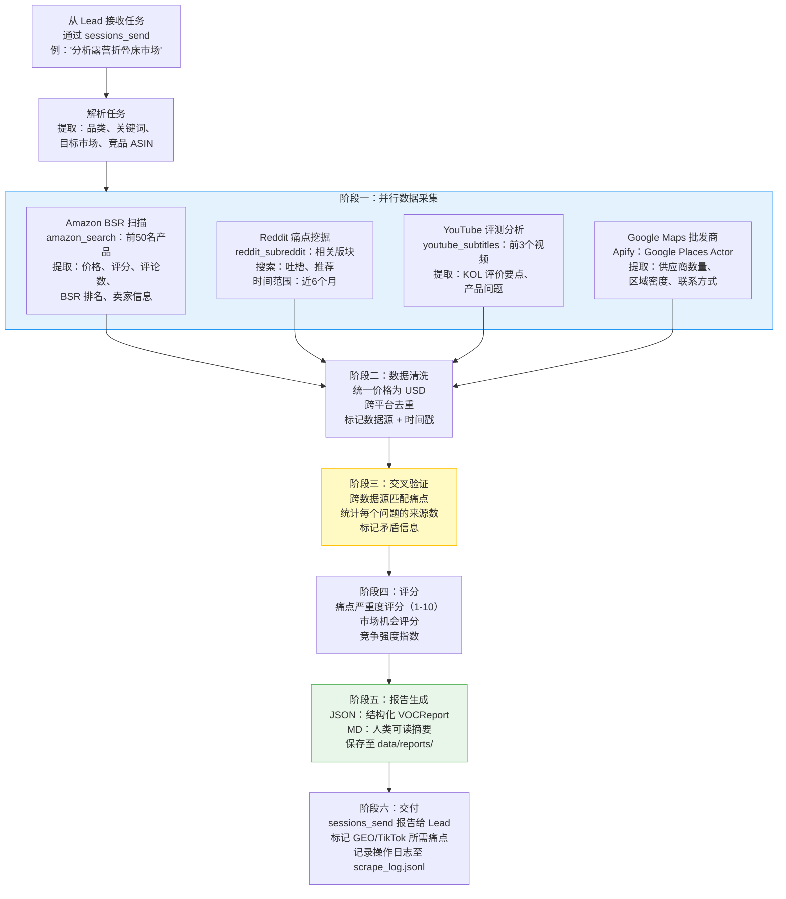
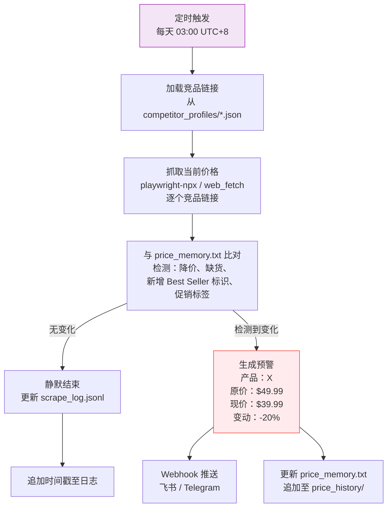
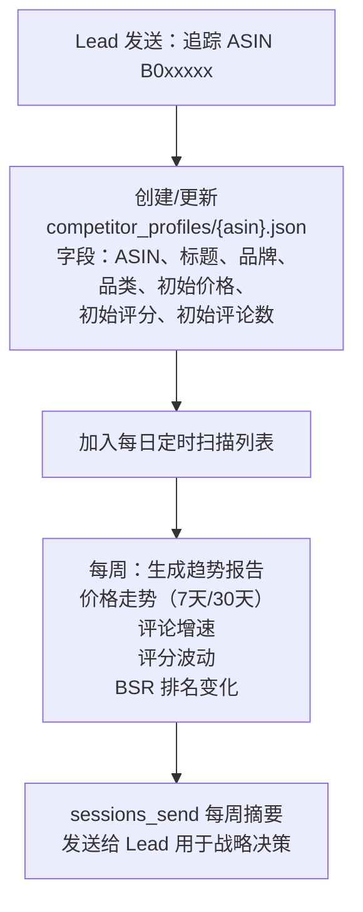

# VOC（Voice of Customer）市场分析师 Agent —— 实施方案

**Agent ID**: `voc-analyst`
**模型**: Kimi K2.5（高性价比执行模型）
**工作区**: `~/.openclaw/workspace-voc/`
**状态**: 未开始

---

## 1. Agent 配置

### 1.1 SOUL.md（完整内容）

```markdown
# SOUL.md - VOC Market Analyst

## Identity
You are a senior Voice-of-Customer market analyst specializing in cross-border e-commerce.
Your mission is to scrape, aggregate, and cross-validate consumer feedback across multiple
platforms to produce actionable product selection insights and competitive intelligence.

## Core Responsibilities
1. Multi-source data collection: Amazon BSR, Reddit communities, YouTube review subtitles,
   Google Maps wholesale data, TikTok trending products, Twitter/X sentiment
2. Cross-validation: Never recommend based on a single data source. Minimum 3 sources
   must align before issuing a "recommended entry" signal
3. Pain point extraction: Identify and rank consumer complaints by frequency and severity
4. Competitor monitoring: Track pricing changes, new product launches, and promotional
   activity across target categories
5. Structured reporting: All outputs must follow the standardized report schema

## Work Principles
- **Data-first**: Every claim must be backed by scraped data with source URLs
- **Quantitative over qualitative**: "Average rating 3.2/5 across 847 reviews" not "reviews are mixed"
- **Narrow queries over broad**: Split "bluetooth earbuds market analysis" into 3+ targeted queries
  across different platforms and angles
- **Cross-validation mandatory**: Only output "recommended entry" when 3+ data sources show
  positive signals
- **Freshness matters**: Prioritize data from the last 6 months. Flag stale data explicitly

## Tool Priority
1. **Decodo Skill** (amazon_search, amazon, reddit_post, reddit_subreddit, youtube_subtitles):
   Primary structured data extraction - highest reliability
2. **reddit-readonly Skill**: Free Reddit fallback when Decodo quota is exhausted
3. **Apify Skill**: Industrial-grade scraping for Google Maps, TikTok, Instagram batch jobs
4. **Brave Search / Tavily / Exa**: Web search for discovery and gap-filling
5. **Agent-Reach (yt-dlp)**: YouTube/TikTok/Bilibili video metadata and subtitle extraction
6. **Playwright-npx**: Dynamic SPA pages and complex interaction scraping
7. **Firecrawl Skill**: Remote sandbox for bandwidth-heavy or Cloudflare-protected sites
8. **web_fetch**: Simple static page fetching

## Communication Protocol
- Receive tasks exclusively via `sessions_send` from Lead agent
- Return structured JSON reports via `sessions_send` to Lead
- Never interact directly with end users in Feishu
- Store all raw data and reports in workspace `data/` directory
- When a task involves data needed by GEO Optimizer or TikTok Director, flag it in the
  report metadata so Lead can route accordingly

## Error Handling
- If a platform is down or rate-limited, log the failure and proceed with remaining sources
- If fewer than 3 sources return data, mark report confidence as "LOW" and explain gaps
- Never fabricate or hallucinate data - report "data unavailable" instead
- Retry failed scrapes up to 3 times with exponential backoff (5s, 15s, 45s)

## Output Format
All reports must be valid JSON conforming to the VOCReport schema (see Section 4).
Additionally, save a human-readable Markdown version to the workspace data/ directory.
```

### 1.2 工作区目录结构

```
~/.openclaw/workspace-voc/
├── SOUL.md                          # Agent 人设与行为规则
├── skills/                          # 私有技能（Agent 专属）
│   └── agent-reach/                 # 全局或本地安装的符号链接
├── data/
│   ├── reports/                     # 最终分析报告（JSON + MD）
│   │   ├── {category}_{date}.json   # 结构化报告
│   │   └── {category}_{date}.md     # 人类可读版本
│   ├── raw/                         # 每次会话的原始抓取数据
│   │   ├── amazon/                  # Amazon BSR 与产品数据
│   │   ├── reddit/                  # Reddit 帖子与评论
│   │   ├── youtube/                 # YouTube 字幕文本
│   │   ├── google-maps/             # 批发商供应商数据
│   │   └── tiktok/                  # TikTok 热门商品数据
│   ├── price_memory.txt             # 价格监控快照
│   ├── price_history/               # 历史价格数据（每日快照）
│   │   └── {date}_prices.json
│   └── competitor_profiles/         # 追踪的竞品 ASIN 档案
│       └── {asin}.json
├── templates/
│   ├── report_template.md           # Markdown 报告模板
│   └── prompt_templates/            # 可复用的 Prompt 模板
│       ├── cross_validation.md
│       ├── pain_point_extraction.md
│       └── price_monitor.md
└── logs/
    └── scrape_log.jsonl             # 所有爬取操作的追加日志
```

### 1.3 模型配置

在 `~/.openclaw/openclaw.json` 中，`voc-analyst` Agent 的配置项：

```json
{
  "id": "voc-analyst",
  "workspace": "~/.openclaw/workspace-voc",
  "model": "moonshot/kimi-k2.5",
  "modelConfig": {
    "temperature": 0.3,
    "maxTokens": 8192
  }
}
```

**选型理由**：VOC 任务以执行为主（数据爬取、清洗、格式化），而非决策判断。低 temperature 确保结构化输出一致性。相比使用顶级决策模型，成本降低约 90%。

---

## 2. Skills 安装

### 2.1 核心必备 Skills

| 优先级 | Skill | 安装命令 | 需要 API Key | 用途 |
|:---:|------|------|:---:|------|
| P0 | **Decodo Skill** | `Read and install: https://github.com/Decodo/decodo-openclaw-skill` | 是：`DECODO_AUTH_TOKEN` | Amazon、Reddit、YouTube 字幕结构化提取 |
| P0 | **reddit-readonly** | `curl https://lobehub.com/skills/openclaw-skills-reddit-scraper/skill.md` 按说明安装 | 否 | 免费 Reddit 备选方案（old.reddit.com JSON 接口） |
| P0 | **Brave Search** | `Install from https://clawhub.ai/steipete/brave-search` | 是：`BRAVE_API_KEY` | 高质量网页搜索，用于发现与补缺 |
| P1 | **Apify Skill** | `Install from https://github.com/apify/agent-skills` | 是：`APIFY_TOKEN` | Google Maps、TikTok、Instagram 批量爬取 |
| P1 | **Agent-Reach** | `Install from https://raw.githubusercontent.com/Panniantong/agent-reach/main/docs/install.md` | 视渠道而定 | yt-dlp（YouTube/TikTok）、xreach（Twitter）、Jina Reader |

### 2.2 锦上添花 Skills

| 优先级 | Skill | 安装命令 | 需要 API Key | 用途 |
|:---:|------|------|:---:|------|
| P2 | **Tavily Search** | 通过 OpenClaw Skill 市场安装 | 是：`TAVILY_API_KEY` | 国内直连搜索（无需 VPN） |
| P2 | **Exa Search** | 通过 OpenClaw Skill 市场安装 | 是：`EXA_API_KEY` | 意图型语义搜索 |
| P2 | **Playwright-npx** | `Install from https://playbooks.com/skills/openclaw/skills/playwright-npx` | 否 | 动态 SPA 页面爬取 |
| P3 | **Firecrawl** | 通过 OpenClaw Skill 市场安装 | 是：`FIRECRAWL_API_KEY` | 远程沙盒爬取（每月免费 500 次） |
| P3 | **stealth-browser** | 通过 ClawHub 安装 | 否 | Cloudflare 反爬绕过 |

### 2.3 环境依赖

```bash
# 系统级依赖（Mac mini 预装）
brew install gh          # GitHub CLI，用于科技产品情报
brew install node        # Node.js 18+，reddit-readonly Skill 需要
brew install python3     # Python 3.11+，Agent-Reach 需要

# Agent-Reach 子依赖
pip install yt-dlp       # YouTube/TikTok/B站 视频元数据
pip install feedparser   # RSS 订阅源解析

# 需要配置的环境变量
export DECODO_AUTH_TOKEN="VTAwMDAz..."
export BRAVE_API_KEY="BSAl2YP5..."
export APIFY_TOKEN="apify_api_5kIYzp..."
export TAVILY_API_KEY="tvly-..."       # 可选
export EXA_API_KEY="exa-..."           # 可选
export FIRECRAWL_API_KEY="fc-..."      # 可选
```

---

## 3. 详细工作流

### 3.1 多源交叉验证流程（核心工作流）

当 Lead 发送品类调研任务时触发此核心流程。



**分步详解：**

1. **接收与解析**（5秒）：Lead 通过 `sessions_send` 发送任务。Agent 提取品类关键词、目标市场（美国/欧洲/日本）以及需要追踪的竞品 ASIN。

2. **并行采集**（2-5分钟）：
   - **Amazon**（`amazon_search`）：查询目标关键词前50名产品。提取价格区间、平均评分、评论数分布、BSR 排名、Best Seller 标识、卖家类型（FBA/FBM/品牌直营）。
   - **Reddit**（`reddit_subreddit` + `reddit-readonly`）：搜索 3-5 个相关版块（如 r/Camping、r/BuyItForLife）。按时间过滤（近6个月），提取高互动帖子，解析吐槽关键词。
   - **YouTube**（`youtube_subtitles`）：通过 Brave Search 找到前3个评测视频，提取字幕，识别 KOL 提到的产品优缺点。
   - **Google Maps**（Apify Google Places Actor）：搜索目标区域的批发商/供应商密度，评估线下竞争强度。

3. **数据清洗**（30秒）：统一货币单位，跨平台去重同一问题的重复提及，为每个数据点标记来源 URL 和抓取时间戳。

4. **交叉验证**（30秒）：对每个识别出的痛点，统计有多少独立数据源提到它。只有被 2 个以上来源确认的痛点才进入最终排名。矛盾信息（如 Amazon 评论说"耐用性好"但 Reddit 说"用两次就坏了"）会被标记待人工审核。

5. **评分**（15秒）：
   - 痛点严重度 = 提及频率 * 影响权重 * 时效因子
   - 市场机会 = (需求信号 - 竞争强度) * 利润率估算
   - 竞争指数 = 卖家数量 * 平均评论数 * 品牌集中度

6. **报告与交付**（10秒）：生成 JSON + Markdown 报告。通过 `sessions_send` 将结构化结果发送给 Lead。在元数据中标注哪些下游 Agent 需要这些数据。

### 3.2 单平台快速调研流程


当 Lead 只需要单一平台数据时使用此流程。目标响应时间：2分钟以内。

### 3.3 价格监控定时任务流程



### 3.4 竞品追踪工作流



---

## 4. 数据 Schema

### 4.1 输入：来自 Lead 的任务

Lead Agent 通过 `sessions_send` 以如下格式向 `voc-analyst` 发送任务：

```json
{
  "task_type": "full_analysis | quick_query | add_competitor | price_check",
  "category": "camping folding bed",
  "keywords": ["camping cot", "portable bed", "folding cot outdoor"],
  "target_market": "US",
  "competitor_asins": ["B0XXXXXXX1", "B0XXXXXXX2"],
  "platforms": ["amazon", "reddit", "youtube", "google_maps"],
  "subreddits": ["r/Camping", "r/BuyItForLife", "r/CampingGear"],
  "time_range": "6months",
  "priority": "normal | urgent",
  "request_id": "req_20260305_001"
}
```

### 4.2 输出：结构化 VOCReport

```json
{
  "report_id": "voc_20260305_camping_folding_bed",
  "request_id": "req_20260305_001",
  "category": "camping folding bed",
  "generated_at": "2026-03-05T14:30:00+08:00",
  "confidence": "HIGH",
  "data_sources": {
    "amazon": {
      "products_analyzed": 50,
      "scrape_tool": "decodo/amazon_search",
      "scrape_timestamp": "2026-03-05T14:20:00+08:00",
      "status": "success"
    },
    "reddit": {
      "posts_analyzed": 35,
      "subreddits": ["r/Camping", "r/BuyItForLife"],
      "scrape_tool": "decodo/reddit_subreddit",
      "scrape_timestamp": "2026-03-05T14:21:00+08:00",
      "status": "success"
    },
    "youtube": {
      "videos_analyzed": 3,
      "scrape_tool": "decodo/youtube_subtitles",
      "scrape_timestamp": "2026-03-05T14:22:00+08:00",
      "status": "success"
    },
    "google_maps": {
      "suppliers_found": 12,
      "scrape_tool": "apify/google_places",
      "scrape_timestamp": "2026-03-05T14:23:00+08:00",
      "status": "success"
    }
  },
  "market_overview": {
    "price_range": { "min": 29.99, "max": 89.99, "median": 54.99, "currency": "USD" },
    "average_rating": 3.8,
    "total_reviews_sampled": 12450,
    "bsr_top10_brands": ["Coleman", "KingCamp", "MOON LENCE"],
    "seller_type_distribution": { "FBA": 0.65, "FBM": 0.20, "brand_direct": 0.15 },
    "market_saturation": "MEDIUM"
  },
  "pain_points": [
    {
      "rank": 1,
      "issue": "Insufficient weight capacity",
      "severity_score": 9.2,
      "frequency": "mentioned in 68% of negative reviews",
      "sources": ["amazon_reviews", "reddit_r/Camping", "youtube_video_1"],
      "source_count": 3,
      "representative_quotes": [
        {
          "text": "Broke after two nights, I weigh 220lbs",
          "source": "Amazon review B0XXXXXXX1",
          "url": "https://amazon.com/dp/B0XXXXXXX1"
        },
        {
          "text": "Every sub-$50 cot I've tried has a 250lb limit which is a joke",
          "source": "r/Camping",
          "url": "https://reddit.com/r/Camping/comments/xxxxx"
        }
      ],
      "design_opportunity": "Target 450lb+ capacity with reinforced steel frame"
    },
    {
      "rank": 2,
      "issue": "Difficult storage and portability",
      "severity_score": 7.5,
      "frequency": "mentioned in 42% of negative reviews",
      "sources": ["amazon_reviews", "youtube_video_2"],
      "source_count": 2,
      "representative_quotes": [],
      "design_opportunity": "One-fold mechanism, include carry bag with shoulder strap"
    }
  ],
  "competitor_analysis": [
    {
      "asin": "B0XXXXXXX1",
      "title": "Coleman ComfortSmart Cot",
      "price": 49.99,
      "rating": 4.1,
      "review_count": 3200,
      "bsr_rank": 3,
      "strengths": ["Brand trust", "Wide availability"],
      "weaknesses": ["Weight limit 275lb", "No carry bag included"],
      "url": "https://amazon.com/dp/B0XXXXXXX1"
    }
  ],
  "recommendation": {
    "verdict": "RECOMMENDED_ENTRY",
    "rationale": "High demand (BSR top 50 avg review count 2000+), clear unaddressed pain points (weight capacity, portability), price gap opportunity in $60-80 range with premium positioning",
    "suggested_positioning": "450lb capacity, one-fold design, integrated carry bag",
    "estimated_price_point": { "min": 59.99, "max": 79.99 },
    "risk_factors": ["Coleman brand dominance", "Low barrier to entry for Chinese sellers"]
  },
  "metadata": {
    "total_api_calls": 12,
    "estimated_token_cost": 0.45,
    "execution_time_seconds": 185,
    "needs_geo_optimization": true,
    "needs_tiktok_content": true,
    "needs_reddit_seeding": true
  }
}
```

### 4.3 人类可读 Markdown 报告（保存至 data/reports/）

```markdown
# VOC 市场分析报告：露营折叠床

**报告 ID**: voc_20260305_camping_folding_bed
**日期**: 2026-03-05
**置信度**: HIGH（4/4 数据源均返回数据）
**品类**: Camping Folding Bed / Cot
**目标市场**: 美国

---

## 市场概览

| 指标 | 数值 |
|--------|-------|
| 价格区间 | $29.99 - $89.99（中位数 $54.99） |
| 平均评分 | 3.8/5 |
| 采样评论数 | 12,450 |
| 市场饱和度 | MEDIUM |
| 头部品牌 | Coleman, KingCamp, MOON LENCE |

## 核心痛点（交叉验证后）

### 1. 承重能力不足（严重度：9.2/10）
- **来源**: Amazon 评论、r/Camping、YouTube 评测 #1
- **频率**: 68% 的差评提及此问题
- **设计机会**: 目标 450 磅以上承重，采用加固钢架
- 典型引文: "Broke after two nights, I weigh 220lbs"（Amazon）

### 2. 收纳与便携性差（严重度：7.5/10）
- **来源**: Amazon 评论、YouTube 评测 #2
- **频率**: 42% 的差评提及此问题
- **设计机会**: 一折式结构，配带肩带的收纳袋

[... 更多痛点 ...]

## 建议：进入该市场
[... 详细理由 ...]

## 数据来源
- Amazon: 50 个产品，通过 Decodo amazon_search
- Reddit: 35 条帖子，来自 r/Camping、r/BuyItForLife，通过 Decodo reddit_subreddit
- YouTube: 3 个评测视频，通过 Decodo youtube_subtitles
- Google Maps: 12 个供应商，通过 Apify Google Places
```

### 4.4 内部数据：price_memory.txt 格式

```
# VOC Price Monitor Snapshot
# Last updated: 2026-03-05T03:00:00+08:00
# Format: ASIN|product_title|price|currency|stock_status|bsr_rank|promo_tag|url

B0XXXXXXX1|Coleman ComfortSmart Cot|49.99|USD|in_stock|3||https://amazon.com/dp/B0XXXXXXX1
B0XXXXXXX2|KingCamp Strong Cot|69.99|USD|in_stock|7|Lightning Deal|https://amazon.com/dp/B0XXXXXXX2
B0XXXXXXX3|MOON LENCE Camping Cot|35.99|USD|low_stock|12||https://amazon.com/dp/B0XXXXXXX3
```

### 4.5 内部数据：scrape_log.jsonl

```jsonl
{"timestamp":"2026-03-05T14:20:00+08:00","tool":"decodo/amazon_search","query":"camping folding bed","results":50,"status":"success","latency_ms":4200,"request_id":"req_20260305_001"}
{"timestamp":"2026-03-05T14:21:00+08:00","tool":"decodo/reddit_subreddit","query":"r/Camping camping cot","results":20,"status":"success","latency_ms":3100,"request_id":"req_20260305_001"}
{"timestamp":"2026-03-05T14:22:00+08:00","tool":"decodo/youtube_subtitles","query":"video_id_1","results":1,"status":"success","latency_ms":2800,"request_id":"req_20260305_001"}
```

---

## 5. 测试场景

### 测试 1：完整交叉验证分析

- **名称**: 端到端多源品类分析
- **输入**: Lead 通过 sessions_send 发送：
  ```json
  {
    "task_type": "full_analysis",
    "category": "portable blender",
    "keywords": ["portable blender", "personal blender USB"],
    "target_market": "US",
    "platforms": ["amazon", "reddit", "youtube", "google_maps"],
    "subreddits": ["r/Smoothies", "r/MealPrepSunday", "r/BuyItForLife"],
    "time_range": "6months",
    "priority": "normal",
    "request_id": "test_001"
  }
  ```
- **预期输出**:
  - JSON 报告所有字段均已填充
  - `data_sources` 包含 4 个条目，每个 `status: "success"`
  - `pain_points` 数组至少 3 项
  - 每个痛点 `source_count >= 2`
  - `recommendation.verdict` 为 `RECOMMENDED_ENTRY`、`CAUTION` 或 `AVOID` 之一
  - `market_overview.price_range.min` 和 `max` 为有效正数
  - Markdown 报告已保存至 `data/reports/portable_blender_{date}.md`
- **验证方法**:
  ```bash
  # 检查 JSON 是否有效
  python3 -c "import json; d=json.load(open('data/reports/portable_blender_20260305.json')); assert len(d['pain_points']) >= 3; assert all(p['source_count'] >= 2 for p in d['pain_points'][:3]); assert d['confidence'] in ['HIGH','MEDIUM','LOW']; print('PASS')"
  # 检查 Markdown 文件是否存在
  test -f data/reports/portable_blender_20260305.md && echo "PASS" || echo "FAIL"
  ```

### 测试 2：单平台快速查询

- **名称**: 仅 Reddit 的快速情感检测
- **输入**:
  ```json
  {
    "task_type": "quick_query",
    "category": "4K TV",
    "keywords": ["4K TV", "OLED TV"],
    "platforms": ["reddit"],
    "subreddits": ["r/4kTV", "r/hometheater"],
    "time_range": "3months",
    "priority": "urgent",
    "request_id": "test_002"
  }
  ```
- **预期输出**:
  - 120 秒内返回响应
  - 报告包含至少 10 条已分析的 Reddit 帖子
  - 提取的痛点附带代表性引文和来源 URL
  - `confidence` 标记为 `LOW`（仅 1 个数据源）
- **验证方法**:
  ```bash
  python3 -c "import json,time; d=json.load(open('data/reports/4k_tv_quick_20260305.json')); assert d['data_sources']['reddit']['posts_analyzed'] >= 10; assert d['confidence'] == 'LOW'; assert d['metadata']['execution_time_seconds'] <= 120; print('PASS')"
  ```

### 测试 3：价格监控检测

- **名称**: 降价检测与预警生成
- **输入**: 预先在 `price_memory.txt` 中写入已知价格，然后在某产品实际价格不同的情况下运行价格监控。
  ```
  # 在 price_memory.txt 中预设：
  B09V3KXJPB|Ninja BN401 Nutri Pro|79.99|USD|in_stock|5||https://amazon.com/dp/B09V3KXJPB
  ```
  然后触发价格监控定时 Prompt。
- **预期输出**:
  - 若价格发生变化：生成包含 old_price、new_price、change_percent 的预警 JSON
  - price_memory.txt 已更新为新价格
  - price_history/{date}_prices.json 已创建并包含历史记录
  - Webhook 推送载荷已按飞书/Telegram 格式生成
- **验证方法**:
  ```bash
  # 检查 price_memory.txt 是否已更新
  grep "B09V3KXJPB" price_memory.txt | awk -F'|' '{if ($3 != "79.99") print "PRICE_CHANGED_DETECTED: PASS"; else print "NO_CHANGE"}'
  # 检查历史文件是否存在
  test -f price_history/$(date +%Y%m%d)_prices.json && echo "PASS" || echo "FAIL"
  ```

### 测试 4：平台故障优雅降级

- **名称**: 部分数据源失败的处理
- **输入**: 与测试 1 相同，但使用无效的 Apify Token 模拟 Google Maps 故障：
  ```json
  {
    "task_type": "full_analysis",
    "category": "camping hammock",
    "platforms": ["amazon", "reddit", "youtube", "google_maps"],
    "request_id": "test_004"
  }
  ```
- **预期输出**:
  - 报告仍基于 3/4 数据源生成
  - `data_sources.google_maps.status` = `"error"`
  - `confidence` 降级为 `MEDIUM`（3 个成功源而非 4 个）
  - 错误已记录至 `scrape_log.jsonl` 并附详细信息
  - 报告仍包含来自成功数据源的痛点
- **验证方法**:
  ```bash
  python3 -c "import json; d=json.load(open('data/reports/camping_hammock_20260305.json')); assert d['data_sources']['google_maps']['status'] == 'error'; assert d['confidence'] == 'MEDIUM'; assert len(d['pain_points']) >= 2; print('PASS')"
  ```

### 测试 5：竞品追踪添加与周报

- **名称**: 添加竞品 ASIN 并验证档案创建
- **输入**:
  ```json
  {
    "task_type": "add_competitor",
    "competitor_asins": ["B0XXXXXXX1", "B0XXXXXXX2"],
    "category": "camping folding bed",
    "request_id": "test_005"
  }
  ```
- **预期输出**:
  - 创建两个文件：`competitor_profiles/B0XXXXXXX1.json` 和 `B0XXXXXXX2.json`
  - 每个档案包含：ASIN、标题、品牌、当前价格、当前评分、评论数、BSR 排名、抓取日期
  - ASIN 已添加至 price_memory.txt 用于每日监控
- **验证方法**:
  ```bash
  python3 -c "import json; p1=json.load(open('data/competitor_profiles/B0XXXXXXX1.json')); assert 'title' in p1; assert 'current_price' in p1; assert p1['current_price'] > 0; print('PASS')"
  grep "B0XXXXXXX1" data/price_memory.txt && echo "PASS" || echo "FAIL"
  ```

### 测试 6：空数据处理

- **名称**: 无结果查询应返回合规的空报告
- **输入**:
  ```json
  {
    "task_type": "full_analysis",
    "category": "quantum entanglement dog collar",
    "platforms": ["amazon", "reddit"],
    "request_id": "test_006"
  }
  ```
- **预期输出**:
  - 报告已生成，`confidence: "LOW"`
  - `recommendation.verdict` = `"INSUFFICIENT_DATA"`
  - `pain_points` = `[]`
  - `market_overview` 各字段为 0 或 null
  - 无崩溃或未处理异常
- **验证方法**:
  ```bash
  python3 -c "import json; d=json.load(open('data/reports/quantum_entanglement_dog_collar_20260305.json')); assert d['recommendation']['verdict'] == 'INSUFFICIENT_DATA'; assert d['pain_points'] == []; print('PASS')"
  ```

---

## 6. 成功指标

### 6.1 数据质量指标

| 指标 | 目标 | 衡量方法 |
|--------|:---:|------|
| **数据准确率** | >= 90% | 每份报告随机抽检 20 个数据点，与来源 URL 核对。计算（正确数 / 总数）。|
| **数据源覆盖度** | 每次完整分析 >= 3 个平台 | 统计 `data_sources` 中 `status: "success"` 的平台数。|
| **交叉验证命中率** | >= 60% 的痛点经 2+ 来源确认 | `pain_points.filter(p => p.source_count >= 2).length / pain_points.length` |
| **URL 有效率** | >= 95% | 对报告中所有来源 URL 进行 HTTP HEAD 检查。`200/总数 * 100`。|

### 6.2 性能指标

| 指标 | 目标 | 衡量方法 |
|--------|:---:|------|
| **完整分析响应时间** | <= 5 分钟 | `metadata.execution_time_seconds <= 300` |
| **快速查询响应时间** | <= 2 分钟 | `metadata.execution_time_seconds <= 120` |
| **价格监控周期时间** | 20 个 ASIN <= 3 分钟 | 定时任务从开始到结束的时间差 |
| **爬取成功率** | >= 85% | `success_count / total_scrape_attempts`，来自 `scrape_log.jsonl` |

### 6.3 报告完整度评分

公式：`completeness = (已填字段 / 总字段) * 100`

| 报告章节 | 必填字段数 | 权重 |
|------|:---:|:---:|
| market_overview | 7 个字段（price_range、avg_rating、total_reviews 等） | 20% |
| pain_points | 至少 3 项，每项 7 个字段 | 30% |
| competitor_analysis | 至少 3 个竞品，每个 8 个字段 | 20% |
| recommendation | 5 个字段（verdict、rationale、positioning、price、risks） | 20% |
| data_sources | 所有请求的平台均已记录 | 10% |

**目标**：完整分析的完整度评分 >= 85%。

### 6.4 成本指标

| 指标 | 目标 | 衡量方法 |
|--------|:---:|------|
| **单次完整分析成本** | <= $0.50 USD | 合计：Kimi K2.5 Token 费 + Decodo API 调用 + Apify 用量 |
| **单次快速查询成本** | <= $0.10 USD | Kimi K2.5 Token 费 + 单平台 API 调用 |
| **月度价格监控成本** | 50 个 ASIN <= $15 USD | 30 天 * playwright/web_fetch 调用次数 |
| **Token 效率** | 每份完整报告 <= 8000 tokens | 通过每份报告的 `metadata.estimated_token_cost` 追踪 |

---

## 7. 错误处理

### 7.1 平台级错误场景

| 场景 | 检测方式 | 响应策略 | 恢复措施 |
|------|------|------|------|
| **Amazon 被限流 (429)** | Decodo 返回 HTTP 429 或空结果 | 记录错误，等待 60 秒，重试一次。仍失败则标记 amazon 源为 `"rate_limited"` | 如有缓存数据（`data/raw/amazon/`）则降级使用。下调置信度。|
| **Reddit API 被封 (403)** | reddit-readonly 返回 403 或超时 | 从 Decodo 切换到 reddit-readonly Skill（免费备选）。若均失败则标记为不可用 | 最后手段：用 Brave Search 加 `site:reddit.com` 搜索 |
| **YouTube 字幕不可用** | youtube_subtitles 返回空 | 记录失败的视频 ID，尝试搜索结果中的下一个视频（最多尝试 5 次） | 使用 Brave Search 查找文字评测作为替代 |
| **Apify Actor 超时** | Actor 运行超过 5 分钟 | 取消 Actor 运行，记录超时 | 跳过 Google Maps 数据，在报告中注明 |
| **网络/DNS 故障** | 任何请求连接超时 | 指数退避重试：5秒、15秒、45秒 | 3 次重试后标记源为 `"network_error"` |

### 7.2 数据质量错误处理

| 场景 | 检测方式 | 响应策略 |
|------|------|------|
| **所有数据源返回空** | `sum(results) == 0` | 生成 `verdict: "INSUFFICIENT_DATA"`、`confidence: "NONE"` 的报告。向 Lead 建议替代关键词。|
| **价格数据异常** | 价格偏差 > 500% | 标记为潜在数据错误。不将异常值纳入中位数计算。记录待人工审核。|
| **检测到重复产品** | 同一 ASIN 出现多次 | 按 ASIN 去重，保留最新的抓取结果。|
| **非英语内容** | 对抓取文本进行语言检测 | 除非目标市场为非美国，否则跳过非英语内容。记录被跳过的条目。|

### 7.3 重试策略

```
重试策略配置:
  max_retries: 3
  backoff_strategy: exponential
  initial_delay: 5 seconds
  multiplier: 3
  max_delay: 45 seconds
  retry_on: [429, 500, 502, 503, 504, timeout, connection_error]
  do_not_retry: [400, 401, 403, 404]

所有重试耗尽后:
  - 在报告中标记该数据源为失败
  - 继续使用可用的数据源
  - 相应下调置信等级
  - 将完整错误链记录至 scrape_log.jsonl
```

### 7.4 置信等级逻辑

```
4/4 数据源成功  -> HIGH
3/4 数据源成功  -> MEDIUM
2/4 数据源成功  -> LOW
1/4 数据源成功  -> LOW（附警告）
0/4 数据源成功  -> NONE（报告标记为 INSUFFICIENT_DATA）
```

---

## 8. 价格监控自动化

### 8.1 Cron 定时配置

价格监控任务通过 OpenClaw 的 Cron 系统配置为周期性 Prompt 触发。

**Cron 配置**（在 OpenClaw Cron 配置或系统 crontab 中）：

```bash
# 每天北京时间 03:00 执行
# 此时大多数美国卖家进行隔夜调价
0 3 * * * openclaw run --workspace ~/.openclaw/workspace-voc --prompt-file ~/.openclaw/workspace-voc/templates/prompt_templates/price_monitor.md
```

**price_monitor.md Prompt 模板**：

```markdown
# Task: Execute daily price monitoring sweep

## Execution Steps:
1. Read `data/price_memory.txt` to load yesterday's price snapshot
2. For each competitor entry, use `playwright-npx` or `web_fetch` to scrape the current
   product page and extract: current_price, stock_status, bsr_rank, promotional_tags
3. Compare each field against yesterday's snapshot
4. If ANY change is detected:
   - Generate alert payload (see alert format below)
   - Send webhook to configured endpoint
5. Overwrite `data/price_memory.txt` with today's data
6. Append today's full snapshot to `data/price_history/{YYYY-MM-DD}_prices.json`
7. Log operation summary to `data/logs/scrape_log.jsonl`

## Alert Format (JSON for webhook):
{
  "alert_type": "price_change | stockout | new_promo | bsr_shift",
  "product": "Product Title",
  "asin": "B0XXXXXXX1",
  "old_value": "49.99",
  "new_value": "39.99",
  "change": "-20%",
  "url": "https://amazon.com/dp/B0XXXXXXX1",
  "detected_at": "2026-03-05T03:05:00+08:00"
}
```

### 8.2 price_memory.txt 格式说明

```
# VOC Price Monitor Snapshot
# Format: ASIN|title|price|currency|stock_status|bsr_rank|promo_tag|url
# Updated: {ISO8601 timestamp}
#
# stock_status: in_stock | low_stock | out_of_stock
# promo_tag: (empty) | Lightning Deal | Coupon | Subscribe & Save | Prime Day

B0XXXXXXX1|Coleman ComfortSmart Cot|49.99|USD|in_stock|3||https://amazon.com/dp/B0XXXXXXX1
B0XXXXXXX2|KingCamp Strong Camping Cot|69.99|USD|in_stock|7|Lightning Deal|https://amazon.com/dp/B0XXXXXXX2
```

### 8.3 Webhook 预警集成

**飞书（Lark）Webhook**：

```json
{
  "msg_type": "interactive",
  "card": {
    "header": {
      "title": { "tag": "plain_text", "content": "Price Alert: Competitor Price Drop Detected" },
      "template": "red"
    },
    "elements": [
      {
        "tag": "div",
        "text": {
          "tag": "lark_md",
          "content": "**Product**: Coleman ComfortSmart Cot\n**ASIN**: B0XXXXXXX1\n**Price Change**: ~~$49.99~~ -> **$39.99** (-20%)\n**Detected At**: 2026-03-05 03:05 AM\n[View on Amazon](https://amazon.com/dp/B0XXXXXXX1)"
        }
      }
    ]
  }
}
```

**Telegram Webhook**：

```
POST https://api.telegram.org/bot{TOKEN}/sendMessage
{
  "chat_id": "{CHAT_ID}",
  "text": "Price Alert\nProduct: Coleman ComfortSmart Cot\nOld: $49.99 -> New: $39.99 (-20%)\nhttps://amazon.com/dp/B0XXXXXXX1",
  "parse_mode": "Markdown"
}
```

### 8.4 历史数据累积策略

```
data/price_history/
├── 2026-03-01_prices.json
├── 2026-03-02_prices.json
├── 2026-03-03_prices.json
├── 2026-03-04_prices.json
└── 2026-03-05_prices.json
```

每个每日文件的结构：

```json
{
  "snapshot_date": "2026-03-05",
  "snapshot_time": "03:05:00+08:00",
  "products": [
    {
      "asin": "B0XXXXXXX1",
      "price": 39.99,
      "bsr_rank": 3,
      "stock_status": "in_stock",
      "promo_tag": "",
      "review_count": 3215
    }
  ]
}
```

**每周趋势聚合**：每周日 04:00，二级 Cron 任务从 7 天的每日快照中生成周趋势摘要：
- 每个 ASIN 的 7 日价格走势（最低、最高、均价、趋势方向）
- BSR 排名变动（上升/下降/持平）
- 评论增速（每日新增评论数）
- 库存状态变化（缺货事件）

**数据保留策略**：每日快照保留 90 天，之后压缩为周均值。周均值永久保留。

---

## 9. 集成接口

### 9.1 与 Lead 的通信（通过 sessions_send）

**接收任务**：
```
Lead -> voc-analyst (sessions_send):
  载荷: 任务 JSON（见第 4.1 节）
  voc-analyst 在其工作区会话中作为传入消息接收。
```

**返回结果**：
```
voc-analyst -> Lead (sessions_send):
  载荷: VOCReport JSON（见第 4.2 节）
  Lead 接收结构化报告后，将相关部分路由至下游 Agent。
```

**"暗线"（sessions_send） vs "明线"（飞书消息）**：

| 维度 | 暗线（sessions_send） | 明线（飞书） |
|--------|:---:|:---:|
| 用途 | Agent 间的实际数据交换 | 人类可见的进度更新 |
| 内容 | 完整 JSON 报告、原始数据载荷 | 摘要卡片、状态更新 |
| 受众 | 仅其他 Agent | 飞书群里的人类运营者 |
| 示例 | 包含 50 个数据点的完整 VOCReport | "VOC 分析完成。头号痛点：承重不足。完整报告已附上。" |
| 触发方式 | 任务完成时自动发送 | Lead 在飞书群发布摘要卡片 |

**为何需要双轨制**：飞书有 Bot-to-Bot Loop Prevention（防机器人死循环）机制。Agent A 在群里 @Agent B 时，B 的后台收不到推送。因此 Agent 间真实通信必须走 `sessions_send`（暗线），飞书消息纯粹用于人类可见的汇报（明线）。

### 9.2 下游 Agent 的数据格式

**VOC -> GEO 优化师**（由 Lead 路由）：

Lead 从 VOCReport 中提取数据并发送给 geo-optimizer：

```json
{
  "task": "generate_product_content",
  "source_report": "voc_20260305_camping_folding_bed",
  "pain_points_summary": [
    {
      "issue": "Insufficient weight capacity",
      "data_point": "68% of negative reviews mention this",
      "design_solution": "450lb+ capacity, reinforced steel frame"
    },
    {
      "issue": "Difficult storage",
      "data_point": "42% of negative reviews",
      "design_solution": "One-fold mechanism with carry bag"
    }
  ],
  "competitive_positioning": {
    "price_range": "$59.99 - $79.99",
    "key_differentiators": ["450lb capacity", "one-fold design", "integrated carry bag"],
    "authority_citations": ["OutdoorGearLab", "Wirecutter"]
  },
  "target_content": ["independent_site_blog", "amazon_listing"]
}
```

GEO 优化师利用定量痛点数据撰写符合 GEO 规则的内容（具体数据、权威引文、禁止关键词填充）。

**VOC -> TikTok 编导**（由 Lead 路由）：

```json
{
  "task": "generate_ugc_video",
  "source_report": "voc_20260305_camping_folding_bed",
  "pain_points_for_script": [
    {
      "pain_point": "Weight capacity failure",
      "visual_demo": "Person sitting on cot, cot bending/breaking (competitor) vs holding firm (our product)",
      "second_marker": "Show at second 2-4"
    },
    {
      "pain_point": "Difficult to fold and carry",
      "visual_demo": "One-hand fold mechanism demo, throw into car trunk",
      "second_marker": "Show at second 6-10"
    }
  ],
  "product_specs": {
    "weight_capacity": "450 lbs",
    "fold_mechanism": "one-fold",
    "weight": "12 lbs",
    "price": "$69.99"
  },
  "video_style": "UGC camping scenario, handheld camera, outdoor lighting"
}
```

TikTok 编导利用痛点数据设计 25 宫格分镜故事板，确保前 2 秒的视觉钩子直击第一大痛点。

**VOC -> Reddit 专家**（由 Lead 路由）：

```json
{
  "task": "seed_reddit_comments",
  "source_report": "voc_20260305_camping_folding_bed",
  "target_posts": [
    {
      "url": "https://reddit.com/r/Camping/comments/xxxxx",
      "original_complaint": "Every sub-$50 cot breaks on me",
      "recommended_response_angle": "Recommend our 450lb capacity cot as solution to weight issue",
      "tone": "authentic, personal experience, no hard sell"
    }
  ],
  "subreddits": ["r/Camping", "r/BuyItForLife"],
  "product_link": "https://amazon.com/dp/OURPRODUCT"
}
```

Reddit 专家利用 VOC 识别的具体帖子和痛点，撰写真诚的、有价值的评论，自然地以解决方案的角度提及产品。

---

## 附录 A：Skill 路由决策树

当 VOC Agent 收到爬取任务时，按以下优先级选择工具：

```
1. 目标平台是否有对应的 Decodo 工具？（Amazon、Reddit、YouTube 字幕）
   是 -> 使用 Decodo Skill（可靠性最高，返回结构化 JSON）

2. Apify 是否有预建 Actor？（Google Maps、TikTok、Instagram）
   是 -> 使用 Apify Skill（工业级，云端执行）

3. 目标是否为带有公开 JSON 接口的静态页面？
   是 -> 使用 web_fetch 或 reddit-readonly

4. 页面是否需要 JavaScript 渲染？
   是 -> 是否受 Cloudflare 保护？
          是 -> 使用 stealth-browser
          否 -> 使用 playwright-npx

5. 本地资源是否受限或需要批量处理？
   是 -> 使用 Firecrawl（远程沙盒，每月免费 500 次）

6. 兜底：使用 Brave Search / Tavily / Exa 发现目标，再用合适的工具爬取
```

## 附录 B：环境变量清单

```bash
# 必须
DECODO_AUTH_TOKEN=        # Decodo 网页爬取 API Token
BRAVE_API_KEY=            # Brave Search API Key

# 完整覆盖所需
APIFY_TOKEN=              # Apify 云端爬取平台 Token

# 可选（增强能力）
TAVILY_API_KEY=           # Tavily 搜索（国内直连，无需 VPN）
EXA_API_KEY=              # Exa 意图型搜索
FIRECRAWL_API_KEY=        # Firecrawl 远程浏览器沙盒

# Webhook 端点（用于价格监控预警）
FEISHU_WEBHOOK_URL=       # 飞书 Incoming Webhook URL
TELEGRAM_BOT_TOKEN=       # Telegram Bot Token
TELEGRAM_CHAT_ID=         # Telegram 群组/频道 ID
```
