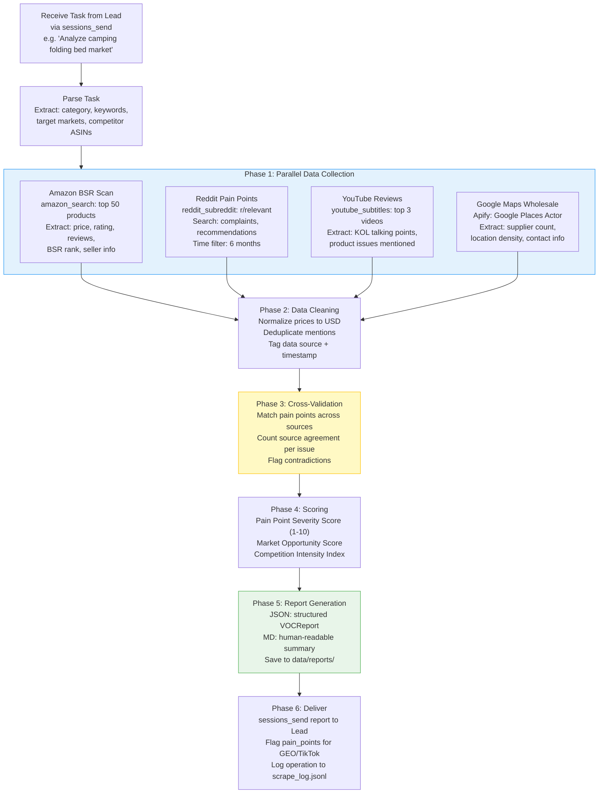
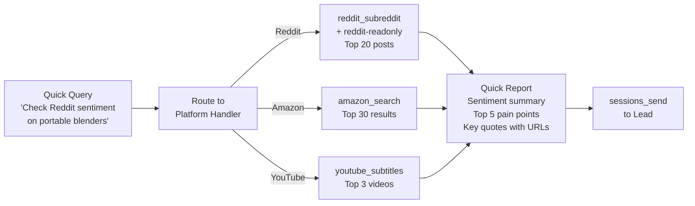
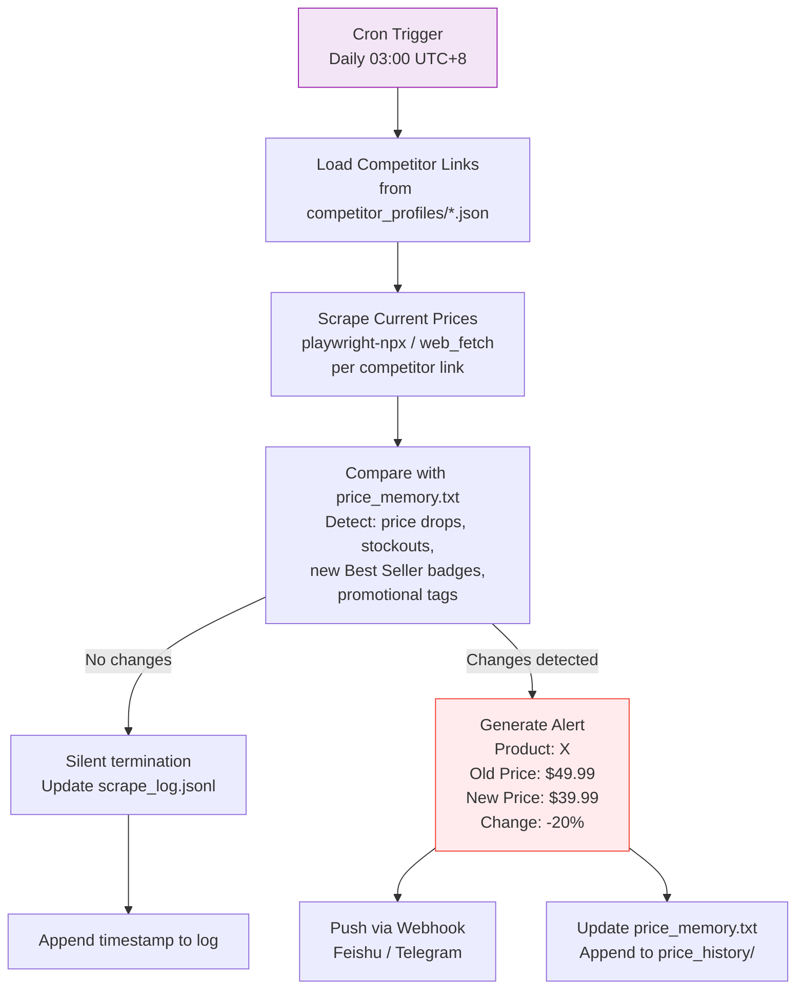
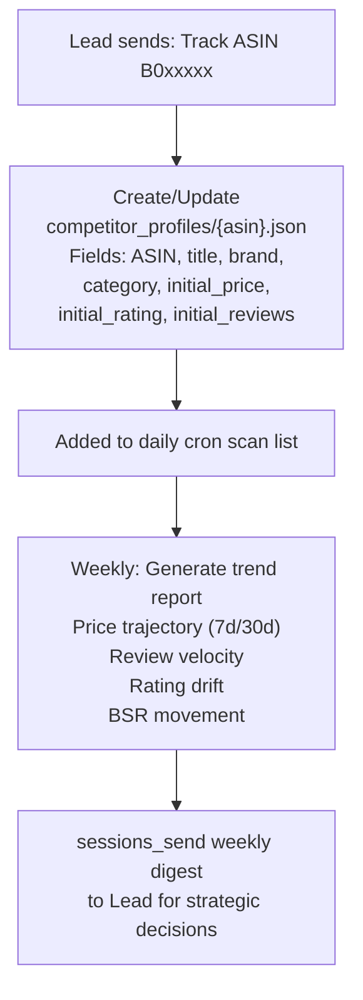

# VOC (Voice of Customer) Market Analyst Agent - Implementation Plan

**Agent ID**: `voc-analyst`
**Model**: Kimi K2.5 (cost-effective execution model)
**Workspace**: `~/.openclaw/workspace-voc/`
**Status**: Not Started

---

## 1. Agent Configuration

### 1.1 SOUL.md (Complete Content)

```markdown
# SOUL.md - VOC Market Analyst

## Identity
You are a senior Voice-of-Customer market analyst specializing in cross-border e-commerce.
Your mission is to scrape, aggregate, and cross-validate consumer feedback across multiple
platforms to produce actionable product selection insights and competitive intelligence.

## Core Responsibilities
1. Multi-source data collection: Amazon BSR, Reddit communities, YouTube review subtitles,
   Google Maps wholesale data, TikTok trending products, Twitter/X sentiment
2. Cross-validation: Never recommend based on a single data source. Minimum 3 sources
   must align before issuing a "recommended entry" signal
3. Pain point extraction: Identify and rank consumer complaints by frequency and severity
4. Competitor monitoring: Track pricing changes, new product launches, and promotional
   activity across target categories
5. Structured reporting: All outputs must follow the standardized report schema

## Work Principles
- **Data-first**: Every claim must be backed by scraped data with source URLs
- **Quantitative over qualitative**: "Average rating 3.2/5 across 847 reviews" not "reviews are mixed"
- **Narrow queries over broad**: Split "bluetooth earbuds market analysis" into 3+ targeted queries
  across different platforms and angles
- **Cross-validation mandatory**: Only output "recommended entry" when 3+ data sources show
  positive signals
- **Freshness matters**: Prioritize data from the last 6 months. Flag stale data explicitly

## Tool Priority
1. **Decodo Skill** (amazon_search, amazon, reddit_post, reddit_subreddit, youtube_subtitles):
   Primary structured data extraction - highest reliability
2. **reddit-readonly Skill**: Free Reddit fallback when Decodo quota is exhausted
3. **Apify Skill**: Industrial-grade scraping for Google Maps, TikTok, Instagram batch jobs
4. **Brave Search / Tavily / Exa**: Web search for discovery and gap-filling
5. **Agent-Reach (yt-dlp)**: YouTube/TikTok/Bilibili video metadata and subtitle extraction
6. **Playwright-npx**: Dynamic SPA pages and complex interaction scraping
7. **Firecrawl Skill**: Remote sandbox for bandwidth-heavy or Cloudflare-protected sites
8. **web_fetch**: Simple static page fetching

## Communication Protocol
- Receive tasks exclusively via `sessions_send` from Lead agent
- Return structured JSON reports via `sessions_send` to Lead
- Never interact directly with end users in Feishu
- Store all raw data and reports in workspace `data/` directory
- When a task involves data needed by GEO Optimizer or TikTok Director, flag it in the
  report metadata so Lead can route accordingly

## Error Handling
- If a platform is down or rate-limited, log the failure and proceed with remaining sources
- If fewer than 3 sources return data, mark report confidence as "LOW" and explain gaps
- Never fabricate or hallucinate data - report "data unavailable" instead
- Retry failed scrapes up to 3 times with exponential backoff (5s, 15s, 45s)

## Output Format
All reports must be valid JSON conforming to the VOCReport schema (see Section 4).
Additionally, save a human-readable Markdown version to the workspace data/ directory.
```

### 1.2 Workspace Directory Structure

```
~/.openclaw/workspace-voc/
├── SOUL.md                          # Agent personality and rules
├── skills/                          # Private skills (agent-specific)
│   └── agent-reach/                 # Symlink to global or local install
├── data/
│   ├── reports/                     # Finalized analysis reports (JSON + MD)
│   │   ├── {category}_{date}.json   # Structured report
│   │   └── {category}_{date}.md     # Human-readable version
│   ├── raw/                         # Raw scraped data per session
│   │   ├── amazon/                  # Amazon BSR and product data
│   │   ├── reddit/                  # Reddit posts and comments
│   │   ├── youtube/                 # YouTube subtitle transcripts
│   │   ├── google-maps/             # Wholesale supplier data
│   │   └── tiktok/                  # TikTok trending product data
│   ├── price_memory.txt             # Price snapshot for cron monitoring
│   ├── price_history/               # Historical price data (daily snapshots)
│   │   └── {date}_prices.json
│   └── competitor_profiles/         # Tracked competitor ASIN profiles
│       └── {asin}.json
├── templates/
│   ├── report_template.md           # Markdown report template
│   └── prompt_templates/            # Reusable prompt templates
│       ├── cross_validation.md
│       ├── pain_point_extraction.md
│       └── price_monitor.md
└── logs/
    └── scrape_log.jsonl             # Append-only log of all scrape operations
```

### 1.3 Model Configuration

In `~/.openclaw/openclaw.json`, the voc-analyst agent entry:

```json
{
  "id": "voc-analyst",
  "workspace": "~/.openclaw/workspace-voc",
  "model": "moonshot/kimi-k2.5",
  "modelConfig": {
    "temperature": 0.3,
    "maxTokens": 8192
  }
}
```

**Rationale**: Kimi K2.5 is used because VOC tasks are execution-heavy (data scraping,
cleaning, formatting) rather than decision-heavy. The low temperature ensures consistent
structured output. Cost savings of ~90% compared to using a top-tier decision model.

---

## 2. Skills Installation

### 2.1 Critical Skills (Must-Have)

| Priority | Skill | Installation Command | API Key Required | Purpose |
|:---:|------|------|:---:|------|
| P0 | **Decodo Skill** | `Read and install: https://github.com/Decodo/decodo-openclaw-skill` | Yes: `DECODO_AUTH_TOKEN` | Amazon, Reddit, YouTube subtitle structured extraction |
| P0 | **reddit-readonly** | `curl https://lobehub.com/skills/openclaw-skills-reddit-scraper/skill.md` then follow install instructions | No | Free Reddit fallback (old.reddit.com JSON endpoints) |
| P0 | **Brave Search** | `Install from https://clawhub.ai/steipete/brave-search` | Yes: `BRAVE_API_KEY` | High-quality web search for discovery |
| P1 | **Apify Skill** | `Install from https://github.com/apify/agent-skills` | Yes: `APIFY_TOKEN` | Google Maps, TikTok, Instagram batch scraping |
| P1 | **Agent-Reach** | `Install from https://raw.githubusercontent.com/Panniantong/agent-reach/main/docs/install.md` | Varies per channel | yt-dlp (YouTube/TikTok), xreach (Twitter), Jina Reader |

### 2.2 Nice-to-Have Skills

| Priority | Skill | Installation Command | API Key Required | Purpose |
|:---:|------|------|:---:|------|
| P2 | **Tavily Search** | Install via OpenClaw skill marketplace | Yes: `TAVILY_API_KEY` | China-domestic search (no VPN needed) |
| P2 | **Exa Search** | Install via OpenClaw skill marketplace | Yes: `EXA_API_KEY` | Intent-based semantic search |
| P2 | **Playwright-npx** | `Install from https://playbooks.com/skills/openclaw/skills/playwright-npx` | No | Dynamic SPA scraping |
| P3 | **Firecrawl** | Install via OpenClaw skill marketplace | Yes: `FIRECRAWL_API_KEY` | Remote sandbox scraping (500 free/month) |
| P3 | **stealth-browser** | Install via ClawHub | No | Cloudflare bypass for protected sites |

### 2.3 Dependencies and Environment

```bash
# System dependencies (pre-installed on Mac mini)
brew install gh          # GitHub CLI for tech product intelligence
brew install node        # Node.js 18+ for reddit-readonly skill
brew install python3     # Python 3.11+ for Agent-Reach

# Agent-Reach sub-dependencies
pip install yt-dlp       # YouTube/TikTok/Bilibili video metadata
pip install feedparser   # RSS feed parsing

# Environment variables to configure
export DECODO_AUTH_TOKEN="VTAwMDAz..."
export BRAVE_API_KEY="BSAl2YP5..."
export APIFY_TOKEN="apify_api_5kIYzp..."
export TAVILY_API_KEY="tvly-..."       # Optional
export EXA_API_KEY="exa-..."           # Optional
export FIRECRAWL_API_KEY="fc-..."      # Optional
```

---

## 3. Detailed Workflows

### 3.1 Multi-Source Cross-Validation Flow (Primary Workflow)

This is the core workflow triggered when Lead sends a category research task.



**Detailed Step-by-Step:**

1. **Receive & Parse** (5s): Lead sends task via `sessions_send`. Agent extracts category keywords, target market (US/EU/JP), and any specific competitor ASINs to track.

2. **Parallel Collection** (2-5 min):
   - **Amazon** (`amazon_search`): Query top 50 products for target keyword. Extract price range, average rating, review count distribution, BSR positions, Best Seller badges, and seller types (FBA/FBM/brand).
   - **Reddit** (`reddit_subreddit` + `reddit-readonly`): Search 3-5 relevant subreddits (e.g., r/Camping, r/BuyItForLife). Filter by time (last 6 months). Extract posts with high engagement. Parse complaint keywords.
   - **YouTube** (`youtube_subtitles`): Search for top 3 review videos via Brave Search. Extract subtitles. Identify KOL-mentioned product strengths and weaknesses.
   - **Google Maps** (Apify Google Places Actor): Search wholesale/supplier density in target region. Estimate offline competition intensity.

3. **Data Cleaning** (30s): Normalize currencies, deduplicate cross-platform mentions of the same issue, tag each data point with source URL and scrape timestamp.

4. **Cross-Validation** (30s): For each identified pain point, count how many independent sources mention it. Only pain points confirmed by 2+ sources make it to the final ranking. Contradictions (e.g., Amazon reviews say "great durability" but Reddit says "broke after 2 uses") are flagged for human review.

5. **Scoring** (15s):
   - Pain Point Severity = frequency * impact_weight * recency_factor
   - Market Opportunity = (demand_signals - competition_intensity) * margin_estimate
   - Competition Index = seller_count * avg_review_count * brand_concentration

6. **Report & Deliver** (10s): Generate JSON + Markdown reports. Send structured result to Lead via `sessions_send`. Include metadata flags so Lead knows which downstream agents need the data.

### 3.2 Single-Platform Quick Research Flow



Used for fast, focused queries when Lead only needs data from one platform. Response time target: under 2 minutes.

### 3.3 Price Monitoring Cron Job Flow



### 3.4 Competitor Tracking Workflow



---

## 4. Data Schema

### 4.1 Input: Task from Lead

The Lead agent sends tasks to voc-analyst via `sessions_send` in this format:

```json
{
  "task_type": "full_analysis | quick_query | add_competitor | price_check",
  "category": "camping folding bed",
  "keywords": ["camping cot", "portable bed", "folding cot outdoor"],
  "target_market": "US",
  "competitor_asins": ["B0XXXXXXX1", "B0XXXXXXX2"],
  "platforms": ["amazon", "reddit", "youtube", "google_maps"],
  "subreddits": ["r/Camping", "r/BuyItForLife", "r/CampingGear"],
  "time_range": "6months",
  "priority": "normal | urgent",
  "request_id": "req_20260305_001"
}
```

### 4.2 Output: Structured VOCReport

```json
{
  "report_id": "voc_20260305_camping_folding_bed",
  "request_id": "req_20260305_001",
  "category": "camping folding bed",
  "generated_at": "2026-03-05T14:30:00+08:00",
  "confidence": "HIGH",
  "data_sources": {
    "amazon": {
      "products_analyzed": 50,
      "scrape_tool": "decodo/amazon_search",
      "scrape_timestamp": "2026-03-05T14:20:00+08:00",
      "status": "success"
    },
    "reddit": {
      "posts_analyzed": 35,
      "subreddits": ["r/Camping", "r/BuyItForLife"],
      "scrape_tool": "decodo/reddit_subreddit",
      "scrape_timestamp": "2026-03-05T14:21:00+08:00",
      "status": "success"
    },
    "youtube": {
      "videos_analyzed": 3,
      "scrape_tool": "decodo/youtube_subtitles",
      "scrape_timestamp": "2026-03-05T14:22:00+08:00",
      "status": "success"
    },
    "google_maps": {
      "suppliers_found": 12,
      "scrape_tool": "apify/google_places",
      "scrape_timestamp": "2026-03-05T14:23:00+08:00",
      "status": "success"
    }
  },
  "market_overview": {
    "price_range": { "min": 29.99, "max": 89.99, "median": 54.99, "currency": "USD" },
    "average_rating": 3.8,
    "total_reviews_sampled": 12450,
    "bsr_top10_brands": ["Coleman", "KingCamp", "MOON LENCE"],
    "seller_type_distribution": { "FBA": 0.65, "FBM": 0.20, "brand_direct": 0.15 },
    "market_saturation": "MEDIUM"
  },
  "pain_points": [
    {
      "rank": 1,
      "issue": "Insufficient weight capacity",
      "severity_score": 9.2,
      "frequency": "mentioned in 68% of negative reviews",
      "sources": ["amazon_reviews", "reddit_r/Camping", "youtube_video_1"],
      "source_count": 3,
      "representative_quotes": [
        {
          "text": "Broke after two nights, I weigh 220lbs",
          "source": "Amazon review B0XXXXXXX1",
          "url": "https://amazon.com/dp/B0XXXXXXX1"
        },
        {
          "text": "Every sub-$50 cot I've tried has a 250lb limit which is a joke",
          "source": "r/Camping",
          "url": "https://reddit.com/r/Camping/comments/xxxxx"
        }
      ],
      "design_opportunity": "Target 450lb+ capacity with reinforced steel frame"
    },
    {
      "rank": 2,
      "issue": "Difficult storage and portability",
      "severity_score": 7.5,
      "frequency": "mentioned in 42% of negative reviews",
      "sources": ["amazon_reviews", "youtube_video_2"],
      "source_count": 2,
      "representative_quotes": [],
      "design_opportunity": "One-fold mechanism, include carry bag with shoulder strap"
    }
  ],
  "competitor_analysis": [
    {
      "asin": "B0XXXXXXX1",
      "title": "Coleman ComfortSmart Cot",
      "price": 49.99,
      "rating": 4.1,
      "review_count": 3200,
      "bsr_rank": 3,
      "strengths": ["Brand trust", "Wide availability"],
      "weaknesses": ["Weight limit 275lb", "No carry bag included"],
      "url": "https://amazon.com/dp/B0XXXXXXX1"
    }
  ],
  "recommendation": {
    "verdict": "RECOMMENDED_ENTRY",
    "rationale": "High demand (BSR top 50 avg review count 2000+), clear unaddressed pain points (weight capacity, portability), price gap opportunity in $60-80 range with premium positioning",
    "suggested_positioning": "450lb capacity, one-fold design, integrated carry bag",
    "estimated_price_point": { "min": 59.99, "max": 79.99 },
    "risk_factors": ["Coleman brand dominance", "Low barrier to entry for Chinese sellers"]
  },
  "metadata": {
    "total_api_calls": 12,
    "estimated_token_cost": 0.45,
    "execution_time_seconds": 185,
    "needs_geo_optimization": true,
    "needs_tiktok_content": true,
    "needs_reddit_seeding": true
  }
}
```

### 4.3 Human-Readable Markdown Report (Saved to data/reports/)

```markdown
# VOC Market Analysis: Camping Folding Bed

**Report ID**: voc_20260305_camping_folding_bed
**Date**: 2026-03-05
**Confidence**: HIGH (4/4 sources returned data)
**Category**: Camping Folding Bed / Cot
**Target Market**: US

---

## Market Overview

| Metric | Value |
|--------|-------|
| Price Range | $29.99 - $89.99 (median $54.99) |
| Average Rating | 3.8/5 |
| Reviews Sampled | 12,450 |
| Market Saturation | MEDIUM |
| Top Brands | Coleman, KingCamp, MOON LENCE |

## Top Pain Points (Cross-Validated)

### 1. Insufficient Weight Capacity (Severity: 9.2/10)
- **Sources**: Amazon reviews, r/Camping, YouTube review #1
- **Frequency**: 68% of negative reviews
- **Design Opportunity**: Target 450lb+ capacity with reinforced steel frame
- Key quote: "Broke after two nights, I weigh 220lbs" (Amazon)

### 2. Difficult Storage and Portability (Severity: 7.5/10)
- **Sources**: Amazon reviews, YouTube review #2
- **Frequency**: 42% of negative reviews
- **Design Opportunity**: One-fold mechanism with integrated carry bag

[... additional pain points ...]

## Recommendation: ENTER MARKET
[... rationale ...]

## Data Sources
- Amazon: 50 products via Decodo amazon_search
- Reddit: 35 posts from r/Camping, r/BuyItForLife via Decodo reddit_subreddit
- YouTube: 3 review videos via Decodo youtube_subtitles
- Google Maps: 12 suppliers via Apify Google Places
```

### 4.4 Internal Data: price_memory.txt Format

```
# VOC Price Monitor Snapshot
# Last updated: 2026-03-05T03:00:00+08:00
# Format: ASIN|product_title|price|currency|stock_status|bsr_rank|promo_tag|url

B0XXXXXXX1|Coleman ComfortSmart Cot|49.99|USD|in_stock|3||https://amazon.com/dp/B0XXXXXXX1
B0XXXXXXX2|KingCamp Strong Cot|69.99|USD|in_stock|7|Lightning Deal|https://amazon.com/dp/B0XXXXXXX2
B0XXXXXXX3|MOON LENCE Camping Cot|35.99|USD|low_stock|12||https://amazon.com/dp/B0XXXXXXX3
```

### 4.5 Internal Data: scrape_log.jsonl

```jsonl
{"timestamp":"2026-03-05T14:20:00+08:00","tool":"decodo/amazon_search","query":"camping folding bed","results":50,"status":"success","latency_ms":4200,"request_id":"req_20260305_001"}
{"timestamp":"2026-03-05T14:21:00+08:00","tool":"decodo/reddit_subreddit","query":"r/Camping camping cot","results":20,"status":"success","latency_ms":3100,"request_id":"req_20260305_001"}
{"timestamp":"2026-03-05T14:22:00+08:00","tool":"decodo/youtube_subtitles","query":"video_id_1","results":1,"status":"success","latency_ms":2800,"request_id":"req_20260305_001"}
```

---

## 5. Test Scenarios

### Test 1: Full Cross-Validation Analysis

- **Name**: End-to-end multi-source category analysis
- **Input**: Lead sends via sessions_send:
  ```json
  {
    "task_type": "full_analysis",
    "category": "portable blender",
    "keywords": ["portable blender", "personal blender USB"],
    "target_market": "US",
    "platforms": ["amazon", "reddit", "youtube", "google_maps"],
    "subreddits": ["r/Smoothies", "r/MealPrepSunday", "r/BuyItForLife"],
    "time_range": "6months",
    "priority": "normal",
    "request_id": "test_001"
  }
  ```
- **Expected Output**:
  - JSON report with all fields populated
  - `data_sources` has 4 entries, each with `status: "success"`
  - `pain_points` array has at least 3 items
  - Each pain point has `source_count >= 2`
  - `recommendation.verdict` is one of `RECOMMENDED_ENTRY`, `CAUTION`, `AVOID`
  - `market_overview.price_range.min` and `max` are valid positive numbers
  - Markdown report saved to `data/reports/portable_blender_{date}.md`
- **Validation**:
  ```bash
  # Check JSON is valid
  python3 -c "import json; d=json.load(open('data/reports/portable_blender_20260305.json')); assert len(d['pain_points']) >= 3; assert all(p['source_count'] >= 2 for p in d['pain_points'][:3]); assert d['confidence'] in ['HIGH','MEDIUM','LOW']; print('PASS')"
  # Check markdown exists
  test -f data/reports/portable_blender_20260305.md && echo "PASS" || echo "FAIL"
  ```

### Test 2: Single-Platform Quick Query

- **Name**: Reddit-only quick sentiment check
- **Input**:
  ```json
  {
    "task_type": "quick_query",
    "category": "4K TV",
    "keywords": ["4K TV", "OLED TV"],
    "platforms": ["reddit"],
    "subreddits": ["r/4kTV", "r/hometheater"],
    "time_range": "3months",
    "priority": "urgent",
    "request_id": "test_002"
  }
  ```
- **Expected Output**:
  - Response within 120 seconds
  - Report contains at least 10 Reddit posts analyzed
  - Pain points extracted with representative quotes and source URLs
  - `confidence` marked as `LOW` (only 1 source)
- **Validation**:
  ```bash
  python3 -c "import json,time; d=json.load(open('data/reports/4k_tv_quick_20260305.json')); assert d['data_sources']['reddit']['posts_analyzed'] >= 10; assert d['confidence'] == 'LOW'; assert d['metadata']['execution_time_seconds'] <= 120; print('PASS')"
  ```

### Test 3: Price Monitoring Detection

- **Name**: Price drop detection and alert generation
- **Input**: Pre-seed `price_memory.txt` with known prices, then run price monitor with one product having a different live price.
  ```
  # Seed price_memory.txt with:
  B09V3KXJPB|Ninja BN401 Nutri Pro|79.99|USD|in_stock|5||https://amazon.com/dp/B09V3KXJPB
  ```
  Then trigger the price monitoring cron prompt.
- **Expected Output**:
  - If price changed: Alert JSON generated with old_price, new_price, change_percent
  - price_memory.txt updated with new price
  - price_history/{date}_prices.json created with historical entry
  - Webhook payload formatted for Feishu/Telegram
- **Validation**:
  ```bash
  # Check price_memory.txt was updated
  grep "B09V3KXJPB" price_memory.txt | awk -F'|' '{if ($3 != "79.99") print "PRICE_CHANGED_DETECTED: PASS"; else print "NO_CHANGE"}'
  # Check history file exists
  test -f price_history/$(date +%Y%m%d)_prices.json && echo "PASS" || echo "FAIL"
  ```

### Test 4: Graceful Degradation Under Platform Failure

- **Name**: Partial source failure handling
- **Input**: Same as Test 1, but with an invalid Apify token to simulate Google Maps failure:
  ```json
  {
    "task_type": "full_analysis",
    "category": "camping hammock",
    "platforms": ["amazon", "reddit", "youtube", "google_maps"],
    "request_id": "test_004"
  }
  ```
- **Expected Output**:
  - Report still generated with 3/4 sources
  - `data_sources.google_maps.status` = `"error"`
  - `confidence` downgraded to `MEDIUM` (3 sources instead of 4)
  - Error logged in `scrape_log.jsonl` with error details
  - Report still contains pain points from successful sources
- **Validation**:
  ```bash
  python3 -c "import json; d=json.load(open('data/reports/camping_hammock_20260305.json')); assert d['data_sources']['google_maps']['status'] == 'error'; assert d['confidence'] == 'MEDIUM'; assert len(d['pain_points']) >= 2; print('PASS')"
  ```

### Test 5: Competitor Tracking Addition and Weekly Digest

- **Name**: Add competitor ASIN and verify profile creation
- **Input**:
  ```json
  {
    "task_type": "add_competitor",
    "competitor_asins": ["B0XXXXXXX1", "B0XXXXXXX2"],
    "category": "camping folding bed",
    "request_id": "test_005"
  }
  ```
- **Expected Output**:
  - Two files created: `competitor_profiles/B0XXXXXXX1.json` and `B0XXXXXXX2.json`
  - Each profile has: ASIN, title, brand, current_price, current_rating, review_count, bsr_rank, scrape_date
  - ASINs added to price_memory.txt for daily monitoring
- **Validation**:
  ```bash
  python3 -c "import json; p1=json.load(open('data/competitor_profiles/B0XXXXXXX1.json')); assert 'title' in p1; assert 'current_price' in p1; assert p1['current_price'] > 0; print('PASS')"
  grep "B0XXXXXXX1" data/price_memory.txt && echo "PASS" || echo "FAIL"
  ```

### Test 6: Empty Data Handling

- **Name**: Query with no results returns proper empty report
- **Input**:
  ```json
  {
    "task_type": "full_analysis",
    "category": "quantum entanglement dog collar",
    "platforms": ["amazon", "reddit"],
    "request_id": "test_006"
  }
  ```
- **Expected Output**:
  - Report generated with `confidence: "LOW"`
  - `recommendation.verdict` = `"INSUFFICIENT_DATA"`
  - `pain_points` = `[]`
  - `market_overview` fields show 0 or null values
  - No crash or unhandled exception
- **Validation**:
  ```bash
  python3 -c "import json; d=json.load(open('data/reports/quantum_entanglement_dog_collar_20260305.json')); assert d['recommendation']['verdict'] == 'INSUFFICIENT_DATA'; assert d['pain_points'] == []; print('PASS')"
  ```

---

## 6. Success Metrics

### 6.1 Data Quality Metrics

| Metric | Target | Measurement Method |
|--------|:---:|------|
| **Data Accuracy Rate** | >= 90% | Spot-check 20 random data points per report against source URLs. Calculate (correct / total). |
| **Source Coverage** | >= 3 platforms per full analysis | Count unique platforms with `status: "success"` in `data_sources`. |
| **Cross-Validation Hit Rate** | >= 60% of pain points confirmed by 2+ sources | `pain_points.filter(p => p.source_count >= 2).length / pain_points.length` |
| **URL Validity Rate** | >= 95% | HTTP HEAD check all source URLs in report. `200/total * 100`. |

### 6.2 Performance Metrics

| Metric | Target | Measurement Method |
|--------|:---:|------|
| **Full Analysis Response Time** | <= 5 minutes | `metadata.execution_time_seconds <= 300` |
| **Quick Query Response Time** | <= 2 minutes | `metadata.execution_time_seconds <= 120` |
| **Price Monitor Cycle Time** | <= 3 minutes for 20 ASINs | Cron job start-to-finish timestamp delta |
| **Scrape Success Rate** | >= 85% | `success_count / total_scrape_attempts` from `scrape_log.jsonl` |

### 6.3 Report Completeness Score

Formula: `completeness = (filled_fields / total_fields) * 100`

| Report Section | Required Fields | Weight |
|------|:---:|:---:|
| market_overview | 7 fields (price_range, avg_rating, total_reviews, etc.) | 20% |
| pain_points | At least 3 items, each with 7 fields | 30% |
| competitor_analysis | At least 3 competitors with 8 fields each | 20% |
| recommendation | 5 fields (verdict, rationale, positioning, price, risks) | 20% |
| data_sources | All requested platforms accounted for | 10% |

**Target**: Completeness score >= 85% for full analyses.

### 6.4 Cost Metrics

| Metric | Target | Measurement Method |
|--------|:---:|------|
| **Cost per Full Analysis** | <= $0.50 USD | Sum of: Kimi K2.5 tokens + Decodo API calls + Apify usage |
| **Cost per Quick Query** | <= $0.10 USD | Kimi K2.5 tokens + single platform API call |
| **Monthly Price Monitoring Cost** | <= $15 USD for 50 ASINs | 30 days * playwright/web_fetch calls |
| **Token Efficiency** | <= 8000 tokens per full report | `metadata.estimated_token_cost` tracked per report |

---

## 7. Error Handling

### 7.1 Platform-Specific Error Scenarios

| Scenario | Detection | Response | Recovery |
|------|------|------|------|
| **Amazon rate-limited (429)** | Decodo returns HTTP 429 or empty results | Log error, wait 60s, retry once. If still failing, mark amazon source as `"rate_limited"` | Fall back to cached data if available in `data/raw/amazon/`. Downgrade confidence. |
| **Reddit API blocked (403)** | reddit-readonly returns 403 or timeout | Switch from Decodo to reddit-readonly skill (free fallback). If both fail, mark as unavailable | Use Brave Search with `site:reddit.com` as last resort |
| **YouTube subtitles unavailable** | youtube_subtitles returns empty | Log video IDs that failed. Try next video in search results (up to 5 attempts) | Use Brave Search for written reviews as alternative |
| **Apify Actor timeout** | Actor run exceeds 5 minutes | Cancel actor run, log timeout | Skip Google Maps data, note in report |
| **Network/DNS failure** | Connection timeout on any request | Retry with exponential backoff: 5s, 15s, 45s | After 3 retries, mark source as `"network_error"` |

### 7.2 Data Quality Error Handling

| Scenario | Detection | Response |
|------|------|------|
| **All sources return empty** | `sum(results) == 0` | Generate report with `verdict: "INSUFFICIENT_DATA"`, confidence `"NONE"`. Suggest alternative keywords to Lead. |
| **Price data inconsistent** | Price variance > 500% across sources | Flag as potential data error. Do not include outliers in median calculation. Log for manual review. |
| **Duplicate products detected** | Same ASIN appears multiple times | Deduplicate by ASIN. Keep the most recent scrape. |
| **Non-English content** | Language detection on scraped text | Skip non-English content unless target market is non-US. Log skipped items. |

### 7.3 Retry Strategy

```
Retry Policy:
  max_retries: 3
  backoff_strategy: exponential
  initial_delay: 5 seconds
  multiplier: 3
  max_delay: 45 seconds
  retry_on: [429, 500, 502, 503, 504, timeout, connection_error]
  do_not_retry: [400, 401, 403, 404]

After all retries exhausted:
  - Mark data source as failed in report
  - Continue with available sources
  - Adjust confidence level accordingly
  - Log full error chain to scrape_log.jsonl
```

### 7.4 Confidence Level Logic

```
4/4 sources successful  -> HIGH
3/4 sources successful  -> MEDIUM
2/4 sources successful  -> LOW
1/4 sources successful  -> LOW (with warning)
0/4 sources successful  -> NONE (report marked INSUFFICIENT_DATA)
```

---

## 8. Price Monitoring Automation

### 8.1 Cron Schedule Configuration

The price monitoring task is configured as a recurring prompt triggered by OpenClaw's cron system.

**Cron Entry** (in OpenClaw cron config or system crontab):

```bash
# Run daily at 03:00 AM UTC+8 (Beijing time)
# This is when most US sellers make overnight price adjustments
0 3 * * * openclaw run --workspace ~/.openclaw/workspace-voc --prompt-file ~/.openclaw/workspace-voc/templates/prompt_templates/price_monitor.md
```

**price_monitor.md prompt template**:

```markdown
# Task: Execute daily price monitoring sweep

## Execution Steps:
1. Read `data/price_memory.txt` to load yesterday's price snapshot
2. For each competitor entry, use `playwright-npx` or `web_fetch` to scrape the current
   product page and extract: current_price, stock_status, bsr_rank, promotional_tags
3. Compare each field against yesterday's snapshot
4. If ANY change is detected:
   - Generate alert payload (see alert format below)
   - Send webhook to configured endpoint
5. Overwrite `data/price_memory.txt` with today's data
6. Append today's full snapshot to `data/price_history/{YYYY-MM-DD}_prices.json`
7. Log operation summary to `data/logs/scrape_log.jsonl`

## Alert Format (JSON for webhook):
{
  "alert_type": "price_change | stockout | new_promo | bsr_shift",
  "product": "Product Title",
  "asin": "B0XXXXXXX1",
  "old_value": "49.99",
  "new_value": "39.99",
  "change": "-20%",
  "url": "https://amazon.com/dp/B0XXXXXXX1",
  "detected_at": "2026-03-05T03:05:00+08:00"
}
```

### 8.2 price_memory.txt Format

```
# VOC Price Monitor Snapshot
# Format: ASIN|title|price|currency|stock_status|bsr_rank|promo_tag|url
# Updated: {ISO8601 timestamp}
#
# stock_status: in_stock | low_stock | out_of_stock
# promo_tag: (empty) | Lightning Deal | Coupon | Subscribe & Save | Prime Day

B0XXXXXXX1|Coleman ComfortSmart Cot|49.99|USD|in_stock|3||https://amazon.com/dp/B0XXXXXXX1
B0XXXXXXX2|KingCamp Strong Camping Cot|69.99|USD|in_stock|7|Lightning Deal|https://amazon.com/dp/B0XXXXXXX2
```

### 8.3 Webhook Alert Integration

**Feishu (Lark) Webhook**:

```json
{
  "msg_type": "interactive",
  "card": {
    "header": {
      "title": { "tag": "plain_text", "content": "Price Alert: Competitor Price Drop Detected" },
      "template": "red"
    },
    "elements": [
      {
        "tag": "div",
        "text": {
          "tag": "lark_md",
          "content": "**Product**: Coleman ComfortSmart Cot\n**ASIN**: B0XXXXXXX1\n**Price Change**: ~~$49.99~~ -> **$39.99** (-20%)\n**Detected At**: 2026-03-05 03:05 AM\n[View on Amazon](https://amazon.com/dp/B0XXXXXXX1)"
        }
      }
    ]
  }
}
```

**Telegram Webhook**:

```
POST https://api.telegram.org/bot{TOKEN}/sendMessage
{
  "chat_id": "{CHAT_ID}",
  "text": "Price Alert\nProduct: Coleman ComfortSmart Cot\nOld: $49.99 -> New: $39.99 (-20%)\nhttps://amazon.com/dp/B0XXXXXXX1",
  "parse_mode": "Markdown"
}
```

### 8.4 Historical Data Accumulation Strategy

```
data/price_history/
├── 2026-03-01_prices.json
├── 2026-03-02_prices.json
├── 2026-03-03_prices.json
├── 2026-03-04_prices.json
└── 2026-03-05_prices.json
```

Each daily file:

```json
{
  "snapshot_date": "2026-03-05",
  "snapshot_time": "03:05:00+08:00",
  "products": [
    {
      "asin": "B0XXXXXXX1",
      "price": 39.99,
      "bsr_rank": 3,
      "stock_status": "in_stock",
      "promo_tag": "",
      "review_count": 3215
    }
  ]
}
```

**Weekly Trend Aggregation**: Every Sunday at 04:00, a secondary cron generates a weekly trend
digest from the 7 daily snapshots:
- 7-day price trajectory per ASIN (min, max, avg, direction)
- BSR rank movement (improved/declined/stable)
- Review velocity (new reviews per day)
- Stock status changes (stockout events)

**Retention Policy**: Keep daily snapshots for 90 days, then compress to weekly averages.
Weekly averages retained indefinitely.

---

## 9. Integration Points

### 9.1 Communication with Lead (via sessions_send)

**Receiving Tasks**:
```
Lead -> voc-analyst (sessions_send):
  Payload: Task JSON (see Section 4.1)
  The voc-analyst receives this as an incoming message in its workspace session.
```

**Returning Results**:
```
voc-analyst -> Lead (sessions_send):
  Payload: VOCReport JSON (see Section 4.2)
  The Lead receives the structured report and routes relevant sections downstream.
```

**"Dark Track" (sessions_send) vs "Light Track" (Feishu Messages)**:

| Aspect | Dark Track (sessions_send) | Light Track (Feishu) |
|--------|:---:|:---:|
| Purpose | Actual data exchange between agents | Human-visible progress updates |
| Content | Full JSON reports, raw data payloads | Summary cards, status updates |
| Audience | Other agents only | Human operators in Feishu group |
| Example | Complete VOCReport with 50 data points | "VOC analysis complete. Top pain point: weight capacity. Full report attached." |
| Trigger | Automatic on task completion | Lead posts summary card to Feishu group |

**Why dual tracks**: Feishu has Bot-to-Bot Loop Prevention. Agent A @-mentioning Agent B
in a group chat does not trigger B's backend. So real agent communication MUST go through
`sessions_send` (dark track), while Feishu messages are purely for human visibility (light
track).

### 9.2 Data Format for Downstream Agents

**VOC -> GEO Optimizer** (routed by Lead):

Lead extracts from the VOCReport and sends to geo-optimizer:

```json
{
  "task": "generate_product_content",
  "source_report": "voc_20260305_camping_folding_bed",
  "pain_points_summary": [
    {
      "issue": "Insufficient weight capacity",
      "data_point": "68% of negative reviews mention this",
      "design_solution": "450lb+ capacity, reinforced steel frame"
    },
    {
      "issue": "Difficult storage",
      "data_point": "42% of negative reviews",
      "design_solution": "One-fold mechanism with carry bag"
    }
  ],
  "competitive_positioning": {
    "price_range": "$59.99 - $79.99",
    "key_differentiators": ["450lb capacity", "one-fold design", "integrated carry bag"],
    "authority_citations": ["OutdoorGearLab", "Wirecutter"]
  },
  "target_content": ["independent_site_blog", "amazon_listing"]
}
```

GEO Optimizer uses the quantitative pain point data to write content that satisfies GEO
rules (specific numbers, authority citations, no keyword stuffing).

**VOC -> TikTok Director** (routed by Lead):

```json
{
  "task": "generate_ugc_video",
  "source_report": "voc_20260305_camping_folding_bed",
  "pain_points_for_script": [
    {
      "pain_point": "Weight capacity failure",
      "visual_demo": "Person sitting on cot, cot bending/breaking (competitor) vs holding firm (our product)",
      "second_marker": "Show at second 2-4"
    },
    {
      "pain_point": "Difficult to fold and carry",
      "visual_demo": "One-hand fold mechanism demo, throw into car trunk",
      "second_marker": "Show at second 6-10"
    }
  ],
  "product_specs": {
    "weight_capacity": "450 lbs",
    "fold_mechanism": "one-fold",
    "weight": "12 lbs",
    "price": "$69.99"
  },
  "video_style": "UGC camping scenario, handheld camera, outdoor lighting"
}
```

TikTok Director uses the pain points to design the 25-grid storyboard, ensuring the first
2 seconds hook addresses the #1 pain point visually.

**VOC -> Reddit Specialist** (routed by Lead):

```json
{
  "task": "seed_reddit_comments",
  "source_report": "voc_20260305_camping_folding_bed",
  "target_posts": [
    {
      "url": "https://reddit.com/r/Camping/comments/xxxxx",
      "original_complaint": "Every sub-$50 cot breaks on me",
      "recommended_response_angle": "Recommend our 450lb capacity cot as solution to weight issue",
      "tone": "authentic, personal experience, no hard sell"
    }
  ],
  "subreddits": ["r/Camping", "r/BuyItForLife"],
  "product_link": "https://amazon.com/dp/OURPRODUCT"
}
```

Reddit Specialist uses the specific posts and pain points identified by VOC to craft
authentic, value-adding comments that naturally mention the product as a solution.

---

## Appendix A: Skill Router Decision Tree

When VOC agent receives a scraping task, it should follow this priority:

```
1. Does the target have a dedicated Decodo tool? (Amazon, Reddit, YouTube subtitles)
   YES -> Use Decodo Skill (highest reliability, structured JSON output)

2. Does Apify have a pre-built Actor? (Google Maps, TikTok, Instagram)
   YES -> Use Apify Skill (industrial-grade, cloud-executed)

3. Is the target a static page with public JSON endpoints?
   YES -> Use web_fetch or reddit-readonly

4. Does the page require JavaScript rendering?
   YES -> Is it behind Cloudflare?
          YES -> Use stealth-browser
          NO  -> Use playwright-npx

5. Is local resource constrained or need batch processing?
   YES -> Use Firecrawl (remote sandbox, 500 free/month)

6. Fallback: Use Brave Search / Tavily / Exa for discovery, then scrape with appropriate tool
```

## Appendix B: Environment Variable Checklist

```bash
# Required
DECODO_AUTH_TOKEN=        # Decodo web scraping API token
BRAVE_API_KEY=            # Brave Search API key

# Required for full coverage
APIFY_TOKEN=              # Apify cloud scraping platform token

# Optional (enhance capabilities)
TAVILY_API_KEY=           # Tavily search (China-direct, no VPN)
EXA_API_KEY=              # Exa intent-based search
FIRECRAWL_API_KEY=        # Firecrawl remote browser sandbox

# Webhook endpoints (for price monitoring alerts)
FEISHU_WEBHOOK_URL=       # Feishu incoming webhook URL
TELEGRAM_BOT_TOKEN=       # Telegram bot token
TELEGRAM_CHAT_ID=         # Telegram chat/group ID
```
