# 跨境电商AI自动化平台商业计划书

**——基于OpenClaw多智能体架构的全链路跨境电商AI解决方案**

> 版本：v1.0 | 日期：2026年3月 | 范围：市场分析、产品架构、商业模式

---

## 目录

- [第一部分：市场分析](#第一部分市场分析)
  - [1.1 行业背景](#11-行业背景)
  - [1.2 四大行业痛点详解](#12-四大行业痛点详解)
  - [1.3 目标客户画像](#13-目标客户画像)
  - [1.4 竞争格局](#14-竞争格局)
  - [1.5 市场规模](#15-市场规模tamsamsom)
- [第二部分：产品架构](#第二部分产品架构cto级深度)
  - [2.1 整体架构](#21-整体架构)
  - [2.2 核心技术栈选型](#22-核心技术栈选型与理由)
  - [2.3 关键设计决策](#23-关键设计决策)
  - [2.4 五大AI Agent角色详解](#24-五大ai-agent角色详解)
  - [2.5 三大能力包深度拆解](#25-三大能力包深度拆解)
  - [2.6 编排中心](#26-编排中心)
  - [2.7 端到端案例](#27-端到端案例露营折叠床)
  - [2.8 架构图表集](#28-架构图表集)
- [第三部分：商业模式](#第三部分商业模式)
  - [3.1 模式创新](#31-技能包优先编排按需模式创新)
  - [3.2 定价策略](#32-定价策略)
  - [3.3 获客策略](#33-获客策略)
  - [3.4 竞争壁垒](#34-竞争壁垒)
  - [3.5 定价金字塔](#35-定价金字塔)
- [附录](#附录)

---

## 第一部分：市场分析

### 1.1 行业背景

**跨境电商市场规模与增速**

2025年中国跨境电商出口规模突破12万亿人民币，年复合增长率（CAGR）维持在15%-20%。Amazon、TikTok Shop、Temu、SHEIN四大平台构成核心战场，中小卖家数量超过200万家。

**AI渗透率现状**

尽管市场体量巨大，AI工具在跨境电商场景的渗透率仍处于早期阶段：

| 环节 | AI渗透率（估算） | 主要瓶颈 |
|------|:---:|------|
| 选品调研 | ~8% | 数据源分散，缺乏交叉验证 |
| 内容创作 | ~15% | 质量不稳定，多语言适配差 |
| 社媒营销 | ~5% | 平台规则复杂，需要长期养号 |
| 运营优化 | ~12% | 工具孤岛，数据不互通 |

**中国卖家核心矛盾**

中国跨境卖家面临"人力密集型运营"与"利润持续压缩"的结构性矛盾。一个典型的中小卖家团队需要配备选品专员、内容运营、社媒管理、广告优化等5-8人，月人力成本3-5万元，但单品利润空间已从2020年的30%-50%压缩至10%-20%。

**AI重塑的机会窗口**

2026年是关键拐点——大模型能力（多模态理解、Agent编排、视频生成）首次达到跨境电商实际可用水平。OpenClaw等多智能体框架的成熟，使得"AI数字员工替代人工团队"从概念走向落地。

### 1.2 四大行业痛点详解

#### 痛点一：选品盲区——数据源分散，决策靠直觉

中小卖家的选品流程依赖Amazon BSR排名、1688供应商推荐等单一数据源，缺乏消费者真实反馈的交叉验证。

**具体表现：**
- Amazon评论分析需要人工逐条阅读，一个品类200+评论需要半天时间
- Reddit、TikTok等社交平台的消费者真实吐槽完全被忽视
- YouTube评测视频中的产品缺陷信息无法高效提取
- 竞品价格变动、上新动作缺乏实时监控

**量化损失：** 选品失败率高达60%-70%，单次选品失败的沉没成本（开模、首批库存）约2-5万元。

#### 痛点二：内容成本——多平台内容生产效率极低

跨境电商需要同时运营Amazon Listing、独立站博客、TikTok短视频、Reddit社区帖文等多个内容渠道，每个渠道的格式、调性、算法规则完全不同。

**具体表现：**
- 一个SKU的多平台内容制作需要3-5个工作日
- 视频内容制作成本高（单条TikTok带货视频外包费用500-2000元）
- 传统SEO已经失效，GEO（生成引擎优化）规则完全不同
- AI搜索引擎（ChatGPT、Perplexity）正在改变流量分配逻辑

**量化损失：** 内容生产占运营总成本的35%-45%，且产出质量参差不齐。

#### 痛点三：人力密集——重复性操作吞噬利润

跨境电商日常运营充斥着大量可自动化但尚未自动化的重复操作。

**具体表现：**
- 竞品价格监控需要每日手动检查（凌晨调价是常态）
- 社媒账号养号需要持续互动（Reddit养号SOP长达5周）
- 多平台数据汇总与报表制作耗时巨大
- 客户评论回复、售后处理等需要7×24小时响应

**量化损失：** 运营团队70%的时间花在重复性执行而非策略思考上。

#### 痛点四：情报困难——竞品动态获取受限

高度反爬的电商平台和社交媒体使得竞品情报获取成为技术难题。

**具体表现：**
- Amazon反爬机制复杂（IP封锁、JS渲染、价格动态刷新）
- Reddit开发者API收紧（2025年起大幅限制）
- TikTok数据抓取需要处理动态SPA渲染
- Twitter/X付费API门槛高，Cookie方案不稳定

**量化损失：** 自建爬虫团队年成本20-50万元，维护成本随平台更新持续攀升。

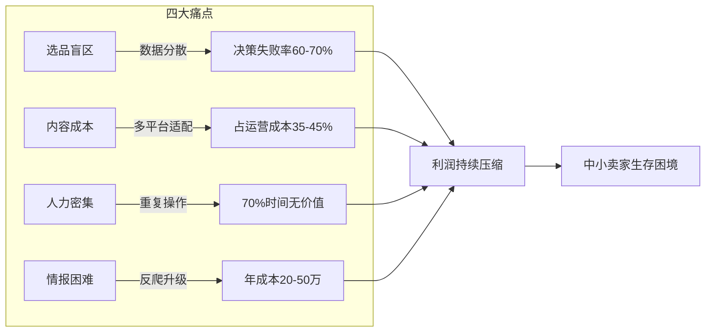

### 1.3 目标客户画像

#### 画像A：中小跨境卖家（核心用户）

| 维度 | 描述 |
|------|------|
| **规模** | 年营收100万-3000万人民币 |
| **团队** | 3-15人，运营+供应链为主 |
| **平台** | Amazon为主，拓展TikTok Shop、独立站 |
| **痛点** | 选品靠感觉，内容制作慢，缺乏社媒能力 |
| **付费意愿** | 月付500-3000元（对标一个初级运营的成本） |
| **决策者** | 老板或运营负责人 |

**用户旅程：**
```
发现痛点 → 搜索"AI跨境电商工具" → 试用情报包（免费/低价）
→ 体验VOC分析价值 → 升级创作包 → 需要全渠道铺设 → 购买营销包
→ 业务增长 → 追加企业版定制
```

#### 画像B：MCN/代运营机构

| 维度 | 描述 |
|------|------|
| **规模** | 服务10-100个品牌客户 |
| **团队** | 20-100人，内容团队占主力 |
| **平台** | 全平台覆盖 |
| **痛点** | 内容产能瓶颈，人效比低 |
| **付费意愿** | 月付5000-20000元（按服务客户数） |
| **决策者** | CEO或内容负责人 |

#### 画像C：大型品牌出海团队

| 维度 | 描述 |
|------|------|
| **规模** | 年营收1亿+ |
| **团队** | 50人+，有独立技术团队 |
| **平台** | 全渠道、全球多站点 |
| **痛点** | 数据孤岛、多市场协同、品牌一致性 |
| **付费意愿** | 年付10-50万元 |
| **决策者** | VP级别 |

### 1.4 竞争格局

当前市场上的解决方案可分为三类：传统SaaS工具、单点AI工具、以及我们的多智能体AI平台。

| 维度 | 传统SaaS（Jungle Scout等） | 单点AI工具（ChatGPT等） | 我们：多Agent AI平台 |
|------|:---:|:---:|:---:|
| 选品能力 | 单一数据源（Amazon BSR） | 需手动喂数据 | 多源交叉验证（10+平台） |
| 内容生成 | 无 | 文字为主，无法出视频 | 文字+图片+视频全链路 |
| 社媒运营 | 无 | 单次输出，无长期策略 | 养号SOP+自动执行 |
| 协作能力 | 工具孤岛 | 单一对话窗口 | 5个Agent异步协作 |
| 中国本地化 | 弱（无飞书集成） | 弱（需翻墙） | 强（飞书/钉钉/企微+国产模型） |
| 数据实时性 | 日更或周更 | 训练数据延迟 | 实时爬取+cron监控 |
| 扩展性 | 固定功能 | 无 | 5400+ Skills生态 |

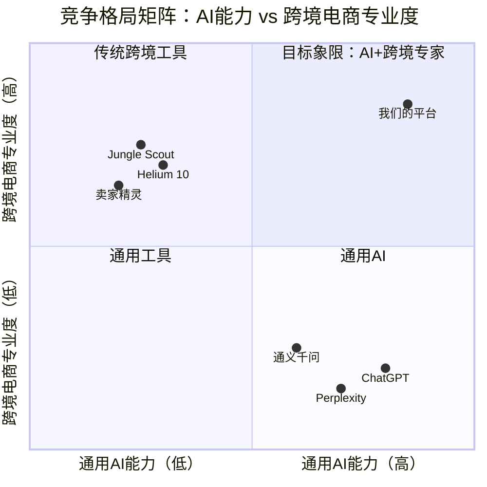

**关键差异化：**

1. **多Agent协作 vs 单一工具**：我们是"AI团队"，而非"AI工具"。5个专业Agent通过sessions_send异步协作，模拟真实电商团队分工。
2. **中国本地化**：原生支持飞书/钉钉/企微，接入doubao-seed-2.0-code、Kimi K2.5、GLM-4.7等国产模型。
3. **Skills生态**：依托OpenClaw 5400+ Skills生态，能力持续扩展，无需重新开发。

### 1.5 市场规模（TAM/SAM/SOM）

| 层级 | 定义 | 规模（年） |
|------|------|:---:|
| **TAM** | 中国跨境电商SaaS+AI工具总市场 | ¥800亿 |
| **SAM** | AI驱动的跨境电商运营工具 | ¥120亿 |
| **SOM** | 第1年可触达的中小卖家市场 | ¥2-5亿 |

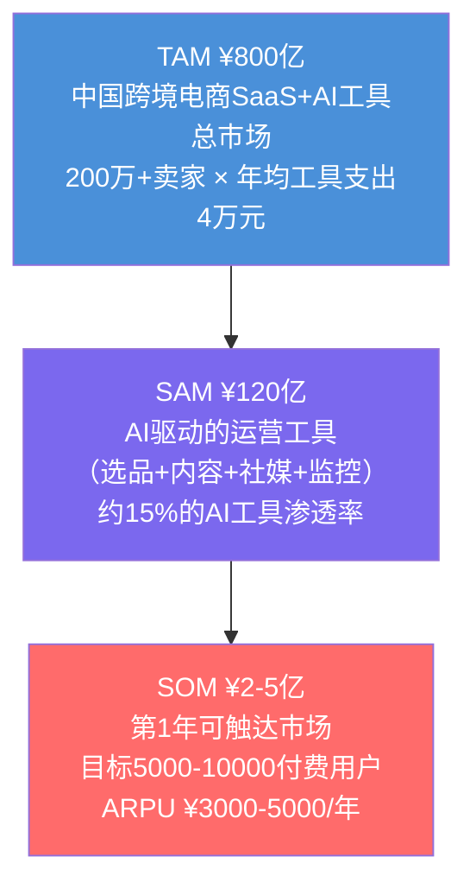

**SAM推导逻辑：**
- 200万跨境卖家中，约30%（60万家）有明确的工具付费意愿
- AI工具年均支出预估 ¥2000-5000/家
- 60万 × ¥2000 = ¥12亿（保守） ～ 60万 × ¥20000 = ¥120亿（乐观含MCN）

**SOM推导逻辑：**
- 第1年通过内容营销+PLG获取5000-10000付费用户
- ARPU ¥3000-5000/年（单包用户到组合包用户的混合值）
- 5000 × ¥5000 = ¥2500万 ～ 10000 × ¥5000 = ¥5000万

---

## 第二部分：产品架构（CTO级深度）

### 2.1 整体架构

平台采用**四层架构设计**，自底向上分别为：基础设施层、能力引擎层、Agent编排层、用户交互层。

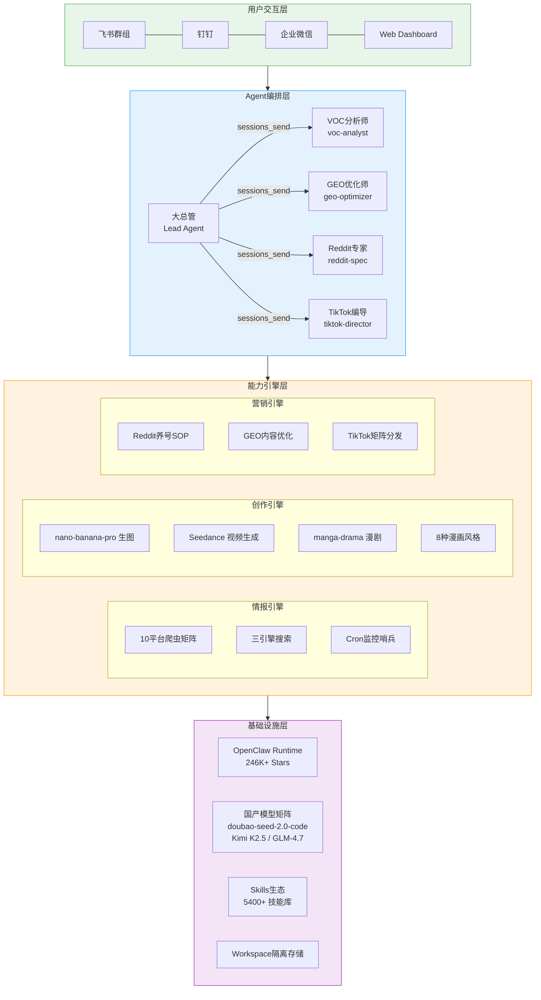

### 2.2 核心技术栈选型与理由

| 层级 | 技术选型 | 选型理由 |
|------|----------|----------|
| **Runtime** | OpenClaw | 246K+ Stars，5400+ Skills生态，原生中国IM集成（飞书/钉钉/企微），支持国产模型 |
| **决策层模型** | doubao-seed-2.0-code | Agent编排能力强，多模态理解（长视频），VLM能力，Coding Plan套餐性价比高 |
| **执行层模型** | Kimi K2.5 / GLM-4.7 | 高性价比，执行层任务（数据清洗、格式适配）无需顶级模型，成本压低90% |
| **视频生成** | Seedance 1.5 Pro → 2.0 | 字节自研，1.5 Pro自带音频生成，2.0待API发布后将大幅提升画面一致性 |
| **图像生成** | nano-banana-pro / Seedream 5.0 | 高保真配图，支持Google API及第三方API，与Seedance无缝衔接 |
| **爬虫层** | Playwright + Apify（双引擎） | Playwright专攻复杂交互与动态反爬，Apify负责大规模结构化抓取，覆盖99%情报场景 |
| **搜索引擎** | Tavily（国内）+ Brave（海外）+ Exa（意图型） | 三引擎互补：Tavily国内直连无需信用卡，Brave数据质量高，Exa适合研究型查询 |
| **通信协议** | sessions_send（A2A） | OpenClaw原生Agent-to-Agent通信，异步穿透，支持跨Workspace调度 |
| **用户前端** | 飞书 WebSocket 长连接 | 零开发前端，每个Agent绑定独立飞书应用，通过bindings数组精准路由 |

**为什么选OpenClaw而非NanoClaw？**

| 维度 | OpenClaw | NanoClaw |
|------|----------|----------|
| 社区规模 | 246K+ Stars | 较小社区 |
| Skills生态 | 5400+ Skills | 依赖Anthropic Agent SDK |
| 中国IM集成 | 原生飞书/钉钉/企微 | 无 |
| 国产模型支持 | doubao-seed-2.0-code, Kimi K2.5, GLM-4.7 | Claude为主（中国不可直连） |
| 部署方式 | Mac mini本地部署 | 云端为主 |

### 2.3 关键设计决策

#### 决策一：为什么多Agent而非单一大模型？

传统单体大模型在面对跨境电商长链路任务时存在"工具幻觉"问题——当对话轮次过长，模型会混淆工具调用的上下文，错误地组合API参数。

多Agent架构的核心优势：

1. **专业化分工**：每个Agent只掌握自己领域的技能和知识，VOC分析师不会误调TikTok编导的视频生成API
2. **并行执行**：大总管可以通过sessions_send同时唤醒多个Agent并发执行，而非串行等待
3. **容错隔离**：单个Agent的失败不会级联影响其他Agent的工作
4. **模型分级**：决策层用顶级模型（doubao-seed-2.0-code），执行层用高性价比模型（Kimi K2.5），成本压低90%

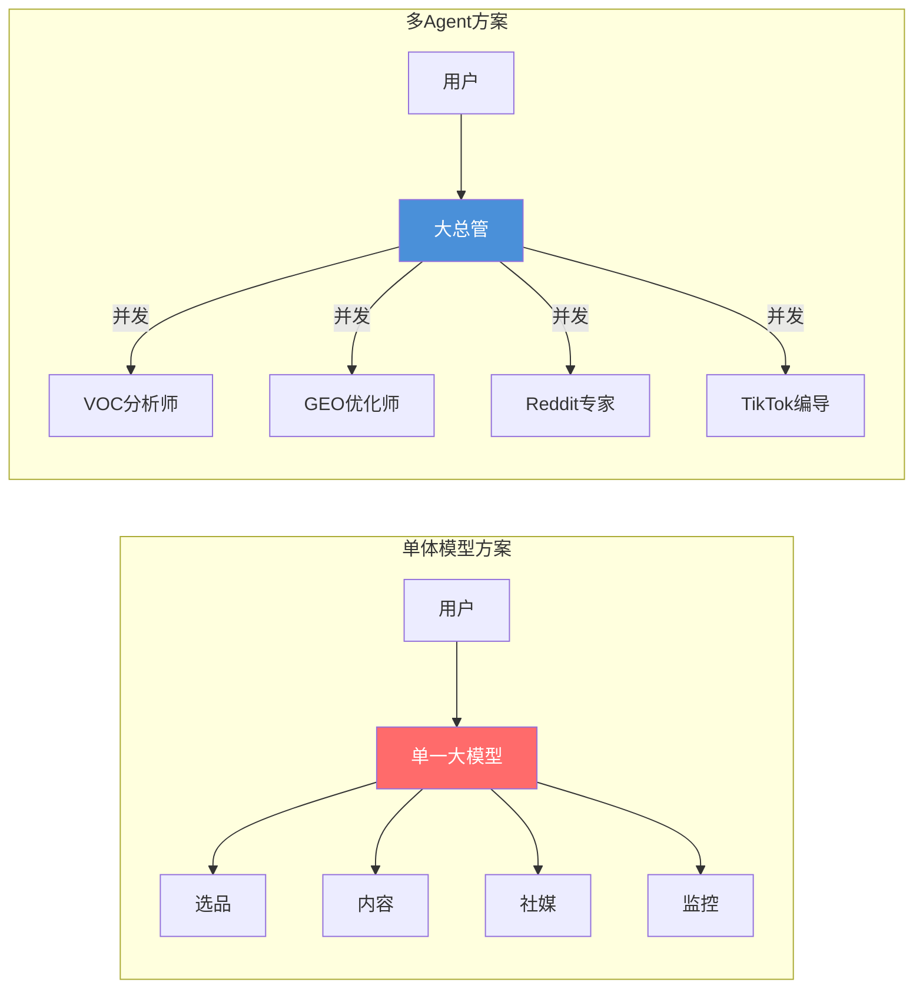

#### 决策二：为什么Workspace隔离？

每个Agent必须拥有独立的Workspace目录，这不是可选配置，而是架构刚需。

```
~/.openclaw/
├── openclaw.json           # 全局路由和通道配置
├── skills/                 # 全局技能库（公共）
├── workspace-lead/         # 大总管（含SOUL.md, AGENTS.md）
├── workspace-voc/          # VOC分析师
├── workspace-geo/          # GEO优化师
├── workspace-reddit/       # Reddit专家（养号记录隔离）
└── workspace-tiktok/       # TikTok编导
```

**隔离的三大理由：**

1. **数据安全**：VOC分析师的市场研报与Reddit专家的养号记录不能混在一个目录，避免跨域数据泄露
2. **Skill加载优先级**：公共技能（生图、搜图）放全局`~/.openclaw/skills/`，私有技能（特定账号发布工具）放Agent专属目录，防止Agent误调别人的API密钥
3. **独立可调试**：每个Workspace可以独立启停、版本回滚，不影响其他Agent

#### 决策三：为什么sessions_send而非HTTP API？

OpenClaw的sessions_send是原生的Agent-to-Agent通信协议，相比自建HTTP API网关具有以下优势：

| 维度 | sessions_send | HTTP API |
|------|:---:|:---:|
| 实现成本 | 零代码，配置白名单即可 | 需开发API网关 |
| 通信模式 | 异步穿透，不阻塞调用方 | 需额外实现异步队列 |
| 上下文保持 | 自动携带会话上下文 | 需手动管理session |
| 飞书联动 | "明暗双轨"：暗线走数据，明线走汇报 | 需额外对接飞书API |

**"明暗双轨制"详解：** 由于飞书官方的Bot-to-Bot Loop Prevention（防机器人死循环）机制，Agent A在群里@Agent B时，B的后台收不到推送。因此采用：
- **暗线**：sessions_send走底层数据交换（Agent间真实通信）
- **明线**：在飞书群里用文本或卡片消息汇报进度（给人类看的进展报告）

### 2.4 五大AI Agent角色详解

#### Agent 1：大总管（Lead）

| 属性 | 详情 |
|------|------|
| **Agent ID** | `lead` |
| **模型** | doubao-seed-2.0-code（顶级决策模型） |
| **Workspace** | `~/.openclaw/workspace-lead/` |
| **核心职责** | 唯一与人类在飞书对接的接口，负责需求拆解、调用sessions_send跨节点分发任务 |
| **人设文件** | AGENTS.md（团队通讯录）+ SOUL.md |
| **强制纪律** | 严禁自己执行底层任务，必须委派；多平台并发时对不同Agent并发调用sessions_send |

**工作逻辑：**
1. 接收用户在飞书群的自然语言指令
2. 解析意图，拆解为子任务
3. 根据子任务类型路由到对应Agent
4. 收集各Agent执行结果，汇总报告给用户
5. 在飞书群"明线"汇报进度

#### Agent 2：VOC市场分析师（voc-analyst）

| 属性 | 详情 |
|------|------|
| **Agent ID** | `voc-analyst` |
| **模型** | Kimi K2.5（高性价比执行模型） |
| **核心职责** | 全网抓取评价数据，提炼用户痛点与竞品弱点 |
| **核心技能** | reddit-readonly, Decodo Skill (amazon_search, reddit_post), youtube_subtitles, Apify |
| **输出物** | 结构化选品报告（含痛点排名、价格区间、竞品弱点） |

**典型工作流：**
```
接收品类关键词 → Amazon抓前50商品 → Reddit抓社区吐槽 → YouTube抓评测字幕
→ Google Maps抓批发商数据 → 四路数据交叉验证 → 生成选品报告
```

#### Agent 3：GEO内容优化师（geo-optimizer）

| 属性 | 详情 |
|------|------|
| **Agent ID** | `geo-optimizer` |
| **模型** | doubao-seed-2.0-code |
| **核心职责** | 撰写面向AI搜索引擎（ChatGPT、Perplexity、Google SGE）优化的产品内容 |
| **工作底线** | 绝对禁止关键词填充；强制数据支撑（定量>定性）；添加权威引文 |
| **输出物** | 独立站博客、Amazon Listing、产品描述 |

**GEO vs SEO的核心区别：**
- SEO优化关键词密度 → GEO优化引文密度和数据可信度
- SEO面向爬虫 → GEO面向大语言模型的信息提取逻辑
- 例：不写"最好的折叠床"，而写"承重450磅，经OutdoorGearLab评测认证"

#### Agent 4：Reddit营销专家（reddit-spec）

| 属性 | 详情 |
|------|------|
| **Agent ID** | `reddit-spec` |
| **模型** | Kimi K2.5 |
| **核心职责** | 执行严格的5周养号SOP，在精准版块进行长尾流量劫持 |
| **目标版块** | r/BuyItForLife, r/SkincareAddiction, r/Camping 等精准社区 |
| **核心策略** | Google搜索高排名老帖 → 在老帖下真诚评论 → 推荐产品解决老款痛点 |

**5周养号SOP：**
| 周次 | 动作 | 目标 |
|:---:|------|------|
| W1 | 注册账号，订阅目标版块，每日浏览 | 建立账号活跃度 |
| W2 | 在热帖下回复有价值的评论（不带链接） | 积累Karma值 |
| W3 | 发布原创经验帖（如"我的露营装备踩坑记"） | 建立领域权威 |
| W4 | 在相关讨论中自然提及产品（解决痛点角度） | 软性引流 |
| W5 | 持续互动，回复他人提问，维护账号信誉 | 长期价值沉淀 |

#### Agent 5：TikTok爆款编导（tiktok-director）

| 属性 | 详情 |
|------|------|
| **Agent ID** | `tiktok-director` |
| **模型** | doubao-seed-2.0-code（需要多模态理解能力） |
| **核心职责** | 分析TikTok爆款逻辑，生成具有UGC质感的带货短视频 |
| **核心技能** | nano-banana-pro（生图）, Seedance 2.0（视频生成）, manga-style-video, manga-drama |
| **输出物** | 25宫格分镜故事板 + 15秒成片 |

**创作流程：**
1. 读取VOC分析师的痛点数据
2. 设计25宫格分镜故事板（含痛点展示、产品细节、使用场景）
3. 精准设计前2秒"呼吸感运镜"（第一人称手持画面，轻微自然抖动）
4. 设计关键帧（如第4秒按压床垫特写，展示回弹性）
5. 调用nano-banana-pro生成高保真配图
6. 将图片资产转交Seedance生成带旁白音频的成片

### 2.5 三大能力包深度拆解

#### 能力包一：情报包（Intelligence Pack）

**10个平台爬虫方案逐一说明：**

| # | 平台 | 方案 | 工具/Skill | 原理与特点 |
|:---:|------|------|------|------|
| 1 | **Reddit** | 免费路线 | reddit-readonly Skill | 底层打old.reddit.com公开.json接口，无需API Key，支持读版块热帖、搜帖子、读评论串 |
| 2 | **Reddit** | 结构化路线 | Decodo Skill (reddit_post/reddit_subreddit) | Decodo后端IP轮换，返回干净JSON，稳定性更高 |
| 3 | **Amazon** | 结构化提取 | Decodo Skill (amazon/amazon_search) | Decodo维护Amazon解析规则，返回价格/评分/评论数/ASIN/BSR/卖家信息 |
| 4 | **YouTube** | 字幕提取 | Decodo Skill (youtube_subtitles) | 输入视频ID直接返回完整字幕文本，无需YouTube API |
| 5 | **TikTok/B站** | 视频下载 | Agent-Reach (yt-dlp) | yt-dlp 148K Stars，YouTube和B站通吃，dump-json获取元数据 |
| 6 | **Twitter/X** | Cookie登录 | Agent-Reach (xreach) | 浏览器扩展导出Cookie，免费读取推文和时间线，7-30天需重新导出 |
| 7 | **GitHub** | 官方CLI | Agent-Reach (gh CLI) | 搜索仓库、读Issue、分析Star趋势，比爬网页稳定 |
| 8 | **动态SPA** | 浏览器渲染 | Playwright-npx / stealth-browser | Playwright处理JS渲染，stealth模拟真实用户特征绕过Cloudflare |
| 9 | **任意网页** | 远程沙盒 | Firecrawl Skill | 远程浏览器沙盒，返回干净Markdown，免费500次/月，本机零压力 |
| 10 | **主流平台批量** | 工业级Actor | Apify Skill | 20年积累的云端爬虫程序，覆盖Google Maps/YouTube/Instagram/TikTok/Amazon |

**搜索引擎三件套：**

| 引擎 | 定位 | 优势 | 限制 |
|------|------|------|------|
| **Tavily** | 国内首选 | AI Agent专设计，国内直连，无需信用卡 | 数据质量中等 |
| **Brave Search** | 海外首选 | 数据质量高 | 需海外信用卡注册 |
| **Exa** | 意图型查询 | 适合"找真实买家写的独立评测"这类意图明确的查询 | 通用查询效果一般 |

**进阶用法——多条窄查询策略：**
```
❌ 一条宽查询："蓝牙耳机市场分析"
✅ 三条窄查询：
  1. "bluetooth earbuds under 30 site:reddit.com complaints 2026"
  2. "bluetooth earbuds amazon best seller negative reviews"
  3. "bluetooth earbuds temu competitor comparison"
→ 三次结果合并，质量差距极大
```

**自动化场景——价格监控哨兵：**
```
Cron定时（每天凌晨03:00）
→ Playwright/web_fetch抓取竞品链接
→ 与price_memory.txt快照比对
→ 价格变动触发警报 → Webhook推送到飞书/Telegram
→ 更新今日快照
```

#### 能力包二：创作包（Content Pack）

**Seedance视频生成矩阵：**

| Skill | 功能 | 模型版本 | 特点 |
|------|------|------|------|
| **seedance-video** | 文生视频 / 图生视频 | 1.5 Pro, 1.0 Pro, 1.0 Lite | 1.5 Pro自带音频生成，基本盘能力 |
| **manga-style-video** | 8种漫画风格一键切换 | 基于Seedance | 内置专业提示词，无需调参 |
| **manga-drama** | 漫剧分镜生成器 | 基于Seedance | 丢一张主角图，自动编排多幕分镜 |
| **volcengine-video-understanding** | 视频内容分析 | doubao-seed-2.0-code | 情感分析、场景识别、质量验收 |

**8种漫画风格详解：**

| 风格 | 英文标识 | 适用场景 |
|------|------|------|
| 日式治愈系 | `japanese` | 生活方式、美妆、食品类产品 |
| 吉卜力 | `ghibli` | 户外、自然、情感故事 |
| 国风水墨 | `chinese` | 茶叶、国潮、传统文化产品 |
| 美式卡通 | `cartoon` | 宠物、儿童、趣味产品 |
| 铅笔素描 | `sketch` | 科技、极简、设计类产品 |
| 水彩 | `watercolor` | 艺术、手工、文创产品 |
| 日式漫画 | `manga_comic` | 电子产品、游戏、潮流 |
| Q版萌系 | `chibi` | 玩具、零食、IP周边 |

**manga-drama工作流（一张图到一套漫剧）：**

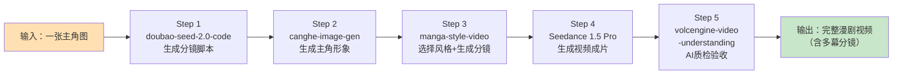

**内置5种分镜类型：** 主角登场、动作场景、情感表达、互动场景、结尾定格。每一幕自动生成构图、镜头角度、光影氛围的详细描述。

#### 能力包三：营销包（Marketing Pack）

**Reddit养号SOP自动化：**

reddit-spec Agent自动执行5周养号SOP，关键策略是"流量劫持"——通过Google搜索找到排名靠前的老帖子，在老帖下真诚评论推荐产品，利用老帖的搜索权重实现长尾流量转化。

**GEO优化体系：**

geo-optimizer Agent生产的内容专门面向AI搜索引擎优化，核心规则：
1. **禁止关键词填充**：传统SEO的关键词堆砌在GEO中有害无益
2. **强制定量数据**："承重450磅"而非"承重能力强"
3. **权威引文**：引用OutdoorGearLab、Wirecutter等权威评测
4. **结构化信息**：FAQ、对比表格等LLM易解析的格式

**TikTok矩阵分发策略：**

tiktok-director Agent的输出直接对接TikTok矩阵账号体系：
1. 一个产品生成多版本视频（不同风格、不同卖点侧重）
2. 分发到矩阵号（3-5个账号）
3. A/B测试不同封面和前2秒钩子
4. 基于数据反馈迭代创作策略

### 2.6 编排中心

#### sessions_send通信机制

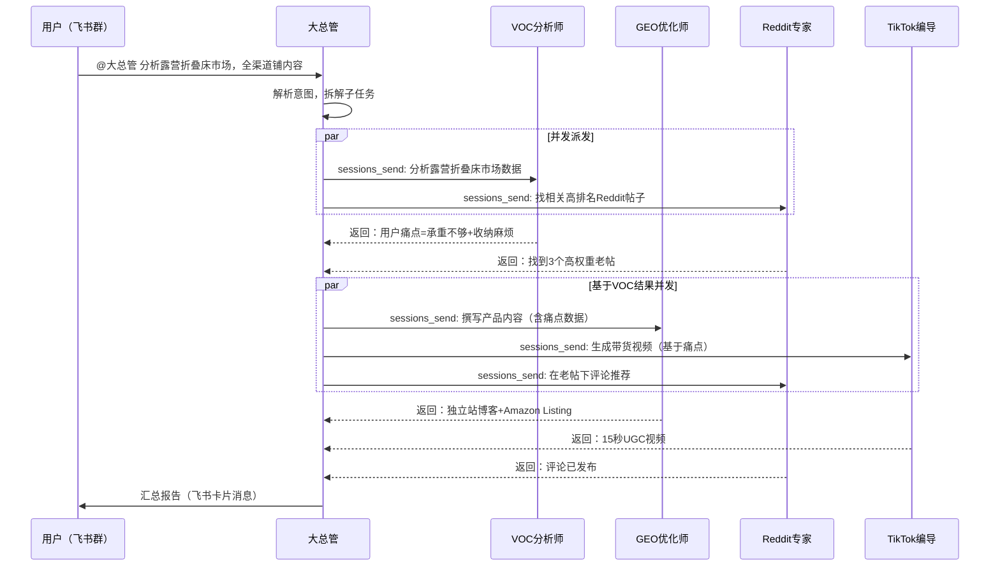

#### DAG工作流编排

任务按照有向无环图（DAG）编排，确保：
- **无数据依赖的任务并发执行**（VOC分析 || Reddit搜帖 同时进行）
- **有数据依赖的任务串行等待**（GEO优化依赖VOC分析结果）
- **自动容错**：单个Agent失败不影响其他分支

#### 配置核心：openclaw.json

Agent间通信的配置关键在于`tools.agentToAgent`的白名单设置：

```json
{
  "channels": {
    "feishu": {
      "enabled": true,
      "connectionMode": "websocket",
      "accounts": {
        "lead": { "appId": "cli_111", "appSecret": "..." },
        "geo":  { "appId": "cli_222", "appSecret": "..." },
        "reddit": { "appId": "cli_333", "appSecret": "..." },
        "tiktok": { "appId": "cli_444", "appSecret": "..." }
      }
    }
  },
  "bindings": [
    { "agentId": "lead", "match": { "channel": "feishu", "accountId": "lead" } },
    { "agentId": "geo-optimizer", "match": { "channel": "feishu", "accountId": "geo" } },
    { "agentId": "reddit-spec", "match": { "channel": "feishu", "accountId": "reddit" } },
    { "agentId": "tiktok-director", "match": { "channel": "feishu", "accountId": "tiktok" } }
  ],
  "tools": {
    "agentToAgent": {
      "enabled": true,
      "allow": ["lead", "voc-analyst", "geo-optimizer", "reddit-spec", "tiktok-director"]
    }
  }
}
```

### 2.7 端到端案例：露营折叠床

**场景**：用户在飞书群输入"分析一下露营折叠床的市场，并全渠道铺内容"

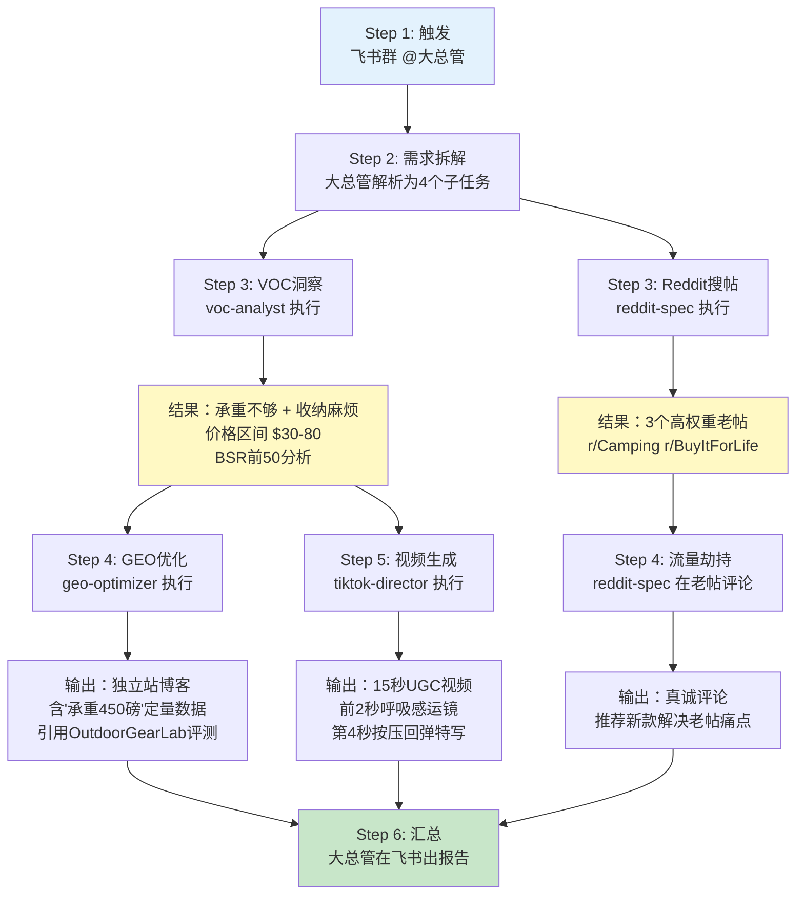

**6步流程详解：**

| 步骤 | 执行者 | 动作 | 输出 | 耗时 |
|:---:|------|------|------|:---:|
| 1 | 用户 | 飞书群@大总管发送需求 | 自然语言指令 | - |
| 2 | 大总管 | 解析意图，拆解为4个并行/串行子任务 | DAG执行计划 | ~5s |
| 3 | VOC分析师 + Reddit专家 | **并发**：Amazon抓竞品数据 + Reddit搜相关帖子 | 痛点报告 + 高权重帖子列表 | ~3min |
| 4 | GEO优化师 + Reddit专家 | **并发**：撰写GEO优化内容 + 在老帖下评论 | 独立站博客 + Reddit评论 | ~5min |
| 5 | TikTok编导 | 读取VOC痛点 → 设计分镜 → 生图 → 生成视频 | 15秒UGC带货视频 | ~10min |
| 6 | 大总管 | 汇总所有输出，飞书卡片消息汇报 | 完整执行报告 | ~10s |

**总耗时：约15-20分钟**（传统人工团队需要3-5个工作日）

### 2.8 架构图表集

#### Workspace隔离架构

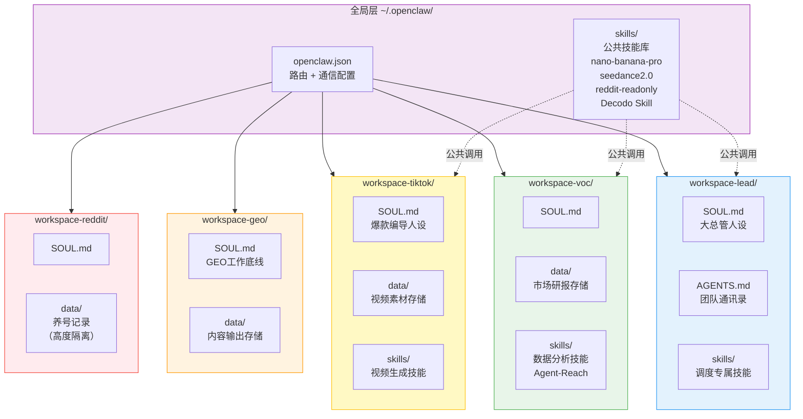

#### 技术栈全景图

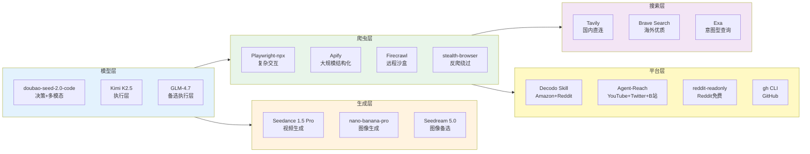

#### 数据流全景

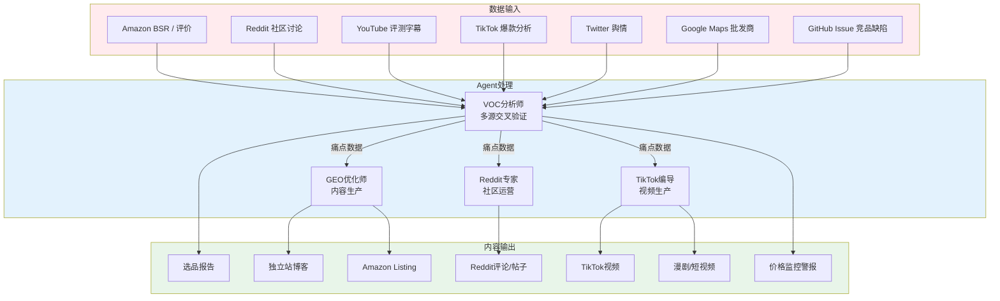

---

## 第三部分：商业模式

### 3.1 "技能包优先，编排按需"模式创新

传统SaaS采用"平台订阅制"——用户为整个平台付费，无论是否使用全部功能。我们的创新在于**将能力拆分为独立技能包**，用户按需购买，编排层作为增值服务。

**模式对比：**

| 维度 | 传统SaaS订阅 | 我们的技能包模式 |
|------|:---:|:---:|
| 付费逻辑 | 按平台/按席位 | 按能力包/按用量 |
| 试用门槛 | 高（需要学习整个平台） | 低（单包即可独立使用） |
| 扩展路径 | 升级套餐（被迫接受不需要的功能） | 叠加技能包（按需组合） |
| 锁定效应 | 平台锁定 | 数据和工作流沉淀（正向锁定） |
| 生态扩展 | 靠平台自研 | 靠5400+ Skills社区贡献 |

**核心洞察：** 跨境电商卖家的需求高度差异化——纯Amazon卖家只需情报包，MCN机构只需创作包，全渠道品牌才需要全套。强制捆绑等于强制流失。

### 3.2 定价策略

#### 单包定价

| 能力包 | 月价 | 年价（8折） | 核心能力 | 目标用户 |
|------|:---:|:---:|------|------|
| **情报包 Lite** | 免费 | 免费 | 单平台数据查询（限5次/天） | 体验用户 |
| **情报包 Pro** | ¥299/月 | ¥2,870/年 | 10平台爬虫 + 搜索三引擎 + Cron监控 | 中小卖家选品 |
| **创作包** | ¥499/月 | ¥4,790/年 | Seedance视频 + 8种漫画风格 + manga-drama + GEO优化 | 内容团队 |
| **营销包** | ¥399/月 | ¥3,830/年 | Reddit养号SOP + TikTok矩阵 + 社媒自动化 | 社媒运营 |

#### 组合定价

| 组合 | 月价 | 相比单买 | 适用场景 |
|------|:---:|:---:|------|
| **情报+创作** | ¥699/月 | 省¥99 | Amazon卖家+独立站 |
| **创作+营销** | ¥799/月 | 省¥99 | MCN/代运营机构 |
| **全能包（三包合一）** | ¥999/月 | 省¥198 | 全渠道品牌卖家 |

#### 企业版

| 层级 | 年价 | 包含 |
|------|:---:|------|
| **企业标准版** | ¥50,000/年 | 全能包 + 5个Agent定制人设 + 私有Workspace + 专属模型调优 |
| **企业旗舰版** | ¥150,000/年 | 标准版 + 私有部署 + 定制Skills开发 + 专属客户成功经理 |

**定价逻辑：**
- 情报包Lite免费：PLG入口，让用户零成本体验核心价值
- 单包月价对标"一个初级运营月薪的1/10"：心理锚定为"每月花几百块省一个人"
- 年付8折：提高LTV，降低月度流失
- 企业版：高接触销售，定制化溢价

### 3.3 获客策略

#### 渠道一：PLG（产品驱动增长）

| 动作 | 详情 |
|------|------|
| **免费入口** | 情报包Lite提供每天5次免费查询，足够体验核心价值 |
| **病毒系数** | 查询报告底部带平台水印和邀请链接，自然传播 |
| **升级触发** | 达到免费次数上限 → 弹出"解锁10平台全量数据"引导 |
| **留存钩子** | Cron监控数据累积越多，迁移成本越高（正向锁定） |

#### 渠道二：内容营销

| 内容类型 | 渠道 | 目标 |
|------|------|------|
| **实战教程** | 微信公众号、知乎 | "用AI选品找到月销10万的蓝海品类"等实操文章 |
| **视频教程** | B站、YouTube | OpenClaw配置教程、实战案例录屏 |
| **开源Skills** | GitHub、ClawHub | 开源部分技能包，建立技术信任 |
| **社区运营** | 微信群、飞书群 | 聚集OpenClaw跨境电商用户，形成互助社区 |

#### 渠道三：渠道合作

| 合作方 | 合作模式 |
|------|------|
| **跨境电商培训机构** | 课程内嵌工具推荐，分佣模式 |
| **ERP/物流服务商** | API集成，互相导流 |
| **MCN机构** | 批量授权，按服务客户数分层定价 |
| **OpenClaw生态** | ClawHub上架技能包，获取自然流量 |

**内容营销核心指标：**

| 指标 | 目标（月度） |
|------|:---:|
| 公众号/知乎文章 | 8篇 |
| 视频教程 | 4条 |
| 开源Skills更新 | 2次 |
| 社区活跃用户 | 500+ |
| 免费→付费转化率 | 8%-12% |

### 3.4 竞争壁垒

#### 壁垒一：技术壁垒

| 壁垒点 | 详情 | 复制难度 |
|------|------|:---:|
| **多Agent编排经验** | sessions_send的"明暗双轨"、Workspace隔离、Skill层级管理等工程经验非文档可教 | 高 |
| **爬虫方案矩阵** | 10个平台的爬虫方案经过实际踩坑验证，Decodo/Apify/Playwright的组合策略是Know-how | 中高 |
| **GEO优化规则** | 面向AI搜索引擎的内容优化是新领域，规则库需要持续迭代 | 中 |

#### 壁垒二：数据壁垒

| 壁垒点 | 详情 |
|------|------|
| **选品知识库** | VOC分析师持续积累的品类洞察数据，越用越精准 |
| **养号资产** | Reddit等平台的高Karma账号是时间沉淀资产，5周养号周期无法速成 |
| **价格快照** | Cron监控积累的历史价格数据，是竞争情报的核心资产 |
| **模板库** | 经过验证的SOUL.md、AGENTS.md人设模板，是隐性知识的结构化沉淀 |

#### 壁垒三：生态壁垒

| 壁垒点 | 详情 |
|------|------|
| **OpenClaw生态绑定** | 深度融入246K Stars的OpenClaw生态，享受平台增长红利 |
| **Skills贡献者网络** | 开源Skills吸引社区贡献者，形成飞轮效应 |
| **用户社区** | 微信群/飞书群的互助社区形成网络效应，新用户可直接获得前人经验 |
| **国产模型深度适配** | 针对doubao-seed-2.0-code、Kimi K2.5的Prompt优化是持续投入的结果 |

### 3.5 定价金字塔

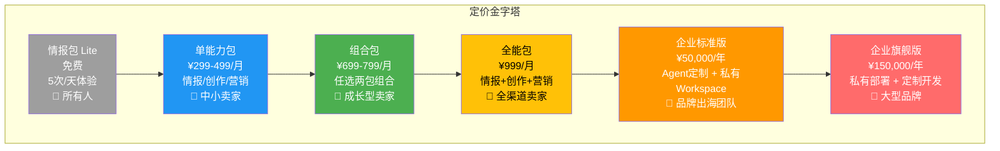

**用户升级路径：**
```
免费体验 → 单包付费（验证价值） → 组合包（扩展场景） → 全能包（全渠道覆盖） → 企业版（定制化需求）
```

**关键商业指标目标（第1年）：**

| 指标 | 目标 |
|------|:---:|
| 免费注册用户 | 50,000 |
| 付费用户 | 5,000-10,000 |
| 免费→付费转化率 | 10%-20% |
| 月均ARPU | ¥400-600 |
| 月度流失率（Churn） | < 5% |
| NPS | > 40 |

---

## 附录

### A. 技术术语表

| 术语 | 英文 | 解释 |
|------|------|------|
| OpenClaw | - | 开源多智能体框架，246K+ Stars，支持Skills生态和多通道接入 |
| Agent | - | AI数字员工，具有独立的Workspace、技能和人设 |
| sessions_send | - | OpenClaw原生的Agent-to-Agent异步通信协议 |
| Workspace | - | Agent的独立工作区目录，包含SOUL.md人设文件和专属数据 |
| SOUL.md | - | Agent的"灵魂"文件，定义其角色、职责和行为底线 |
| AGENTS.md | - | 团队通讯录文件，定义Agent间的协作关系 |
| Skills | - | 可安装的功能技能包，类似插件系统 |
| GEO | Generative Engine Optimization | 生成引擎优化，面向AI搜索引擎的内容优化策略 |
| VOC | Voice of Customer | 客户之声，通过收集和分析用户反馈理解需求 |
| PLG | Product-Led Growth | 产品驱动增长，以产品体验为核心的获客策略 |
| DAG | Directed Acyclic Graph | 有向无环图，用于任务编排的依赖关系管理 |
| BSR | Best Seller Rank | Amazon平台的畅销排名 |
| ARPU | Average Revenue Per User | 每用户平均收入 |
| LTV | Lifetime Value | 用户生命周期价值 |
| NPS | Net Promoter Score | 净推荐值，衡量用户推荐意愿 |
| Seedance | - | 字节跳动的AI视频生成模型 |
| manga-drama | - | 漫剧生成Skill，一张主角图自动编排多幕分镜 |
| Decodo | - | 提供IP轮换和结构化网页抓取的第三方服务 |
| Apify | - | 工业级云端爬虫平台，20年经验，覆盖主流平台 |

### B. 案例索引

| 案例 | 涉及Agent | 所在章节 |
|------|------|------|
| 露营折叠床全渠道铺设 | 全部5个Agent | 2.7 |
| 4K电视Reddit舆情监控 | VOC分析师 | 情报包详解 |
| 少年仗剑走天涯漫剧 | TikTok编导 | 创作包详解 |
| 便携榨汁机选品调研 | VOC分析师 | 1.2 痛点详解 |
| 竞品价格凌晨监控 | 情报引擎 | 情报包详解 |
| 多源交叉验证选品 | VOC分析师 | 情报包详解 |

### C. 技术文档索引

| 文档 | 核心内容 | 引用章节 |
|------|------|------|
| 《用OpenClaw搭跨境电商团队：5个AI员工，跑通全平台矩阵！》 | Agent角色设计、sessions_send协作逻辑、飞书配置教程、Workspace隔离 | 2.3, 2.4, 2.6, 2.8 |
| 《给OpenClaw开天眼！解决了10个跨境电商网站爬虫难题》 | 10个平台爬虫方案、搜索引擎配置、Apify集成、自动化监控 | 2.5（情报包）|
| 《终于，我把Openclaw加Seed2.0 Skills做AI漫剧搞定了》 | Seedance视频生成、8种漫画风格、manga-drama工作流、视频理解 | 2.5（创作包）|

---

> 本文档基于已验证的技术方案撰写，所有产品能力均有实际运行截图和案例支撑。市场数据基于公开信息和行业报告推算，具体数字可能因市场变化而调整。
